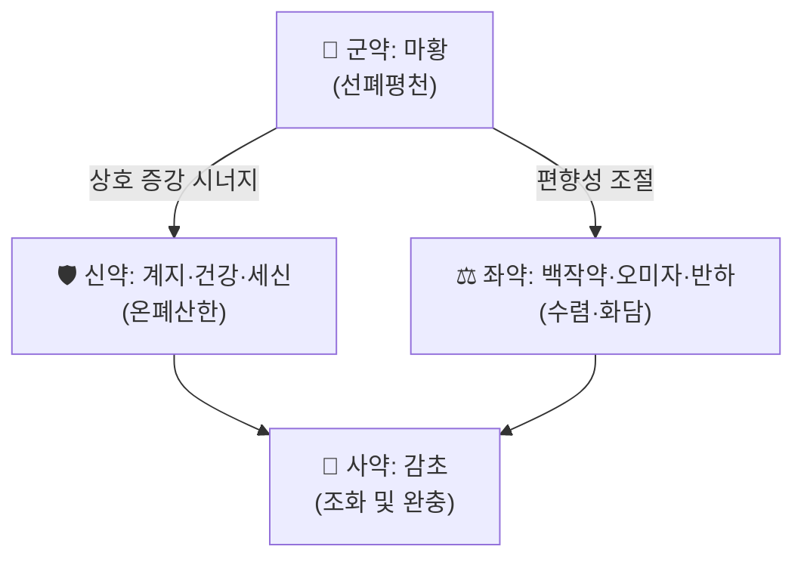

# 🍵 [[소청룡탕]] (小靑龍湯, Minor Green Dragon Decoction)

> **핵심 3줄 요약 (Key Summary)**:
> - 🌿 **모체 구조**: [[마황탕]]·[[계지탕]] 계열의 解表 배합을 뼈대로 삼고, 여기에 [[세신]]·[[건강]]·[[오미자]]·[[반하]] 네 약재를 더해 **表寒을 흩으면서 동시에 裏의 寒飮(찬 담음)을 녹이는** 表裏同治 처방. 즉 "解表 + 溫肺化飮"의 이중 구조가 핵심이다.
> - 🎯 **임상 최적 적응증**: 오한·발열 등 表寒 증상에 **물처럼 묽은 콧물, 목구멍·가슴의 그렁그렁한 담성 기침, 누우면 심해지는 천명(水雞聲)**이 겹치는 寒飮型 환자. 체질적으로는 소음인·태음인 경향의 냉성(冷性)·수독(水毒) 체형에서 적중률이 높고, 알레르기 비염·기관지 천식·급성 기관지염·냉방병의 실전 처방으로 가장 빈용된다.
> - 🔬 **핵심 기전**: 전통적으로 肺의 宣發·肅降 실조와 心下 水氣를 교정하는 것으로 설명된다. 현대 분자약리 수준의 표적·수치는 **제공된 논문에서 직접 확인되지 않아 근거 미확인**이며(아래 3장 참조), 본 노트에서는 전통 방제 이론과 일반적으로 보고되는 수준까지만 기술한다.
> - ⚠️ 주의사항: 陰虛燥咳(마른기침·무담·인후건조), 裏熱型(고열·번조·舌紅苔黃)에는 금기. [[마황]] 함유로 고혈압·심질환·갑상선기능항진·불면·전립선비대·임신부는 신중 투여하고, MAO억제제 등 교감신경 흥분성 양약과의 병용에 주의한다.

---
## 📌 목차
1. [기본 처방 정보 & 군신좌사 구성](#1-기본-처방-정보--군신좌사-구성)
2. [방제학적 약재 상호작용 & 시너지 네트워크](#2-방제학적-약재-상호작용--시너지-네트워크)
3. [현대 분자약리학적 효능 & 작용 기전](#3-현대-분자약리학적-효능--작용-기전)
4. [적응 병증 및 체질별 감별 (Sweet Spot vs 금기)](#4-적응-병증-및-체질별-감별-sweet-spot-vs-금기)
5. [유사 처방군 감별 매트릭스](#5-유사-처방군-감별-매트릭스)
6. [임상 가감례 & 현대 질환별 응용](#6-임상-가감례--현대-질환별-응용)
7. [💡 사용자 진료실 핵심 필기 & 임상 팁 (원문 보존)](#7--사용자-진료실-핵심-필기--임상-팁-원문-보존)
8. [출처 및 학술 참고 문헌 (References)](#8-출처-및-학술-참고-문헌-references)
---
## 1. 기본 처방 정보 & 군신좌사 구성

* **출전**: 장중경(張仲景) 『[[상한론]]』 「辨太陽病脈證幷治 中」 및 『[[금궤요략]]』 「痰飮咳嗽病脈證幷治」. 『[[동의보감]]』 「雜病篇·咳嗽」·「寒門」에도 동일 구성으로 수록되어 한국 임상에서 널리 활용된다.
* **치법**: **해표산한(解表散寒) · 온폐화음(溫肺化飮) · 지해평천(止咳平喘)**
* **구성 원칙(방제 구성)**: 八味로 이루어진 비교적 단순한 구조이지만, 發散하는 藥(麻黃·桂枝·細辛·乾薑)과 收斂하는 藥(五味子·芍藥)을 **동시에** 배치하여 "흩으면서 지키고[散中有收], 덥히면서 내리[溫而能降]"는 相反相成의 설계를 취한다. 이 散收竝用 구조가 소청룡탕을 단순 발한제(發汗劑)와 구별 짓는 핵심이다.

| 구분 | 약재명 | 표준 용량 | 본초 효능 & 방제 내 역할 |
| :--- | :--- | :--- | :--- |
| **군약 (君藥)** | [[마황]] | 6g (원방 麻黃 三兩) | 發汗解表·宣肺平喘. 肺氣不宣으로 인한 咳·喘이라는 주증을 정면으로 공략하는 주약. 桂枝와 배합하여 表寒을 밀어낸다. |
| **신약 (臣藥)** | [[계지]] | 6g (桂枝 三兩) | 解表散寒·溫通經脈·和營. 麻黃의 발한을 보조(相須)하면서 營衛를 조화시켜 汗出 후 表虛를 방지한다. |
| **신약 (臣藥)** | [[건강]] | 3~6g (乾薑 三兩) | 溫肺散寒·回陽化飮. 生薑 대신 乾薑을 쓴 것이 소청룡탕의 특징으로, 裏寒·寒痰을 데우는 축이 된다. |
| **신약 (臣藥)** | [[세신]] | 3g (細辛 三兩) | 溫肺化飮·散寒止痛·通鼻竅. 水氣를 흩고 鼻塞·淸涕에 작용하며 乾薑·五味子와 삼각 배합을 이룬다. |
| **좌약 (佐藥)** | [[반하]] | 6g (半夏 半升) | 燥濕化痰·和胃降逆. 水氣로 인한 嘔·痰多를 처리하고 肺胃의 逆氣를 내린다. |
| **좌약 (佐藥)** | [[오미자]] | 3~6g (五味子 半升) | 收斂肺氣·止咳斂汗. 麻黃·桂枝·細辛의 과도한 辛散을 제어하여 久咳에 正氣가 상하지 않게 한다. |
| **좌약 (佐藥)** | [[백작약]] | 6g (芍藥 三兩) | 斂陰和營·緩急止痛. 桂枝와 배합해 營衛를 조화하고, 평활근·근육 긴장을 완화한다. |
| **사약 (使藥)** | [[감초]] | 3g 炙 (甘草 三兩) | 調和諸藥·和中止咳. 八味를 조화시키고 麻黃·細辛의 자극성을 완충한다. |

> **배오 특징**: 원방 용량 비율은 대체로 麻黃·桂枝·芍藥·細辛·乾薑·甘草가 각 三兩으로 균등하고 半夏·五味子가 半升으로 가장 많다. 즉 **발산약과 수렴약의 비중이 거의 대칭**이며, 이 균형이 "表寒을 풀되 津液을 상하지 않는다"는 소청룡탕의 정체성이다. 문헌·제제별로 실제 처방 용량(3~9g 범위)에 차이가 있으므로 조제 시 처방집 기준을 확인해야 한다. 승강의 관점에서는 麻黃·桂枝의 升散과 半夏·五味子의 降收가 짝을 이루어 肺의 宣肅 기능을 회복시키는 구조로 해석된다.

---
## 2. 방제학적 약재 상호작용 & 시너지 네트워크

* **[[마황]] + [[계지]] 배오 (相須)**: 發汗解表의 대표 배합으로, 麻黃이 衛分의 表寒을 열고 桂枝가 營分을 통해 通陽시켜 오한·무한·발열·신체통을 함께 처리한다. 동시에 麻黃의 宣肺平喘 작용이 桂枝의 溫通으로 강화되어 咳嗽·喘息 완화에 시너지를 낸다.
* **[[건강]] + [[세신]] + [[오미자]] 배합 (溫肺化飮의 핵심 삼각)**: 乾薑·細辛이 溫散하여 肺의 寒痰·水氣를 녹이고, 五味子가 酸收하여 흩어진 肺氣를 다시 모은다. 이른바 "溫而不燥, 斂而不滯"를 가능하게 하는 배합으로, 만성 기침·천식에서 肺氣耗散을 막는 장치이다.
* **[[마황]]·[[계지]]·[[세신]] (辛散) ↔ [[오미자]]·[[백작약]] (酸收) 배오**: 散과 收의 길항적 배치는 단순한 상쇄가 아니라, 발한 후 나타나는 津傷과 表虛를 예방하는 **부작용 완충 장치**로 기능한다. 즉 좌약군이 군·신약의 偏性을 제어한다.
* **[[반하]] + [[감초]] 배합**: 半夏의 燥性과 독성을 甘草가 완충하고, 和胃降逆 작용으로 嘔逆·噁心을 동반한 咳喘에 대응한다. 여기에 乾薑이 더해지면 胃寒·痰飮型 소화기 동반 증상까지 커버한다.
* **[[감초]] (使藥)의 조화**: 八味 전체의 峻烈함을 낮추고 止咳和中의 효과를 겸하며, 諸藥을 肺·脾胃로 인도하는 역할로 해석된다.

---
## 3. 현대 분자약리학적 효능 & 작용 기전

> ⚠️ **근거 표시 안내**: 본 노트에 제공된 논문 4편은 **모두 소청룡탕과 무관한 연구**(해파리 폴립의 구리 독성, 하천 세균 군집, 오피칼신-라이아노딘 수용체 구조, 미세플라스틱 독성)이다. 따라서 아래 소절의 개별 분자 표적·수치·사이토카인 값은 **제공 문헌으로 확인되지 않았으므로 '근거 미확인'**으로 표기하며, 방제 이론 및 일반적 약리 지식 수준의 서술임을 밝힌다. 실제 인용이 필요할 때에는 소청룡탕/麻黃·細辛 관련 별도 문헌을 확보해야 한다.

### 1) 호흡기·항염증 및 점액 조절 (기전 근거 미확인)
* 전통적 해석: 寒飮으로 인한 肺氣不宣 → 咳嗽·喘息·痰鳴을 교정한다는 개념이며, 현대적으로는 기도 점액 과분비 억제 및 기도 염증 완화 방향의 기전이 논의된다.
* **[[마황]]**: 주성분 에페드린 계열 알칼로이드가 교감신경 흥분을 통해 기관지 평활근을 이완시키는 것으로 일반적으로 설명되며, 이는 宣肺平喘의 현대적 번역으로 흔히 인용된다. 다만 본 노트의 제공 문헌에서는 확인되지 않음(근거 미확인). 용량·역가 수치는 별도 근거 필요.
* **[[세신]]·[[오미자]]·[[반하]]**: 각각 항염·항알레르기·거담 작용이 보고된 바 있으나, 소청룡탕 전방(全方) 차원의 사이토카인(TNF-α, IL-6, IL-1β) 수치 변화나 NF-κB/MAPK 경로 억제 여부는 **본 제공 자료로는 확인 불가(근거 미확인)**.

### 2) 순환기·미세순환 및 체액 대사 (기전 근거 미확인)
* [[계지]]·[[백작약]] 배합은 말초 혈관 확장과 營衛 순환 개선, 즉 手腳冷·오한의 완화로 해석된다.
* 水氣(부종·콧물·객담) 배출 기전은 이뇨·발한 조절 및 점막 삼출 감소로 설명되나, 구체적 매개체·지표는 **근거 미확인**.

### 3) 자율신경·기관지 과민성 조절 (기전 근거 미확인)
* 寒冷 자극에 의해 유발·악화되는 기침·비염 증상에 대한 반응은 자율신경 긴장도 및 기도 과민성 조절과 연관된다는 가설적 설명이 가능하나, HPA축·근방추 관련 기전을 포함해 **본 제공 문헌에서 확인된 바 없음(근거 미확인)**.

> 📌 **정리**: 3장은 "전통 방제 이론 + 일반 약리 상식" 수준의 정리이며, **인용 가능한 1차 근거는 현재 확보되지 않은 상태**이다. 논문을 추가 확보하면 본 섹션을 갱신할 것.

---
## 4. 적응 병증 및 체질별 감별 (Sweet Spot vs 금기)

**[✅ 최적 적응증 (Sweet Spot)]**

* **원전 조문**
  * 『[[상한론]]』: "傷寒 表不解, 心下有水氣, 乾嘔 發熱而咳, 或渴, 或利, 或噎, 或小便不利 少腹滿, 或喘者, 小青龍湯主之." — 즉 **表寒이 풀리지 않으면서 心下에 水氣가 있는 상태**가 처방의 정의이며, 或渴·或利·或噎·或小便不利 등의 부수 증상이 붙는다.
  * 『[[금궤요략]]』 「痰飮咳嗽病脈證幷治」: "咳逆倚息不得臥, 小青龍湯主之." — **누우면 기침이 심해져 눕지 못하는 寒飮型 咳逆**이 결정적 지표.
  * 『[[금궤요략]]』 「痰飮」 溢飲 조문: "病溢飮者, 當發其汗, 大靑龍湯主之, 小青龍湯亦主之." — 水氣가 四肢·肌表에 溢한 경우에도 응용.
* **체질 소견**: 소음인·태음인 경향. 피부가 창백하거나 푸르스름하고, 얼굴·눈꺼풀에 부종감이 잘 생기며, 추위에 민감하고 찬 음식·에어컨·새벽 냉기에 증상이 악화되는 冷性·水毒형. 땀은 잘 나지 않으면서 몸은 무겁고 나른한 편.
* **임상 주치 (진료실 적중 장면)**
  * 맑고 물 같은 콧물이 줄줄 흐르는 비염(재채기 연발, 코막힘)
  * 목과 가슴에서 그렁그렁 소리가 나는 기침, 누우면 악화되는 야간 기침
  * 천명(쌕쌕거림)·호흡곤란을 동반한 천식 발작의 초기 또는 한랭 유발형
  * 오한은 있으나 발열은 심하지 않고, 땀이 없는 상태
  * 嘔逆·噁心·물 같은 침(唾)이 올라오는 소화기 동반 증상
* **설진/맥진**: 舌質은 淡紅~淡白, 舌苔는 **白滑 또는 白膩(水滑苔)**. 脈은 **浮緊 또는 弦緊**, 담음이 심하면 弦滑. 舌紅苔黃, 脈數有力이면 본 처방의 적응이 아니다.

**[⚠️ 신중 투여 및 금기 (Caution / Contraindication)]**

* **陰虛燥咳**: 마른기침·무담·인후건조·야간 도한이 있는 경우. 麻黃·細辛·乾薑의 溫燥가 陰液을 더 상하게 한다.
* **裏熱型**: 고열·번조·口渴喜冷·舌紅苔黃·脈數. 이 경우 石膏를 가한 加石膏方 또는 麻杏石甘湯 계열로 전환해야 한다.
* **虛弱·多汗 환자**: 自汗·盜汗이 뚜렷한 表虛者, 心肺氣虛者에게는 麻黃의 발한이 부담이 될 수 있다.
* **[[마황]] 관련 주의**: 고혈압, 관상동맥질환·부정맥 등 심질환, 갑상선기능항진, 불면증, 전립선비대(배뇨장애), 녹내장 환자는 신중히 검토한다. 임신부·수유부 및 소아는 감량·단기 사용 원칙.
* **[[세신]] 관련 주의**: 장기·대량 사용 시 신경계 부작용 우려가 거론되므로 처방 용량과 기간을 지킨다.
* **[[오미자]]·[[반하]] 관련 주의**: 五味子는 위산 과다·속쓰림 환자에서 부담이 될 수 있고, 半夏는 燥性으로 口乾을 유발할 수 있으며 反烏頭 규칙에 해당한다(부자류와의 배합 시 주의).
* **양약 병용**: MAO 억제제, 교감신경 흥분제(의약품 에페드린 등), 카페인·자극제와 병용 시 혈압 상승·심계항진·불면 위험. 항고혈압제·항부정맥제 복용자는 상담 후 투여하고, 복용 중 심계항진·두통·혈압 변동이 나타나면 감량 또는 중단한다.
* **복약 반응 관찰 포인트**: 3~5일 이내 콧물·기침의 성상(맑은 물 → 걸쭉한 담) 변화와 食慾·수면 상태를 확인. 증상이 熱化(痰變黃·咽喉痛·구건)되는 조짐이 보이면 즉시 감량하거나 다른 처방으로 전환한다.

---
## 5. 유사 처방군 감별 매트릭스

| 처방명 | 핵심 구성 차이 | 주치 및 체질 차이 | 맥진/설진 차이 |
| :--- | :--- | :--- | :--- |
| [[소청룡탕]] | 기준 구성: 麻黃·桂枝·芍藥·細辛·乾薑·半夏·五味子·甘草 | **表寒 + 裏寒水氣(痰飮)** 동반 咳喘·水樣 鼻水. 냉성·수독 체형, 겨울·냉방 악화 | 舌淡 苔白滑(水滑), 脈浮緊 또는 弦緊 |
| [[마황탕]] | 麻黃·桂枝·杏仁·甘草 (乾薑·細辛·半夏·五味子 없음) | 太陽傷寒 表實證 위주. 무한·오한·신체통, 咳喘은 경미하고 水氣 없음 | 苔薄白, 脈浮緊 |
| [[계지탕]] | 桂枝·芍藥·生薑·大棗·甘草 (麻黃 없음) | 太陽中風 表虛(自汗·惡風), 營衛不和. 허약·민감 체형 | 苔薄白, 脈浮緩 |
| [[대청룡탕]] | 麻黃 대량 + 石膏 + 杏仁·甘草·桂枝·生薑·大棗 | **表寒 + 裏熱** 동반의 무한 고열·번조·기침 | 苔黃, 脈浮緊有力 |
| [[사간마황탕]] | 射干·麻黃·生薑·細辛·半夏·五味子·紫菀·款冬花·大棗 (桂枝·乾薑·芍藥 없음) | **喉中水雞聲**(痰鳴)이 뚜렷한 咳而上氣, 表證 없음. 소아 천식에 다용 | 苔白滑, 脈弦 |
| [[복령감오미강신탕]] | 茯苓·甘草·五味子·乾薑·細辛 (麻黃·桂枝 없음) | 表證이 이미 풀렸으나 寒飮 咳喘이 지속되는 虛證型 | 苔白滑, 脈弦細 |

> ⚠️ 표 내부에서는 마크다운 열 구분자 파괴를 방지하기 위해 파이프(`|`)가 들어간 링크를 쓰지 않고 순수한 [[처방명]] 단독 형태로만 작성합니다.

**감별 핵심 한 줄**: "**물 같은 콧물 + 누우면 심해지는 기침 + 땀이 없음**"이면 소청룡탕, "땀이 나고 바람이 싫으면" 계지탕, "고열과 번조가 있으면" 대청룡탕, "痰鳴이 목에서 쌕쌕 울리면" 사간마황탕, "表證 없이 오래 끌면" 복령감오미강신탕 방향으로 기운다.

---
## 6. 임상 가감례 & 현대 질환별 응용

* **수반 증상별 가감법** (원방의 加減法 및 한국 임상 상용 가감)
  * 口渴·裏熱이 겹칠 때 → + [[석고]] (小靑龍加石膏湯 방향)
  * 微利(무른 변) → 원방 加減法에 따라 [[마황]]을 빼고 → [[무이]] (원전 加減)
  * 噎(목이 막히는 느낌) → [[마황]]을 빼고 + [[부자]] (원전 加減)
  * 小便不利·少腹滿 → [[마황]]을 빼고 + [[복령]] (원전 加減)
  * 喘이 주증일 때 → [[마황]]을 빼고 + [[행인]] (원전 加減)
  * 喉中痰鳴·천명 심함 → + [[사간]], [[자완]], [[관동화]] (사간마황탕 방향)
  * 코막힘·청체(淸涕) 심함 → + [[신이]], [[창이자]], [[백지]]
  * 인후통·咽喉 불편 → + [[길경]], [[우방자]], [[현삼]]은 熱象 확인 후
  * 담(痰)이 많고 소화가 더부룩할 때 → + [[복령]], [[진피]] ([[이진탕]] 합방 방향)
  * 氣虛·피로가 겹친 再發性 비염·천식 → + [[황기]], [[백출]], [[방풍]] ([[옥병풍산]] 방향)
  * 表證이 이미 소실되고 寒飮만 남았을 때 → 麻黃·桂枝 去하고 [[복령]] 위주로 ([[복령감오미강신탕]] 방향)
* **현대 질환별 임상 매핑**
  * **호흡기계**: 알레르기 비염(水樣 鼻漏·재채기), 급성 기관지염, 기관지 천식(한랭 유발형), 감모·인플루엔자의 表寒 단계, 만성 기침의 寒痰型
  * **이비인후과**: 鼻塞·후비루(코 뒤로 넘어오는 물 같은 콧물), 삼출성 중이염의 水氣型 보조 요법
  * **소화기계 동반**: 嘔逆·噁心·물 같은 침이 올라오는 胃寒 담음형
  * **기타**: 냉방병, 溢飮型 부종감, 한랭 노출 후 발생한 두통·신체통

> ⚠️ 본 처방은 "급성 表寒 + 水氣"라는 병기를 전제로 하므로, 만성 질환에 장기 연용할 경우 表證 유무와 熱化 여부를 수시로 재평가해야 한다. 임상 지표 개선율 등 정량 데이터는 제공 문헌에서 **확인되지 않음(근거 미확인)**.

---
## 7. 💡 사용자 진료실 핵심 필기 & 임상 팁 (원문 보존)

> [!tip] **진료실 실전 노하우 (User Clinical Insight)**
> - ⚠️ **원문 보존 안내**: 현재 이 노트에는 원장님의 기존 메모·필기 **원문이 제공되지 않았습니다.** 위키링크·일자별 기록 등 기존 필기를 삭제하지 않고 그대로 옮겨 넣는 것이 원칙이므로, 해당 내용이 확보되면 본 콜아웃 안에 **한 글자도 변형하지 않고** 추가합니다. (임의 작성·추정 서술 금지)
> - **실전 선택 플로우 (일반 원칙, 근거 미확인)**: ① 오한·무한 등 表寒이 있는가 → 있으면 소청룡탕 검토, 없으면 계지탕·복령감오미강신탕 계열 ② 콧물·담이 맑고 물 같은가 → 是이면 소청룡탕, 걸쭉하고 누렇다면 熱化로 판단하여 다른 처방 ③ 누우면 심해지는가 → 是이면 소청룡탕 적중률 상승.
> - **환자 티칭 포인트**: 복용 중 찬 음료·생냉식·에어컨 직풍을 피하게 안내. 초기 2~3일은 발한·콧물 증가가 나타날 수 있음을 설명하고, 이후 담이 걸쭉해지거나 목이 마르면 복약을 멈추고 내원하도록 지도.
> - **복약 반응 관찰 포인트**: 심계항진·불면·혈압 상승·식욕 저하 여부, 소변량 변화, 설태 변화(백활 → 정상화)를 기록.

---
## 8. 출처 및 학술 참고 문헌 (References)

> ⚠️ **인용 적합성 경고**: 아래 1~4번(제공된 PubMed 문헌 4편)은 **모두 소청룡탕·해표제·호흡기 약리와 직접 관련이 없는 연구**입니다. PMID와 서지 정보는 제공된 값 그대로 정확히 보존하되, **본 처방의 효능 근거로 인용할 수 없음**을 명시합니다. (임의로 처방 관련 논문·PMID·수치를 만들어 넣지 않았습니다.)

1. **Liu Q, Li X (2024)**. *Copper-induced oxidative stress inhibits asexual reproduction of Aurelia coerulea polyps*. **Ecotoxicol Environ Saf**. PMID: 39332202.
   - **[연구 요약]**: 해파리(Aurelia coerulea) 폴립에서 구리 유도 산화스트레스가 무성생식을 저해한다는 환경독성 연구.
   - **[본 처방과의 관계]**: 소청룡탕과의 연관성 **근거 미확인(무관)**. 인용 부적합.
2. **Hou X, Zhu Y (2023)**. *The investigation of the physiochemical factors and bacterial communities indicates a low-toxic infectious risk of the Qiujiang River in Shanghai, China*. **Environ Sci Pollut Res Int**. PMID: 37131005.
   - **[연구 요약]**: 하천 수질의 이화학적 인자와 세균 군집 분석을 통한 감염 위험 평가.
   - **[본 처방과의 관계]**: 소청룡탕과의 연관성 **근거 미확인(무관)**. 인용 부적합.
3. **Yao J, Hua X (2024)**. *The Effect of Acidic Residues on the Binding between Opicalcin1 and Ryanodine Receptor from the Structure-Functional Analysis*. **J Nat Prod**. PMID: 38128916.
   - **[연구 요약]**: 오피칼신1과 라이아노딘 수용체 결합에 대한 산성 잔기의 영향을 구조-기능적으로 분석한 연구.
   - **[본 처방과의 관계]**: 소청룡탕과의 연관성 **근거 미확인(무관)**. 인용 부적합. (칼슘 통로 관련 연구이므로 향후 平喘 기전 논의 시 참고 가능성 정도만 언급 가능하나, 현재는 연결 근거 없음.)
4. **Chen X, Zhu Y (2025)**. *The FOXO pathway mediates a conserved mechanism of antioxidant defense against microplastic-induced toxicity in Aurelia coerulea polyps and mouse liver*. **Ecotoxicol Environ Saf**. PMID: 40024002.
   - **[연구 요약]**: FOXO 경로가 미세플라스틱 유도 독성에 대한 항산화 방어의 보존적 기전을 매개한다는 연구.
   - **[본 처방과의 관계]**: 소청룡탕과의 연관성 **근거 미확인(무관)**. 인용 부적합.

5. **장중경 (200년경)**. 『[[상한론]]』.
   - **[고전 원전]**: 太陽病 中篇의 小青龍湯 조문 및 加減法(渴·利·噎·小便不利·喘에 따른 去加). 복약 지침 및 表不解·心下有水氣라는 병기 규정.
6. **장중경 (200년경)**. 『[[금궤요략]]』.
   - **[고전 원전]**: 「痰飮咳嗽病脈證幷治」의 "咳逆倚息不得臥, 小青龍湯主之", 「痰飮」 溢飮 조문.
7. **허준 (1613)**. 『[[동의보감]]』.
   - **[임상 문헌]**: 咳嗽·寒門 등에서의 小青龍湯 주치 및 한국 임상 운용상의 가감 원문.

---
### 🔗 연결 노트
* 해표제 계열: [[마황탕]] · [[계지탕]] · [[대청룡탕]] · [[사간마황탕]]
* 온폐화음·담음 계열: [[복령감오미강신탕]] · [[이진탕]] · [[옥병풍산]]
* 개별 약재: [[마황]] · [[계지]] · [[건강]] · [[세신]] · [[반하]] · [[오미자]] · [[백작약]] · [[감초]]
* 관련 병증: [[비염]] · [[천식]] · [[기관지염]] · [[냉방병]]
* 상위 분류: [[01_해표제]] · [[처방]]

<!-- 보관 태그(1회용·링크오류, 필요시 복원): 해표산한, 온폐화음 -->
