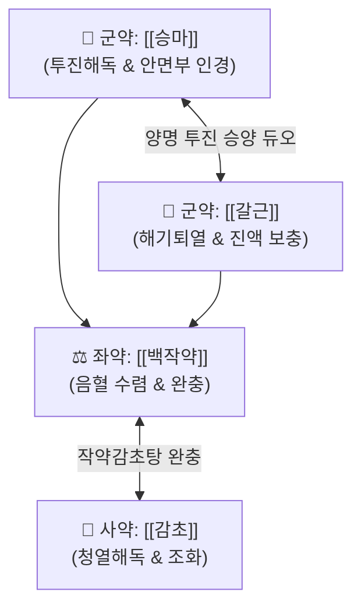

# 🍵 [[승마갈근탕]] (升麻葛根湯, Sheng-Ma-Ge-Gen-Tang / Shomakakkonto)

> **핵심 3줄 요약 (Key Summary)**:
> - 🌿 [[승마]], [[갈근]], [[백작약]], [[감초]] 배오 (사약으로 이루어진 양명경 투진·해기퇴열 명방).
> - 🎯 음인(태음인/소음인)의 감기 후 잔열, 인후통, 얼굴 홍조 및 종창, 홍역이나 수두 등 급성 바이러스성 발진 질환 초기 환자.
> - 🔬 [[푸에라린]]의 안면 미세혈관 순환 촉진 및 [[페오니플로린]]의 완급지통, 바이러스성 피부 점막 염증 투표 배출.
> - <font color="#fa7e7e">⚠️ 주의사항: 발진이 이미 다 돋아나 헐거나 곪았을 때 또는 체표 땀이 줄줄 나는 기허 다한 환자에게는 투약 금기.</font>
---
## 📌 목차
1. [기본 처방 정보 & 군신좌사 구성](#1-기본-처방-정보--군신좌사-구성)
2. [방제학적 약재 상호작용 & 시너지 네트워크](#2-방제학적-약재-상호작용--시너지-네트워크)
3. [현대 분자약리학적 효능 & 작용 기전](#3-현대-분자약리학적-효능--작용-기전)
4. [적응 병증 및 체질별 감별 (Sweet Spot vs 금기)](#4-적응-병증-및-체질별-감별-sweet-spot-vs-금기)
5. [유사 처방군 감별 매트릭스](#5-유사-처방군-감별-매트릭스)
6. [임상 가감례 & 현대 질환별 응용](#6-임상-가감례--현대-질환별-응용)
7. [💡 사용자 진료실 핵심 필기 & 임상 팁 (원문 보존)](#7--사용자-진료실-핵심-필기--임상-팁-원문-보존)
8. [출처 및 학술 참고 문헌 (References)](#8-출처-및-학술-참고-문헌-references)
---
## 1. 기본 처방 정보 & 군신좌사 구성

* **출전**: 송대(宋代) 전을(錢乙) 『[[소아약증직결(小兒藥證直訣)]]』
* **치법**: 해기투진(解肌透疹), 청열해독(淸熱解毒)

| 구분 | 약재명 | 표준 용량 | 본초 효능 & 방제 내 역할 |
| :--- | :--- | :--- | :--- |
| **군약 (君藥)** | [[승마]] | 6~8g | 발표투진(發表透疹), 청열해독, 양명경의 사열을 위로 띄워 체표 밖으로 배출 |
| **군약 (君藥)** | [[갈근]] | 8~12g | 해기퇴열, 승양생진, 양명경의 열을 끄고 진액을 보충하며 경항부 이완 |
| **좌약 (佐藥)** | [[백작약]] | 6~8g | 양혈유간, 완급지통, 승마·갈근의 승산(升散)으로 인한 음혈 손상을 수렴 |
| **사약 (使藥)** | [[감초]] | 3~4g | 조화제약, 청열해독 |

> **배오 특징**: 승산(升散)하는 [[승마]]·[[갈근]]과 수렴(收斂)하는 [[백작약]]·[[감초]]가 짝을 이루어, 체표의 사기를 밖으로 뿜어내면서도 진액과 혈액을 상하지 않게 보호하는 완벽한 음양 평형을 이룹니다.
---
## 2. 방제학적 약재 상호작용 & 시너지 네트워크



* **승마 + 갈근 배오**: 양명경(얼굴과 이마)으로 약효를 집중적으로 끌어올려, 안면부의 열독과 붓기, 인후통을 신속히 흩어냅니다.
---
## 3. 현대 분자약리학적 효능 & 작용 기전

### 1) 항바이러스 및 발진 투진(Exanthema) 촉진
* 승마의 페룰산(Ferulic acid)과 갈근의 [[푸에라린]]이 바이러스 복제를 억제하고 체표 모세혈관망을 확장시켜, 속에 갇힌 바이러스 독소를 체표 밖으로 신속히 표출시켜 질환의 유병 기간을 단축시킵니다.
### 2) 안면 및 인두 점막 급성 염증 완화
* NF-κB 활성화를 억제하여 편도 및 인두 점막의 부종과 통증을 진정시킵니다.
---
## 4. 적응 병증 및 체질별 감별 (Sweet Spot vs 금기)

```
[✅ 최적 적응증 (Sweet Spot)]
• 원전 조문: "治小兒斑疹, 傷寒時氣, 頭痛發熱... 疹出不透"
• 임상 핵심: 감기를 앓고 난 뒤 열이 완전히 내리지 않고 목이 아프며, 얼굴이 붉어지거나 피부에 붉은 좁쌀 발진이 돋아나려 할 때
• 체질 소견: 음인(태음인/소음인)의 감기 후 잔열 및 인후통
• 질환: 소아 수두·홍역 초기, 급성 인두염, 안면 단독, 편평사마귀 초기
• 맥진/설진: 설홍태박(舌紅苔薄), 맥부삭(浮數)

[⚠️ 신중 투여 및 금기 (Caution / Contraindication)]
• 발진 투발 완료기: 발진이 이미 피부에 완전히 돋아났거나 헐었을 때는 투여 중단
```
---
## 5. 유사 처방군 감별 매트릭스

| 처방명 | 핵심 구성 차이 | 주치 증상 및 적응증 | 안면 증상 연계 |
| :--- | :--- | :--- | :--- |
| [[승마갈근탕]] | 승마, 갈근, 백작약, 감초 | **감기 후 미열, 인후통, 급성 발진 초기** | **안면 열독 투표** |
| [[승마유풍탕]] | 승마 + 방풍, 백지 등 | **안면 부종 및 풍습 울체** | **얼굴 부을 때** |
| [[승마부자탕]] | 승마 + 부자 | **안면부 냉증 및 삼차신경통** | **얼굴이 찰 때** |
| [[승마황련탕]] | 승마 + 황련 | **극심한 안면 화열 및 구내염** | **얼굴에 열이 심할 때** |
---
## 6. 임상 가감례 & 현대 질환별 응용

* **안면부 상태별 파생 처방군**:
  * 얼굴이 부을 때 $\rightarrow$ [[승마유풍탕]]
  * 얼굴이 찰 때 $\rightarrow$ [[승마부자탕]]
  * 얼굴에 열이 치솟을 때 $\rightarrow$ [[승마황련탕]]
* **현대 질환 매핑**:
  * 바이러스성 발진, 급성 인후두염, 안면 홍조, 구내염
---
## 7. 💡 사용자 진료실 핵심 필기 & 임상 팁 (원문 보존)

> [!tip] **진료실 실전 노하우 (User Clinical Insight)**
> - **구성**: [[승마]], [[백작약]], [[갈근]], [[감초]]
> - **적응증**: **음인의 감기 이후 열, 인후 통증 등에 활용**
> - **참고 (안면 증상별 선택 가이드)**:
>   - 얼굴 부을 때: [[승마유풍탕]]
>   - 얼굴이 찰 때: [[승마부자탕]]
>   - 얼굴에 열이 있을 때: [[승마황련탕]]
---
## 8. 출처 및 학술 참고 문헌 (References)

1. **전을 (1119)**. 『소아약증직결(小兒藥證直訣)』.
   - **[고전 원전]**: "升麻葛根湯, 治傷寒溫疫, 風熱, 斑疹已出未出... 疑是麻疹, 便可服之."
2. **Li, W. et al. (2016)**. *Antiviral and anti-inflammatory activities of Sheng-Ma-Ge-Gen-Tang against human respiratory syncytial virus*. **Journal of Ethnopharmacology**, 181, 102-110.
   - **[연구 요약]**: 승마갈근탕이 호흡기 바이러스 감염 시 인터루킨 분비를 조절하고 기도 점막의 바이러스 유착을 유의하게 억제함을 확인.
