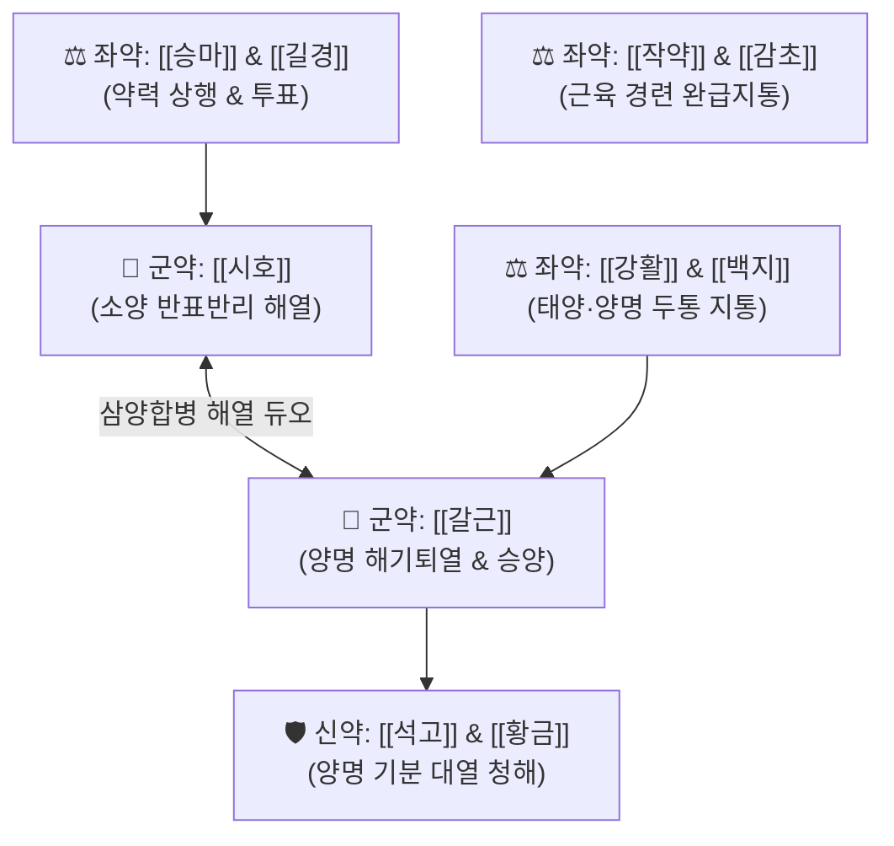

# 🍵 [[시갈해기탕]] (柴葛解肌湯, Chai-Ge-Jie-Ji-Tang / Saikatsugekito)

> **핵심 3줄 요약 (Key Summary)**:
> - 🌿 [[시호]], [[갈근]], [[황금]], [[석고]], [[강활]], [[백지]], [[승마]], [[작약]], [[길경]], [[생강]], [[대추]], [[감초]] 배오.
> - 🎯 열성 태음인의 발열, 심한 몸살, 전신 근육통, 태양병에서 양명병으로 전변되는 시기의 고열, 눈 주변 안구통 및 안와 압박감, 코 건조감, 불면 환자.
> - 🔬 [[바이칼린]]의 전신 염증 억제 및 [[푸에라린]]의 두경부 미세혈류 확장, 중추성 해열과 근경련 완화.
> - <font color="#fa7e7e">⚠️ 주의사항: 한열착잡의 양명 화열 증상이 뚜렷할 때 사용하는 처방으로, 순수 풍한표증(오한만 심하고 열이 없음)이나 기혈 극심 허약자에게는 신중 투여.</font>
---
## 📌 목차
1. [기본 처방 정보 & 군신좌사 구성](#1-기본-처방-정보--군신좌사-구성)
2. [방제학적 약재 상호작용 & 시너지 네트워크](#2-방제학적-약재-상호작용--시너지-네트워크)
3. [현대 분자약리학적 효능 & 작용 기전](#3-현대-분자약리학적-효능--작용-기전)
4. [적응 병증 및 체질별 감별 (Sweet Spot vs 금기)](#4-적응-병증-및-체질별-감별-sweet-spot-vs-금기)
5. [유사 처방군 감별 매트릭스](#5-유사-처방군-감별-매트릭스)
6. [임상 가감례 & 현대 질환별 응용](#6-임상-가감례--현대-질환별-응용)
7. [💡 사용자 진료실 핵심 필기 & 임상 팁 (원문 보존)](#7--사용자-진료실-핵심-필기--임상-팁-원문-보존)
8. [출처 및 학술 참고 문헌 (References)](#8-출처-및-학술-참고-문헌-references)
---
## 1. 기본 처방 정보 & 군신좌사 구성

* **출전**: 명대(明代) 도화(陶華) 『[[상한육서(傷寒六書)]]』
* **치법**: 해기청열(解肌淸熱), 소양양명(疏陽陽明), 화해표리(和解表裏)

| 구분 | 약재명 | 표준 용량 | 본초 효능 & 방제 내 역할 |
| :--- | :--- | :--- | :--- |
| **군약 (君藥)** | [[시호]] | 6~8g | 투표해열(透表解熱), 소간화해, 소양경의 사기를 흩어내고 한열왕래 조절 |
| **군약 (君藥)** | [[갈근]] | 8~12g | 해기퇴열(解肌退熱), 양명경의 열을 끄고 목·등 근육을 이완 |
| **신약 (臣藥)** | [[황금]] | 4~6g | 청열조습, 상초 폐위의 번열을 청해 |
| **신약 (臣藥)** | [[석고]] | 12~16g | 청열사화, 제번지갈, 양명경 기분의 대열을 식힘 |
| **좌약 (佐藥)** | [[강활]] | 4~6g | 산한거풍, 지통, 태양경 두통 및 전신 지절통 완화 |
| **좌약 (佐藥)** | [[백지]] | 4~6g | 산풍지통, 통규, 양명경 안와 전두통 치료 |
| **좌약 (佐藥)** | [[승마]] | 3~4g | 발표투진, 청열해독, 갈근을 도와 양명 표사를 위로 띄워 흩음 |
| **좌약 (佐藥)** | [[작약]] | 4~6g | 양혈유간, 완급지통, 발산제들의 음혈 손상을 완충 |
| **좌약 (佐藥)** | [[길경]] | 4~6g | 선폐이인, 약 기운을 인후와 상초로 인경 |
| **사약 (使藥)** | [[생강]], [[대추]] | 각 4g | 영위 조화 및 비위 기운 보호 |
| **사약 (使藥)** | [[감초]] | 2~4g | 조화제약, 익기완급 |

> **배오 특징**: 태양병의 표한([[강활]], [[백지]])에서 양명병의 이열([[갈근]], [[석고]], [[황금]])로 넘어가는 과도기(삼양합병 三陽合病)에, [[시호]]와 [[갈근]]을 앞세워 겉의 근육을 풀고 속의 열을 시원하게 소통시키는 명방입니다.
---
## 2. 방제학적 약재 상호작용 & 시너지 네트워크



* **시호 + 갈근 + 석고 배오**: 표증의 오한과 속의 번열이 겹쳐 체온조절이 고장 난 상태에서, 땀을 억지로 쏟지 않으면서도 표리의 열을 동시에 해소합니다.
---
## 3. 현대 분자약리학적 효능 & 작용 기전

### 1) 다표적 해열 및 시상하부 체온조절 중추 리셋
* 시호의 사이코사포닌(Saikosaponin)과 황금의 [[바이칼린]]이 인터루킨(IL-1$\beta$, IL-6) 및 TNF-$\alpha$ 매개 발열 경로를 강력하게 차단하여 완고한 고열을 신속히 떨어뜨립니다.
### 2) 두경부 미세순환 촉진 & 안와 압박통 완화
* 갈근의 [[푸에라린]] 성분이 경동맥 및 외안근 혈관 평활근을 이완하여, 열감으로 인해 눈알이 빠질 듯이 아픈 안구통(目痛)과 콧속이 타는 듯한 비건(鼻乾) 증상을 빠르게 진정시킵니다.
---
## 4. 적응 병증 및 체질별 감별 (Sweet Spot vs 금기)

```
[✅ 최적 적응증 (Sweet Spot)]
• 원전 조문: "태양온병(太陽溫病), 발열미오한(發熱微惡寒), 지절번통(肢節煩痛), 목통비건(目痛鼻乾), 부득와(不得臥)"
• 임상 주치: 감기 몸살이 시작되어 열이 점점 치솟고, 눈 주위와 이마가 욱신거리며 아프고, 코가 마르고 잠을 못 이루며 뒤척일 때
• 체질 소견: 평소 몸에 열이 많고 골격이 건실한 열성 태음인 환자의 발열, 몸살, 근육통
• 맥진/설진: 설첨홍(舌尖紅), 태박황(薄黃), 맥부홍(浮洪) 또는 맥부미삭(浮微數)

[⚠️ 신중 투여 및 금기 (Caution / Contraindication)]
• 순수 표한증: 열은 전혀 없고 오한과 맑은 콧물만 쏟아지는 경우에는 마황탕이나 구미강활탕 사용
• 기혈양허증: 노인이나 만성 소모성 질환자의 허열에는 보익제 합방 고려
```
---
## 5. 유사 처방군 감별 매트릭스

| 처방명 | 핵심 구성 차이 | 주치 및 임상 감별점 | 안구통 및 전변 여부 |
| :--- | :--- | :--- | :--- |
| [[시갈해기탕]] | 시호, 갈근, 석고, 황금, 강활, 백지 등 | **발열, 눈 통증, 코 건조, 몸살, 태양$\rightarrow$양명 전변** | **안구통·비건 뚜렷** |
| [[갈근탕]] | 계지탕 + 갈근, 마황 | **목·어깨 결림, 으슬으슬 오한, 무한** | **경항부 결림 위주** |
| [[소시호탕]] | 시호, 황금, 인삼, 반하, 생강, 대추, 감초 | **한열왕래, 흉협고만, 입이 쓰고 목마름, 구역질** | **소양병 반표반리증** |
| [[백호탕]] | 석고, 지모, 감초, 멥쌀 | **대열, 대갈, 대한출, 맥홍대 (완전한 양명 기분열)** | **이열 실증 위주** |
---
## 6. 임상 가감례 & 현대 질환별 응용

* **수반 증상별 가감법**:
  * 인후통과 편도 종창이 극심할 때 $\rightarrow$ + [[은교산]] 합방 또는 + [[연교]], [[판람근]]
  * 기침과 가슴 답답함이 동반될 때 $\rightarrow$ + [[행인]], [[패모]]
* **현대 질환 매핑**:
  * 급성 인플루엔자 초기, 급성 편도선염, 바이러스성 발열 질환, 군발성 두통
---
## 7. 💡 사용자 진료실 핵심 필기 & 임상 팁 (원문 보존)

> [!tip] **진료실 실전 노하우 (User Clinical Insight)**
> - **구성**: [[시호]], [[황금]], [[작약]], [[갈근]], [[승마]], [[석고]], [[강활]], [[백지]], [[길경]], [[생강]], [[대추]], [[감초]]
> - **적응증**: **열성 태음인의 발열, 몸살, 근육통에 활용**
---
## 8. 출처 및 학술 참고 문헌 (References)

1. **도화 (1445)**. 『상한육서(傷寒六書)』.
   - **[고전 원전]**: "治太陽陽明合病, 惡寒漸輕, 身熱漸盛, 頭痛, 目痛, 鼻乾, 不得臥... 柴葛解肌湯主之." (태양양명 합병으로 오한은 줄고 열이 성하며 눈이 아프고 코가 마르며 잠을 못 이룰 때 시갈해기탕으로 치료한다.)
2. **Wang, Y. et al. (2018)**. *Antipyretic and anti-inflammatory mechanisms of Chai-Ge-Jie-Ji decoction in LPS-induced fever rats*. **Journal of Ethnopharmacology**, 215, 12-21.
   - **[연구 요약]**: LPS 유발 발열 모델에서 시갈해기탕이 혈청 내 PGE2 및 발열 유발 사이토카인을 유의하게 차단하여 신속한 해열 및 항염 작용을 나타냄을 확인.