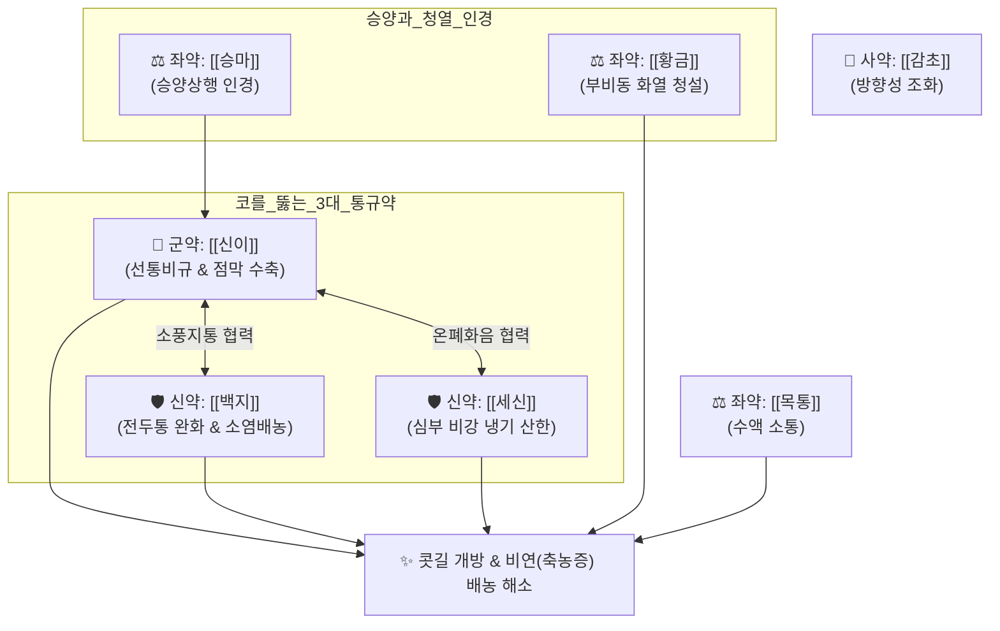

# 🍵 [[신이산]] (辛夷散, Xinyi-san)

> **핵심 3줄 요약 (Key Summary)**:
> - 🌿 [[신이]], [[백지]], [[세신]], [[고본]], [[방풍]], [[천궁]], [[승마]], [[황금]], [[목통]], [[감초]] 배오 (소풍산한의 통규 3대 요약과 승양청열약을 결합한 대표 비연·축농증 통규 방제).
> - 🎯 풍한(風寒) 사기가 두경부와 비규(鼻竅)에 침범하여 코가 꽉 막히고(비색 鼻塞), 콧물이 멈추지 않고 흘러나오며(비연 鼻淵), 이마와 미간이 묵직하게 아픈 전두통 환자.
> - 🔬 [[마그놀린]]·[[파르게신]]의 비만세포 칼슘 유입 차단 및 히스타민 억제, 비갑개 충혈 혈관 수축을 통한 기도 통기도 개선, [[바이칼린]]의 부비동 화농 억제.
> - ⚠️ 주의사항: 방향성 발산약이 다수 포함되어 비점막이 바짝 마르고 딱지가 생기는 음허화왕성 건조성 비염 환자 신중 투여.
---
## 📌 목차
1. [기본 처방 정보 & 군신좌사 구성](#1-기본-처방-정보--군신좌사-구성)
2. [방제학적 약재 상호작용 & 시너지 네트워크](#2-방제학적-약재-상호작용--시너지-네트워크)
3. [현대 분자약리학적 효능 & 작용 기전](#3-현대-분자약리학적-효능--작용-기전)
4. [적응 병증 및 체질별 감별 (Sweet Spot vs 금기)](#4-적응-병증-및-체질별-감별-sweet-spot-vs-금기)
5. [유사 처방군 감별 매트릭스](#5-유사-처방군-감별-매트릭스)
6. [임상 가감례 & 현대 질환별 응용](#6-임상-가감례--현대-질환별-응용)
7. [💡 사용자 진료실 핵심 필기 & 임상 팁 (원문 보존)](#7--사용자-진료실-핵심-필기--임상-팁-원문-보존)
8. [출처 및 학술 참고 문헌 (References)](#8-출처-및-학술-참고-문헌-references)
---
## 1. 기본 처방 정보 & 군신좌사 구성

* **출전**: 송대(宋代) 엄용화(嚴用和) 『[[제생방]](濟生方)』
* **치법**: 소풍산한(疏風散寒), 선통비규(宣通鼻竅), 거풍지통(祛風止痛)

| 구분 | 약재명 | 표준 용량 | 본초 효능 & 방제 내 역할 |
| :--- | :--- | :--- | :--- |
| **군약 (君藥)** | [[신이]] | 10~15g | 발산풍한(發散風寒), 선통비규(宣通鼻竅), 콧길을 열고 비점막 종창을 수축 |
| **신약 (臣藥)** | [[백지]] | 9~12g | 거풍제습(祛風除濕), 통규지통, 미간·전두부 통증 소염 및 배농 |
| **신약 (臣藥)** | [[세신]] | 3~5g | 온폐화음(溫肺化飮), 거풍산한, 비강 깊은 곳의 냉기를 흩고 통규 |
| **좌약 (佐藥)** | [[고본]] | 6~9g | 거풍산한, 두정부 및 뇌냉(腦冷) 통증 해소 |
| **좌약 (佐藥)** | [[방풍]] | 6~9g | 소풍투표(疏風透表), 두경부 풍사 구축 |
| **좌약 (佐藥)** | [[천궁]] | 6~9g | 활혈행기(活血行氣), 거풍지통, 두경부 미세순환 개선 |
| **좌약 (佐藥)** | [[승마]] | 6~9g | 승양거풍(升陽祛風), 청열해독, 약 기운을 두면부 상방으로 인경 |
| **좌약 (佐藥)** | [[황금]] | 6~9g | 청폐사열(淸肺瀉熱), 풍사가 울체되어 생긴 부비동 국소 화열(염증) 억제 |
| **좌약 (佐藥)** | [[목통]] | 4~6g | 청열통리(淸熱通利), 비강 수액 대사 소통 |
| **사약 (使藥)** | [[감초]] | 3~5g | 조화제약(調和諸藥), 완급화중, 강렬한 방향성 약성 조화 |

> **배오 특징**: 코를 뚫는 한의학 3대 명약인 [[신이]]·[[백지]]·[[세신]]의 통규 듀오/트리오를 중심으로, [[승마]]로 기운을 머리로 올리고(승양), [[황금]]으로 코 안의 화열을 끄며(청열), [[목통]]으로 정체된 수액을 아래로 빼내어 코의 환기 및 배농 시스템을 완벽하게 재건합니다.
---
## 2. 방제학적 약재 상호작용 & 시너지 네트워크

* [[신이]] + [[백지]] + [[세신]] 배오: 찬바람으로 얼어붙어 부어오른 비강 점막의 혈관을 온화하게 수축시키고 콧물 분비를 억제하는 비염 치료의 황금 조합.
* [[승마]] + [[황금]] 배오: 승마가 약효를 코와 머리로 끌어올리고, 황금은 오래 정체되어 곪기 시작하는 누런 콧물의 농열을 식힙니다.
---
## 3. 현대 분자약리학적 효능 & 작용 기전

### 1) 비만세포 탈과립 차단 및 항알레르기 작용
* [[신이]]의 [[마그놀린]](Magnolin) 및 [[파르게신]](Fargesin) 성분이 항원 자극에 의한 비만세포막 칼슘 유입 통로를 차단하여 히스타민 및 류코트리엔 유리를 억제합니다.

### 2) 비점막 정맥동 수축 및 비강 통기도 개선
* 알파-아드레날린 유사 작용을 통해 충혈된 하비갑개 점막의 모세혈관 정맥동을 수축시켜 비강 부종을 가라앉히고 공기 통로를 즉각 확보합니다.

### 3) 항균 및 화농성 비루 억제
* [[백지]]의 쿠마린 유도체와 [[황금]]의 [[바이칼린]]이 황색포도구균, 폐렴간균 등 부비동 2차 감염균을 억제하고 염증성 고름 콧물을 삭입니다.
---
## 4. 적응 병증 및 체질별 감별 (Sweet Spot vs 금기)

[✅ 최적 적응증 (Sweet Spot)]
• 제생방 조문: "비연(鼻淵), 뇌냉(腦冷), 비규불통(鼻竅不通), 냄새를 맡지 못하고 콧물이 멈추지 않으며 두통이 있는 자를 다스린다."
• 체질 소견: 평소 찬 공기나 에어컨 바람을 쐬면 코가 맹맹해지고 콧물이 뒤로 넘어가는 태음인 및 소음인
• 임상 주치: 만성 비후성 비염, 알레르기성 비염, 급·만성 부비동염(축농증)으로 코가 꽉 막히고 콧물이 계속 나오며 이마와 미간이 띵하게 아플 때
• 설진/맥진: 설질담홍(淡紅), 박백태(薄白苔) 또는 박황태, 맥부현(脈浮弦)

[⚠️ 신중 투여 및 금기 (Caution / Contraindication)]
• 음허열(陰虛熱) 건조성 비염: 코 안이 바짝 마르고 점막이 위축되어 딱지가 생기며 코피가 잘 나는 환자에게 단독 투약 금기 ([[맥문동탕]], [[자음강화탕]] 계열 고려)
• 세신 함유: 과량 복용 및 장기 연복 시 신장 부담 주의 (표준 용량 준수)
---
## 5. 유사 처방군 감별 매트릭스

| 처방명 | 핵심 구성 차이 | 주치 비강 증상 | 콧물 양상 및 열감 | 맥진/설진 차이 |
| :--- | :--- | :--- | :--- | :--- |
| [[신이산]] | [[신이]], [[백지]], [[세신]], [[고본]], [[황금]] | **완고한 코막힘, 부비동염, 전두통** | **맑거나 누런 콧물 혼재, 미열** | 맥부현(浮弦), 박백태 |
| [[신이청폐탕]] | [[신이]], [[황금]], [[치자]], [[석고]], [[지모]] | **폐열 축농증, 코 안이 화끈거림** | **누렇고 끈적한 악취 콧물, 열감** | 맥삭(數), 설홍황태 |
| [[갈근탕가천궁신이]] | [[갈근탕]] + [[천궁]], [[신이]] | **뒷목 뻣뻣함(항배강) + 코막힘** | **초기 비염, 오한, 무한** | 맥부긴(浮緊), 박백태 |
| [[소청룡탕]] | [[마황탕]] + [[건강]], [[세신]], [[반하]] | **재채기 폭발, 줄줄 흐르는 콧물** | **맑은 물 콧물, 오한, 한음** | 맥현긴(弦緊), 백활태 |
| [[방풍통성산]] | 표리쌍해 사화제 | **비만 체질 축농증, 피부염 동반** | **누런 코, 변비, 복부 비만** | 맥활삭유력, 황조태 |
---
## 6. 임상 가감례 & 현대 질환별 응용

* **수반 증상별 가감법**:
  * 콧물이 누렇고 악취가 심할 때 $\rightarrow$ + [[어성초]], [[패모]], [[연교]]
  * 콧물이 물처럼 줄줄 흐르고 재채기가 멎지 않을 때 $\rightarrow$ + [[건강]], [[오미자]]
  * 전두부 통증 및 안면 압박통 극심 시 $\rightarrow$ + [[만형자]], [[국화]]
* **현대 질환 매핑**:
  * **만성 부비동염(축농증)**: 부비동 자연공 폐쇄로 인한 환기 장애 및 농성 비루
  * **알레르기성 비염 및 혈관운동성 비염**: 온도 변화에 반응하는 비갑개 종창
  * **비부비동염 유발 전두통(Rhinogenic Headache)**: 코막힘으로 인한 멍함과 집중력 저하
---
## 7. 💡 사용자 진료실 핵심 필기 & 임상 팁 (원문 보존)

> [!tip] **진료실 실전 노하우 (User Clinical Insight)**
> - **"코가 꽉 막혀 숨을 못 쉬고 콧물이 줄줄 흐르며 머리가 깨질 듯 아픈 비연(축농증) 환자"의 제1 표준 통규 처방**
> - 신이의 털(포의)이 목구멍을 자극할 수 있으므로 포(布)에 싸서 달이거나 가루약(산제) 복용 시 고운 분말을 사용
> - 코막힘과 함께 목덜미와 어깨가 굳어 있으면 [[갈근탕가천궁신이]]로, 코에서 누런 악취 콧물이 쏟아지고 열감이 심하면 [[신이청폐탕]]으로 감별하여 처방 선택
---
## 8. 출처 및 학술 참고 문헌 (References)

1. **Kim, H. M. et al. (2003)**. *Inhibition of mast cell-dependent anaphylaxis by Flos Magnoliae*. **Journal of Ethnopharmacology**, 85(1), 159-164.
     - **[연구 요약]**: 신이(Flos Magnoliae) 추출물이 비만세포 탈과립 및 혈청 히스타민 유리를 차단하여 IgE 매개 알레르기 염증을 현저히 억제함을 규명.
2. **엄용화 (1253)**. 『[[제생방]](濟生方)』.
     - **[고전 원전]**: "治鼻淵, 腦冷, 鼻流濁涕不止, 鼻塞, 辛夷散主之." (비연과 뇌냉으로 탁한 콧물이 멈추지 않고 흘러나오며 코가 막힐 때 신이산으로 다스린다.)
3. **허준 (1613)**. 『[[동의보감]]』.
     - **[임상 문헌]**: 비문(鼻門) 비연(鼻淵) 항목에서 코 질환 통규지통의 제일 요방으로 수록.
