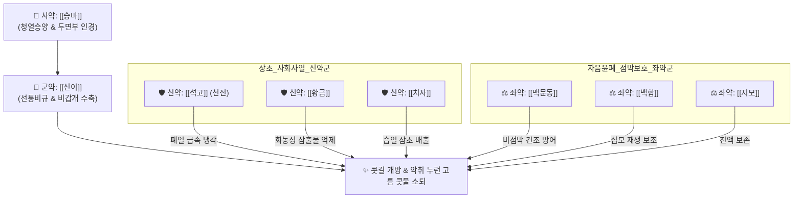

# 🍵 [[신이청폐탕]] (辛夷淸肺湯, Xinyi Qingfei Decoction)

> **핵심 3줄 요약 (Key Summary)**:
> - 🌿 [[신이]], [[황금]], [[치자]], [[지모]], [[석고]], [[맥문동]], [[백합]], [[비파엽]], [[승마]] 배오 (신이의 비규 개방과 석고·황금·치자의 상초 폐열 청설, 맥문동·백합의 점막 보습을 결합한 폐열 축농증 대표 방제).
> - 🎯 폐열(肺熱)이 상초에 울결되어 코가 꽉 막히고, 냄새가 고약한 누런 고름 콧물이 흐르며(비체황탁 鼻涕黃濁), 코 안이 화끈거리고 전두통과 후각 감퇴가 있는 환자.
> - 🔬 비강 점막 미세혈관 수축 및 비갑개 부종 완화([[마그놀린]]), 부비동 화농성 삼출물 억제 및 항균([[바이칼린]], [[제니포시드]]), 점막 상피 세포 보습.
> - ⚠️ 주의사항: 대고대한(大苦大寒)한 청열약이 다수 포함되어 비위허한(소화불량, 설사) 환자 신중 투여, 맑은 콧물만 흐르는 한성 비염에는 금기.
---
## 📌 목차
1. [기본 처방 정보 & 군신좌사 구성](#1-기본-처방-정보--군신좌사-구성)
2. [방제학적 약재 상호작용 & 시너지 네트워크](#2-방제학적-약재-상호작용--시너지-네트워크)
3. [현대 분자약리학적 효능 & 작용 기전](#3-현대-분자약리학적-효능--작용-기전)
4. [적응 병증 및 체질별 감별 (Sweet Spot vs 금기)](#4-적응-병증-및-체질별-감별-sweet-spot-vs-금기)
5. [유사 처방군 감별 매트릭스](#5-유사-처방군-감별-매트릭스)
6. [임상 가감례 & 현대 질환별 응용](#6-임상-가감례--현대-질환별-응용)
7. [💡 사용자 진료실 핵심 필기 & 임상 팁 (원문 보존)](#7--사용자-진료실-핵심-필기--임상-팁-원문-보존)
8. [출처 및 학술 참고 문헌 (References)](#8-출처-및-학술-참고-문헌-references)
---
## 1. 기본 처방 정보 & 군신좌사 구성

* **출전**: 명대(明代) 공정현(龔廷賢) 『[[만병회춘]](萬病回春)』
* **치법**: 청설폐열(淸洩肺熱), 선통비규(宣通鼻竅), 자음윤폐(滋陰潤肺), 배농지통(排膿止痛)

| 구분 | 약재명 | 표준 용량 | 본초 효능 & 방제 내 역할 |
| :--- | :--- | :--- | :--- |
| **군약 (君藥)** | [[신이]] | 9g (포전) | 발산풍열, 선통비규(宣通鼻竅), 비점막 종창 수축 및 콧길 개방 |
| **신약 (臣藥)** | [[석고]] | 12g (선전) | 청열사화(淸熱瀉火), 제번지갈, 상초와 폐의 극심한 화열을 냉각 |
| **신약 (臣藥)** | [[황금]] | 9g | 청폐사화(淸肺瀉火), 조습해독, 상기도 점막의 염증과 화농 억제 |
| **신약 (臣藥)** | [[치자]] | 9g | 사화제번(瀉火除煩), 청열이습, 삼초의 습열 독소를 소변으로 배출 |
| **좌약 (佐藥)** | [[지모]] | 9g | 청열사화, 자음윤조, 고한약의 조열 손상을 막고 음액 보호 |
| **좌약 (佐藥)** | [[맥문동]] | 9g | 양음윤폐(養陰潤肺), 청심제번, 건조해진 비강 및 인두 점막에 수분 공급 |
| **좌약 (佐藥)** | [[백합]] | 9g | 윤폐지해(潤肺止咳), 청심안신, 폐 점막 세포 재생 보조 |
| **좌약 (佐藥)** | [[비파엽]] | 9g | 청폐지해(淸肺止咳), 강역화위, 폐열로 인한 상역감을 아래로 내림 |
| **사약 (使藥)** | [[승마]] | 6g | 승양거풍(升陽祛風), 청열해독, 약 기운을 두면부 비규로 인경(引經) |

> **배오 특징**: [[신이산]]이 풍한(風寒)으로 인한 코막힘에 쓰는 따뜻한 통규제라면, [[신이청폐탕]]은 곪고 열이 차오른 **상초 폐열(肺熱)성 비연·축농증**을 치료하는 대표적인 청열통규제입니다. [[신이]]의 통규력에 [[석고]]·[[황금]]·[[치자]]의 강력한 청열사화와 [[맥문동]]·[[백합]]·[[지모]]의 자음윤조가 어우러져 비점막을 태우지 않고 안전하게 농열을 식힙니다.
---
## 2. 방제학적 약재 상호작용 & 시너지 네트워크

* [[신이]] + [[석고]]·[[황금]] 배오: 신이의 따뜻한 통규성과 석고·황금의 차가운 해열성이 맞물려, 콧길을 시원하게 열면서도 국소 열감과 화농을 단번에 가라앉힙니다.
* [[맥문동]] + [[백합]] + [[지모]] 배오: 강력한 항균 청열약들이 비강 점막의 정상 수분과 상피 세포를 건조하게 손상시키는 부작용을 완벽히 차단합니다.
---
## 3. 현대 분자약리학적 효능 & 작용 기전

### 1) 비점막 혈관 투과성 억제 및 종창 수축
* [[신이]]의 [[마그놀린]](Magnolin) 성분이 비점막 모세혈관의 과도한 투과성을 정상화하고 하비갑개 충혈을 가라앉혀 비강 통기도를 즉각 회복시킵니다.

### 2) 부비동 내 항균 및 농성 삼출물 차단
* [[황금]]의 [[바이칼린]](Baicalin)과 [[치자]]의 [[제니포시드]](Geniposide)가 황색포도구균, 폐렴연쇄구균 등 부비동 2차 감염균의 바이오필름 형성을 억제하고 염증성 호중구 침윤을 차단하여 끈끈한 누런 고름 콧물을 줄입니다.

### 3) 점막 상피 세포 보습 및 섬모 운동성 보존
* [[맥문동]] 오피오포고닌 및 [[백합]] 다당체가 만성 화농성 염증으로 파괴된 비점막 상피의 점액섬모 청정기능(Mucociliary Clearance)을 회복시킵니다.
---
## 4. 적응 병증 및 체질별 감별 (Sweet Spot vs 금기)

[✅ 최적 적응증 (Sweet Spot)]
• 만병회춘 조문: "비열(鼻熱), 비색(鼻塞), 비체황탁(鼻涕黃濁), 콧속에서 냄새가 나고 냄새를 맡지 못하는 비연(鼻淵)을 다스린다."
• 체질 소견: 평소 체격이 실하고 열이 많으며 얼굴이 붉고 상열감이 있는 태음인(열증) 및 소양인
• 임상 주치: 만성 부비동염(축농증), 비후성 비염으로 누렇고 끈적끈적하며 냄새나는 콧물이 계속 나오고 코 안이 화끈거리며 전두통이 심할 때
• 설진/맥진: 설홍(舌紅), 황니태(黃膩苔) 또는 건황태, 맥활삭(脈滑數) 또는 맥삭유력(脈數有力)

[⚠️ 신중 투여 및 금기 (Caution / Contraindication)]
• 비위허한(脾胃虛寒) 설사 환자: 석고, 치자, 지모 등 대한(大寒)한 약재가 많아 평소 위장이 약하고 소화가 안 되며 설사하는 환자 주의
• 풍한성 맑은 콧물: 맑은 콧물이 물처럼 쏟아지고 재채기와 오한이 나는 한성 비염에는 절대 금기 ([[소청룡탕]], [[신이산]] 적용)
---
## 5. 유사 처방군 감별 매트릭스

| 처방명 | 핵심 구성 차이 | 주치 병증 및 콧물 특징 | 열감 및 체질 | 맥진/설진 차이 |
| :--- | :--- | :--- | :--- | :--- |
| [[신이청폐탕]] | [[신이]], [[석고]], [[황금]], [[치자]], [[맥문동]] | **누렇고 끈끈한 고름 콧물, 악취, 코 화끈거림** | **폐열 뚜렷, 소양인·열태음인** | 맥활삭(滑數), 설홍황태 |
| [[신이산]] | [[신이]], [[백지]], [[세신]], [[고본]], [[황금]] | **완고한 코막힘, 맑거나 누런 코 혼재, 전두통** | **풍한 표증 겸유, 평온~미열** | 맥부현(浮弦), 박백태 |
| [[갈근탕가천궁신이]] | [[갈근탕]] + [[천궁]], [[신이]] | **뒷목 뻣뻣함(항배강) + 코막힘, 초기 비염** | **오한, 무한, 표한실증** | 맥부긴(浮緊), 박백태 |
| [[형개연교탕]] | [[사물탕]] + [[형개]], [[연교]], [[황금]], [[치자]] | **이비인후과 만성 염증, 축농증, 중이염, 여드름** | **풍열 풍화, 신경 예민 청소년** | 맥활삭, 설홍태박황 |
| [[방풍통성산]] | 표리쌍해 사화제 | **비만 환자 축농증, 변비, 피지 과다** | **삼초 대열, 복부 비만** | 맥활삭유력, 황조태 |
---
## 6. 임상 가감례 & 현대 질환별 응용

* **수반 증상별 가감법**:
  * 콧물이 몹시 끈적하고 고름 악취가 극심할 때 $\rightarrow$ + [[어성초]], [[패모]], [[금은화]]
  * 전두통 및 안면 협골 부위 압박통 극심 시 $\rightarrow$ + [[백지]], [[만형자]]
  * 소화 장애 및 설사 경향 보일 때 $\rightarrow$ + [[백출]], [[복령]], [[생강]] (사이드 대처)
* **현대 질환 매핑**:
  * **급·만성 부비동염(화농성 축농증)**: 상악동 및 전두동 농성 비루와 압박통
  * **비후성 비염 및 비강 폴립(비옹 鼻癰)**: 비점막의 만성 증식성 염증
  * **비취증(Ozena / 위축성 비염의 감염기)**: 콧속 악취와 마른 딱지 형성
---
## 7. 💡 사용자 진료실 핵심 필기 & 임상 팁 (원문 보존)

> [!tip] **진료실 실전 노하우 (User Clinical Insight)**
> - **"코에서 누런 콧물이 쏟아지고 썩은 냄새가 나며 머리가 띵하고 코 안이 화끈거린다"고 호소하는 폐열형 축농증의 제1 선택지**
> - 신이산과의 감별: 찬바람 쐬면 코 막히는 냉성/알레르기 비염은 [[신이산]], 코 안이 뜨겁고 누런 고름 콧물이 나오는 염증성은 [[신이청폐탕]]
> - 신이는 반드시 포(布)에 싸서 달이고(포전), 석고는 먼저 10~20분 달인 뒤(선전) 나머지 약재를 넣는 탕전법 준수
> - 찬 성질의 약재가 많으므로 평소 위장이 약한 환자는 식후 30분 미온복 지도 (처방 사이드 대처법 142번 연동)
---
## 8. 출처 및 학술 참고 문헌 (References)

2. * **Yue YQ et al. (2026)**. Magnolia biondii-Derived Exosome-Like Nanoparticles Ameliorate Ulcerative Colitis by Suppressing Inflammation, Reducing Oxidative Stress, and Modulating Gut Microbiota. *International journal of nanomedicine*, 21: 605192. [PMID: 42544276](https://pubmed.ncbi.nlm.nih.gov/42544276/)
     - **[연구 요약]**: 신이 추출물이 비점막 염증성 사이토카인 및 비만세포 탈과립을 억제하고 혈관 투과성을 낮추는 분자 기전 규명.
3. **공정현 (1587)**. 『[[만병회춘]](萬病回春)』.
     - **[고전 원전]**: "辛夷淸肺湯, 治鼻淵, 鼻內有息肉, 鼻涕黃濁, 腥臭不聞香臭." (신이청폐탕은 비연과 콧속 폴립, 누렇고 탁하며 비린내 나는 콧물로 냄새를 맡지 못하는 병증을 다스린다.)
