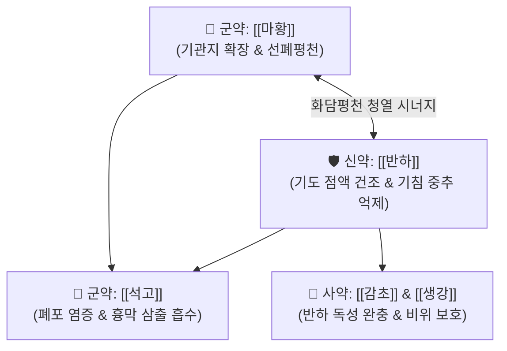

# 🍵 [[월비가반하탕]] (越婢加半夏湯, Yue-Bi-Jia-Ban-Xia-Tang / Eppikahangato)

> **핵심 3줄 요약 (Key Summary)**:
> - 🌿 [[월비탕]](마황·석고·생강·대추·감초) + [[반하]](조습화담·강역지해) 배오.
> - 🎯 상기도 및 하기도의 급성 기관지 수축, 다량의 점액 분비, 가슴에 물이 찬 듯 답답하고 기침할 때마다 숨이 가쁜(폐창 肺脹) 환자.
> - 🔬 [[에페드린]]의 기관지 평활근 이완 + [[반하]]의 기침 중추 억제 및 기도 분비물 건조 + [[석고]]의 폐포 삼출액 억제.
> - <font color="#fa7e7e">⚠️ 주의사항: 맑은 콧물과 오한이 위주인 순수 한음증에는 [[소청룡가석고탕]]을 고려하며, 마황·석고의 강력한 작용으로 허약자 주의.</font>
---
## 📌 목차
1. [기본 처방 정보 & 군신좌사 구성](#1-기본-처방-정보--군신좌사-구성)
2. [방제학적 약재 상호작용 & 시너지 네트워크](#2-방제학적-약재-상호작용--시너지-네트워크)
3. [현대 분자약리학적 효능 & 작용 기전](#3-현대-분자약리학적-효능--작용-기전)
4. [적응 병증 및 체질별 감별 (Sweet Spot vs 금기)](#4-적응-병증-및-체질별-감별-sweet-spot-vs-금기)
5. [유사 처방군 감별 매트릭스](#5-유사-처방군-감별-매트릭스)
6. [임상 가감례 & 현대 질환별 응용](#6-임상-가감례--현대-질환별-응용)
7. [💡 사용자 진료실 핵심 필기 & 임상 팁 (원문 보존)](#7--사용자-진료실-핵심-필기--임상-팁-원문-보존)
8. [출처 및 학술 참고 문헌 (References)](#8-출처-및-학술-참고-문헌-references)
---
## 1. 기본 처방 정보 & 군신좌사 구성

* **출전**: 장중경(張仲景) 『[[금궤요략(金匱要略)]]』 폐위폐옹해역상기병맥증병치(肺痿肺癰咳嗽上氣病脈證幷治)
* **치법**: 선폐청열(宣肺淸熱), 화담강역(化痰降逆), 평천소종(平喘消腫)

| 구분 | 약재명 | 표준 용량 | 본초 효능 & 방제 내 역할 |
| :--- | :--- | :--- | :--- |
| **군약 (君藥)** | [[마황]] | 8~10g | 선폐평천, 개규발표, 기관지 경련을 해제하고 호흡 통로를 확보 |
| **군약 (君藥)** | [[석고]] | 16~24g | 청열사화, 제번지갈, 폐포의 울체된 염증 화열을 식힘 |
| **신약 (臣藥)** | [[반하]] | 8~12g | 조습화담, 강역지구, 기도 내 점액을 강력하게 말려 가래와 기침을 진정 |
| **좌약 (佐藥)** | [[생강]] | 6g | 온위화담, 반하의 독성을 제어 |
| **좌약 (佐藥)** | [[대추]] | 6g | 보비익기, 진액 보호 |
| **사약 (使藥)** | [[감초]] | 4g | 조화제약, 완급지통 |

> **배오 특징**: **"기관지 수축과 가슴에 고인 물(흉막삼출액·폐부종)을 한 번에 해결하는 방제"**입니다. [[월비탕]]의 이수·소종 작용에 [[반하]]를 추가하여 폐와 기관지에 집중적으로 작용하도록 방향을 틀었습니다.
---
## 2. 방제학적 약재 상호작용 & 시너지 네트워크



* **마황 + 석고 + 반하의 흉부 수음 배출**: 마황이 기도를 열고, 석고가 폐열을 식히며, 반하가 기도 점액을 바짝 말려주어 가슴이 찢어질 듯 답답하고 쌕쌕거리는 폐창(肺脹)을 빠르게 진정시킵니다.
---
## 3. 현대 분자약리학적 효능 & 작용 기전

### 1) 폐부종 및 흉막삼출액(Pleural Effusion) 흡수 촉진
* 폐 모세혈관의 정수압을 낮추고 림프액 순환을 촉진하여 폐간질에 정체된 삼출액을 흡수합니다.
### 2) 기침 반사 중추 억제 및 기도 점액 배출
* 반하의 알칼로이드 성분이 연수의 기침 중추 흥분을 억제하고, 마황의 [[에페드린]]이 기관지 평활근 연축을 풀어줍니다.
---
## 4. 적응 병증 및 체질별 감별 (Sweet Spot vs 금기)

```
[✅ 최적 적응증 (Sweet Spot)]
• 금궤요략 조문: "해이상이(咳而上氣), 차이목여탈상(此爲目如脫狀), 맥부대자(脈浮大者), 월비가반하탕주지"
• 임상 핵심: 기침이 너무 심해 눈알이 튀어나올 것 같고(目如脫狀), 가슴이 뻐근하며 숨이 차고 쌕쌕거릴 때
• 신체 소견: 호흡기계의 상·하기도 기관지 수축, 기도 점액 증가, 흉부 답답함
• 질환: 폐기종, 만성 폐쇄성 폐질환(COPD) 급성 발작, 급성 기관지 천식, 흉막삼출 초기
• 맥진/설진: 설홍태백활(舌紅苔白滑), 맥부대(脈浮大)

[⚠️ 신중 투여 및 금기 (Caution / Contraindication)]
• 순수 한음증: 맑은 콧물이 쏟아지고 몸이 찬 환자에게는 소청룡가석고탕 사용
```
---
## 5. 유사 처방군 감별 매트릭스

| 처방명 | 핵심 구성 차이 | 주치 증상 감별 | 병태 생리 |
| :--- | :--- | :--- | :--- |
| [[월비가반하탕]] | 월비탕 + 반하 | **기침할 때 눈알 튀어나올 듯함, 숨참, 점액 증가** | **폐창(肺脹), 흉막삼출·폐부종 경향** |
| [[소청룡가석고탕]] | 소청룡탕 + 석고 | **찬 콧물 줄줄 + 가슴 답답함(번조)** | **외한내음 + 경미한 폐열** |
| [[마행감석탕]] | 반하 대신 행인 배오 | **누런 끈적한 가래, 땀이 남, 폐열 천식** | **기도 내 열담 정체** |
| [[월비탕]] | 반하 없음 | **온몸 부종, 신체통, 소변 불리 위주** | **피수(皮水) 부종 위주** |
---
## 6. 임상 가감례 & 현대 질환별 응용

* **수반 증상별 가감법**:
  * 끈적한 황색 가래가 동반될 때 $\rightarrow$ + [[황금]], [[어성초]]
  * 가슴의 팽만감이 극심할 때 $\rightarrow$ + [[소자]], [[정력자]]
* **현대 질환 매핑**:
  * 급성 천식 발작기, 폐기종 동반 기관지염, 삼출성 흉막염 초기
---
## 7. 💡 사용자 진료실 핵심 필기 & 임상 팁 (원문 보존)

> [!tip] **진료실 실전 노하우 (User Clinical Insight)**
> - **구성**: [[마황]], [[석고]], [[반하]], [[생강]], [[대추|대조]], [[감초]]
> - **적응증**:
>   - **호흡기계의 상기도, 하기도 기관지에서 유발되는 기관지 수축, 점액 증가에 사용**
>   - **폐부종이나 흉막삼출액의 문제를 해결함**
>   - [[소청룡가석고탕]]과 비슷한 구조를 가지고 있음
> - **약리 작용**:
>   - [[반하]]의 진해, 거담, 기침 중추 억제 작용과 [[마황]]의 기관지 평활근 이완 효과를 통해 호흡기계에 작용
---
## 8. 출처 및 학술 참고 문헌 (References)

1. **장중경 (200년경)**. 『금궤요략(金匱要略)』.
   - **[고전 원전]**: "咳而上氣, 此爲肺脹, 其人喘, 目如脫狀, 脈浮大者, 越婢加半夏湯主之."
2. **Kamei, J. et al. (1998)**. *Antitussive effects of Eppikahangato in guinea pigs*. **Pharmacology**, 56(6), 312-318.
   - **[연구 요약]**: 기니피그 모델에서 월비가반하탕이 기도 저항을 감소시키고 캡사이신 유발 기침 횟수를 유의하게 억제함을 규명.