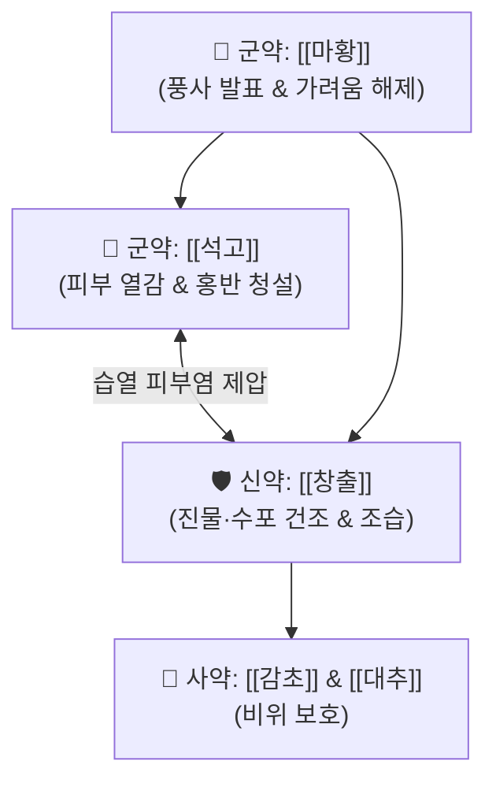

# 🍵 [[월비가출탕]] (越婢加朮湯, Yue-Bi-Jia-Zhu-Tang / Eppikajutsuto)

> **핵심 3줄 요약 (Key Summary)**:
> - 🌿 [[월비탕]](마황·석고·생강·대추·감초) + [[창출]](또는 백출, 조습건비·이수) 배오.
> - 🎯 피부 열감과 부종, 수포, 진물이 흐르는 습윤 경향을 보이는 급성 습진, 아토피 피부염, 두드러기, 접촉성 피부염, 열성 관절통 환자.
> - 🔬 [[에페드린]]·[[석고]]의 혈관 투과성 억제 + 창출의 아쿠아포린 조절을 통한 진물·부종 흡수 및 항히스타민 소양증 완화.
> - <font color="#fa7e7e">⚠️ 주의사항: 단독으로는 염증 억제력이 약할 수 있으므로, 두드러기·홍반이 심하면 [[황련해독탕]], 만성 염증 시 [[온청음]]·[[소풍산]] 합방.</font>
---
## 📌 목차
1. [기본 처방 정보 & 군신좌사 구성](#1-기본-처방-정보--군신좌사-구성)
2. [방제학적 약재 상호작용 & 시너지 네트워크](#2-방제학적-약재-상호작용--시너지-네트워크)
3. [현대 분자약리학적 효능 & 작용 기전](#3-현대-분자약리학적-효능--작용-기전)
4. [적응 병증 및 체질별 감별 (Sweet Spot vs 금기)](#4-적응-병증-및-체질별-감별-sweet-spot-vs-금기)
5. [유사 처방군 감별 매트릭스](#5-유사-처방군-감별-매트릭스)
6. [임상 가감례 & 현대 질환별 응용](#6-임상-가감례--현대-질환별-응용)
7. [💡 사용자 진료실 핵심 필기 & 임상 팁 (원문 보존)](#7--사용자-진료실-핵심-필기--임상-팁-원문-보존)
8. [출처 및 학술 참고 문헌 (References)](#8-출처-및-학술-참고-문헌-references)
---
## 1. 기본 처방 정보 & 군신좌사 구성

* **출전**: 장중경(張仲景) 『[[금궤요략(金匱要略)]]』 수기병맥증병치(水氣病脈證幷治)
* **치법**: 청열선폐(淸熱宣肺), 거풍제습(祛風除濕), 소종지양(消腫止痒)

| 구분 | 약재명 | 표준 용량 | 본초 효능 & 방제 내 역할 |
| :--- | :--- | :--- | :--- |
| **군약 (君藥)** | [[마황]] | 8~10g | 선폐발한, 이수소종, 체표의 풍습사를 열고 모세혈관 수축 |
| **군약 (君藥)** | [[석고]] | 16~24g | 청열사화, 제번지갈, 피부의 불타는 열감과 화농성 염증을 청해 |
| **신약 (臣藥)** | [[창출]](또는 [[백출]]) | 8~12g | 조습건비(燥濕健脾), 거풍제습, 피부 및 관절의 진물과 수포를 건조·흡수 |
| **좌약 (佐藥)** | [[생강]] | 6g | 온중화위, 발표통규 |
| **좌약 (佐藥)** | [[대추]] | 6g | 보비익기, 진액 보호 |
| **사약 (使藥)** | [[감초]] | 4g | 조화제약, 완급지통 |

> **배오 특징**: **"피부 비뇨기과의 소방수이자 제습기"**입니다. [[석고]]로 피부 표면의 화열(火熱)을 끄고, [[창출]]로 짓무르고 축축한 진물(濕邪)을 말리며, [[마황]]으로 가려움증을 일으키는 풍사(風邪)를 땀과 소변으로 배출시킵니다.
---
## 2. 방제학적 약재 상호작용 & 시너지 네트워크



* **석고 + 창출 + 마황의 피부 3단계 치유**:
  1. 석고: 피부 표면의 붉은 열독 진정
  2. 창출: 짓무른 진물과 수포 건조
  3. 마황: 참을 수 없는 극심한 가려움증 해소
---
## 3. 현대 분자약리학적 효능 & 작용 기전

### 1) 혈관 투과성 항진 억제 & 진물(Exudate) 흡수
* 석고의 칼슘 이온과 창출의 아트락틸로딘 성분이 피부 모세혈관의 혈관 내피 성장 인자(VEGF) 및 히스타민 반응을 차단하여 삼출액 분비를 억제합니다.
### 2) 비만세포 탈과립 억제 및 항소양증
* 마황의 [[에페드린]] 성분이 교감신경을 자극하여 가려움 신경 전달 섬유(C-fiber)의 과흥분을 억제합니다.
---
## 4. 적응 병증 및 체질별 감별 (Sweet Spot vs 금기)

```
[✅ 최적 적응증 (Sweet Spot)]
• 금궤요략 조문: "리수(裏水), 월비가출탕주지... 감가(甘家)는 오미(五味)를 기(忌)함"
• 임상 핵심: 피부가 붉고 뜨거우면서 퉁퉁 붓고, 긁으면 노란 진물이 줄줄 흐르는 삼출성 피부 질환
• 신체 소견: 피부 열감, 부종, 수포, 습윤 경향을 보이는 급성 피부염 환자
• 질환: 급성 습진, 접촉성 피부염, 화폐상 습진, 아토피 피부염 급성 삼출기, 두드러기, 열성 관절 종창
• 맥진/설진: 설홍태백활(舌紅苔白滑) 또는 황니(黃膩), 맥부활삭(浮滑數)

[⚠️ 신중 투여 및 금기 (Caution / Contraindication)]
• 만성 건조형 아토피: 진물이 나지 않고 피부가 바짝 마르고 각질만 떨어지는 건성 피부염에는 온청음이나 당귀음자 사용
```
---
## 5. 유사 처방군 감별 매트릭스

| 처방명 | 핵심 구성 차이 | 주치 피부 상태 | 염증 및 진물 양상 |
| :--- | :--- | :--- | :--- |
| [[월비가출탕]] | 월비탕 + 창출 | **피부 열감, 부종, 수포, 짓무르는 진물** | **삼출성 급성 피부염** |
| [[소풍산]] | 형개, 방풍, 고삼, 당귀, 지황 등 | **가려움 극심, 피부 발진, 풍열 습진** | **만성 알레르기성 피부염** |
| [[황련해독탕]] | 황련, 황금, 황백, 치자 | **화농성 여드름, 붉은 홍반, 화열 극심** | **순수 청열사화** |
| [[온청음]] | 사물탕 + 황련해독탕 | **피부 건조 + 붉은 염증이 겹친 상태** | **혈허 화열 복합증** |
---
## 6. 임상 가감례 & 현대 질환별 응용

* **증상별 실전 합방 프로토콜**:
  * **두드러기나 홍반이 극심할 때 $\rightarrow$ + [[황련해독탕]] 합방**
  * **염증이 만성화되고 건조감이 겹칠 때 $\rightarrow$ + [[온청음]] 또는 [[소풍산]] 합방**
* **현대 질환 매핑**:
  * 급성 화폐상 습진, 급성 두드러기, 감염성 수포성 피부염, 통풍성 급성 관절염
---
## 7. 💡 사용자 진료실 핵심 필기 & 임상 팁 (원문 보존)

> [!tip] **진료실 실전 노하우 (User Clinical Insight)**
> - **구성**: [[석고]], [[마황]], [[창출]], [[대추|대조]], [[감초]], [[생강]]
> - **적응증**:
>   - **피부 열감과 부종, 수포, 습윤 경향을 보이는 상태에 사용**
>   - **급성 [[습진]], 자가면역성 피부염, [[아토피 피부염]], [[두드러기]], 접촉피부염에 활용**
>   - **단독으로는 약하고 두드러기나 홍반이 심하면 [[황련해독탕]], 염증이 심할 때 [[온청음]]이나 [[소풍산]]을 합방**
---
## 8. 출처 및 학술 참고 문헌 (References)

1. **장중경 (200년경)**. 『금궤요략(金匱要略)』.
   - **[고전 원전]**: "里水, 一身面目黃腫... 越婢加朮湯主之."
2. **Kurokawa, M. et al. (2002)**. *Efficacy of Eppikajutsuto on contact dermatitis and inflammatory skin disorders*. **International Immunopharmacology**, 2(7), 963-971.
   - **[연구 요약]**: 월비가출탕이 접촉성 피부염 모델에서 피부 귀 부종과 호중구 침윤을 현저히 억제하여 급성 삼출성 습진에 강력한 치료 효과가 있음을 증명.
