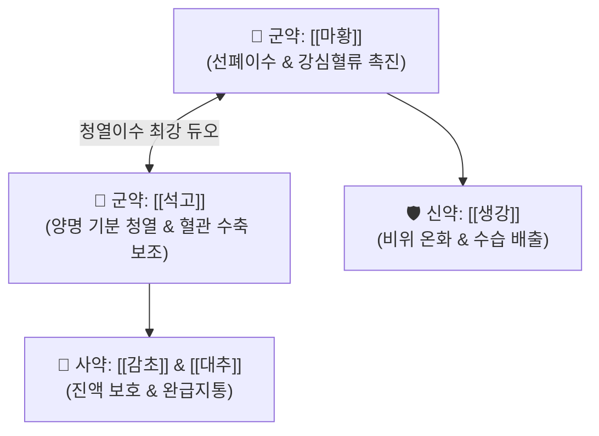

# 🍵 [[월비탕]] (越婢湯, Yue-Bi-Tang / Eppito)

> **핵심 3줄 요약 (Key Summary)**:
> - 🌿 [[마황]], [[석고]], [[생강]], [[대추]], [[감초]] 배오 ([[마황탕]]에서 계지·행인을 빼고 석고를 대량 배오).
> - 🎯 급성 풍수(風水)로 온몸과 얼굴이 붓고, 신체통, 소변불리가 메인이며 땀이 송골송골 나면서(자한 득한) 갈증과 열감이 있는 환자.
> - 🔬 [[에페드린]]의 교감신경 $\beta_1$ 심장 수축 촉진 및 $\alpha$ 수용체 말초 수축을 [[석고]]의 $Ca^{2+}$ 이온이 보조하여 강력한 강심성 반사 이뇨 작용 발휘.
> - <font color="#fa7e7e">⚠️ 주의사항: 알부민 부족성 삼투압 저하 부종에는 [[방기황기탕]]을 사용하며, 무열성 한음 환자에게 석고 과용 주의.</font>
---
## 📌 목차
1. [기본 처방 정보 & 군신좌사 구성](#1-기본-처방-정보--군신좌사-구성)
2. [방제학적 약재 상호작용 & 시너지 네트워크](#2-방제학적-약재-상호작용--시너지-네트워크)
3. [현대 분자약리학적 효능 & 작용 기전](#3-현대-분자약리학적-효능--작용-기전)
4. [적응 병증 및 체질별 감별 (Sweet Spot vs 금기)](#4-적응-병증-및-체질별-감별-sweet-spot-vs-금기)
5. [유사 처방군 감별 매트릭스](#5-유사-처방군-감별-매트릭스)
6. [임상 가감례 & 현대 질환별 응용](#6-임상-가감례--현대-질환별-응용)
7. [💡 사용자 진료실 핵심 필기 & 임상 팁 (원문 보존)](#7--사용자-진료실-핵심-필기--임상-팁-원문-보존)
8. [출처 및 학술 참고 문헌 (References)](#8-출처-및-학술-참고-문헌-references)
---
## 1. 기본 처방 정보 & 군신좌사 구성

* **출전**: 장중경(張仲景) 『[[금궤요략(金匱要略)]]』 수기병맥증병치(水氣病脈證幷治)
* **치법**: 소풍청열(疏風淸熱), 선폐선수(宣肺宣水), 청열이수(淸熱利水)

| 구분 | 약재명 | 표준 용량 | 본초 효능 & 방제 내 역할 |
| :--- | :--- | :--- | :--- |
| **군약 (君藥)** | [[마황]] | 8~12g | 선폐발한, 이수소종, 폐기를 열어 체표 수기를 배출하고 사구체 여과율 촉진 |
| **군약 (君藥)** | [[석고]] | 16~24g | 청설기분지열(淸洩氣分之熱), 제번지갈, 마황의 발한열성을 억제하고 염증성 삼출 차단 |
| **신약 (臣藥)** | [[생강]] | 6~8g | 온위산한, 마황의 발표를 보조하며 수습 정체로 인한 구역감 완화 |
| **좌약 (佐藥)** | [[대추]] | 6~8g | 보비생진, 마황·석고의 강력한 이수 작용 속에서 진액 고갈 방지 |
| **사약 (使藥)** | [[감초]] | 4~6g | 보비화중, 조화제약, 마황의 심계 자극 완충 |

> **배오 특징**: **"해수가 메인이 아니라 부종과 신체통, 소변불리가 메인인 처방"**입니다. 마황의 이수 작용과 석고의 청열 작용이 짝을 이루어, 체표에 열이 차면서 물이 빠지지 않는 풍수(風水) 상태를 신속히 해소합니다.
---
## 2. 방제학적 약재 상호작용 & 시너지 네트워크



* **마황 + 석고 + 칼슘 이온 시너지**: 마황의 [[에페드린]]이 심근 $\beta_1$ 수용체를 자극하여 심장 수축력을 높이고, 석고의 칼슘($Ca^{2+}$) 이온이 입모근 및 말초 혈관 평활근 수축을 보조하여 모세혈관 정맥압을 증가시키고 신속한 소변 배출을 유도합니다.
---
## 3. 현대 분자약리학적 효능 & 작용 기전

### 1) 사구체 혈류량 증가 및 수분 삼출 흡수
* 전신 순환 혈류량을 증대시켜 신동맥 혈압을 유지하고, 조직 간질에 고여 있던 부종액을 혈관 내로 재흡수시켜 요량을 획기적으로 증가시킵니다.
### 2) 급성 염증성 부종 및 열성 천명 완화
* 석고의 항염 작용과 마황의 기관지 확장 작용이 결합하여, 고열을 동반한 호흡 곤란과 신체 통증을 동시에 가라앉힙니다.
---
## 4. 적응 병증 및 체질별 감별 (Sweet Spot vs 금기)

```
[✅ 최적 적응증 (Sweet Spot)]
• 금궤요략 조문: "풍수(風水), 악풍(惡風), 일신실종(一身悉腫), 맥부부갈(脈浮不渴), 속어속한(續自汗出), 무대열(無大熱), 월비탕주지"
• 임상 핵심: 갑자기 얼굴과 눈꺼풀이 붓기 시작하여 온몸이 붓고, 소변량이 줄어들며, 열감이 있고 땀이 송골송골 나면서 몸이 무겁고 아플 때
• 질환: 급성 사구체신염 초기 부종, 네프로제 증후군 초기, 혈관신경성 안면 부종, 열성 천식
• 맥진/설진: 설첨홍(舌尖紅), 태박황(薄黃), 맥부삭(浮數) 또는 맥부대(浮大)

[⚠️ 신중 투여 및 금기 (Caution / Contraindication)]
• 허약성 부종: 영양 부족이나 기허로 인해 살이 물렁물렁하고 붓는 환자에게는 방기황기탕 사용
• 심장성 부종 말기: 심장 기능이 극도로 저하된 환자에게 마황 단독 고용량 사용 주의
```
---
## 5. 유사 처방군 감별 매트릭스

| 처방명 | 핵심 구성 차이 | 주치 기전 감별 | 부종의 원인 및 성격 |
| :--- | :--- | :--- | :--- |
| [[월비탕]] | 마황, 석고, 생강, 대추, 감초 | **강심 및 혈관 운동 촉진을 통한 반사성 이뇨** | **풍수(風水), 열성 급성 부종** |
| [[방기황기탕]] | 방기, 황기, 백출, 감초 등 | **혈장 알부민 공급 및 교질 삼투압 증가** | **기허(氣虛), 영양 부족성 만성 부종** |
| [[마행감석탕]] | 행인 배오, 생강·대추 없음 | **해수·천명이 메인인 호흡기 질환** | **부종 없음, 폐열 천식 위주** |
| [[대청룡탕]] | 계지탕 합방, 마황 배량 | **땀이 전혀 안 나고(무한) 가슴 답답(번조) 극심** | **대발한·해열 표한이열** |
---
## 6. 임상 가감례 & 현대 질환별 응용

* **수반 증상별 파생 방제군**:
  * 관절 부종과 피부 습윤성 질환이 겹칠 때 $\rightarrow$ + [[창출]] ([[월비가출탕]])
  * 기침이 심하고 가슴이 찢어질 듯 답답할 때 $\rightarrow$ + [[반하]] ([[월비가반하탕]])
* **현대 질환 매핑**:
  * 급성 신우신염/신염 부종, 특발성 안면 부종, 소아 열성 기침 부종
---
## 7. 💡 사용자 진료실 핵심 필기 & 임상 팁 (원문 보존)

> [!tip] **진료실 실전 노하우 (User Clinical Insight)**
> - **구성**: [[마황]], [[석고]], [[생강]], [[대추]], [[감초]]
> - **적응증**:
>   - **고열을 동반하는 천식, 해수, 신체 통증, 소변 불리, 부종에 사용**
>   - [[마황]], [[석고]] 조합으로 해수가 메인인 것은 아니고, 부종과 신체통, 소변 불리가 메인임
> - **약리 작용**:
>   - [[마황]]의 [[에페드린]]의 교감신경 활성화와 베타1 아드레날린 수용체에 의한 심장 수축, 알파 아드레날린 수용체에 의한 말초혈관 수축을 [[석고]]의 칼슘 이온이 보조함
> - [[방기황기탕]] VS [[월비탕]] 기전 비교 감별:
>   - [[방기황기탕]]: 혈장 알부민 부족에 알부민을 공급하여 삼투압을 증가시켜 부종을 감소시키는 기전
>   - [[월비탕]]: 강심과 근육 수축과 이완을 통해서 이뇨 작용을 일으켜 부종을 감소시키는 기전
---
## 8. 출처 및 학술 참고 문헌 (References)

1. **장중경 (200년경)**. 『금궤요략(金匱要略)』.
   - **[고전 원전]**: "風水, 惡風, 一身悉腫... 續自汗出, 無大熱, 越婢湯主之." (풍수로 온몸이 붓고 땀이 나면서 열이 날 때 월비탕으로 치료한다.)
2. **Akiba, T. et al. (2001)**. *Diuretic and renal hemodynamic effects of Eppito in rats*. **Biol Pharm Bull**, 24(7), 844-848.
   - **[연구 요약]**: 월비탕이 신동맥 저항을 감소시키고 사구체 혈류량을 유의하게 증가시켜 강력한 이뇨 효과를 나타냄을 입증.