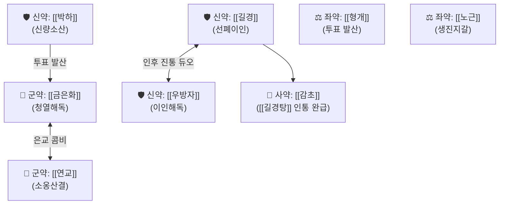

# 🍵 [[은교산]] (銀翹散, Yin-Qiao-San / Ginkyosan)

> **핵심 3줄 요약 (Key Summary)**:
> - 🌿 [[금은화]], [[연교]], [[박하]], [[우방자]], [[길경]], [[노근]], [[죽엽]], [[형개]], [[대두황권]], [[감초]] (은화·[[연교]]의 청열해독 베이스에 [[박하]]·[[형개]]의 신량투표, [[길경]]·[[우방자]]의 이인개음 결합).
> - 🎯 감기 초기 오한발열, 무한 또는 미한(微汗), 목구멍이 붓고 타는 듯이 아픈 인후종통(咽喉腫痛), 마른 기침, 편도염 환자.
> - 🔬 호흡기 바이러스 복제 억제, NF-κB 억제를 통한 인두 점막 급성 염증 완화.
> - ⚠️ 주의사항: 맑은 콧물과 오한이 심한 풍한표증(風寒表證) 금기, 비위허한 환자 복용 후 설사 시 주의.
---
## 📌 목차
1. [기본 처방 정보 & 군신좌사 구성](#1-기본-처방-정보--군신좌사-구성)
2. [방제학적 약재 상호작용 & 시너지 네트워크](#2-방제학적-약재-상호작용--시너지-네트워크)
3. [현대 분자약리학적 효능 & 작용 기전](#3-현대-분자약리학적-효능--작용-기전)
4. [적응 병증 및 체질별 감별 (Sweet Spot vs 금기)](#4-적응-병증-및-체질별-감별-sweet-spot-vs-금기)
5. [유사 처방군 감별 매트릭스](#5-유사-처방군-감별-매트릭스)
6. [임상 가감례 & 현대 질환별 응용](#6-임상-가감례--현대-질환별-응용)
7. [💡 사용자 진료실 핵심 필기 & 임상 팁 (원문 보존)](#7--사용자-진료실-핵심-필기--임상-팁-원문-보존)
8. [출처 및 학술 참고 문헌 (References)](#8-출처-및-학술-참고-문헌-references)
---
## 1. 기본 처방 정보 & 군신좌사 구성

* **출전**: 오국통(吳鞠通) 『[[온병조변(溫病條辨)]]』 상초편(上焦篇)
* **치법**: 신량투표(辛涼透表), 청열해독(淸熱解毒)

| 구분 | 약재명 | 표준 용량 | 본초 효능 & 방제 내 역할 |
| :--- | :--- | :--- | :--- |
| **군약 (君藥)** | [[금은화]] | 10~15g | 청열해독(淸熱解毒), 방향소열, 체표의 온열사(溫熱邪)를 해독 |
| **군약 (君藥)** | [[연교]] | 10~15g | 청열해독(淸熱解毒), 소옹산결(消癰散結), 인후와 상초의 열독을 삭힘 |
| **신약 (臣藥)** | [[박하]] | 6~8g | 신량소표(辛涼疏表), 청리두목(淸利頭目), 풍열사를 흩고 목구멍을 시원하게 함 |
| **신약 (臣藥)** | [[우방자]] | 6~8g | 소산풍열(疏散風熱), 해독투진(解毒透疹), 이인산결(利咽散結), 편도선 부종 진정 |
| **신약 (臣藥)** | [[길경]] | 6~8g | 개선폐기(開宣肺氣), 이인배농(利咽排膿), 약 기운을 인후와 폐로 이끄는 인경약 |
| **좌약 (佐藥)** | [[형개]] | 4~6g | 미온(微溫)하나 신산(辛散)하여 표사를 열고 투표(透表) 작용 강화 |
| **좌약 (佐藥)** | [[대두황권]] | 6~8g | 투열외달(透熱外達), 청해표습(淸解表濕), 피부 표면의 열사를 밖으로 유도 |
| **좌약 (佐藥)** | [[죽엽]] | 6~8g | 청열제번(淸熱除煩), 생진이뇨, 심화(心火)를 소변으로 배출 |
| **좌약 (佐藥)** | [[노근]] | 10~15g | 청열생진(淸熱生津), 지갈(止渴), 온열사로 손상된 진액을 보충 |
| **사약 (使藥)** | [[감초]] | 3~5g | 청열해독, 조화제약, [[길경]]과 합쳐져 [[길경탕]](桔梗湯)을 이루어 목 통증을 완해 |

> **배오 특징**: **"향기가 나면 즉시 불을 끄고 달이지 말라(香氣大出, 卽宜拿服, 勿過煮)"**는 온병학의 철칙이 적용되는 방제입니다. 휘발성 정유 성분을 보존하여 상초 인후부의 풍열을 신속하게 날려보내는 현대의 천연 소염진통 항생제입니다.
---
## 2. 방제학적 약재 상호작용 & 시너지 네트워크

* [[길경]] + [[감초]] 배오 ([[길경탕]]): 인후 점막의 통각 수용체 과흥분을 억제하고 염증성 부종을 직접 가라앉히는 목 통증의 킬러 조합입니다.
* [[형개]] + [[대두황권]]의 묘용: 신량(辛涼)한 차가운 약재들 사이에 약간 따뜻하고 흩어주는 [[형개]]·두황권을 소량 섞어, 약 기운이 뭉치지 않고 체표 밖으로 시원하게 뿜어져 나가도록 만듭니다.
---
## 3. 현대 분자약리학적 효능 & 작용 기전

### 1) 항인플루엔자 및 광범위 항바이러스 활성
* [[금은화]]의 [[클로로겐산]](Chlorogenic acid)과 [[연교]]의 [[필리린]](Phillyrin) 성분이 호흡기 바이러스(Influenza A, RSV 등)의 세포 표면 수용체 결합 및 엔도솜 탈출을 차단합니다.

### 2) NF-κB 경로 억제를 통한 급성 인후 소염
* 인후 점막 상피세포에서 염증 전사인자인 NF-κB의 핵 내 이동을 억제하여 **TNF-α, IL-1β, IL-6, COX-2 발현을 급격히 억제**합니다.
* 편도선 및 인두의 모세혈관 투과성을 정상화하여 침 삼킬 때의 날카로운 인통(Odynophagia)을 신속히 소퇴시킵니다.

### 3) 천연 해열 및 면역 글로불린 보존
* 시상하부 PGE2 과다 유리를 억제하면서도 면역 세포의 식균 작용을 방해하지 않아, 체력 소모 없이 온열성 발열을 해열합니다.
---
## 4. 적응 병증 및 체질별 감별 (Sweet Spot vs 금기)

[✅ 최적 적응증 (Sweet Spot)]
• 온병조변 조문: "태양온병(太陽溫病), 초기(初起), 발열이갈(發熱而渴), 미악한(微惡寒), 구고인통(口苦咽痛), 해수(咳嗽), 은교산주지"
• 임상 핵심: 목구멍이 칼칼하게 아프면서 침 삼키기 힘들고, 열이 나며, 오한은 심하지 않고 갈증이 나는 목감기 초기
• 질환: 급성 인후두염, 급성 편도염, 유행성 이하선염, 헤르페스성 구내염, 초기 수포진
• 설진/맥진: 설첨홍(舌尖紅, 혀끝이 붉음), 설태박백 또는 박황(薄黃), 맥부삭(脈浮數, 빠르고 표면에 뜸)

[⚠️ 신중 투여 및 금기 (Caution / Contraindication)]
• 풍한표증(風寒表證) 금기: 맑은 콧물이 줄줄 흐르고, 목 통증 없이 온몸이 춥고 떨리는 오한 감기 환자에게는 금기 ([[갈근탕]], [[마황탕]] 적용)
• 비위허한(脾胃虛寒): 평소 소화기가 차고 설사를 자주 하는 환자가 장복하면 복통·설사 유발
• 복용 타이밍: 온병 초기에 즉시 투여해야 하며, 사기가 이미 폐포 깊숙이 들어가 누런 가래가 끓는 기분(氣分) 열증으로 진행된 경우에는 마행감석탕이나 백호탕으로 변경

---
## 5. 유사 처방군 감별 매트릭스

| 처방명 | 핵심 배오 차이 | 주치 및 임상 감별점 | 맥진/설진 |
| :--- | :--- | :--- | :--- |
| [[은교산]] | [[금은화]], [[연교]], [[박하]], [[길경]] 등 | **신량해표, 목구멍 통증(인후통), 미열, 마른 기침** | 설첨홍, 맥부삭(浮數) |
| [[갈근탕]] | [[갈근]], [[마황]], [[계지]] 등 | **신온해표, 목·어깨 결림, 오한, 땀 안 남, 냉방병** | 설담홍, 맥부긴(浮緊) |
| [[형개연교탕]] | [[형개]], [[연교]], [[방풍]], 황련, [[황금]] 등 | **만성 풍열, 만성 축농증, 화농성 여드름, 이비인후 화열** | 설홍, 황니태, 맥활삭 |
| [[마행감석탕]] | [[마황]], [[행인]], [[감초]], [[석고]] | **폐열 해수, 쌕쌕거림(천식), 끈적하고 누런 가래, 땀 남** | 설홍, 황태, 맥활삭 |
| [[패독산]] | 시호, 전호, [[강활]], 독활, 인삼 등 | **기허자 감기, 으슬으슬 춥고 팔다리가 무거우며 담음 동반** | 맥부완무력 |
---
## 6. 임상 가감례 & 현대 질환별 응용

* **수반 증상별 가감법**:
  * 인후통 및 편도 부종이 극심할 때 $\rightarrow$ + [[마발]], [[현삼]] (청대, 판람근 가미)
  * 기침이 심하고 가슴이 울릴 때 $\rightarrow$ + [[행인]], [[패모]]
  * 열이 극심하고 입이 바짝 마를 때 $\rightarrow$ + [[석고]], [[지모]]
* **현대 질환 매핑**:
  * 급성 인두염, 편도선염, 후두염, 목감기
  * 성대 결절 초기 염증, 소아 수족구병 초기 구내염
---
## 7. 💡 사용자 진료실 핵심 필기 & 임상 팁 (원문 보존)

> [!tip] **진료실 실전 노하우 (User Clinical Insight)**
> - 감기로 오한발열, 무한, 두통과 인후통, 기침을 하는 경우에 사용
> - **구성**: [[연교]], [[금은화]], [[우방자]], [[박하]], [[길경]], [[죽엽]], [[형개]], [[대두황권]], [[감초]]
---
## 8. 출처 및 학술 참고 문헌 (References)

1. **오국통 (1798)**. 『온병조변(溫病條辨)』.
   - **[고전 원전]**: "太陰溫病, 惡風寒, 服桂枝湯已, 惡寒何? 病在手太陰, 溫病忌汗, 汗之不惟不愈, 反見神昏譫語... 銀翹散主之." (태양온병 초기에 땀을 내는 [[계지탕]]을 쓰지 말고 신량청열하는 은교산으로 푼다.)
2. **Poon, P. M. et al. (2010)**. *In vitro antiviral activity of Yinqiao san against influenza A virus*. **Journal of Ethnopharmacology**, 128(2), 526-530.
   - **[연구 요약]**: 은교산 추출물이 인플루엔자 A 바이러스의 숙주 세포 부착 및 단백질 발현을 유의적으로 억제하여 세포 생존율을 보호함을 입증.
3. **허준 (1613)**. 『동의보감(東醫寶鑑)』.
   - **[임상 문헌]**: 풍열(風熱) 감모로 목구멍이 붓고 아픈 열성 상초 병증의 소염 치료 원리 부합.