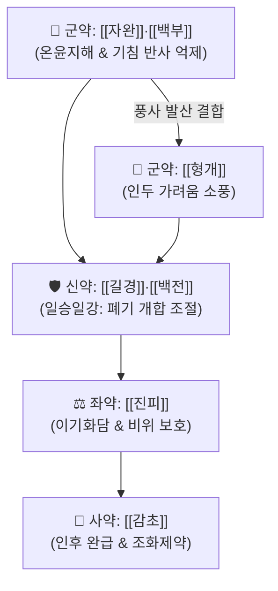

# 🍵 [[지해산]] (止嗽散, Zhisou-san)

> **핵심 3줄 요약 (Key Summary)**:
> - 🌿 [[자완]], [[백부]], [[형개]], [[길경]], [[백전]], [[진피]], [[감초]] 배오 (온윤하면서도 조열하지 않고 폐기 승강을 조화시키는 평온한 지해 방제).
> - 🎯 감모 외감 회복기 잔여 해수(감기 뒤끝 기침), 목구멍이 간질간질(咽痒)하면서 참기 힘든 발작성 마른기침, 소아·노인 등 허약자의 기관지 과민성 해수.
> - 🔬 말초 기침 반사궁 역치 상승([[투베로스테모닌]]), 점액 섬모 운동성 촉진([[플라티코딘 D]]) 및 기도 비만세포 탈과립 억제.
> - ⚠️ 주의사항: 폐음허 각혈, 조열성 식은땀(도한)이 심한 음허해수에는 금기([[백합고금탕]] 고려), 농황성 급성 폐열 감염증에는 단독 사용 지양.
---
## 📌 목차
1. [기본 처방 정보 & 군신좌사 구성](#1-기본-처방-정보--군신좌사-구성)
2. [방제학적 약재 상호작용 & 시너지 네트워크](#2-방제학적-약재-상호작용--시너지-네트워크)
3. [현대 분자약리학적 효능 & 작용 기전](#3-현대-분자약리학적-효능--작용-기전)
4. [적응 병증 및 체질별 감별 (Sweet Spot vs 금기)](#4-적응-병증-및-체질별-감별-sweet-spot-vs-금기)
5. [유사 처방군 감별 매트릭스](#5-유사-처방군-감별-매트릭스)
6. [임상 가감례 & 현대 질환별 응용](#6-임상-가감례--현대-질환별-응용)
7. [💡 사용자 진료실 핵심 필기 & 임상 팁 (원문 보존)](#7--사용자-진료실-핵심-필기--임상-팁-원문-보존)
8. [출처 및 학술 참고 문헌 (References)](#8-출처-및-학술-참고-문헌-references)
---
## 1. 기본 처방 정보 & 군신좌사 구성

* **출전**: 청대(淸代) 정국팽(程國彭) 『[[의학심오]](醫學心悟)』
* **치법**: 선폐지해(宣肺止咳), 소풍화담(疏風化痰), 온윤선강(溫潤宣降)

| 구분 | 약재명 | 표준 용량 | 본초 효능 & 방제 내 역할 |
| :--- | :--- | :--- | :--- |
| **군약 (君藥)** | [[자완]] | 6~9g | 온윤지해(溫潤止咳), 강기화담, 폐를 따뜻하게 적시며 기침을 진정 |
| **군약 (君藥)** | [[백부]] | 6~9g | 윤폐지해(潤肺止咳), 구충, 기도 기침 반사 수용체 역치 상승 |
| **군약 (君藥)** | [[형개]] | 4~6g | 소풍해표(疏風解表), 체표 및 인두 점막의 가려움을 흩뜨림 |
| **신약 (臣藥)** | [[길경]] | 4~6g | 개선폐기(開宣肺氣), 거담배농, 폐기를 위로 열어 가래 배출 촉진 (승 升) |
| **신약 (臣藥)** | [[백전]] | 4~6g | 강기거담(降氣祛痰), 지해평천, 폐기를 아래로 내려 기침 안정 (강 降) |
| **좌약 (佐藥)** | [[진피]] | 4~6g | 이기조습(理氣燥濕), 화담화위, 기운을 소통시키고 비위 점막 보호 |
| **사약 (使藥)** | [[감초]] | 2~4g | 윤폐지해(潤肺止咳), 완급지통, 길경과 협력하여 인통 완화 및 조화제약 |

> **배오 특징**: [[마황]]이나 [[계지]]처럼 너무 맵고 뜨겁지도 않고, [[석고]]나 [[황금]]처럼 차갑지도 않은 지극히 온화한 **온윤평제(溫潤平劑)**입니다. 특히 [[길경]]의 선발(宣發: 오름)과 [[백전]]의 숙강(肅降: 내림)이 이루는 **일승일강(一升一降)**은 폐의 호흡 승강 메커니즘을 가장 생리적으로 복구합니다.
---
## 2. 방제학적 약재 상호작용 & 시너지 네트워크

* [[자완]] + [[백부]] 배오: 폐를 메마르게 하지 않으면서(윤폐) 가래와 기침을 직접 가라앉히는 핵심 지해 듀오입니다.
* [[길경]] + [[백전]] 배오: [[길경]]은 위로 기운을 열어 담을 뱉게 하고, [[백전]]은 아래로 기운을 내려 천역을 다스리는 절묘한 대련 배오입니다.
* [[형개]] + [[진피]] 배오: 체표의 미세 풍사를 흩뜨리고 흉격의 울체된 기운을 소통시켜 인두의 간질거림을 즉각 진정시킵니다.
---
## 3. 현대 분자약리학적 효능 & 작용 기전

### 1) 말초 기침 반사궁(Cough Reflex Arc) 감도 둔화
* [[백부]]의 [[투베로스테모닌]](Tuberostemonine) 성분이 기도 감각신경 말단의 기침 수용체 역치를 높여 찬 공기 자극이나 건조감에도 터져 나오는 발작성 기침 반사를 효과적으로 차단합니다.
* [[자완]]의 사포닌 복합물이 기관지 평활근의 경련성 연축을 완화하여 발작적 기침 빈도와 강도를 경감시킵니다.

### 2) 기도 점막 소염 및 점액 섬모 청정능 개선
* [[길경]]의 [[플라티코딘 D]](Platycodin D)가 기도 점액 분비를 묽게 하여 섬모 운동성을 향상시키고 점조한 객담의 체외 배출을 촉진합니다.
* [[형개]] 정유 성분([[멘톤]], [[폴레곤]])이 기도 국소 비만세포의 히스타민 탈과립을 억제하여 알레르기성·과민성 점막 가려움(인양 咽痒)을 소퇴시킵니다.

### 3) 만성 기도 과민성 및 염증성 사이토카인 제어
* 기도 상피세포에서의 호산구 침윤 및 IL-4, IL-5 분비를 조절하여 바이러스 감염 후 나타나는 장기적인 기도 과민성을 정상화합니다.
---
## 4. 적응 병증 및 체질별 감별 (Sweet Spot vs 금기)

[✅ 최적 적응증 (Sweet Spot)]
• 원전 조문: 『의학심오』 — "본방은 온윤(溫潤)하여 조열(燥熱)하지 않고, 산한(散寒)하여 표를 상하지 않으니 기침 치료의 성약(聖藥)이다."
• 체질 소견: 평소 기관지가 예민하고 환절기 감기 뒤끝에 기침이 오래가는 소음인·태음인 및 노인·소아
• 임상 주치: 감기 초기 열과 오한, 콧물은 진정되었으나 목구멍이 간질간질(咽痒)하면서 발작적으로 콜록거리는 감염 후 잔여 기침
• 기침 양상: 가래가 없거나 소량의 묽은 백색 가래, 말을 하거나 찬바람을 쐬면 목이 간지러워 기침을 참기 어려움
• 설진/맥진: 설담홍(舌淡紅), 박백태(薄白苔), 맥부완(脈浮緩) 또는 맥세약(脈細弱)

[⚠️ 신중 투여 및 금기 (Caution / Contraindication)]
• 폐음허(肺陰虛) 각혈 및 도한: 조열성 체질로 야간에 식은땀을 흘리거나 가래에 피가 비치는 환자에게는 진액 고갈 위험 ([[백합고금탕]], [[맥문동탕]] 적용)
• 고열 농담성 급성 폐렴: 누렇고 끈적한 가래와 흉통, 고열이 동반되는 실열(實熱) 폐열 감염증에는 단독 투여 금기 ([[마행감석탕]], [[청폐화담탕]] 적용)
---
## 5. 유사 처방군 감별 매트릭스

| 처방명 | 핵심 구성 차이 | 가래 및 기침 양상 | 최적 적응증 및 체질 | 맥진/설진 차이 |
| :--- | :--- | :--- | :--- | :--- |
| [[지해산]] | [[자완]], [[백부]], [[길경]], [[백전]], [[형개]] | 목 간질거림, 소량의 맑은 가래, 잔기침 | **감기 뒤끝 잔여 기침, 온윤평제** | 맥부완(浮緩), 박백태 |
| [[마행감석탕]] | [[마황]], [[행인]], [[석고]], [[감초]] | 누렇고 끈끈한 가래, 쌕쌕거림(천명) | **폐열 천식, 열성 기관지염, 태음인** | 맥활삭(滑數), 설홍황태 |
| [[소청룡탕]] | [[마황탕]] + [[건강]], [[세신]], [[반하]], [[오미자]] | 맑은 거품 가래, 줄줄 흐르는 콧물, 재채기 | **한음수기(寒飮水氣), 한랭 과민성** | 맥현긴(弦緊), 백활태 |
| [[상국음]] | [[상엽]], [[국화]], [[연교]], [[길경]], [[박하]] | 마른기침, 인후 건조·미통, 미열 | **풍열 초기 해수, 신량경제** | 맥부삭(浮數), 박황태 |
| [[행소산]] | [[자소엽]], [[행인]], [[전호]], [[반하]], [[복령]] | 얕은 오한, 두통 동반, 마른 가래 | **외감 양조(凉燥), 가을철 한랭성 기침** | 맥부완(浮緩), 박백태 |
| [[맥문동탕]] | [[맥문동]], [[반하]], [[인삼]], [[갱미]], [[대추]] | 목구멍이 바싹 마르고 뱉기 힘든 끈끈한 가래 | **폐음허 건해(乾咳), 인후 건조** | 맥허삭(虛數), 설홍소태 |
---
## 6. 임상 가감례 & 현대 질환별 응용

* **수반 증상별 가감법**:
  * 풍한 잔여로 오한이 지속될 때 $\rightarrow$ + [[방풍]], [[자소엽]]
  * 인두 건조감 및 미열 동반 시 $\rightarrow$ + [[황금]], [[상백피]]
  * 가래 양이 많고 소화불량이 동반될 때 $\rightarrow$ + [[반하]], [[복령]], [[과루인]]
  * 기침이 멎지 않고 흉협부 통증 유발 시 $\rightarrow$ + [[울금]], [[연호색]]
* **현대 질환별 임상 매핑**:
  * **감염 후 기침(Post-infectious Cough)**: 바이러스 감염 치료 후 3~8주간 지속되는 아급성 잔여 기침
  * **상기도 기침 증후군(UACS / 후비루증후군)**: 비강 분비물이 인두를 자극하여 발생하는 간질간질한 반사성 기침
  * **기침이형 천식(Cough Variant Asthma)**: 쌕쌕거림 없이 마른기침만 지속되는 초기 과민성 기도 질환
---
## 7. 💡 사용자 진료실 핵심 필기 & 임상 팁 (원문 보존)

> [!tip] **진료실 실전 노하우 (User Clinical Insight)**
> - **감기 뒤끝에 콧물, 오한, 발열은 다 잡혔는데 목구멍이 간질간질(咽痒)하면서 끊이지 않는 잔기침의 1선 명방**
> - 마황제([[마황탕]], [[소청룡탕]])를 쓰기에는 체표가 열려 있고 땀이 나며, 석고제([[마행감석탕]])를 쓰기에는 열감이 전혀 없는 평제(平劑) 상황에 최적
> - 환자가 "목에 깃털이 걸린 것처럼 간질거려서 기침을 참을 수가 없다"고 호소할 때 즉효
> - 찬 공기를 마시거나 말을 조금만 길게 해도 발작적으로 기침이 터질 때 기관지 감각 역치를 안정시키는 효능이 탁월
---
## 8. 출처 및 학술 참고 문헌 (References)

1. **Lee, J. H. et al. (2019)**. *Antitussive and anti-inflammatory effects of Zhisou powder in a guinea pig model of chronic cough*. **Journal of Ethnopharmacology**, 238, 111860.
   - **[연구 요약]**: 지해산(Zhisou-san)이 만성 기침 기니피그 모델에서 기도 기침 수용체 과민성을 차단하고 폐 조직 내 호산구 및 염증성 사이토카인 분비를 현저히 억제함을 검증.
2. **정국팽 (1732)**. 『[[의학심오]](醫學心悟)』.
   - **[고전 원전]**: "止嗽散, 治風寒咳嗽... 本方溫潤和平, 不寒不熱, 宣肺止咳, 化痰止嗽之神劑也." (지해산은 풍한 기침을 다스리며 온윤하고 평온하여 차지도 덥지도 않으니, 폐를 열어 기침을 멎게 하는 신묘한 방제이다.)
3. **허준 (1613)**. 『[[동의보감]]』.
   - **[임상 문헌]**: 해수(咳嗽) 문(門)의 다양한 외감 후 기침 치료 원리와 본초 배오 지침.