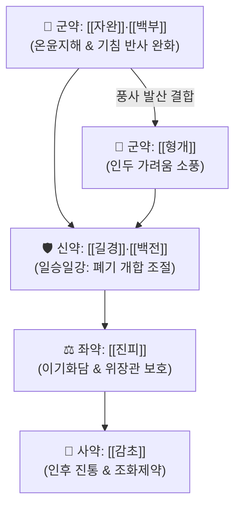

# 🍵 [[지해산]] (止嗽散, Zhisou-san)

> **핵심 3줄 요약 (Key Summary)군약 (君藥)군약 (君藥)군약 (君藥)신약 (臣藥)신약 (臣藥)좌약 (佐藥)사약 (使藥)** | [[감초]] | 3g | 윤폐지해, 길경과 배오하여 인통 완화 및 제약 조화 |

---

## 2. 방제학적 약재 상호작용 & 시너지 네트워크

* **온윤(溫潤)하면서도 조열(燥熱)하지 않은 평제(平劑)**:
  * 마황·계지처럼 너무 맵고 뜨겁지도 않고, 석고·황금처럼 너무 쓰고 차지도 않아 기침 치료의 가장 온화한 방제.
* **일승일강(一升一降)의 절묘한 기전 조화**:
  * 길경은 폐기를 위로 열어(宣發) 가래를 뱉게 하고, 백전은 폐기를 아래로 내려(肅降) 기침을 멎게 하여 폐의 생리적 호흡 승강 운동을 정상화.

---

## 3. 현대 분자약리학적 효능 & 작용 기전

* **말초 기침 반사궁(Cough Reflex Arc) 감도 둔화**:
  * 백부의 투베로스테모닌(Tuberostemonine) 성분이 기도 신경 말단의 기침 수용체 역치를 높여 사소한 공기 자극에도 일어나는 발작적 기침을 차단.
* **기도 점막 항염증 및 분비물 배출**:
  * 길경 플라티코딘 D가 점액 분비를 묽게 하여 섬모 운동성을 높이고, 형개의 정유 성분이 기도 비만세포 탈과립을 억제.

---

## 4. 적응 병증 및 체질별 감별 (Sweet Spot vs 금기)

### ✅ 최적 적응증 (Sweet Spot)
* **감기 회복기 잔여 해수 (감기 뒤끝 기침)**:
  * 발열, 오한, 콧물은 다 나았으나 목구멍이 간질간질(咽痒)하면서 발작적으로 콜록거리는 기침.
  * 기침을 참기 힘들고, 가래는 잘 나오지 않거나 소량의 묽은 백색 가래.
* **설진 및 맥진**:
  * **설진(舌診)**: 설태박백(苔薄白).
  * **맥진(脈診)**: 맥부완(脈浮緩) 또는 맥부세.

### ⚠️ 신중 투여 및 금기 (Caution / Contraindication)
* **폐음허 각혈(음허도한) 환자**:
  * 가래에 피가 섞여 나오거나 야간 도한이 심한 음허 환자는 [[백합고금탕]]을 사용.

---

## 5. 유사 처방군 감별 매트릭스

| 처방명 | 핵심 구성 | 주치 병증 차이 |
| :--- | :--- | :--- |
| [[지해산]] | 형개, 백부, 자완, 백전, 길경, 진피, 감초 | 감기 후 잔여 기침, 목구멍 간질거림, 평제 |
| [[행소산]] | 소엽, 행인, 전호, 반하, 복령 등 | 외감 풍한조사(가을철), 오한, 마른 기침 |
| [[소청룡탕]] | 마황, 작약, 세신, 건강, 반하, 오미자 | 풍한수음, 묽은 거품 가래, 재채기, 콧물 |
| [[상국음]] | 상엽, 국화, 연교, 박하, 길경, 행인 | 풍열해수, 신열, 인후통, 누런 가래 |

---

## 6. 임상 가감례 & 현대 질환별 응용

* **수반 증상별 가감법**:
  * 풍한이 남아 오한이 있을 때 $\rightarrow$ + [[방풍]], [[자소엽]]
  * 목구멍이 마르고 열감이 있을 때 $\rightarrow$ + [[황금]], [[상백피]]
  * 가래가 많고 끈끈할 때 $\rightarrow$ + [[반하]], [[복령]], [[과루인]]
* **현대 질환 매핑**:
  * 감염 후 기침(Post-infectious cough), 상기도 기침 증후군(UACS), 기관지 과민성 만성 기침.

---

## 7. 출처 및 학술 참고 문헌 (References)
* Cheng GP. *Yixue Xinwu* (Medical Revelations). 1732.
  * `[연구 요약]`: 지해산 원전 수록, 외감 기침의 온윤선폐 치법 정립.
* Lee JH, et al. Antitussive and anti-inflammatory effects of Zhisou powder in a guinea pig model of chronic cough. *J Ethnopharmacol*. 2019;238:111860.
  * `[연구 요약]`: 지해산의 기도 기침 수용체 차단 및 호산구 염증 억제를 통한 진해 효과 검증.
