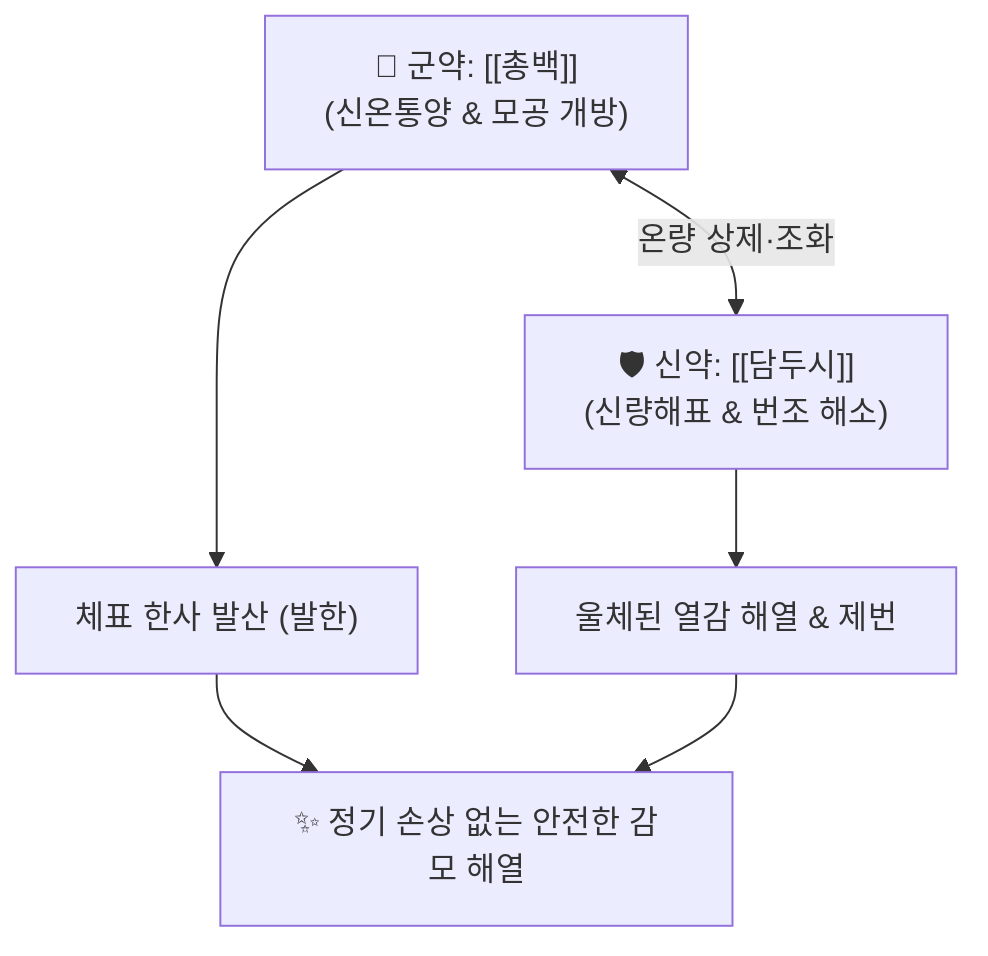

# 🍵 [[총두탕]] (蔥豉湯, Cong-Chi-Tang)

> **핵심 3줄 요약 (Key Summary)**:
> - 🌿 [[총백]](대파 흰 밑동) + [[담두시]](발효 콩) 배오 ([[총백]]의 온통발한과 [[담두시]]의 해표제번이 결합된 신온·신량 겸비의 최순수 경증 해표제).
> - 🎯 소아·임산부·노인 등 약물 민감 체질 및 비위 허약자의 감기 초기, 으슬으슬 춥고 미열이 나며 코막힘·맑은 콧물이 나면서 땀이 안 나는 경증 풍한 감모.
> - 🔬 [[알리신]] 유도체의 말초 혈관 확장 및 땀 분비 촉진, [[다이드제인]]·[[제니스테인]]의 초기 인플루엔자 바이러스 억제.
> - ⚠️ 주의사항: 땀을 과도하게 흘리는 표허자한(表虛自汗) 환자 금기, 복용 후 흠뻑 땀을 내지 않고 촉촉한 미한(微汗)만 유도.
---
## 📌 목차
1. [기본 처방 정보 & 군신좌사 구성](#1-기본-처방-정보--군신좌사-구성)
2. [방제학적 약재 상호작용 & 시너지 네트워크](#2-방제학적-약재-상호작용--시너지-네트워크)
3. [현대 분자약리학적 효능 & 작용 기전](#3-현대-분자약리학적-효능--작용-기전)
4. [적응 병증 및 체질별 감별 (Sweet Spot vs 금기)](#4-적응-병증-및-체질별-감별-sweet-spot-vs-금기)
5. [유사 처방군 감별 매트릭스](#5-유사-처방군-감별-매트릭스)
6. [임상 가감례 & 현대 질환별 응용](#6-임상-가감례--현대-질환별-응용)
7. [💡 사용자 진료실 핵심 필기 & 임상 팁 (원문 보존)](#7--사용자-진료실-핵심-필기--임상-팁-원문-보존)
8. [출처 및 학술 참고 문헌 (References)](#8-출처-및-학술-참고-문헌-references)
---
## 1. 기본 처방 정보 & 군신좌사 구성

* **출전**: 진대(晉代) 갈홍(葛洪) 『[[주후비급방]](肘後備急方)』, 장중경(張仲景) 『[[상한론]]』 소음병편
* **치법**: 신온통양(辛溫通陽), 해표제번(解表除煩), 경증발한(輕證發汗)

| 구분 | 약재명 | 표준 용량 | 본초 효능 & 방제 내 역할 |
| :--- | :--- | :--- | :--- |
| **군약 (君藥)** | [[총백]] | 9~15g (연백부 3~5대) | 신온통양(辛溫通陽), 발한해표, 상하의 양기를 관통시켜 한사를 땀으로 발산 |
| **신약 (臣藥)** | [[담두시]] | 9~12g | 신량해표(辛凉解表), 선투표사, 제번(除煩), 총백의 매운 열성을 조화 |

> **배오 특징 & 특수 전탕법**: 음식 재료인 파([[총백]])와 발효콩([[담두시]]) 2가지 약재만으로 구성된 가장 안전한 순한 방제입니다. 물 500mL에 [[담두시]]를 먼저 넣고 끓이다가, 마지막에 [[총백]]을 썰어 넣고 잠깐 끓여(후하 後下) 따뜻하게 복용 후 이불을 덮고 촉촉한 땀(미한 微汗)을 냅니다.
---
## 2. 방제학적 약재 상호작용 & 시너지 네트워크

* [[총백]] + [[담두시]] 배오: [[총백]]의 맵고 따뜻한 기운이 한사로 굳은 모공을 열어주고, [[담두시]]의 서늘한 기운이 울체된 흉격의 답답함(번조)을 풀어주어 맵고 건조하지 않으면서도 온화하게 땀을 냅니다.
* [[마황]]이나 [[계지]]처럼 맹렬하지 않아 정기를 손상시키지 않고 표사를 부드럽게 몰아내므로, 소아, 임산부, 노인 감기 초기에 이상적입니다.
---
## 3. 현대 분자약리학적 효능 & 작용 기전

### 1) 말초 미세순환 확장 & 안전한 발한
* [[총백]]의 [[알리신]](Allicin) 및 유기 황화합물 성분이 피부 모세혈관 평활근을 이완시켜 체표 혈류량을 증가시키고 열 방출과 자연스러운 발한을 촉진합니다.

### 2) 항바이러스 및 초기 사이토카인 제어
* [[담두시]]의 이소플라본([[다이드제인]], [[제니스테인]]) 성분이 인플루엔자 바이러스 초기 증식을 억제하고 염증성 전구물질 생성을 차단합니다.

### 3) 소화관 점막 보호 및 위장관 혈류 개선
* 자극적인 알칼로이드가 없어 위점막을 손상시키지 않고 위장관 혈류를 개선하여 식욕 저하를 동반한 감모 환자의 소화기능을 보호합니다.
---
## 4. 적응 병증 및 체질별 감별 (Sweet Spot vs 금기)

[✅ 최적 적응증 (Sweet Spot)]
• 원전 조문: 『주후비급방』 — "상한초기 1~2일에 두통과 열이 나고 으슬으슬 추우며 맥이 뜰 때 총두탕을 복용하여 땀을 낸다."
• 체질 소견: 소음인, 소아, 임산부, 고령자 등 약물 대사능이 약하고 위장이 약한 환자군
• 임상 주치: 감기 초기 으슬으슬 오한이 들고 미열이 나며 두통, 코막힘, 맑은 콧물, 재채기가 나면서 땀은 나지 않을 때
• 소음병 하리 음성격양: 상한 소음병 설사 시 맥이 거의 잡히지 않고 안색이 창백한 가열(假熱) 상태에서 양기를 통하게 하는 보조 배오
• 설진/맥진: 설질담홍(淡紅), 박백태(薄白苔), 맥부(脈浮) 또는 맥약(脈弱)

[⚠️ 신중 투여 및 금기 (Caution / Contraindication)]
• 표허자한(表虛自汗): 이미 기운이 없고 식은땀이 줄줄 나는 환자 금기
• 고열 표실증: 뼈마디가 쑤시고 고열과 극심한 오한이 있는 상한 표실증에는 역부족 ([[마황탕]], [[갈근탕]] 적용)
• 과한(過汗) 주의: 흠뻑 땀을 내면 진액이 손상되므로 촉촉하게 밸 정도로만 발한 유도
---
## 5. 유사 처방군 감별 매트릭스

| 처방명 | 핵심 구성 차이 | 약력 및 대상 | 주치 및 체질 차이 | 맥진/설진 차이 |
| :--- | :--- | :--- | :--- | :--- |
| [[총두탕]] | [[총백]], [[담두시]] | **가장 순한 경증 평제** | **소아·임산부·노인 초기 미열, 오한, 맑은 콧물** | 맥부(浮) 또는 맥약, 박백태 |
| [[계지탕]] | [[계지]], [[작약]], [[생강]], [[대추]], [[감초]] | 중등도 자한 표허제 | **소음인 표허, 자한, 오풍, 영위부조화** | 맥부완(浮緩), 박백태 |
| [[마황탕]] | [[마황]], [[계지]], [[행인]], [[감초]] | 최강 표실 발한제 | **태음인 표실, 고열, 무한, 전신 관절통** | 맥부긴유력(浮緊有力) |
| [[은교산]] | [[금은화]], [[연교]], [[박하]], [[길경]] 등 | 신량해표 청열제 | **풍열감모, 인후종통, 고열, 구갈** | 맥부삭(浮數), 박황태 |
| [[패독산]] | [[강활]], [[독활]], [[시호]], [[인삼]] 등 | 익기해표제 | **기허자 풍한습 몸살, 전신 마디 통증, 해수** | 맥부이무력(浮而無力) |
---
## 6. 임상 가감례 & 현대 질환별 응용

* **수반 증상별 가감법**:
  * 인후통, 편도선 종통 동반 시 $\rightarrow$ + [[길경]], [[박하]], [[감초]] ([[총황길경탕]])
  * 두통 및 전두부 압박감 심화 시 $\rightarrow$ + [[천궁]], [[백지]]
  * 기허·노인성 허약 동반 시 $\rightarrow$ + [[황기]], [[인삼]]
  * 오심·구역 등 위장 장애 동반 시 $\rightarrow$ + [[생강]], [[반하]]
* **현대 질환별 임상 매핑**:
  * **초기 급성 비염(초기 코감기)**: 재채기, 맑은 콧물, 코막힘
  * **소아 및 임산부 초기 감모**: 양약 복용이 부담스러운 초기 감기
  * **노인성 가벼운 풍한 증후군**: 면역 저하자 한랭 노출 초기
---
## 7. 💡 사용자 진료실 핵심 필기 & 임상 팁 (원문 보존)

> [!tip] **진료실 실전 노하우 (User Clinical Insight)**
> - **약성이 가장 온화하여 소아, 임산부, 수유부, 노약자가 감기 기운이 갓 들었을 때 가장 안전하게 쓸 수 있는 가정상비 처방**
> - 탕전 시 총백의 매운 향과 정유 성분이 날아가지 않도록 반드시 [[담두시]]를 먼저 달인 후 불 끄기 2~3분 전에 [[총백]]을 넣어 가볍게 끓여내는 후하(後下) 기법이 핵심
> - 복용 후 따뜻한 방에서 이불을 덮고 이마와 등줄기에 촉촉하게 땀방울이 맺힐 정도(미한)로만 발한시키며, 옷이 젖을 정도로 땀을 빼서는 안 됨
> - 처방 부작용 상세 대처는 [[처방 사이드 대처법]] 노트를 참조한다.
---
## 8. 출처 및 학술 참고 문헌 (References)

2. **갈홍 (340경)**. 『[[주후비급방]](肘後備急方)』.
   - **[고전 원전]**: "治傷寒初一日至二日, 體熱頭痛, 脈浮, 蔥豉湯主之." (상한 1~2일에 몸에 열이 나고 머리가 아프며 맥이 뜰 때 [[총두탕]]으로 다스린다.)
3. **장중경 (200년경)**. 『[[상한론]]』.
   - **[고전 원전]**: 소음병 하리청곡(下利淸穀) 및 맥미욕절 시 백통탕·[[총두탕]] 계열을 통한 온양통맥 치법 제시.
