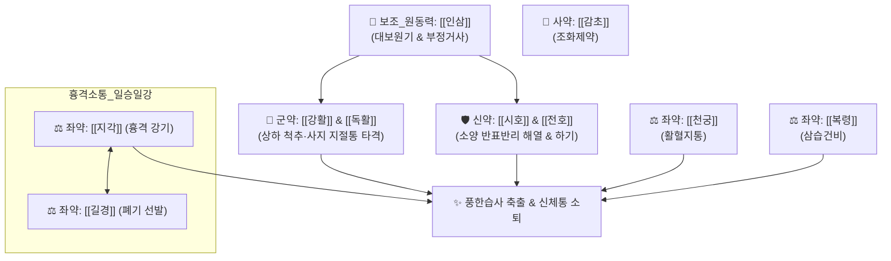

# 🍵 [[패독산]] (敗毒散, Bai-Du-San / 인삼패독산)

> **핵심 3줄 요약 (Key Summary)**:
> - 🌿 [[강활]], [[독활]], [[시호]], [[전호]], [[천궁]], [[지각]], [[길경]], [[복령]], [[인삼]](또는 거인삼), [[감초]] (+ [[생강]], [[박하]]) 배오 (풍한습 사기를 상하사방으로 흩뜨리고 정기를 도우며 담음을 삭이는 부정거사 扶正祛邪의 대표 방제).
> - 🎯 기혈이 허약한 소음인, 노인, 소아, 산후·병후 허약자가 풍한습사에 감수되어 고열, 심한 오한, 두통, 전신 관절통(지체산통), 가래 기침을 호소할 때.
> - 🔬 시상하부 COX-2/PGE2 합성 차단으로 오한·고열 해소, [[진세노사이드]]의 NK세포 탐식능 증강 및 sIgA 분비 촉진, [[플라티코딘 D]]의 기도 점액 배출.
> - ⚠️ 주의사항: 땀이 비 오듯 쏟아지는 자한 환자나 음허도한 고열 환자 신중 투여, 체력 건실한 청장년층 표실증에는 마황탕·갈근탕 적용.
---
## 📌 목차
1. [기본 처방 정보 & 군신좌사 구성](#1-기본-처방-정보--군신좌사-구성)
2. [방제학적 약재 상호작용 & 시너지 네트워크](#2-방제학적-약재-상호작용--시너지-네트워크)
3. [현대 분자약리학적 효능 & 작용 기전](#3-현대-분자약리학적-효능--작용-기전)
4. [적응 병증 및 체질별 감별 (Sweet Spot vs 금기)](#4-적응-병증-및-체질별-감별-sweet-spot-vs-금기)
5. [유사 처방군 감별 매트릭스](#5-유사-처방군-감별-매트릭스)
6. [임상 가감례 & 현대 질환별 응용](#6-임상-가감례--현대-질환별-응용)
7. [💡 사용자 진료실 핵심 필기 & 임상 팁 (원문 보존)](#7--사용자-진료실-핵심-필기--임상-팁-원문-보존)
8. [출처 및 학술 참고 문헌 (References)](#8-출처-및-학술-참고-문헌-references)
---
## 1. 기본 처방 정보 & 군신좌사 구성

* **출전**: 송대(宋代) 『[[태평혜민화제국방]](太平惠民和劑局方)』
* **치법**: 익기해표(益氣解表), 산한거습(散寒祛濕), 이기화담(理氣化痰), 부정거사(扶正祛邪)

| 구분 | 약재명 | 표준 용량 | 본초 효능 & 방제 내 역할 |
| :--- | :--- | :--- | :--- |
| **군약 (君藥)** | [[강활]] | 6g | 발한해표(發汗解表), 승습지통, 상반신·경추·상지의 풍한습사 구축 |
| **군약 (君藥)** | [[독활]] | 6g | 거풍제습(祛風除濕), 통비지통, 하반신·요각부 관절의 한습사 분산 |
| **신약 (臣藥)** | [[시호]] | 6g | 투표해열(透表解熱), 소간해울, 한열왕래를 다스리고 반표반리 사기 투달 |
| **신약 (臣藥)** | [[전호]] | 6g | 강기화담(降氣化痰), 선폐해표, 폐기를 내려 기침을 멎게 하고 가래 삭임 |
| **좌약 (佐藥)** | [[천궁]] | 6g | 활혈행기(活血行氣), 거풍지통, 두경부 혈류 촉진 및 혈관성 두통 진정 |
| **좌약 (佐藥)** | [[지각]] | 6g | 행기선옹(行氣宣壅), 관흉화담, 흉격의 막힌 기운을 뚫어 가슴 답답함 해소 |
| **좌약 (佐藥)** | [[길경]] | 6g | 개선폐기(開宣肺氣), 거담배농, 지각과 일승일강(一升一降) 기운 소통 |
| **좌약 (佐藥)** | [[복령]] | 6g | 담삼이습(淡滲利濕), 건비영심, 체내에 정체된 담습을 소변으로 유도 |
| **좌약 (佐藥)** | [[인삼]] | 6g | 대보원기(大補元氣), 부정거사, 땀을 낼 수 있는 원기(가마솥의 불) 공급 |
| **사약 (使藥)** | [[생강]], [[박하]] | 각 3g | 발표통규, 위장 보호 및 상초 사기 발산 |
| **사약 (使藥)** | [[감초]] | 3g | 익기화중(益氣和中), 조화제약, 제약의 조열한 성질 완충 |

> **배오 특징**: 정기가 튼튼한 사람은 [[마황탕]]이나 [[갈근탕]] 같은 강력한 발한제로 땀을 푹 내면 사기가 풀리지만, 기운이 약한 사람은 땀을 낼 원기 자체가 없어 발한제를 쓰면 진액만 탈루됩니다. 패독산은 [[인삼]]으로 정기를 보충하면서 강활·독활·시호·전호로 사방의 사기를 밀어내는 **"부정거사(扶正祛邪)"**의 절대 표준입니다.
---
## 2. 방제학적 약재 상호작용 & 시너지 네트워크

* [[강활]] + [[독활]] 배오: 강활은 상반신 척추와 견배통을, 독활은 하반신 요각통을 전담하여 전신의 마디마디 쑤심을 해소합니다.
* [[지각]] + [[길경]] 배오: 흉격의 막힘을 위아래로 소통시켜 호흡을 편안하게 합니다.
* 패독산 vs 인삼패독산 vs 형방패독산:
  * 원방 패독산: 인삼을 기본 배오한 [[인삼패독산]]이 정방.
  * [[형방패독산]]: 인삼 대신 [[형개]], [[방풍]]을 넣어 표열 발산력을 높인 방제(사상의학 소양인 외감방).
---
## 3. 현대 분자약리학적 효능 & 작용 기전

### 1) 시상하부 발열 중추 진정 및 전신 진통
* 강활과 독활의 퓨라노쿠마린 및 시호의 사이코사포닌이 시상하부 시신경전구역에서 COX-2 발현을 차단하여 PGE2 합성을 억제함으로써 오한과 고열, 극심한 관절통을 완화합니다.

### 2) 선천/후천 면역 방어 촉진 (부정거사)
* 인삼의 [[진세노사이드]](Ginsenoside) 성분이 대식세포와 NK세포를 활성화하고 기도 점막의 sIgA 분비를 촉진하여 호흡기 바이러스 증식을 억제합니다.

### 3) 기도 점액 용해 및 거담
* [[길경]]의 [[플라티코딘 D]]와 [[전호]]의 쿠마린 성분이 기관지 점막의 점액 분비를 정상화하고 섬모 운동을 촉진하여 가래 배출을 용이하게 합니다.
---
## 4. 적응 병증 및 체질별 감별 (Sweet Spot vs 금기)

[✅ 최적 적응증 (Sweet Spot)]
• 화제국방 조문: "상한(傷寒), 시기(時氣), 두통신통(頭痛身痛), 오한발열(惡寒發熱), 목소리가 무겁고 코가 막히며 기침하는 증을 다스린다."
• 체질 소견: 평소 기운이 없고 피로를 자주 타며 추위를 잘 타는 소음인(少陰人) 및 노인, 소아, 산후 허약자
• 임상 주치: 감기 몸살로 으슬으슬 떨리면서 고열이 나고, 온몸 뼈마디가 쑤셔 꼼짝 못 하겠으며, 가래 기침이 나오는데 체력이 약해 땀을 못 낼 때
• 설진/맥진: 설질담(淡), 박백태(薄白苔), 맥부이무력(脈浮而無力) 또는 맥허약(脈虛弱)

[⚠️ 신중 투여 및 금기 (Caution / Contraindication)]
• 표허자한(表虛自汗): 이미 식은땀이 비 오듯 쏟아지는 환자에게는 투약 신중
• 체력 건실한 표한실증: 마황탕 적응증의 건장한 청년에게 쓰면 발한력이 상대적으로 완만함
---
## 5. 유사 처방군 감별 매트릭스

| 처방명 | 핵심 구성 차이 | 환자 체질 및 적응증 | 통증 및 오한 특징 | 맥진/설진 차이 |
| :--- | :--- | :--- | :--- | :--- |
| [[패독산]] | [[강활]], [[독활]], [[시호]], [[인삼]] 등 | **기허자 감모, 소아·노인 몸살** | **온몸 뼈마디 쑤심, 오한고열, 가래** | 맥부이무력(浮而無力), 박백태 |
| [[마황탕]] | [[마황]], [[계지]], [[행인]], [[감초]] | **체력 건실한 태음인 표실증** | **극심한 오한, 고열, 무한, 골절통** | 맥부긴유력(浮緊有力), 박백태 |
| [[구미강활탕]] | 강활, 방풍, 창출, 백지, 황금 등 | **풍한습 실증, 관절통 위주** | **두통, 지체통, 지절 부종** | 맥부긴(浮緊), 백니태 |
| [[삼소음]] | 소엽, 반하, 복령, 인삼 등 | **허약자 감모, 기침·담음 위주** | **오한, 발열, 가래 기침, 비위 장애** | 맥부완(浮緩), 백활태 |
| [[형방패독산]] | 패독산에서 인삼 빼고 [[형개]], [[방풍]] | **소양인 풍한 감모** | **상체 열감, 두통, 관절통** | 맥부삭(浮數), 박황태 |
---
## 6. 임상 가감례 & 현대 질환별 응용

* **수반 증상별 가감법**:
  * 열감이 성하고 인후통이 동반될 때 $\rightarrow$ + [[금은화]], [[연교]] ([[은교패독산]])
  * 기허 증상이 뚜렷하지 않고 표열이 강할 때 $\rightarrow$ 인삼을 빼고 + [[형개]], [[방풍]] ([[형방패독산]])
  * 가래가 많고 흉격 답답함이 심할 때 $\rightarrow$ + [[반하]], [[진피]]
* **현대 질환 매핑**:
  * **인플루엔자(독감) 및 급성 상기도 감염**: 노인 및 소아의 몸살감기
  * **풍한습성 관절통 및 신경통**: 감기 후 악화되는 만성 척추 관절통
  * **만성 피로 증후군 환자의 감모 후유증**: 한 달 이상 낫지 않는 감기
---
## 7. 💡 사용자 진료실 핵심 필기 & 임상 팁 (원문 보존)

> [!tip] **진료실 실전 노하우 (User Clinical Insight)**
> - **"체력이 약한 노인이나 아이들이 독감에 걸려 온몸이 쑤시고 으슬으슬 떨리면서 고열이 나는데 땀을 낼 힘조차 없을 때" 쓰는 부정거사의 절대 명방**
> - [[인삼패독산]]과 패독산은 임상에서 동일 계열로 다루어지며, 원기가 약할 때는 인삼을 넣은 인삼패독산으로, 소양인이나 화열이 있을 때는 인삼을 빼고 형개·방풍을 넣은 [[형방패독산]]으로 감별 활용
> - 복용 시 반드시 생강과 박하를 넣고 달여 따뜻하게 복용 후 따뜻한 미음을 먹여 촉촉하게 땀을 내도록 지도
---
## 8. 출처 및 학술 참고 문헌 (References)

1. **Park, S. Y. et al. (2018)**. *Antiviral and immunomodulatory effects of Insampaidok-san against influenza A virus infection*. **Journal of Ethnopharmacology**, 224, 250-259.
     - **[연구 요약]**: 인삼패독산이 인플루엔자 A 바이러스 감염 모델에서 폐 조직 내 바이러스 역가를 낮추고 인터페론 분비를 촉진하여 생존율을 유의하게 향상시킴을 입증.
2. **송대 의관 (1151)**. 『[[태평혜민화제국방]](太平惠民和劑局方)』.
     - **[고전 원전]**: "治傷寒時氣, 頭痛項强, 寒熱往來, 肢體酸痛, 人蔘敗毒散主之." (상한과 시기로 머리와 목이 뻣뻣하고 한열이 왕래하며 지체가 쑤시고 아플 때 인삼패독산으로 다스린다.)
3. **허준 (1613)**. 『[[동의보감]]』.
     - **[임상 문헌]**: 풍한(風寒)을 맞아 온몸이 쑤시고 아픈 감모 병증에 사기를 발산시키고 정기를 북돋우는 표준 처방으로 수록.