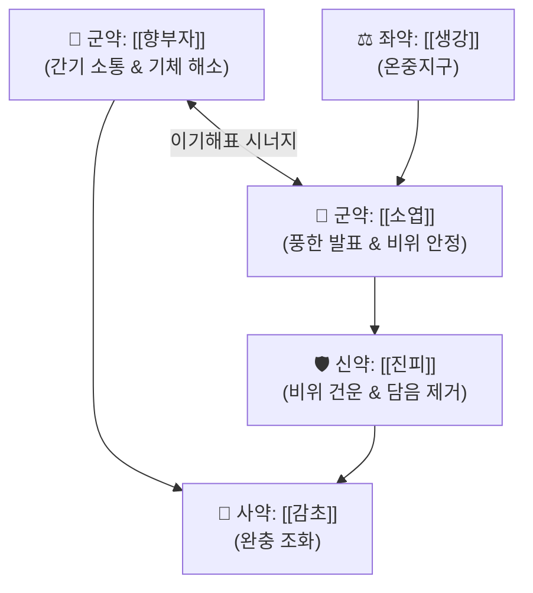

# 🍵 [[향소산]] (香蘇散, Xiang-Su-San / Kososan)

> **핵심 3줄 요약 (Key Summary)**:
> - 🌿 [[향부자]](소간이기), [[자소엽]](신온해표), [[진피]](이기건비), [[생강]], [[감초]] 배오.
> - 🎯 스트레스와 기체(氣滯)가 겹친 신경성 초기 감기, 임산부 감기, 위장관 운동 저하(복부 팽만, 소화불량) 및 과민성 대장 증후군 환자.
> - 🔬 시상하부-변연계 항우울·항불안 조절, 위장관 미세순환 및 장관 평활근 운동 조화.
> - ⚠️ 주의사항: 약성이 온화하여 임산부에게도 안전하나, 고열과 극심한 오한의 풍한 실증에는 마황제·갈근제 고려.
---
## 📌 목차
1. [기본 처방 정보 & 군신좌사 구성](#1-기본-처방-정보--군신좌사-구성)
2. [방제학적 약재 상호작용 & 시너지 네트워크](#2-방제학적-약재-상호작용--시너지-네트워크)
3. [현대 분자약리학적 효능 & 작용 기전](#3-현대-분자약리학적-효능--작용-기전)
4. [적응 병증 및 체질별 감별 (Sweet Spot vs 금기)](#4-적응-병증-및-체질별-감별-sweet-spot-vs-금기)
5. [유사 처방군 감별 매트릭스](#5-유사-처방군-감별-매트릭스)
6. [임상 가감례 & 현대 질환별 응용](#6-임상-가감례--현대-질환별-응용)
7. [💡 사용자 진료실 핵심 필기 & 임상 팁 (원문 보존)](#7--사용자-진료실-핵심-필기--임상-팁-원문-보존)
8. [출처 및 학술 참고 문헌 (References)](#8-출처-및-학술-참고-문헌-references)
---
## 1. 기본 처방 정보 & 군신좌사 구성

* **출전**: 송대(宋代) 진사량(陳師良) 『[[태평혜민화제국방(太平惠民和劑局方)]]』
* **치법**: 소간이기(疏肝理氣), 해표산한(解表散寒), 화위건비(和胃健脾)

| 구분 | 약재명 | 표준 용량 | 본초 효능 & 방제 내 역할 |
| :--- | :--- | :--- | :--- |
| **군약 (君藥)** | [[향부자]] | 6~8g | 소간이기(疏肝理氣), 조경지통(調經止痛), 스트레스로 맺힌 간기를 풀고 기운을 소통 |
| **군약 (君藥)** | [[소엽]](자[[소엽]]) | 6~8g | 발한해표(發汗解表), 행기화위(行氣和胃), 안태(安胎), 체표 한사를 흩고 구역감을 진정 |
| **신약 (臣藥)** | [[진피]] | 4~6g | 이기건비(理氣健脾), 조습화담, 흉복부 창만을 가라앉히고 비위 기운을 순환 |
| **좌약 (佐藥)** | [[생강]] | 4~6g | 온중화위, 발표산한, [[소엽]]을 도와 발표를 촉진 |
| **사약 (使藥)** | [[감초]] | 2~4g | 보비익기, 조화제약, 약성을 부드럽게 감싸줌 |

> **배오 특징**: **"감기약이면서 동시에 신경안정제이자 위장약"**입니다. 발한력이 온화하여 체력을 깎지 않으며, 임산부의 감모나 입덧에도 안심하고 처방할 수 있는 최고 안전도의 이기해표제(理氣解表劑)입니다.
---
## 2. 방제학적 약재 상호작용 & 시너지 네트워크

* [[향부자]] + 자[[소엽]] 배오: [[향부자]]의 간기(肝氣) 울결 해소 작용과 자[[소엽]]의 폐위(肺胃) 기운 발산 작용이 어우러져, 상체와 흉격에 맺힌 스트레스성 긴장을 시원하게 틔워줍니다.
---
## 3. 현대 분자약리학적 효능 & 작용 기전

### 1) HPA 축 안정화 & 항우울·항불안 작용
* [[향부자]]의 $\alpha$-사이페론(Cyperone)과 [[소엽]]의 로즈마린산(Rosmarinic acid) 성분이 뇌신경계 변연계(Limbic system)의 모노아민 신경전달물질 대사를 조절하여 우울감, 불안, 인두부 이물감(매핵기)을 개선합니다.
### 2) 위장관 운동성 조화 & 과민성 대장 증후군 억제
* [[진피]]의 [[헤스페리딘]]과 [[생강]] [[진저롤]]이 장관 신경총(Myenteric plexus)의 세로토닌(5-HT) 수용체를 조절하여 복부 가스 참, 팽만감, 비특이적 복통을 해소합니다.
---
## 4. 적응 병증 및 체질별 감별 (Sweet Spot vs 금기)

[✅ 최적 적응증 (Sweet Spot)]
• 원전 조문: "사시온역(四時溫疫), 두통항강(頭痛項强), 발열오한(發熱惡寒)... 기체(氣滯)로 인한 심복창만(心腹脹滿)"
• 임상 핵심: 신경을 쓰거나 스트레스를 받은 후 으슬으슬 감기 기운이 오면서, 체한 듯 명치가 답답하고 트림이 나는 환자
• 특수 적용: 임산부 초기 감기, 입덧, 수유부 감모, 신경성 위장염
• 질환: 과민성 대장 증후군(IBS), 신경성 소화불량, 인후두 이상감각증(매핵기), 만성 두드러기, 알레르기 비염
• 맥진/설진: 설담(舌淡), 박백태(薄白苔), 맥부현(浮弦) 또는 맥완(緩)

[⚠️ 신중 투여 및 금기 (Caution / Contraindication)]
• 고열 실증 감기: 발한력이 매우 완만하므로 고열이 펄펄 끓고 온몸 뼈마디가 쑤시는 독감 실증에는 [[마황탕]] 또는 [[갈근탕]] 사용

---
## 5. 유사 처방군 감별 매트릭스

| 처방명 | 핵심 구성 차이 | 주치 및 임상 감별점 | 복용 안전성 |
| :--- | :--- | :--- | :--- |
| [[향소산]] | [[향부자]], [[소엽]], [[진피]], [[생강]], [[감초]] | **스트레스성 감기, 소화불량, 가스 참, 임산부 감기** | **임산부 최고 안전** |
| [[곽향정기산]] | 향소산에 곽향, [[후박]], [[반하]], [[백출]] 등 가미 | **여름철 냉방병, 위장형 감기, 구토, 설사 동반** | **위장염 복합증** |
| [[소요산]] | 시호, 당귀, [[작약]], [[백출]], 복령 등 | **간울혈허, 생리불순, 갱년기 화열, 옆구리 결림** | **간비부조형** |
| [[반하후박탕]] | [[반하]], [[후박]], 복령, [[생강]], [[소엽]] | **목구멍에 가래 걸린 느낌(매핵기), 신경성 기침** | **담음 이물감 위주** |
---
## 6. 임상 가감례 & 현대 질환별 응용

* **수반 증상별 가감법**:
  * 소화불량과 구토가 심할 때 $\rightarrow$ + [[반하]], [[후박]]
  * 두통과 어지럼증이 동반될 때 $\rightarrow$ + [[천궁]], [[백지]]
  * 피부 가려움증이나 두드러기가 올라올 때 $\rightarrow$ + [[방풍]], [[형개]]
* **현대 질환 매핑**:
  * 초기 감모증, 과민성 장 증후군(가스형/설사형), 신경성 소화불량, 스트레스성 긴장 두통
---
## 7. 💡 사용자 진료실 핵심 필기 & 임상 팁 (원문 보존)

> [!tip] **진료실 실전 노하우 (User Clinical Insight)**
> - 종합감기약으로 급성기에 사용
> - **완만하기에 임산부에게도 사용 가능**하며, 소화관 운동약으로 복부의 비특이적 증상에도 활용
> - [[과민성 장 증후군]], 알레르기성 [[비염]], [[두드러기]]에 활용
> - **약리 작용**: 항산화 작용, 항우울 작용, 우울증 개선, 인후두 이상감각증 개선, 섬유근통, 두통 개선
---
## 8. 출처 및 학술 참고 문헌 (References)

1. **진사량 (1107)**. 『태평혜민화제국방(太平惠民和劑局方)』.
   - **[고전 원전]**: "治四時傷寒... 抑鬱不散, 脾胃不和." (사시 상한과 억울하여 기운이 풀리지 않고 비위가 불화한 증상을 다스린다.)
2. **Ito, N. et al. (2006)**. *Antidepressant-like effect of Kososan, a traditional herbal medicine, via restoration of the hypothalamic-pituitary-adrenal axis*. **Phytomedicine**, 13(9-10), 658-667.
   - **[연구 요약]**: 향소산이 만성 스트레스 모델에서 HPA 축의 과도한 코르티솔 분비를 정상화하고 항우울 유사 작용을 유의하게 나타냄을 증명.