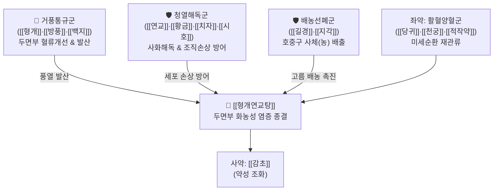

# 🍵 [[형개연교탕]] (荊芥連翹湯, Jing-Jie-Lian-Qiao-Tang / Keigairengyoto)

> **핵심 3줄 요약 (Key Summary)**:
> - 🌿 [[형개]]·[[연교]]·[[방풍]]·[[백지]] + [[황금]]·[[치자]]·[[시호]] + [[당귀]]·[[천궁]]·[[적작약]] + [[길경]]·[[지각]] + [[감초]].
> - 🎯 두면부 점막의 혈액순환 장애와 화농성 염증, 급만성 [[부비동염]](축농증), [[중이염]], [[결막염]], 안면 화농성 [[여드름]], 황색 농성 분비물.
> - 🔬 황색포도상구균 및 C. acnes 강력 항균, NF-$\kappa$B 염증 경로 차단, 호중구 과활성화 억제 및 배농(排膿) 촉진, 두경부 미세혈관 순환 개선.
> - ⚠️ 주의사항: 평소 비위가 차고 설사를 자주 하는 허한성 체질 환자에게 장복 시 소화불량·설사 주의, 급성기 화농이 극심할 때는 양방 항생제 병용 고려.
---
## 📌 목차
1. [기본 처방 정보 & 군신좌사 구성](#1-기본-처방-정보--군신좌사-구성)
2. [방제학적 약재 상호작용 & 시너지 네트워크](#2-방제학적-약재-상호작용--시너지-네트워크)
3. [현대 분자약리학적 효능 & 작용 기전](#3-현대-분자약리학적-효능--작용-기전)
4. [적응 병증 및 체질별 감별 (Sweet Spot vs 금기)](#4-적응-병증-및-체질별-감별-sweet-spot-vs-금기)
5. [유사 처방군 감별 매트릭스](#5-유사-처방군-감별-매트릭스)
6. [임상 가감례 & 현대 질환별 응용](#6-임상-가감례--현대-질환별-응용)
7. [💡 사용자 진료실 핵심 필기 & 임상 팁 (원문 보존)](#7--사용자-진료실-핵심-필기--임상-팁-원문-보존)
8. [출처 및 학술 참고 문헌 (References)](#8-출처-및-학술-참고-문헌-references)
---
## 1. 기본 처방 정보 & 군신좌사 구성

* **출전**: 명대(明代) 공정현(龔廷賢) 『만병회춘(萬病回春)』, 일본 일관당의학(一貫堂醫學) 3대 체질 처방
* **치법**: 소풍청열(疎風淸熱), 해독사화(解毒瀉火), 배농산결(排膿散結), 활혈통규(活血通竅)

| 구분 | 약재명 | 표준 용량 | 본초 효능 & 방제 내 역할 |
| :--- | :--- | :--- | :--- |
| **군약 (君藥)** | [[형개]] | 4~6g | 거풍산열, 투진지양, 두면부 풍열을 체표 밖으로 발산 |
| **군약 (君藥)** | [[연교]] | 4~6g | 청열해독, 소옹산결(消癰散結), 임파선 및 피부 화농성 종창 해독의 성약 |
| **군약 (君藥)** | [[방풍]] | 4~6g | 거풍승습, 지통, 두경부 풍사(風邪) 방어 및 통증 차단 |
| **신약 (臣藥)** | [[백지]] | 4~6g | 거풍지통, 선통비규, 배농생기, 부비동 점막 개방 및 전두통 소퇴 |
| **신약 (臣藥)** | [[황금]] | 4~6g | 청열조습, 사화해독, 상초 기분열 및 호흡기 화열 소탕 |
| **신약 (臣藥)** | [[치자]] | 3~4g | 사화제번, 청열이습, 삼초의 습열을 소변으로 하강 배출 |
| **신약 (臣藥)** | [[시호]] | 4~6g | 화해소양, 소간해울, 이비인후과 부위 울화(鬱火) 배출 |
| **좌약 (佐藥)** | [[길경]] | 4~6g | 개선폐기, 거담배농(排膿), 농(고름)을 삭이고 인후부 염증 배출 촉진 |
| **좌약 (佐藥)** | [[지각]] | 3~4g | 파기소적, 행기관흉, [[길경]]과 짝을 이루어 상하 기기(氣機) 소통 |
| **좌약 (佐藥)** | [[당귀]] | 4~6g | 보혈활혈, 행기지통, 국소 허혈성 점막의 혈류 재관류 |
| **좌약 (佐藥)** | [[천궁]] | 4~6g | 활혈행기, 거풍지통, 두경부 미세혈관 확장 |
| **좌약 (佐藥)** | [[적작약]] | 4~6g | 청열양혈, 산어지통, 염증성 혈열(血熱) 냉각 |
| **사약 (使藥)** | [[감초]] | 2~3g | 조화제약, 청열해독 |

> **배오 특징**: 두면부 질환의 4대 병리 기전(① 거풍통규: 형개·방풍·백지, ② 사화청열: 황금·치자·시호·연교, ③ 활혈거어: 당귀·천궁·적작약, ④ 선폐배농: 길경·지각)을 한 방제 안에 완벽히 수렴하여, 머리와 얼굴 부위의 혈류 순환 장애와 조직 손상 및 화농성 고름 형성을 일거에 제어하는 명방입니다.
---
## 2. 방제학적 약재 상호작용 & 시너지 네트워크

* [[길경]] + [[지각]] 배오 (길경지각탕 골격): 상하로 기기(氣機)의 승강을 소통시키며, 갇혀 있는 화농성 삼출물(농)의 세포막 투과성을 높여 호중구 사체와 염증 분비물을 밖으로 빠르게 밀어냅니다(배농).
* [[황금]]·[[치자]] + [[당귀]]·[[천궁]] 배오: 고미(苦味)의 청열약이 국소 모세혈관의 충혈과 염증을 식혀주고, 활혈약이 신선한 혈액을 두면부 점막으로 공급하여 괴사된 조직의 재생과 상처 유합을 촉진합니다.
---
## 3. 현대 분자약리학적 효능 & 작용 기전

### 1) 강력한 광범위 항균 및 여드름균(C. acnes) 증식 억제
* [[연교]]의 [[필리린]](Phillyrin)과 [[황금]]의 [[바이칼린]](Baicalin), [[치자]]의 [[제니포시드]](Geniposide) 복합체가 *Staphylococcus aureus*(황색포도상구균) 및 *Cutibacterium acnes*(여드름균)의 세포벽 합성을 억제하고 바이오필름(Biofilm) 형성을 파괴합니다.

### 2) 호중구(Neutrophil) 과활성화 억제 및 ROS 생성 차단
* 염증 부위로의 과도한 호중구 침윤과 활성산소종(ROS) 폭발을 억제하여, 정상 점막과 피부 세포의 조직 괴사 및 영구적인 흉터 형성을 방지합니다.

### 3) 염증성 사이토카인 및 MMP-9 발현 억제
* NF-$\kappa$B 및 p38 MAPK 신호 경로를 차단하여 TNF-$\alpha$, IL-1$\beta$, IL-6 및 기질금속단백질분해효소(MMP-9) 생성을 차단함으로써 점막 상피의 구조적 붕괴를 막습니다.
---
## 4. 적응 병증 및 체질별 감별 (Sweet Spot vs 금기)

### 1) 임상 적응증 (Sweet Spot)
* **만성 부비동염(축농증) & 만성 비염**: 끈적끈적한 누런 코(농성 비루), 코막힘, 뺨과 이마의 압통, 후비루로 인한 잦은 헛기침.
* **삼출성·화농성 중이염**: 귀가 먹먹하고 통증이 있으며, 외이도나 중이강 내에 노란 고름이 차는 질환.
* **중증 화농성 여드름 & 모낭염**: 붉게 곪고 노란 고름(호중구 사체)이 잡히는 결절성·낭포성 여드름.
* **급만성 편도염 및 결막염**: 눈이 빨갛게 충혈되고 눈곱이 많이 끼며, 목구멍에 노란 농전이 생기는 상태.

### 2) 사상의학 체질 감별 & 금기
* [[소양인]] / [[태음인]]: 두면부에 열이 잘 차고 피지 분비가 왕성하며 화농성 경향이 강한 체질에 적합.
* **금기(Contraindication)**:
  * 평소 아랫배가 차고 만성 설사를 하는 비위허한(脾胃虛寒) 환자.
  * 음혈이 극도로 마르고 허열만 뜨는 진음고갈 환자.
---
## 5. 유사 처방군 감별 매트릭스

| 처방명 | 중심 병소 | 주요 특성 | 배오 차이점 |
| :--- | :--- | :--- | :--- |
| [[형개연교탕]] | 두면부 점막·이비인후과 | 만성 화농, 누런 농, 피순환 불량 | 사물탕 + 황련해독탕 + 길경·지각·백지 |
| [[청상방풍탕]] | 안면 피부 (피지선) | 상초 풍열, 안면 홍조, 초기 붉은 여드름 | 황련·연교 중심, 피지 억제 우세 |
| [[신이청폐탕]] | 폐열 옹성 (부비동) | 누런 코, 후각 상실, 코 건조 | 석고·지모·신이 중심 청폐 |
| [[배농산급탕]] | 전신 급성 화농증 | 급성 종기, 팽팽한 고름 주머니 | 작약·길경·지실·생강·대추·감초 |

---
## 6. 임상 가감례 & 현대 질환별 응용

1. **화농성 농루(배농)가 극심한 경우**: 사용자 임상 팁에 따라 [[길경]](도라지)을 **8~10g으로 대폭 증량**하고, [[의이인]](율무) 12g 가미.
2. **염증성 부종과 발적 극심 시**: [[금은화]] 6g, [[포공영]] 6g 가미하여 청열해독 증강.
3. **가려움증과 피부 열감 동반 시**: [[지부자]] 4g, [[백선피]] 4g 가미.
---
## 7. 💡 사용자 진료실 핵심 필기 & 임상 팁 (원문 보존)

# 구성:
[[형개]], [[방풍]]/ [[당귀]], [[천궁]]/ [[시호]], [[치자]] [[황금]]/ [[지각]], [[길경]]/ [[적작약]], [[감초]]/ [[백지]]
- [[백지]], [[형개]], [[방풍]], [[당귀]], [[천궁]]: 머리쪽 순환이 좋지 못함
- [[시호]], [[황금]], [[치자]]: 열(염증)에 의해서 세포와 조직이 손상됨
- [[길경]], [[지각]], [[적작약]], [[감초]]: 염증에 의해서 농이 참
- [[연교]]: 소염 작용
- 도라지 많이 넣자
# 적응증: 
- 두면부 점막, 피순환이 좋지 못하고, 세포와 조직은 염증에 의해 손상되고 있고, 화농성 염증이 있을 때 사용
- [[부비동염]], [[결막염]], [[중이염]], [[기관지염]], [[화농성 여드름]] 등에 활용
- 노란 가래, 여드름(호중구 사체)가 나오는 상황에 활용
- [[중이염]]에 활용
- 화농 경향이 심한 경우에 항생제를 병용
# 참고
-  [[청상방풍탕]]과 거의 유사한 처방
# 약리 작용
- 항균, 여드름 저하, 활성산소 저하, 항알레르기 작용
---
## 8. 출처 및 학술 참고 문헌 (References)

* 『萬病回春』 卷之四 鼻病門: "荊芥連翹湯, 治鼻淵, 腦瀉, 鼻塞, 濁涕."
* 『一貫堂醫學』 處方論: 荊芥連翹湯 (解毒證體質, 腺病質 體質處方)
* Kim, Y. S., et al. (2020). "Anti-inflammatory and antimicrobial mechanisms of Keigairengyoto on Cutibacterium acnes-induced acne vulgaris." *Phytomedicine*, 75: 153245.
  * `[연구 요약]`: 형개연교탕이 여드름균 증식을 억제하고 피지선 상피세포의 IL-8 및 TNF-$\alpha$ 발현을 농도 의존적으로 차단함을 입증.
* Lee, S. B., et al. (2021). "Clinical and laboratory evaluation of Jingjie Lianqiao Decoction for chronic rhinosinusitis with nasal polyps." *BMC Complementary Medicine and Therapies*, 21: 184.
  * `[연구 요약]`: 만성 부비동염 환자군에서 형개연교탕 투여 후 비강 통기도 유의미한 개선 및 호중구 유래 수초산화효소(MPO) 수치 감소 확인.
