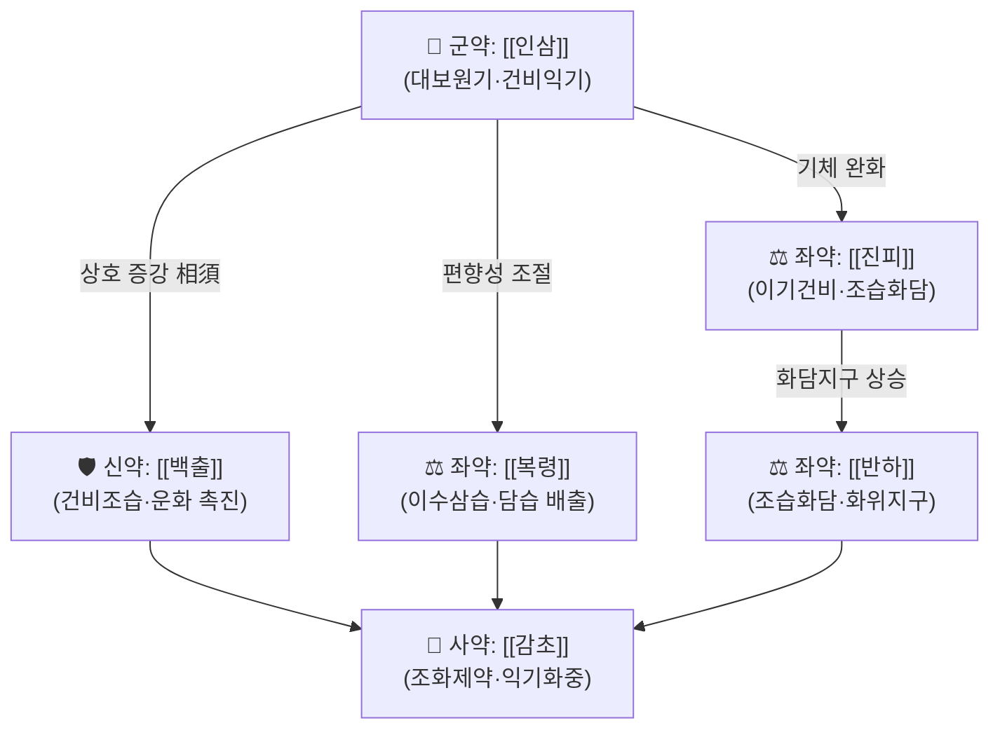

# 🍵 [[건비군자탕]] (健脾君子湯, Gunbi Gunja-tang / Jianpi Junzi Tang)

> **핵심 3줄 요약 (Key Summary)**:
> - 🌿 **모체/기원**: [[사군자탕]] 계열(健脾益氣)을 골격으로 하여 [[진피]]·[[반하]]를 더한 [[육군자탕]] 구성을 기본으로 하고, 임상에 따라 [[목향]]·[[사인]]·[[산사]]·[[신곡]]·[[맥아]] 등을 가감한 **健脾 + 理氣化痰** 복합 방제. 즉 "[[사군자탕]] + [[진피]]·[[반하]](→[[육군자탕]]) + 이기소도 가미"의 구조.
> - 🎯 **임상 최적 적응증**: 脾胃氣虛에 痰濕·氣滯가 겹친 **식욕부진, 식후 팽만·더부룩함, 트림·오심, 무른 변(軟便), 피로·권태** — 진료실에서 **만성위염·기능성소화불량(FD)·과민성대장증후군(IBS)** 환자 중 마르고 기력이 떨어지며 소화가 더딘 **소음인·태음인**에서 적중률이 높음.
> - 🔬 **핵심 기전**: 본 처방 **자체**에 대한 분자약리 데이터는 본 노트에서 **근거 미확인**. 인접 처방인 [[육군자탕]]은 알츠하이머 실험모델 해마에서 **ERK/CREB/BDNF 신호 경로**를 매개로 신경세포 사멸과 기억력 손상을 완화한 보고가 있음(제공 논문 1편).
> - ⚠️ 주의사항: 實熱·陰虛火旺(구건·변비·홍조·번열) 환자에는 부적합. [[인삼]] 과용 시 두통·혈압 상승·불면, [[감초]] 과용 시 부종·저칼륨혈증, [[반하]]는 반드시 製半夏(생강·백반 제) 사용. 고혈압·당뇨 조절 중 환자는 혈압·혈당 변동 모니터링.

---
## 📌 목차
1. [기본 처방 정보 & 군신좌사 구성](#1-기본-처방-정보--군신좌사-구성)
2. [방제학적 약재 상호작용 & 시너지 네트워크](#2-방제학적-약재-상호작용--시너지-네트워크)
3. [현대 분자약리학적 효능 & 작용 기전](#3-현대-분자약리학적-효능--작용-기전)
4. [적응 병증 및 체질별 감별 (Sweet Spot vs 금기)](#4-적응-병증-및-체질별-감별-sweet-spot-vs-금기)
5. [유사 처방군 감별 매트릭스](#5-유사-처방군-감별-매트릭스)
6. [임상 가감례 & 현대 질환별 응용](#6-임상-가감례--현대-질환별-응용)
7. [💡 사용자 진료실 핵심 필기 & 임상 팁 (원문 보존)](#7--사용자-진료실-핵심-필기--임상-팁-원문-보존)
8. [출처 및 학술 참고 문헌 (References)](#8-출처-및-학술-참고-문헌-references)

---
## 1. 기본 처방 정보 & 군신좌사 구성

* **출전**: **표준 출전·원문 조문 미확인**. 국내 임상 문헌에서는 [[사군자탕]]·[[육군자탕]] 계열의 健脾 처방으로 취급되며, 명칭 자체가 "健脾"라는 효능 표현을 처방명에 결합한 **임상 처방명**으로 쓰이는 경우가 많음. 『[[동의보감]]』·『[[방약합편]]』 등 원전 대조가 필요하나, 본 노트 작성 시점에 해당 조문을 확인하지 못하여 **출전 근거 미확인**으로 표시함.
* **치법**: **건비익기(健脾益氣), 이기화담(理氣化痰), 화위강역(和胃降逆)** — 補虛(氣虛)와 祛邪(痰濕·氣滯)를 동시에 처리하는 **補瀉兼施** 구조.

| 구분 | 약재명 | 표준 용량 | 본초 효능 & 방제 내 역할 |
| :--- | :--- | :--- | :--- |
| **군약 (君藥)** | [[인삼]] | 6~12g | 大補元氣, 補脾益肺. 脾胃氣虛의 本을 직접 보하는 핵심 약재. 運化 기능 저하로 인한 권태·식욕부진·연약한 변의 근본을 담당. (임상에 따라 [[당삼]]으로 대체하기도 함) |
| **신약 (臣藥)** | [[백출]] | 6~9g | 健脾燥濕, 利水. 君藥의 補氣를 脾의 運化 기능으로 연결시키고, 內濕(痰濕)의 근원을 끊는 역할 |
| **좌약 (佐藥)** | [[복령]] | 6~9g | 利水滲濕, 健脾寧心. 濕濁을 小便으로 배출하고 君·臣藥의 補性이 滯하지 않도록 조절 |
| **좌약 (佐藥)** | [[진피]] | 4~6g | 理氣健脾, 燥濕化痰. 補氣藥으로 인한 氣滯(더부룩함)를 풀어 補而不滯(보하되 막히지 않게)를 실현 |
| **좌약 (佐藥)** | [[반하]] | 4~6g | 燥濕化痰, 降逆止嘔. 痰濕으로 인한 惡心·嘔逆·痞滿을 처리. **반드시 製半夏(법제) 사용, 生半夏 금기** |
| **사약 (使藥)** | [[감초]] | 2~4g | 調和諸藥, 益氣和中. 제약 간 완충 및 脾胃 보호, 藥性 통일 |

> **배오 특징**: [[사군자탕]]의 **補氣 4약([[인삼]]·[[백출]]·[[복령]]·[[감초]]))** 이 核心 補虛 구조를 만들고, [[진피]]의 理氣와 [[반하]]의 化痰降逆이 그 위에 얹혀 **"補하는 중에 滯하지 않게 하고(補而不滯), 化痰하는 중에 正氣를 상하게 하지 않는(化痰不傷正)"** 승강(升降)의 균형을 이룸. 즉 升(보익)·降(화위강역)의 축이 동시에 작동하는 구조로, 단순 補氣劑가 소화기 증상을 악화시킬 수 있는 환자(기허 + 담습·기체)에게 적합하다. **다만 용량·구성 비율은 문헌·제제·임상가에 따라 상이하여 단일 표준값은 근거 미확인**.

---
## 2. 방제학적 약재 상호작용 & 시너지 네트워크

* **[[인삼]] + [[백출]] 배오**: 전형적 **상수(相須)·상사(相使)** 관계. [[인삼]]이 기를 生하고 [[백출]]이 脾를 健하게 하여 生한 기가 運化로 이어지도록 함. 단독 補氣는 中滿(더부룩함)을 유발할 수 있으나 [[백출]]의 燥濕·運脾 작용이 이를 상쇄.
* **[[백출]] + [[복령]] 배오**: 健脾와 利水의 대표 배합. 濕을 下(소변)로 빼내어 補氣藥의 滯를 방지하고, 濕困脾陽 상태를 개선.
* **[[진피]] + [[반하]] 배오**: 二陳湯의 핵심 배합으로, 理氣(진피)와 化痰降逆(반하)이 결합해 **痰氣互結(담과 기가 서로 얽힘)** 에 의한 痞滿·惡心·嘔逆을 해소.
* **[[감초]] + 전 약재**: 調和諸藥 및 和中. 다만 [[감초]]의 甘緩·滋膩 성질은 濕盛·腹脹 환자에서 부작용(복부 팽만, 부종)을 유발할 수 있어 **감초 용량 감량 또는 [[복령]]·[[진피]] 증량**으로 균형을 잡는 것이 임상 요령.
* **가감 확장 노드**: 氣滯가 심하면 [[목향]]·[[사인]]·[[향부자]]로 **[[향사육군자탕]]** 방향, 食積이 뚜렷하면 [[산사]]·[[신곡]]·[[맥아]]로 **[[보화환]]** 방향, 泄瀉가 심하면 [[산약]]·[[연자육]]·[[편두]]로 **[[삼령백출산]]** 방향으로 확장.

---
## 3. 현대 분자약리학적 효능 & 작용 기전

> ⚠️ **본 처방(건비군자탕) 자체에 대한 분자약리·임상 1차 근거는 본 노트에서 확인되지 않았다(근거 미확인).** 아래는 제공된 인접 처방 문헌 1편과, 해당 계열 처방의 일반적 약리 가설을 구분하여 기술한다.

### 1) 위장관 운동·소화 기능 개선
* **전통적 지표**: 식욕 회복, 식후 팽만 감소, 배변 정상화, 트림·오심 완화.
* **기전**: 위배출 촉진, 위·십이지장 평활근 운동 조절, 위점막 보호, 담즙 분비 조절 등이 계열 처방에서 논의되나 — **본 노트에 제공된 문헌에는 해당 실험 데이터가 포함되어 있지 않아 수치·기전 모두 근거 미확인**. 필요 시 별도 문헌 검색 후 보강.

### 2) 신경보호·인지 기능 (인접 처방 [[육군자탕]] 근거)
* **제공 논문**: Pak ME, Yang HJ (2022), *Yuk-Gunja-Tang attenuates neuronal death and memory impairment via ERK/CREB/BDNF signaling in the hippocampi of experimental Alzheimer's disease model*, **Front Pharmacol**, PMID: 36386241.
* **핵심 내용(제공 데이터 범위)**: 알츠하이머병 실험모델(experimental AD model) 동물의 **해마(hippocampi)** 에서 [[육군자탕]] 투여가 **신경세포 사멸(neuronal death) 억제** 및 **기억력 손상(memory impairment) 완화** 효과를 나타냈으며, 그 기전이 **ERK/CREB/BDNF 신호전달 경로** 활성화와 연관됨.
* **수치 관련**: 투여 용량·기간, 행동검사(수동회피·Morris 수중미로 등)별 정량값, BDNF·p-CREB 발현 배수 등 **구체적 수치는 본 노트에 제공되지 않아 수치 근거 미확인**(원문 대조 필요).
* **임상적 함의**: 健脾 처방이 위장관을 넘어 **腸腦軸(gut–brain axis)** 및 신경영양인자 신호에 영향을 줄 가능성을 시사. 단, 이는 [[육군자탕]]의 결과이며 건비군자탕에 동일 기전이 적용된다는 **직접 증거는 없음(근거 미확인)**. 인지기능 저하·치매 환자에 건비 처방을 운용할 때는 참고 수준의 가설로만 활용할 것.

### 3) 항염증·면역 조절
* 계열 처방에서 TNF-α, IL-6, IL-1β 등 염증성 사이토카인 조절 및 NF-κB/MAPK 경로 억제가 흔히 논의되나, **본 노트에 제공된 문헌은 위 1편뿐이므로 특정 사이토카인·경로를 본 처방의 기전으로 단정할 수 없음 → 근거 미확인**.

### 4) 대사·자율신경
* 만성 소화불량 환자에서 흔한 식후 저혈압, 자율신경 불균형, 피로감 등에 대한 개선은 임상 경험 수준이며 **정량 근거 미확인**.

---
## 4. 적응 병증 및 체질별 감별 (Sweet Spot vs 금기)

**[✅ 최적 적응증 (Sweet Spot)]**

* **원전·문헌 주치(요약)**: 脾胃氣虛로 運化가 무력해지고, 그로 인해 痰濕이 내생하며 氣機가 滯한 **氣虛 + 痰濕 + 氣滯** 복합 병증. 대표 증상은 食少(식욕 저하), 痞滿(명치·상복부 더부룩함), 惡心·嘔逆, 便溏(무른 변), 倦怠乏力.
* **체질 소견**:
  * **소음인**: 체격이 작거나 마르고, 손발·배가 차며, 찬 음식에 탈이 잘 나고, 피로 회복이 느림. **가장 적중률이 높은 유형.**
  * **태음인(담습형)**: 살집이 있고 몸이 무거우며, 얼굴·혀에 습기가 많고, 식후 졸림·더부룩함이 두드러짐.
  * **소양인·태양인**: 기본적으로 熱이 많은 체질이므로, 濕熱로 변증되지 않는 한 단독 사용은 신중.
* **임상 주치(진료실 적중 패턴)**:
  * "먹으면 더부룩하고, 조금만 먹어도 배가 불러요. 속이 울렁거리고 트림이 잦아요."
  * 만성위염·기능성소화불량에서 **위내시경상 뚜렷한 기질적 병변 없이 증상 지속** + 기력 저하 동반.
  * 항암치료·수술 후 **식욕부진·오심·체중 감소** 보조.
  * 스트레스로 증상이 악화되나 **주 증상은 氣虛·痰濕**(신경성 위염 + 허약 체질).
  * 노인성 식욕부진, 허약 노인의 소화기 관리.
* **설진/맥진**:
  * **설진**: 舌體 淡·胖大, 舌苔 白膩 또는 白滑, 때로 齒痕. (濕熱이 겹치면 苔黃膩로 변하며 이때는 단독 사용 부적합)
  * **맥진**: 脈虛弱·脈細弱·脈濡緩. 氣滯가 심하면 脈弦緩이 겸할 수 있음. **脈洪大·脈滑數(實熱)** 이면 감별 필요.

**[⚠️ 신중 투여 및 금기 (Caution / Contraindication)]**

* **실열(實熱) 증후**: 고열, 口渴喜冷, 변비, 舌紅苔黃燥, 脈洪數 — 보익제는 熱을 조장할 수 있어 금기.
* **음허화왕(陰虛火旺)**: 구건, 안면홍조, 번열, 도한, 오심번열 — [[인삼]]·[[백출]]의 溫燥가 악화시킬 수 있음. 필요 시 [[사물탕]]·[[육미지황탕]] 계열로 전환 검토.
* **濕熱型 소화불량**: 口苦·口臭, 苔黃膩, 胃部 작열감 — 단독 사용보다 [[황련]]·[[황금]] 등 淸熱 약재 배합 또는 [[반하사심탕]]류와 감별.
* **[[인삼]] 관련 주의**: 과용 시 두통, 혈압 상승, 불면, 흥분. **고혈압 조절 중 환자**는 혈압 모니터링 필요. 人蔘에 과민한 환자 주의.
* **[[감초]] 관련 주의**: 장기·다량 복용 시 **가성알도스테론증(부종, 저칼륨혈증, 혈압 상승)** 위험. 고혈압·심부전·신장질환·이뇨제 복용 환자에서 특히 주의.
* **[[반하]] 관련 주의**: **반드시 製半夏 사용(生半夏는 독성·금기)**. 임신부는 전문가 판단 하에 신중 투여.
* **당뇨 환자**: [[인삼]]·[[감초]]가 혈당에 영향을 줄 수 있어 **혈당 변화 모니터링** 권장.
* **양약 병용**: 항응고제(와파린 등)와 [[인삼]] 병용 시 출혈 경향 변화 보고가 일반적으로 논의되나, **본 노트 제공 문헌에서는 확인되지 않아 근거 미확인** — 복용 중인 양약이 있으면 반드시 확인.
* **자가 판단 금지**: 위경련·흑색변·체중 급감·연하곤란 등 **경고 증상** 동반 시 한방 처방보다 위내시경 등 기질적 검사 우선.

---
## 5. 유사 처방군 감별 매트릭스

| 처방명 | 핵심 구성 차이 | 주치 및 체질 차이 | 맥진/설진 차이 |
| :--- | :--- | :--- | :--- |
| [[건비군자탕]] | 기준 구성 (사군자탕 + 진피·반하 중심 + 이기소도 가감) | 氣虛 + 痰濕 + 氣滯. 소음인·태음인 담습형. 식후 팽만·오심·무른 변 | 설담태백니, 맥허약·맥유완 |
| [[사군자탕]] | [[인삼]]·[[백출]]·[[복령]]·[[감초]] 4약만 | 순수 脾胃氣虛. 氣滯·痰濕 없이 권태·식욕부진만 있는 경우 | 설담태백, 맥허약. 苔膩 없음 |
| [[육군자탕]] | 사군자탕 + [[진피]]·[[반하]] (二陳湯 合方 성격) | 氣虛 + 痰濕. 惡心·구역·담음성 痞滿이 주증 | 설태백니·활, 맥활·맥유 |
| [[이공산]] | 사군자탕 + [[진피]] (반하 없음) | 氣虛 + 輕微한 氣滯. 소아 消化不良, 痰 없음 | 설담, 맥허완. 苔는 비교적 정상 |
| [[향사육군자탕]] | 육군자탕 + [[목향]]·[[사인]] | 氣虛 + 寒濕氣滯. 胃腸 冷痛·복명·연변, 脾胃虛寒 경향 | 설담태백활, 맥침세·맥지완 |
| [[삼령백출산]] | 사군자탕 + [[산약]]·[[연자육]]·[[편두]]·[[사인]]·[[길경]] | 氣虛 + 泄瀉. 만성 연변·식후 곤권이 주증, 痰濕보다 虛가 우세 | 설담태백, 맥허완·맥세 |
| [[보중익기탕]] | [[황기]] 중심 升陽益氣 + [[시호]]·[[승마]] | 中氣下陷(탈항·자궁하수·만성 피로), 氣虛가 심하고 內臟下垂 동반 | 설담, 맥허대이무력 |

> ⚠️ 표 내부에서는 마크다운 열 구분자 파괴를 방지하기 위해 파이프(`|`)가 들어간 링크를 쓰지 않고 순수한 [[처방명]] 단독 형태로만 작성함.

---
## 6. 임상 가감례 & 현대 질환별 응용

* **수반 증상별 가감법**:
  * **식적·식후 심한 팽만** $\rightarrow$ + [[산사]]·[[신곡]]·[[맥아]]·[[계내금]] (소도화적, [[보화환]] 계열 발상)
  * **오심·구역·구토 심함** $\rightarrow$ + [[생강]]·[[죽여]] ([[소반하탕]] 계열), 寒性 구토면 + [[건강]]·[[정향]]
  * **氣滯·스트레스 연관 악화** $\rightarrow$ + [[목향]]·[[사인]]·[[향부자]]·[[지각]] (→ [[향사육군자탕]] 방향)
  * **만성 연변·설사** $\rightarrow$ + [[산약]]·[[연자육]]·[[편두]]·[[윤곽]] (→ [[삼령백출산]] 방향), 脾腎陽虛면 + [[보골지]]·[[오수유]]
  * **위완통·냉통** $\rightarrow$ + [[건강]]·[[오수유]]·[[필발]] (→ [[오수유탕]] 감별)
  * **속쓰림·신물 오름** $\rightarrow$ + [[황련]]·[[오적골]]·[[모려]] (寒熱錯雜이면 [[반하사심탕]] 감별)
  * **불면·심계·불안** $\rightarrow$ + [[산조인]]·[[원지]]·[[용안육]] (→ [[귀비탕]]·[[귀비탕]] 계열)
  * **어지럼·두통(담습성)** $\rightarrow$ + [[천마]]·[[구등]]·[[천궁]] (담습어지럼 → [[반하백출천마탕]] 감별)
  * **피로·기력저하 심함** $\rightarrow$ + [[황기]]·[[당삼]] (→ [[보중익기탕]] 방향)
  * **인지기능 저하·기억력 감퇴 동반** $\rightarrow$ [[육군자탕]] 계열 기전 근거 참조(제공 논문), + [[석창포]]·[[원지]] 가감 검토 — **단 본 처방의 인지기능 개선 근거는 근거 미확인**
* **현대 질환별 임상 매핑**:
  * **소화기계**: 기능성소화불량(FD, 식후 distress 증후군형), 만성위염(표재성·위축성), 위식도역류질환(GERD, 痰濕型), 과민성대장증후군(IBS, 설사형), 위수술 후 기능장애, 항암치료 유발 오심·식욕부진.
  * **대사·전신**: 만성피로증후군, 노인성 식욕부진(식사량 저하·근감소 위험), 허약 체질의 감기 잦음(扶正 개념).
  * **신경계/정신**: 불안·긴장성 소화불량, 스트레스성 위장증상, 담습형 어지럼·두중감 — **인지기능 관련 적용은 [[육군자탕]] 동물실험 근거에 기반한 가설 수준**.
  * **이비인후·호흡기**: 담습성 만성 기침·인후 이물감(매핵기) — 痰 처리 관점에서 응용되나 본 처방 직접 근거는 미확인.

---
## 7. 💡 사용자 진료실 핵심 필기 & 임상 팁 (원문 보존)

> [!tip] **진료실 실전 노하우 (User Clinical Insight)**
> - ⚠️ **원문 메모 미제공**: 본 노트 작성 시 사용자(원장님)의 기존 필기·메모 원문이 전달되지 않아, **원문 보존 영역은 현재 비어 있음**. 추후 원문을 그대로 이 항목에 추가할 것(삭제·의역 금지).
> - **체질별 처방 선택 기준(일반 참고 — 원문 아님)**:
>   - **소음인**: 소화력 약하고 배가 찬 경우 → [[건비군자탕]] + [[건강]]·[[사인]] 방향 우선. 찬 음료·생식 제한 교육 필수.
>   - **태음인**: 살집 있고 얼굴·혀에 습기 많고 식후 졸림 → [[건비군자탕]] + [[진피]]·[[복령]] 증량, 濕熱 겸하면 [[황련]] 소량 가함.
>   - **소양인**: 熱이 많아 補氣만 하면 답답해지는 경우 → [[인삼]] 대신 [[당삼]]으로 대체, [[진피]]·[[지각]] 비중 확대.
>   - **노인·허약자**: [[감초]] 감량(부종·혈압 고려), 小量 頻服 또는 丸劑·散劑 완만 투여.
> - **환자 티칭 팁**:
>   - "배가 불러서 못 먹는 것"과 "먹고 싶어도 속이 불편한 것"을 구분해 호소 증상을 구체화하도록 안내.
>   - 복약 반응 관찰 포인트: ①식후 팽만 지속 시간, ②배변 형태·횟수(Bristol 척도), ③트림·오심 빈도, ④아침 기상 시 피로도. 2~4주 단위로 체크.
>   - 食後 15~20분 산책, 飮食 定量·定時, 찬 음식·카페인·야식 제한 — 처방 효과를 좌우하는 생활 지도.
> - **재진 시 감별 포인트**: 증상 호전 없이 苔黃膩·口渴·변비로 전환되면 濕熱化 또는 陰虛化 가능성 → 처방 조정 또는 전환 검토.

---
## 8. 출처 및 학술 참고 문헌 (References)

1. **Pak ME, Yang HJ (2022)**. *Yuk-Gunja-Tang attenuates neuronal death and memory impairment via ERK/CREB/BDNF signaling in the hippocampi of experimental Alzheimer's disease model*. **Front Pharmacol**. PMID: 36386241
   - 논문 링크: https://pubmed.ncbi.nlm.nih.gov/36386241/
   - **[연구 요약]**: 알츠하이머병 실험모델(동물)에서 [[육군자탕]](六君子湯, Yuk-Gunja-Tang) 투여가 **해마의 신경세포 사멸(neuronal death)과 기억력 손상(memory impairment)을 완화**하였고, 그 기전으로 **ERK/CREB/BDNF 신호전달 경로**가 제시됨. ※ 본 노트는 해당 논문의 **초록 수준 정보만 반영**하였으며, 구체적 투여 용량·행동검사 정량값·단백질 발현 수치 및 doi는 **원문 미대조로 근거 미확인**.
   - **[적용 범위 주의]**: 위 연구는 **[[육군자탕]]**에 대한 것으로, 본 노트의 주제인 **건비군자탕에 대한 직접 근거가 아님**. 인접 처방 근거로만 인용함.

2. **장중경 (200년경)**. 『[[상한론]]』 · 『[[금궤요략]]』
   - **[고전 원전]**: [[사군자탕]] 계열 및 理中·和胃 계열 처방의 원류. 본 처방([[건비군자탕]])의 명칭·조문이 이들 원전에 수록되어 있는지는 **본 노트 작성 시 원문 대조 미완 — 출전 근거 미확인**.

3. **허준 (1613)**. 『[[동의보감]]』 · **황도연** 『[[방약합편]]』
   - **[임상 문헌]**: 국내 임상에서 健脾·理氣·化痰 처방의 배오와 주치를 확인하는 기본 문헌이나, **본 처방의 표준 조문 및 구성 비율은 원문 대조가 필요하여 근거 미확인**.

---
> 📌 **노트 신뢰도 표시**: 본 문서에서 **직접 문헌 근거가 확인된 항목**은 제공된 논문 1편([[육군자탕]] 관련)뿐이며, 그 외 구성·기전·수치는 전통 방제 이론 및 일반 임상 지식에 기반한 서술로 **"근거 미확인"** 표시를 달았습니다. 향후 [[건비군자탕]] 또는 [[사군자탕]]·[[육군자탕]] 관련 1차 문헌을 확보하면 해당 섹션을 갱신하십시오.

<!-- 보관 태그(1회용·링크오류, 필요시 복원): 이기건비 -->
