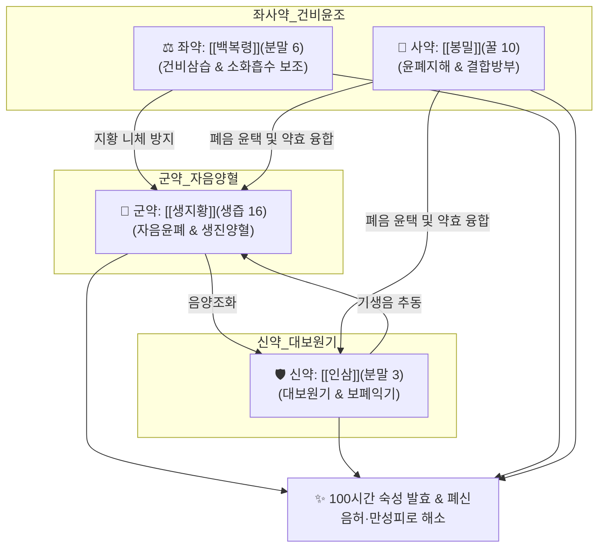

# 🍵 [[경옥고]] (瓊玉膏, Gyeongok-go)

> **핵심 3줄 요약 (Key Summary)**:
> - 🌿 [[생지황]](군약, 생즙 16) + [[인삼]](신약, 미세분말 3) + [[백복령]](좌약, 미세분말 6) + [[봉밀]](사약, 정제 꿀 10) 4미를 옹기에 담아 72시간 중탕 후 화독 제거 및 24시간 재중탕 숙성·발효시킨 명방.
> - 🎯 폐음(肺陰)과 신수(腎水) 부족으로 인한 만성 허로(虛勞), 마른기침(건해), 피로 권태, 노인 쇠약, 병후 기력 저하, 기억력 감퇴, 코로나19 후유증(만성 기침 및 브레인 포그). 서양의학의 고농도 영양수액/영양주사를 꾸준히 경구 복용하는 것과 유사한 전신 대사 증진 효과.
> - 🔬 100시간 숙성을 통한 Rg3, Rh1 등 희귀 [[진세노사이드]] 및 저분자 다당체 생성, 폐포 대식세포 염증성 사이토카인(TNF-α, IL-1β, IL-6) 억제 및 점막 sIgA 분비 촉진, 뇌 해마 BDNF/CREB 활성화 및 혈중 젖산 분해.
> - ⚠️ 주의사항: 봉밀 함유로 혈당 조절 불안정 중증 당뇨 환자 주의, 산화 방지를 위해 쇠숟가락 대신 도자기/나무 수저 사용.
---
## 📌 목차
1. [기본 처방 정보 & 군신좌사 구성](#1-기본-처방-정보--군신좌사-구성)
2. [방제학적 약재 상호작용 & 시너지 네트워크](#2-방제학적-약재-상호작용--시너지-네트워크)
3. [현대 분자약리학적 효능 & 작용 기전](#3-현대-분자약리학적-효능--작용-기전)
4. [적응 병증 및 체질별 감별 (Sweet Spot vs 금기)](#4-적응-병증-및-체질별-감별-sweet-spot-vs-금기)
5. [유사 처방군 감별 매트릭스](#5-유사-처방군-감별-매트릭스)
6. [임상 가감례 & 현대 질환별 응용](#6-임상-가감례--현대-질환별-응용)
7. [💡 사용자 진료실 핵심 필기 & 임상 팁 (원문 보존)](#7--사용자-진료실-핵심-필기--임상-팁-원문-보존)
8. [출처 및 학술 참고 문헌 (References)](#8-출처-및-학술-참고-문헌-references)
---
## 1. 기본 처방 정보 & 군신좌사 구성

* **출전**: 송대(宋代) 『[[이간방]](夷堅方)』, 허준 『[[동의보감]](東醫寶鑑)』 양생연년약이(養生延年藥餌)
* **치법**: 자음윤폐(滋陰潤肺), 익기생진(益氣生津), 보신익정(補腎益精), 건비안신(健脾安神)

| 구분 | 약재명 | 배합 비율(중량비) | 본초 효능 & 방제 내 역할 |
| :--- | :--- | :--- | :--- |
| **군약 (君藥)** | [[생지황]] | 16 (생즙 약 5000g) | 자음양혈(滋陰養血), 생진윤조(生津潤燥), 진액과 혈을 대량 보충 |
| **신약 (臣藥)** | [[인삼]] | 3 (미세분말 약 900g) | 대보원기(大補元氣), 보비익폐(補脾益肺), 기운을 북돋우고 생지황의 보음을 추동 |
| **좌약 (佐藥)** | [[백복령]] | 6 (미세분말 약 1800g) | 건비삼습(健脾滲濕), 녕심안신(寧心安神), 지황의 담음화 방지 및 비위 소화력 보조 |
| **사약 (使藥)** | [[봉밀]] | 10 (정제 꿀 약 3000g) | 윤폐지해(潤肺止咳), 보중완급(補中緩急), 제약을 결합시키고 방부 및 흡수 촉진 |

> **배오 특징**: 생지황의 생즙에 초미세 분말화된 인삼과 백복령을 고르게 섞고 정제된 꿀을 넣어 옹기에 밀봉한 후 72시간 중탕 가열, 하루 냉각(화독 제거), 다시 24시간 재중탕 숙성합니다. 이 과정을 거치며 지황의 한성(寒性)이 완화되고 인삼의 온성(溫性)이 중화되며 진액과 원기가 하나로 융합되어 체질에 구애받지 않고 흡수됩니다.
---
## 2. 방제학적 약재 상호작용 & 시너지 네트워크

* [[생지황]] + [[인삼]] 배오: 지황의 음(陰)과 인삼의 양(陽)이 어우러져 기혈음양(氣血陰陽)을 동시에 보하는 수승화강(水昇火降)의 기초를 세웁니다.
* [[생지황]] + [[백복령]] 배오: 생지황의 끈적하고 찬 성질이 비위에 부담을 주는 것(니체 泥滯)을 백복령의 건비삼습 작용으로 완벽하게 방지하여 소화 흡수를 원활하게 합니다.
* [[인삼]] + [[봉밀]] 배오: 꿀의 윤조(潤燥) 작용이 인삼의 조열(燥熱)함을 감싸주고 폐기를 촉촉하게 적셔 기침을 멎게 합니다.
---
## 3. 현대 분자약리학적 효능 & 작용 기전

### 1) 폐 점막 보호 및 만성 기침 완화 (코로나19 후유증)
* **기도 염증 및 섬유화 억제**: 미세먼지나 바이러스 감염 후 발생하는 폐포 대식세포의 염증성 사이토카인(TNF-α, IL-1β, IL-6) 분비를 유의하게 억제하고 점액 섬모 운동을 촉진하여 마른기침을 진정시킵니다.
* **점막 면역 강화**: 기도 분비액 내 secretory IgA(sIgA) 분비를 증가시켜 호흡기 점막 방어력을 복구합니다.

### 2) 항피로 및 지구력 증진 (양방 영양수액 유사 효과)
* **젖산 분해 및 글리코겐 보존**: 고강도 운동 및 과로 후 축적되는 혈중 젖산을 빠르게 감소시키며 간 및 골격근의 글리코겐 저장량을 보존합니다.
* **항산화 방어계 강화**: 적혈구 및 간세포 내 SOD, Catalase 활성을 유도하고 지질 과산화물(MDA) 생성을 억제합니다.

### 3) 뇌 기능 및 기억력 향상
* **BDNF 발현 촉진**: 해마(Hippocampus) 부위의 뇌신경유래영양인자(BDNF) 및 CREB 인산화를 증가시켜 시냅스 가소성을 증진하고 인지 기능 및 기억력을 향상시킵니다.
---
## 4. 적응 병증 및 체질별 감별 (Sweet Spot vs 금기)

[✅ 최적 적응증 (Sweet Spot)]
• 원전 조문: 《동의보감》 "진기를 채우고 골수를 보하며 모발을 검게 하고 치아를 다시 나게 하며 백병을 물리친다. 27년을 먹으면 360세를 산다."
• 체질 소견: 소음인, 태음인, 소양인 모두 투여 가능하나, 마르고 진액이 고갈되어 피부가 거칠고 마른기침을 자주 하는 음허(陰虛) 체질에 최적
• 임상 주치: 
  1. 만성 피로 및 병후 기력 저하, 노인성 쇠약(양방 영양수액을 정기 복용하는 것과 같은 체력 증진)
  2. 만성 마른기침(건해), 코로나19 후유증 기침 및 브레인 포그
  3. 수험생 기억력 개선 및 뇌 피로, 피부 건조, 갱년기 진액 부족
• 설진/맥진: 설홍소태(舌紅少苔) 혹은 건조태, 맥세삭(脈細數) 혹은 맥허약(脈虛弱)

[⚠️ 신중 투여 및 금기 (Caution / Contraindication)]
• 중증 당뇨병 환자: 정제 봉밀(꿀)이 다량 함유되어 혈당 조절에 영향을 줄 수 있으므로 복용량 감량 또는 무당 제품 권장.
• 급성 감염증 고열 환자: 외감 실열기에는 보제 투여를 보류하고 해열 후 투여.
---
## 5. 유사 처방군 감별 매트릭스

| 처방명 | 핵심 구성 차이 | 주치 및 체질 차이 | 제형 및 특징 |
| :--- | :--- | :--- | :--- |
| [[경옥고]] | 생지황, 인삼, 백복령, 봉밀 | **폐신음허, 만성 마른기침, 전신 쇠약, 기억력 저하** | 고제(膏劑), 떠먹거나 스틱 |
| [[공진단]] | 사향, 녹용, 당귀, 산수유 | 간신음양 부족, 급·만성 뇌신경 피로, 노인 자양강장 | 금박 환제, 씹어서 복용 |
| [[쌍화탕]] | 백작약, 숙지황, 황기, 당귀, 육계 등 | 과로 및 방사 후 기혈 손상, 근육 피로, 감기 전구기 | 탕제(湯劑), 따뜻하게 복용 |
| [[보중익기탕]] | 황기, 인삼, 백출, 당귀, 승마, 시호 등 | 비위 기허, 식욕부진, 기함하수(위하수, 탈항) | 탕제(湯劑), 아침 복용 |

---
## 6. 임상 가감례 & 현대 질환별 응용

* **제형 및 현대적 응용**:
  * 복용 편의성 증진: 전통 단지 형태에서 1포(20g) 스틱 파우치 제형으로 발전하여 휴대 및 정량 복용 용이
  * 무당(No-sugar) 가감: 당뇨 환자나 혈당 스파이크 우려 환자를 위해 프락토올리고당 등으로 대체한 무설탕 제형 응용
* **현대 질환별 임상 매핑**:
  * **호흡기계**: 만성 기관지염, 결핵 후유증 건해, 미세먼지 유발 천식, 코로나19 후유증 만성 기침
  * **신경계/대사계**: 만성 피로 증후군(CFS), 노인 쇠약 증후군, 수험생 집중력 저하, 갱년기 건조증
  * **면역계**: 암 치료 후 피로 완화 및 면역 회복, 병후 회복기 전신 쇠약
---
## 7. 💡 사용자 진료실 핵심 필기 & 임상 팁 (원문 보존)

> [!tip] **진료실 실전 노하우 (User Clinical Insight)**
> ### 📌 구성
> [[복령]], [[지황]], [[인삼]], [[꿀]]
> - 위 약재들을 중탕, 발효를 통해 장내 미생물 대사, 소화흡수 없이 고농도의 약리성분을 뽑아내서 섭취하는 것
> 
> ### 📌 적응증
> - 양방 영양수액, 영양 주사를 꾸준히 복용하는 것과 비슷한 효과가 있음.
> - 혈당, 혈압 유지, 기억력 향상, 만성 피로 완화
> - 만성 기침(코로나 후유증) 환자에게 활용
> 
> ### 📌 참고
> - 한의원에서 만드는 것은 힘들기에 검증된 회사의 제품 사용이 좋음

---
## 8. 출처 및 학술 참고 문헌 (References)

1. **Lee, B. C., et al. (2014)**. "Gyeongok-go ameliorates particulate matter-induced inflammatory response in human bronchial epithelial cells and mouse lungs." *Journal of Ethnopharmacology*, 153(3), 580-588.
   - **[연구 요약]**: 미세먼지에 노출된 기관지 상피세포 및 마우스 폐 조직에서 경옥고가 염증성 사이토카인 방출을 억제하고 기도 염증 및 점액 과분비를 완화함을 증명.
2. **Park, D. H., et al. (2016)**. "Anti-fatigue and endurance-improving effects of traditional herbal prescription Kyung-Ok-Ko in mice." *Nutrients*, 8(7), 428.
   - **[연구 요약]**: 경옥고 경구 투여가 마우스의 탈진 수영 시간을 대조군 대비 유의하게 증가시키고 젖산탈수소효소(LDH) 및 크레아틴 키나아제(CK) 수치를 억제하여 뛰어난 항피로 효과를 입증.
3. **허준 (1613)**. 『[[동의보감]](東醫寶鑑)』.
   - **[임상 문헌]**: 양생연년약이(養生延年藥餌) 제1방 수록 조문 및 조제법.
