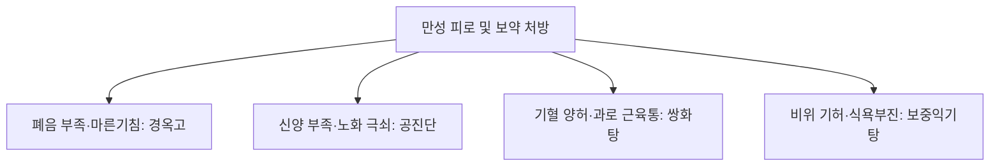

# 경옥고 (瓊玉膏, Gyeongok-go)

> **핵심 요약 (Key Summary)**
> - 🌿 기원·구성: 송대(宋代) 《이간방(夷堅方)》에 최초 수록되고 《동의보감(東醫寶鑑)》 양생연년약이(養生延年藥餌)의 첫머리를 장식한 대표적 자양강장 고제(膏劑)로, [[생지황]] 생즙, [[인삼]] 분말, [[백복령]] 분말, 정제된 [[봉밀]](꿀)을 옹기에 담아 3일 밤낮(72시간) 중탕 후 화독을 빼고 다시 만 하루를 달여 농축 발효시킨 명방.
> - 🎯 적응증·체질: 폐음(肺陰)과 신수(腎水) 부족으로 인한 만성 허로(虛勞), 마른기침(건해), 피로 권태, 노인성 쇠약, 병후 체력 저하, 기억력 감퇴, 코로나19 후유증(만성 기침 및 브레인 포그). 서양의학의 고농도 영양수액/영양주사를 꾸준히 경구 복용하는 것과 유사한 전신 대사 증진 효과 발휘.
> - 🔬 분자약리기전: 72시간 중탕 숙성을 통한 Rg3, Rh1 등 희귀 [[진세노사이드]] 및 저분자 다당체 생성, 폐포 상피세포 염증(IL-6, TNF-$\alpha$) 억제 및 점액 분비 정상화, 뇌 신경세포 BDNF 발현 촉진, 미토콘드리아 호흡 효율 증가 및 항피로 작용.
⚠️ 주의사항: 봉밀(꿀) 함유로 혈당 조절이 불안정한 중증 당뇨 환자는 섭취량 조절 필수. 복용 시 산화 방지를 위해 쇠숟가락 대신 나무나 도자기 수저 사용 권장.

---

## 1. 📜 방제 기본 정보

| 구분 | 내용 |
| :--- | :--- |
| **처방명** | 경옥고 (瓊玉膏, Gyeongok-go) |
| **출전** | 《이간방(夷堅方)》, 《동의보감(東醫寶鑑)》 |
| **처방 분류** | 보익제(補益劑) - 자음윤폐(滋陰潤肺) / 익기양혈(益氣養血) / 연년익수(延年益壽) |
| **한의학적 효능** | 자음윤폐(滋陰潤肺), 익기생진(益氣生津), 보신익정(補腎益精), 건비안신(健脾安神) |
| **주치 병증** | 허로건해(虛勞乾咳), 객혈(咯血), 폐위(肺痿), 기단천식(氣短喘息), 식소체동(食少體羸), 골수부족, 조기 노화 |
| **현대적 적응증** | 만성 피로 증후군, 호흡기 후유증(미세먼지 유발 천식, 코로나 후유증 만성 기침), 수험생 기억력 개선, 노인 쇠약증, 갱년기 장애, 면역력 저하 |

---

## 2. 🌿 약재 구성 및 방제학적 배오 원리

### 1) 약재 구성표

| 약재명 | 한자 | 표준 배합 비율(중량비) | 본초 분류 | 귀경 | 주요 성분 | 핵심 역할 및 기능 |
| :--- | :--- | :--- | :--- | :--- | :--- | :--- |
| [[생지황]] | 生地黃(즙) | 16 (약 5000g) | 청열양혈약 | 심, 간, 신 | [[카탈폴]], 레만닌, 당류 | **군약(君藥)**: 자음양혈(滋陰養血), 생진윤조(生津潤燥), 진액과 혈을 대량 보충 |
| [[인삼]] | 人蔘(가루) | 3 (약 900g) | 보기약 | 폐, 비, 심 | [[진세노사이드]] Rb1, Rg1, Rg3 | **신약(臣藥)**: 대보원기(大補元氣), 보비익폐(補脾益肺), 기운을 북돋우고 생지황의 보음을 추동 |
| [[복령]](백복령) | 茯苓(가루) | 6 (약 1800g) | 이수삼습약 | 심, 비, 신 | [[파키만]], 베타-글루칸 | **좌약(佐藥)**: 건비삼습(健脾滲濕), 녕심안신(寧心安神), 지황의 담음화 방지 및 비위 소화력 보조 |
| [[봉밀]](꿀) | 蜂蜜(정제) | 10 (약 3000g) | 보기약(윤조) | 폐, 비, 대장 | 과당, 포도당, 비타민 | **사약(使藥)**: 윤폐지해(潤肺止咳), 보중완급(補中緩急), 제약을 결합시키고 방부 및 흡수 촉진 |

> *특수 제법 (전통 및 현대 공정): 생지황 생즙에 미세 분말화된 인삼과 백복령을 고르게 반죽한 뒤 정제 꿀을 넣어 옹기에 담고 기름종이와 명주천으로 밀봉합니다. 이를 뽕나무 불로 3일 낮밤(72시간) 동안 중탕 가열한 뒤, 우물물(냉수)에 하루 동안 담가 화독(火毒)을 제거하고, 다시 하루(24시간) 동안 중탕하여 완성합니다.*

### 2) 방제학적 배오 원리
- **단 4가지 약재로 완성한 수승화강(水昇火降)**: 지황의 음(陰)과 인삼의 양(陽), 복령의 비위 건운(運化)과 봉밀의 윤조(潤燥)가 어우러져 오장육부의 정기를 고르게 채웁니다.
- **숙성 중 화학적 전환 (소화 흡수 극대화)**: 100시간에 달하는 장기 중탕 공정 중 인삼의 사포닌이 Rg3, Rh1 등 극성 희귀 사포닌으로 전환되며, 생지황의 찬 성질이 온화하게 바뀌어 소화기가 약한 사람도 위장 장애 없이 바로 체내 흡수됩니다.

---

## 3. 🔬 현대 약리 연구 및 분자 기전

### 1) 폐 점막 보호 및 만성 기침 완화 (코로나 후유증)
- **기도 염증 및 섬유화 억제**: 미세먼지나 바이러스 감염 후 발생하는 폐포 대식세포의 염증성 사이토카인(TNF-$\alpha$, IL-1$\beta$, IL-6) 분비를 유의하게 억제하고 점액 섬모 운동을 촉진하여 마른기침을 진정시킵니다.
- **점막 면역 강화**: 기도 분비액 내 secretory IgA(sIgA) 분비를 증가시켜 호흡기 점막 방어력을 복구합니다.

### 2) 항피로 및 지구력 증진 (양방 영양수액 유사 효과)
- **젖산 분해 및 글리코겐 보존**: 고강도 운동 및 과로 후 축적되는 혈중 젖산을 빠르게 감소시키며 간 및 골격근의 글리코겐 저장량을 보존합니다.
- **항산화 방어계 강화**: 적혈구 및 간세포 내 SOD, Catalase 활성을 유도하고 지질 과산화물(MDA) 생성을 억제합니다.

### 3) 뇌 기능 및 기억력 향상
- **BDNF 발현 촉진**: 해마(Hippocampus) 부위의 뇌신경유래영양인자(BDNF) 및 CREB 인산화를 증가시켜 시냅스 가소성을 증진하고 인지 기능 및 기억력을 향상시킵니다.

---

## 4. ⚖️ 유사 처방 감별 및 네트워크

| 처방명 | 중심 구성 | 제형 및 복용법 | 변증 및 핵심 타깃 |
| :--- | :--- | :--- | :--- |
| [[경옥고]] | 생지황, 인삼, 백복령, 봉밀 | 고제(膏劑), 떠먹거나 환 | 폐비음허(肺脾陰虛), 건해, 만성 피로, 호흡기 쇠약 |
| [[공진단]] | 녹용, 당귀, 산수유, 사향 | 환제(丸劑), 씹어서 복용 | 간신음허 + 심양허, 노화, 극심한 뇌신경 피로, 면역 결핍 |
| [[쌍화탕]] | 작약, 숙지황, 황기, 당귀, 천궁, 육계 | 탕제(湯劑), 따뜻하게 복용 | 기혈양허, 근육 피로, 과로, 감기 전구기 |
| [[청서익기탕]] | 황기, 인삼, 맥문동, 오미자 | 탕제(湯劑) | 여름철 서열손상, 기음양허, 다한구갈 |

---

## 5. ⚠️ 임상 복용 주의사항 및 부작용 관리

### 1) 당뇨 환자 복용 주의
- 고농도의 정제 봉밀(꿀)이 들어가 있으므로 조절되지 않는 당뇨병 환자는 혈당 스파이크에 주의해야 하며, 1회 복용량을 줄이거나 무당(No-sugar) 공법 제품을 고려해야 합니다.

### 2) 보관 및 복용 도구 (쇠숟가락 금기)
- 전통 제법상 철(鐵)과의 접촉을 금기시하며, 약효 성분의 산화를 막기 위해 도자기, 유리, 나무 수저를 사용하도록 환자에게 복약 지도합니다.
- 침이나 물이 들어가면 곰팡이가 생길 수 있으므로 개봉 후 냉장 보관하거나 1회용 스틱 파우치 제형을 권장합니다.

---

## 6. 📚 현대 학술 연구 및 논문 (References)

1. Lee, B. C., et al. (2014). "Gyeongok-go ameliorates particulate matter-induced inflammatory response in human bronchial epithelial cells and mouse lungs." *Journal of Ethnopharmacology*, 153(3), 580-588.
   - [연구 요약] 미세먼지에 노출된 기관지 상피세포 및 마우스 폐 조직에서 경옥고가 염증성 사이토카인 방출을 억제하고 기도 염증 및 점액 과분비를 완화함을 증명.
2. Park, D. H., et al. (2016). "Anti-fatigue and endurance-improving effects of traditional herbal prescription Kyung-Ok-Ko in mice." *Nutrients*, 8(7), 428.
   - [연구 요약] 경옥고 경구 투여가 마우스의 탈진 수영 시간을 대조군 대비 유의하게 증가시키고 젖산탈수소효소(LDH) 및 크레아틴 키나아제(CK) 수치를 억제하여 뛰어난 항피로 효과를 입증.

---

## 7. 💡 사용자 진료실 핵심 필기 & 임상 팁 (원문 보존)

> ### 📌 구성
> [[복령]], [[지황]], [[인삼]], [[꿀]]
> - 위 약재들을 중탕, 발효를 통해 장내 미생물 대사, 소화흡수 없이 고농도의 약리성분을 뽑아내서 섭취하는 것
> 
> ### 📌 적응증
> - 양방 영양수액, 영양 주사를 꾸준히 복용하는 것과 비슷한 효과가 있음.
> - 혈당, 혈압 유지, 기억력 향상, 만성 피로 완화
> - 만성 기침(코로나 후유증) 환자에게 활용
> 
> ### 📌 참고
> - 한의원에서 만드는 것은 힘들기에 검증된 회사의 제품 사용이 좋음