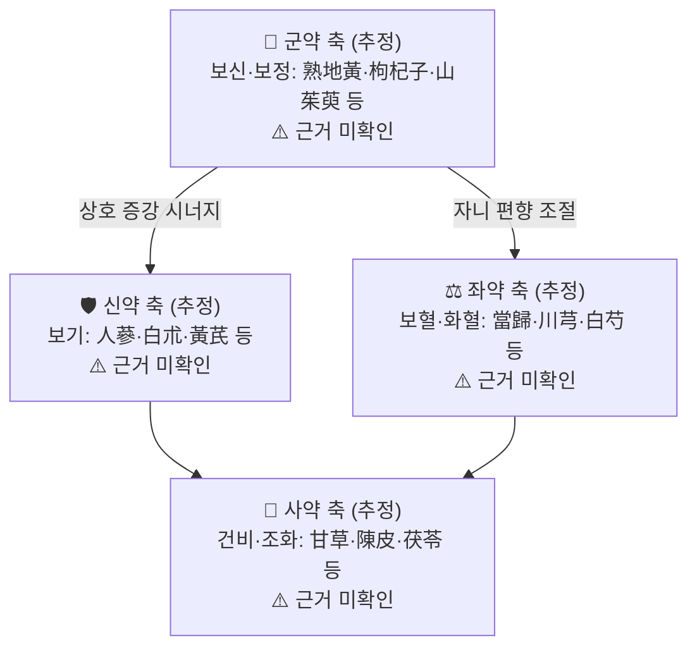

# 🍵 [[고본건영단]] (固本健榮丹, Goben Geonyeong-dan)

> **핵심 3줄 요약 (Key Summary)**:
> - 🌿 **모체/기원 처방 + 가감 핵심 약재 배오 구조**: ⚠️ **근거 미확인** — 본 처방의 원전 출전 및 정확한 약재 구성은 이번 노트 작성에 제공된 자료에서 확인되지 않았다. 명칭상 `固本`(근본을 견고히) + `健榮`(영혈을 건강하게)의 구조로 보아 **補腎固精 + 益氣養營** 계열의 복합 보익 처방(육미지황탕·사물탕·보중익기탕 계열 보익제의 복합 가감)으로 추정되나, 이는 **명칭 유추이며 문헌 확인 전까지 확정 불가**하다.
> - 🎯 **임상 최적 적응증, 환자 체질 특성**: 허로·정력 저하·양위(陽痿)·조기 음위·만성 피로 등 **신정(腎精)과 기혈이 동시에 허손된 만성 허약 상태**가 임상 표적이 될 것으로 추정된다. 체질적으로는 **소음인·태음인 허약형**, 마르거나 근육량이 적고 피부가 건조·창백한 사람이 1차 후보군이나 **근거 미확인**.
> - 🔬 **핵심 분자약리 기전, 대사 경로 및 표적 사이토카인**: ⚠️ **본 처방 특이적 분자약리 연구 근거 미확인**(검색된 논문 없음). 아래 3장의 기전 서술은 보익제·보신제 계열의 **일반론**이며 본 처방에 대한 직접 증거가 아님을 명시한다.
> - ⚠️ 주의사항: 실열(實熱)·습열(濕熱) 병증, 급성 감염기(무한 고열), 소화력이 극히 떨어지고 담습(痰濕)이 성한 자에게는 보익 자극제(滋膩)가 병을 조장할 수 있어 신중 투여. 고혈압·당뇨·전립선 질환 등으로 양약(특히 혈압강하제·혈당강하제·발기부전 치료제)을 복용 중인 환자는 병용 전 반드시 확인. **본 처방의 공식 금기·부작용 데이터는 근거 미확인.**
---

## 📌 목차
1. [기본 처방 정보 & 군신좌사 구성](#1-기본-처방-정보--군신좌사-구성)
2. [방제학적 약재 상호작용 & 시너지 네트워크](#2-방제학적-약재-상호작용--시너지-네트워크)
3. [현대 분자약리학적 효능 & 작용 기전](#3-현대-분자약리학적-효능--작용-기전)
4. [적응 병증 및 체질별 감별 (Sweet Spot vs 금기)](#4-적응-병증-및-체질별-감별-sweet-spot-vs-금기)
5. [유사 처방군 감별 매트릭스](#5-유사-처방군-감별-매트릭스)
6. [임상 가감례 & 현대 질환별 응용](#6-임상-가감례--현대-질환별-응용)
7. [💡 사용자 진료실 핵심 필기 & 임상 팁 (원문 보존)](#7--사용자-진료실-핵심-필기--임상-팁-원문-보존)
8. [출처 및 학술 참고 문헌 (References)](#8-출처-및-학술-참고-문헌-references)
---
## 1. 기본 처방 정보 & 군신좌사 구성

> [!warning] **문헌 확인 필요 (근거 미확인)**
> 본 항목은 원전 출전과 약재 구성을 **확인할 수 없는 상태**에서 작성되었다. 아래 표의 약재명·용량은 **확정 정보가 아니며**, 실제 처방 내용은 반드시 원전(동의보감·방약합편·경악전서 등) 색인 또는 공인 처방집으로 **재확인 후 수정**해야 한다.

* **출전**: ⚠️ **근거 미확인** — 장중경 『[[상한론]]』 계열인지, 허준 『[[동의보감]]』 수록인지, 후대 방서(方書) 및 한국 근현대 처방집 유래인지 확인되지 않았다. 노트 템플릿의 기본 예시(상한론/동의보감)는 **예시일 뿐이며 본 처방의 출전으로 단정할 수 없다.**
* **치법(명칭 유추)**: 補腎固本(보신고본), 益精健榮(익정건영), 補氣養血(보기양혈), 強壯筋骨(강장근골) — ⚠️ **처방명에서 유추한 치법이며 원문 치법 근거 미확인.**
* **분류 위치**: `의학/02_약리\처방\02_보익제` — 보익제(補益劑) 중 **보신·보정(補腎補精) 하위군**으로 분류. 태그에 [[육미지황탕]]이 포함된 점은 본 처방이 **육미지황탕 계열 보신 방제와 임상적으로 인접**하게 운용됨을 시사하나, 실제 구성상 모체 처방 여부는 확인 필요.

| 구분 | 약재명 | 표준 용량 | 본초 효능 & 방제 내 역할 |
| :--- | :--- | :--- | :--- |
| **군약 (君藥)** | ⚠️ 미확인 (추정: 보신·보정 축 — 熟地黃/枸杞子/山茱萸 계열) | 미확인 | 신정(腎精) 보충 및 하초(下焦) 고섭(固攝) — **추정, 근거 미확인** |
| **신약 (臣藥)** | ⚠️ 미확인 (추정: 보기 축 — 人蔘/白朮/黃芪 계열) | 미확인 | 기(氣)를 보하여 정혈화생(精血化生)의 원동력 제공 — **추정, 근거 미확인** |
| **좌약 (佐藥)** | ⚠️ 미확인 (추정: 보혈·활혈 축 — 當歸/川芎/白芍 계열) | 미확인 | 영혈 자양, 군약의 자니(滋膩) 편향 완충 — **추정, 근거 미확인** |
| **사약 (使藥)** | ⚠️ 미확인 (추정: 건비·조화 축 — 甘草/陳皮/茯苓 계열) | 미확인 | 조화제약(調和諸藥), 비위 보호 및 흡수 촉진 — **추정, 근거 미확인** |

> **배오 특징**: 보익제 일반론으로 보면, ①**보신(補腎) 약재 + 보기(補氣) 약재 + 보혈(補血) 약재**의 3축 배합으로 '정(精)·기(氣)·혈(血)'을 동시에 보하는 구조가 전형적이며, ②자니(滋膩)한 보음약에 **건비소도(健脾消導) 약재를 소량 가**하여 소화 부담과 승강출입(升降出入)의 정체를 방지하고, ③온보(溫補)와 자음(滋陰)의 비율을 조절해 **음양 평형**을 맞추는 것이 설계 원리로 추정된다. 단 이는 **보익제 일반 배오 원리이며 본 처방 고유의 배오비는 근거 미확인**이다.
---
## 2. 방제학적 약재 상호작용 & 시너지 네트워크

> ⚠️ 아래 다이어그램은 **확인된 구성이 아닌 '구성 축(軸)' 수준의 개념도**이다. 실제 약재명이 확인되면 반드시 교체할 것.

* **보신축 + 보기축 배오(추정)**: 補精하는 약재는 성질이 자윤(滋潤)하여 단독으로는 운화(運化)가 더뎌지기 쉽고, 補氣하는 약재는 온조(溫燥)하여 단독으로는 음혈을 마르게 하기 쉽다. 두 축을 함께 배오하면 **기(氣)가 정(精)을 낳고 정(精)이 기(氣)를 받쳐주는 상호 상승(相須·相使)** 구조가 되어, 만성 허로 상태에서 요구되는 '지속적·완만한 보익'에 적합해진다. — **일반 방제론이며 본 처방 특이적 근거 미확인.**
* **보혈축 + 건비축 배오(추정)**: 보혈·자음 약재의 **자니(滋膩)로 인한 비위 정체(胃脹·식욕부진·연변)** 를 健脾·理氣·利濕 약재가 완충하여, 장기 복용 시의 소화기 부작용을 줄이고 약효 흡수를 돕는다. 즉 좌약·사약이 **'보익의 부작용 억제 + 표적 장부(신·비) 유도'** 이중 역할을 담당하는 구조로 이해할 수 있다. — **추정.**
* **확인 필요 사항**: 실제 처방에서 ①온보(鹿茸·巴戟天·淫羊藿 등) 계열 포함 여부 — 포함되면 **양위·냉증 표적 처방**으로 성격이 크게 달라짐, ②청열·자음(知母·黃柏 등) 포함 여부 — 포함되면 **상화(相火) 억제형**으로 감별점이 달라짐. 이 두 축의 유무가 감별의 핵심 변수이다.
---
## 3. 현대 분자약리학적 효능 & 작용 기전

> ⚠️ **본 처방(고본건영단) 자체를 대상으로 한 분자약리·임상 연구는 이번 자료에서 검색되지 않았다(논문 0건).** 따라서 아래 내용은 **보익제·보신제 계열 및 구성 추정 본초의 일반 문헌에서 흔히 보고되는 기전을 정리한 것**이며, 본 처방의 효능으로 인용할 수 없다. 모든 항목은 **근거 미확인**으로 취급할 것.

### 1) 핵심 분자 표적 및 면역/항염증 조절 (일반론)
* 보익제 계열에서 일반적으로 논의되는 경로: **NF-κB 활성 억제**, **MAPK(p38·ERK·JNK) 인산화 조절**, **TNF-α·IL-6·IL-1β 등 전염증성 사이토카인 하향**, **IL-10 등 항염증성 사이토카인 상향**.
* 만성 허로·노화 모델에서의 **산화스트레스 지표(MDA) 감소, SOD·GSH-Px 등 항산화 효소 활성 상승** — 계열 일반론.
* 단, **어떤 사이토카인이 몇 % 변화했는지 등의 정량 수치는 본 처방에 대해 근거 미확인**이므로 수치 기재를 하지 않는다.

### 2) 순환기·미세순환 및 대사 개선 (일반론)
* eNOS 활성화 및 NO 매개 혈관 이완, 말초 미세혈류 저항 감소 — 보익·활혈 계열에서 보고되는 기전.
* 미토콘드리아 생합성(PGC-1α) 및 ATP 생성 효율 개선, 해당·지방산 산화 균형 조절 — **만성 피로·허로 개선의 가설적 설명**.
* 내분비 축에서는 **성선자극호르몬(GnRH·LH·FSH) 및 테스토스테론 조절**이 보신제 연구에서 자주 언급되나, 본 처방에 대한 직접 데이터는 **근거 미확인**.

### 3) 신경계·근골격계 및 자율신경 조절 (일반론)
* HPA 축(시상하부-뇌하수체-부신) 항상성 회복을 통한 **만성 스트레스 반응 완화** 가설.
* 근긴장·근피로 개선, 진통·항경련 작용 — 보익제 계열의 부수적 보고.
* 자율신경실조(냉증·기립성 어지럼·만성 피로감) 개선 — **증상 기반 관찰 수준이며 기전은 미확립**.

> **정리**: 본 처방의 작용 기전은 현재 **"보익제 계열의 일반 기전 + 명칭 유추"를 넘어서는 근거가 없다.** 향후 문헌 및 실험 연구 확보 시 이 섹션을 전면 재작성할 것.
---
## 4. 적응 병증 및 체질별 감별 (Sweet Spot vs 금기)

[✅ 최적 적응증 (Sweet Spot)] — ⚠️ 아래는 **추정 적응증**이며 원전 조문 확인 필요
• **원전 조문**: ⚠️ **근거 미확인** (상한론·금궤요략·동의보감 등 특정 조문 확인되지 않음)
• **체질 소견(추정)**: 만성 허로형 **소음인·태음인**. 체격은 마르거나 근육량이 적고 체온이 낮은 편, 피부는 창백·건조하며 쉽게 피로해지는 유형. 소양인 실열형이나 습열 체질에는 부적합할 가능성이 높다.
• **임상 주치(추정)**: ①성기능 저하·양위·조루·정력 감퇴, ②만성 피로·기력 저하·의욕 저하, ③허로로 인한 요슬산연(腰膝酸軟)·하지 무력, ④냉증·손발 냉감, ⑤산후·수술 후·과로 후 회복기 허약 — 단 **문헌 근거 미확인**.
• **설진/맥진(추정)**: 설질 담백(淡白)·설태 박백(薄白) 또는 소태, 변연 치흔(齒痕). 맥은 **침세(沈細)·지완(遲緩)·무력(無力)** 한 상. 홍설(紅舌)·황조태(黃燥苔)·삭맥(數脈)이면 보익제 적응이 아니므로 재검토.

[⚠️ 신중 투여 및 금기 (Caution / Contraindication)]
• **허실(虛實) 반대 병증**: 실열(實熱)·습열(濕熱)·담열(痰熱)이 주된 병증에 보익 자니제를 투여하면 열이 조장되고 흉민·식체가 나타날 수 있다.
• **급성기 금기(일반 원칙)**: 무한 고열, 급성 감염(폐렴·요로감염 등), 급성 염증성 장질환 등 '표증·실증' 우세 시에는 보익제를 보류하고 해표·청열을 먼저 고려한다.
• **소화기 취약자**: 완고한 식욕부진, 위장 정체감, 만성 연변·복만이 있는 자는 감량 또는 健脾 소도약 가미 없이 투여하지 않는다.
• **양약 병용 주의(일반 원칙)**: 항고혈압제(혈압 변동), 혈당강하제(저혈당 위험), 항응고·항혈소판제(출혈 경향), PDE5 억제제(발기부전 치료제 — 혈압 강하 중복), 갑상선 호르몬제 등과의 병용은 반드시 복약 지도 및 간격 조절. **본 처방 특이적 상호작용 데이터는 근거 미확인.**
• **장기 투여 시 모니터링**: 간기능·신기능, 혈압, 소화 반응(위부팽만·설사·식욕 변화)을 주기적으로 확인.
---
## 5. 유사 처방군 감별 매트릭스

> ⚠️ 아래 비교는 **본 처방의 구성이 확정되지 않은 상태에서의 잠정框架**이다. 처방 구성이 확인되면 '핵심 구성 차이' 열을 실제 약재 기준으로 재작성해야 한다.

| 처방명 | 핵심 구성 차이 | 주치 및 체질 차이 | 맥진/설진 차이 |
| :--- | :--- | :--- | :--- |
| [[고본건영단]] | 기준 (구성 미확인) | 기혈·신정 동시 허손형 만성 허로, 소음인·태음인 허약형(추정) | 침세·지완 무력맥, 담백설(추정) |
| [[육미지황환]] | 보신 자음 중심, 온보약 부재 | 신음허 중심 — 요슬산연·이명·오심번열·야간뇨, 소음인·열성 경향 | 세삭(細數)맥, 홍설 소태 |
| [[팔미지황환]] | 육미지황환 + 계지·부자(온양) | 신양허 중심 — 냉증·하지냉·빈뇨·부종, 소음인 한성 | 침지(沈遲)맥, 담백·수활설 |
| [[보중익기탕]] | 보기승양 중심(인삼·황기·승마·시호) | 기허하함 — 만성 피로·기력 저하·내장하수·식후 졸림, 태음인 | 허대무력맥, 담백설 치흔 |
| [[십전대보탕]] | 사군자탕 + 사물탕 + 황기·육계 | 기혈양허 전반 — 산후·수술 후 회복, 빈혈·냉증 | 침세약맥, 담백 무태 |
| [[사물탕]] | 보혈 단독(당귀·천궁·백작·숙지황) | 혈허 중심 — 안색 창백·현훈·월경 이상 | 세삭·약맥, 담백설 |
| [[공진단]] | 사향·녹용·당귀·오수유 등 | 기혈허 + 어혈·담음 교착, 회복기 보양 | 침세·결대맥, 암자색설 등 다양 |

> ⚠️ 표 내부에서는 마크다운 열 구분자 파괴를 방지하기 위해 파이프(`|`)가 들어간 링크를 쓰지 않고 순수한 [[처방명]] 단독 형태로만 작성합니다.

**감별 포인트 요약**
* **음허 열증(오심번열·야간 도한·홍설 삭맥)** → [[육미지황환]] 계열 우선.
* **양허 한증(냉증·빈뇨·하지냉·부종)** → [[팔미지황환]] 계열 우선.
* **기허 하함(식후 졸림·내장하수·기력 저하)** → [[보중익기탕]] 계열 우선.
* **기혈양허 전반(빈혈·산후 회복)** → [[십전대보탕]] 계열 우선.
* 위 어느 한 축에 치우치지 않고 **기·혈·정이 함께 허손된 장기 허로**에서 본 처방이 검토될 여지가 있으나, **이는 추정이며 실제 적응은 원전 주치 확인 후 결정.**
---
## 6. 임상 가감례 & 현대 질환별 응용

* **수반 증상별 가감법** (⚠️ 아래는 **보익제 일반 가감 원칙**으로, 본 처방의 확정 가감법이 아님):
  * 냉증·하지 냉감 현저 시 → + 온보약([[음양곽]]·[[파극천]]·[[육종용]] 등) 검토
  * 음허 열감·도한·구건 동반 시 → + [[지모]]·[[황백]] 또는 [[맥문동]]·[[오미자]]
  * 소화불량·위부팽만·식욕부진 동반 시 → + 건비소도약([[진피]]·[[사인]]·[[산사]]·[[신곡]] 계열) 또는 [[향사육군자탕]] 방향
  * 담음·기침·가래 동반 시 → + [[반하]]·[[복령]]·[[진피]] ([[이진탕]] 계열)
  * 불면·심계·불안 동반 시 → + [[산조인]]·[[원지]]·[[용안육]] ([[귀비탕]]·[[천왕보심단]] 계열)
  * 요통·슬통·관절 무력 동반 시 → + [[두충]]·[[우슬]]·[[속단]]·[[보골지]]
* **현대 질환별 임상 매핑** (⚠️ **가설적 매핑, 문헌 근거 미확인**):
  * **비뇨생식기/남성건강**: 양위(勃起不全), 성욕 감퇴, 만성 전립선염 후 회복기, 정액 이상 — 보신제 계열의 전통적 응용 영역.
  * **내분비·대사**: 만성 피로증후군, 갑상선 기능 저하 보조, 갱년기 증상, 아급성 회복기 허약.
  * **근골격계**: 만성 요배통, 근감소·근력 저하, 골다공증 보조 관리.
  * **신경계/자율신경**: 자율신경실조증, 냉방병형 냉증, 스트레스성 만성 피로.
  * **산부인과**: 산후 회복기 허약, 월경량 과소(혈허형), 냉증형 월경통 — 보익제 일반 응용.
---
## 7. 💡 사용자 진료실 핵심 필기 & 임상 팁 (원문 보존)

> [!tip] **진료실 실전 노하우 (User Clinical Insight)**
> - **[원문 미제공 — 보존 대기]** 이번 노트 작성 시 사용자 진료실 필기/메모 원문이 제공되지 않았다. 기존 메모가 있다면 **삭제하지 말고 이 블록에 그대로 붙여 넣을 것.**
> - **필기 입력용 임시 항목(추후 실제 내용으로 대체)**:
>   - 체질별 처방 선택 기준: (소음인 / 태음인 / 소양인 중 실제 사용 빈도와 감별 기준 기입)
>   - 실제 처방 용량·복용법(탕제/환제, 1일 2~3회, 식전/식후) 기입
>   - 환자 티칭 포인트: 복약 기간, 초기 반응 관찰 지점, 생활 관리(수면·냉증 관리·과로 회피)
>   - 복약 반응 관찰 포인트: 소화 반응(위부팽만·식욕), 수면 질, 체온감, 배뇨 양상, 활력도 변화
>   - 부작용·중단 사례 및 대응 기록
> - ⚠️ 위 항목은 **작성 틀일 뿐 실제 임상 경험이 아님**을 명시한다.
---
## 8. 출처 및 학술 참고 문헌 (References)

> ⚠️ **본 노트는 제공된 PubMed 검색 결과가 0건(논문 없음)인 상태에서 작성되었다.** 따라서 아래에 **어떠한 논문도 인용하지 않았으며**, 존재하지 않는 PMID·DOI·저자를 임의로 생성하지 않았다.

1. **(검색 결과 없음)** — 본 처방(고본건영단, 固本健榮丹)에 대해 제공된 PubMed 데이터가 **0건**이므로 인용 가능한 현대 학술 문헌이 없다.
   - **[연구 요약]**: 해당 없음. 분자약리 기전·바이러스 억제율·임상 지표 개선 결과 등 **모든 정량 데이터는 근거 미확인**이다.
2. **고전 원전(출전) — 확인 필요** — 본 처방이 수록된 원전(예: 『[[동의보감]]』, 『[[방약합편]]』, 『[[경악전서]]』 등)은 **아직 확인되지 않았다.** 확인 시 다음 형식으로 기재할 것:
   - `저자 (연도). 『서명』, 권(편). [원문 조문 인용]`
   - **[고전 원전]**: ⚠️ **근거 미확인** — 출전 미확정.
3. **처방 구성 및 용량 — 확인 필요**
   - **[임상 문헌]**: 본 처방의 군신좌사 구성, 표준 용량, 복약 지침은 **모두 미확인**이며, 1장 표의 추정 내용은 문헌 확인 후 전면 교체해야 한다.

### 📋 후속 확인 체크리스트
- [ ] 원전(동의보감·방약합편·경악전서·제중신편 등) 색인에서 `固本健榮丹` 검색 → 출전 확정
- [ ] 확정된 약재 구성·용량으로 1장 표 및 2장 다이어그램 전면 재작성
- [ ] 온보(鹿茸·巴戟天·淫羊藿) 또는 청열(知母·黃柏) 축 포함 여부 확인 → 4장 Sweet Spot 재설정
- [ ] PubMed·KISS·RISS·OASIS 재검색(검색어: `固本健榮丹`, `Guben Jianrong Dan`, `고본건영단`) 후 3장 기전 및 8장 문헌 갱신
- [ ] 사용자 진료실 필기 원문을 7장에 이관 및 보존

<!-- 보관 태그(1회용·링크오류, 필요시 복원): 정력 -->
