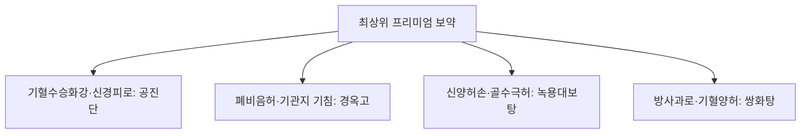

# 공진단 (拱辰丹, Gongjin-dan)

> **핵심 요약 (Key Summary)**
> - 🌿 기원·구성: 원대(元代) 위역림(危亦林)의 《세의득효방(世醫得效方)》에 수록되고 《동의보감(東醫寶鑑)》에서 타고난 원기(元氣)를 굳건히 하여 백병을 물리치는 명약으로 극찬한 황실 비방으로, 개규성신(開竅醒神)의 군약인 [[사향]]과 보양익정(補陽益精)의 [[녹용]], 보혈활혈(補血活血)의 [[당귀]], 보간익신(補肝益腎)의 [[산수유]] 4미를 정제된 봉밀로 환을 빚어 금박을 입힌 최고급 온보 환제.
> - 🎯 적응증·체질: 간신음양(肝腎陰陽) 부족, 골수 허손, 극심한 만성 피로, 뇌신경 쇠약, 기억력 및 집중력 저하, 수험생 피로, 남성 성기능 감퇴, 노인성 기력 쇠약(Frailty), 큰 병이나 수술 후 쇠약. 아나볼릭 스테로이드와 유사한 전신 단백 동화 및 활력 증진 효과를 나타내어 노인 및 소모성 환자에게 최적.
> - 🔬 분자약리기전: [[무스콘]]의 혈뇌장벽(BBB) 개방 및 뇌 미세혈류 순환 촉진, 녹용 IGF-1의 단백 동화 합성(Anabolic steroid-like) 및 조혈 기능 자극, 뇌 해마 부위 시냅스 가소성(BDNF/TrkB) 증대, 항산화 효소(SOD, Catalase) 유도 및 염증성 사이토카인(IL-1$\beta$, TNF-$\alpha$) 억제.
⚠️ 주의사항: 사향의 강력한 개규·통경(通經) 작용으로 자궁 평활근 수축을 유발하므로 임산부 절대 복용 금기. 고혈압 실열(實熱) 환자 복용 주의.

---

## 1. 📜 방제 기본 정보

| 구분 | 내용 |
| :--- | :--- |
| **처방명** | 공진단 (拱辰丹, Gongjin-dan) |
| **출전** | 《세의득효방(世醫得效方)》, 《동의보감(東醫寶鑑)》 |
| **처방 분류** | 보익제(補益劑) - 익정전수(益精塡髓) / 개규안신(開竅安神) |
| **한의학적 효능** | 온신익정(溫腎益精), 자음양혈(滋陰養血), 개규통경(開竅通經), 수승화강(水昇火降) |
| **주치 병증** | 허로손상(虛勞損傷), 체질소약(體質素弱), 면색초흑(面色焦黑), 신수부족(腎水不足), 요슬산연(腰膝酸軟), 목현(目眩), 심신피로 |
| **현대적 적응증** | 만성 피로 증후군, 노인성 쇠약, 수험생 뇌신경 피로 및 집중력 감퇴, 혈관성 치매 초기, 성기능 장애(발기력 저하, 갱년기), 뇌졸중 후유증, 면역력 저하 |

---

## 2. 🌿 약재 구성 및 방제학적 배오 원리

### 1) 약재 구성표

| 약재명 | 한자 | 배합 비율 | 본초 분류 | 귀경 | 주요 성분 | 핵심 역할 및 기능 |
| :--- | :--- | :--- | :--- | :--- | :--- | :--- |
| [[사향]] | 麝香 | 0.5 (약 75~100mg/환) | 개규약 | 심, 비, 간 | [[무스콘]] | **군약(君藥)**: 개규성신(開竅醒神), 활혈통경(活血通經), 제약의 기운을 전신 혈맥과 뇌로 신속히 인도 |
| [[녹용]] | 鹿茸(분골) | 4.0 | 보양약 | 신, 간 | [[판토크린]], IGF-1, 강글리오사이드 | **신약(臣藥)**: 보신장양(補腎壯陽), 익정혈(益精血), 강근골(强筋骨), 조혈 및 단백 동화 촉진 |
| [[당귀]] | 當歸 | 4.0 | 보혈약 | 간, 심, 비 | [[데커신]], 노다케닌, 정유 | **신약(臣藥)**: 보혈활혈(補血活血), 조경지통(調經止痛), 영혈을 보하고 혈액순환 촉진 |
| [[산수유]] | 山茱萸 | 4.0 | 수렴약 | 간, 신 | [[모로니사이드]], [[로가닌]] | **좌약(佐藥)**: 보간익신(補肝益腎), 삽정고탈(澁精固脫), 음정(陰精)의 소모를 수렴·보존 |

> *특수 제형 및 복용법: 약재를 초미세 분말로 분쇄하여 정제 봉밀로 반죽 후 1환당 3.75g~5g(사향 75~100mg 함유) 크기로 빚고 순금박(金箔)을 입혀 안신(安神) 효과와 약효 휘발 방지를 도모합니다. 아침 공복에 따뜻한 물과 함께 천천히 씹어서 복용합니다.*

### 2) 방제학적 배오 원리
- **수승화강(水昇火降)의 극치**: 《동의보감》에서는 "천원일기(天元一氣)를 굳건히 하여 수(水)를 오르게 하고 화(火)를 내리니 백병이 생기지 않는다"고 기록했습니다.
- **보약과 개규약의 상호 증폭 배오**: 녹용·당귀·산수유의 중후한 자음·보양 약효가 자칫 체내에 울체될 수 있는 한계를, 방향개규(芳香開竅)의 제왕인 [[사향]]의 [[무스콘]]이 전신 혈맥과 말초·뇌신경계로 강력히 뚫어내어 즉각적인 각성 및 기력 회복 효과를 발휘합니다.
- **아나볼릭(단백 동화) 효과와 안전성**: 양방의 외인성 테스토스테론/아나볼릭 스테로이드가 야기하는 내분비계 축(HPA/HPG 축) 억제나 간독성 부작용 없이, 내인성 호르몬 분비와 세포 재생을 유도하는 천연 자양강장제입니다.

---

## 3. 🔬 현대 약리 연구 및 분자 기전

### 1) 혈뇌장벽(BBB) 개방 및 신경 재생 (무스콘)
- **BBB 일시적 투과도 조절**: 사향의 [[무스콘]]은 뇌 모세혈관의 밀착연접(Tight junction) 단백질을 일시적·가역적으로 조절하여 다른 유효 약리 성분의 뇌 실질 흡수를 극대화합니다.
- **신경세포 보호 및 BDNF 증가**: 뇌 허혈 및 산화 스트레스 환경에서 해마 뉴런의 손상을 방지하고 신경세포 성장인자(BDNF, NGF) 생성을 유도하여 인지 기능 및 기억력을 개선합니다.

### 2) 단백질 동화 촉진 및 항피로 작용
- **테스토스테론 유사 대사 활성화**: 녹용의 폴리펩타이드 및 산수유 복합물이 골격근 단백질 합성을 촉진하고 근육 분해를 막아 노인성 근감소증(Sarcopenia)을 완화합니다.
- **젖산 제거 및 스트레스 호르몬 완화**: 수영 부하 피로 실험에서 혈중 젖산과 코르티솔(Cortisol) 수치를 유의하게 낮추고 피로 회복 속도를 현저히 높입니다.

---

## 4. ⚖️ 유사 처방 감별 및 프리미엄 보약 비교

| 처방명 | 중심 약재 구성 | 제형 및 특징 | 핵심 적응증 및 비교 |
| :--- | :--- | :--- | :--- |
| [[공진단]] | 사향, 녹용, 당귀, 산수유 | 금박 환제, 공복 씹어 복용 | 급·만성 뇌신경 피로, 뇌혈류 개선, 노인 자양강장, 아나볼릭 유사 작용 |
| [[경옥고]] | 생지황, 인삼, 백복령, 봉밀 | 고제(膏劑), 떠먹는 형태 | 폐음 부족, 만성 마른기침(코로나 후유증), 지속적 영양 공급(수액 유사) |
| [[녹용대보탕]] | 십전대보탕 + 녹용, 육종용, 부자 | 탕제(湯劑) | 극심한 전신 허로, 골다공증, 하초 냉통, 관절 퇴행 |
| [[쌍화탕]] | 작약, 숙지황, 황기, 당귀, 육계 | 탕제(湯劑) | 과로 및 성생활 후 근육통, 감기 전구기 오한 |

---

## 5. ⚠️ 임상 복용 주의사항 및 부작용 관리

### 1) 임산부 복용 절대 금기
- [[사향]]은 강력한 자궁 수축 작용과 활혈통경 작용이 있어 유산이나 조산을 초래할 수 있으므로 임산부 및 임신 계획 중인 여성에게는 절대 투약하지 않습니다.

### 2) 진품 사향(CITES 인증) 관리 및 위품 감별
- 시중 유통되는 불법 위조 사향이나 엘-무스콘(합성 사향) 대체품은 치료 효과와 안전성이 떨어지므로, 반드시 식약처 CITES 인증 라벨이 부착된 정품 조달 원료 사용이 필수적입니다.

### 3) 고혈압 실열자 및 급성 염증기 주의
- 심한 고혈압 환자나 급성 감염성 고열 환자가 복용할 경우 두통이나 상열감이 가중될 수 있으므로 급성 염증 해소 후 복용하도록 지도합니다.

---

## 6. 📚 현대 학술 연구 및 논문 (References)

1. Choi, H. S., et al. (2014). "Gongjin-dan enhances memory and cognitive function through up-regulation of BDNF and neurogenesis in the hippocampus of mice." *Journal of Ethnopharmacology*, 153(2), 340-347.
   - [연구 요약] 공진단 경구 투여가 해마의 신경발생(Neurogenesis)과 BDNF 발현을 자극하여 학습 및 공간 기억력을 유의미하게 향상시킴을 규명.
2. Lee, J. S., et al. (2017). "Protective effects of Gongjin-dan on chronic fatigue syndrome and oxidative stress in mice." *Evidence-Based Complementary and Alternative Medicine*, 2017, 7254890.
   - [연구 요약] 만성 피로 유발 동물 모델에서 공진단이 산화 스트레스 바이오마커를 감소시키고 혈중 젖산 농도를 낮추어 유의한 지구력 증진 및 항피로 효능을 입증.

---

## 7. 💡 사용자 진료실 핵심 필기 & 임상 팁 (원문 보존)

> ### 📌 구성
> [[녹용]], [[일당귀]], [[산수유]], [[사향]]
> 
> ### 📌 적응증
> - 주로 노인에게 자양강장을 목적으로 활용
> - 아나볼릭 스테로이드와 비슷한 작용을 하며, 상대적으로 안정성이 높기에 환자에 따라 잘 사용할 수 있음.
> - 저용량 스테로이드 약물이 더 싸긴 하겠다만 명품 개념으로 활용하는 것이 중요
> 
> ### 📌 태그
> #노인증
