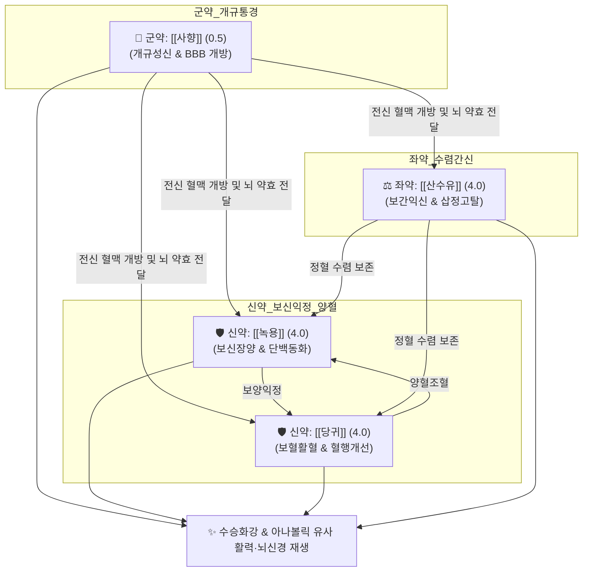

# 🍵 [[공진단]] (拱辰丹, Gongjin-dan)

> **핵심 3줄 요약 (Key Summary)**:
> - 🌿 [[사향]](군약, 개규성신) + [[녹용]](신약, 분골 보양익정) + [[당귀]](신약, 보혈활혈) + [[산수유]](좌약, 보간익신) 4미를 초미세 분말 후 정제 봉밀로 환을 빚어 순금박을 입힌 최고급 온보 환제.
> - 🎯 간신음양(肝腎陰陽) 부족, 골수 허손, 극심한 만성 피로, 뇌신경 쇠약, 기억력 및 집중력 저하, 수험생 피로, 남성 성기능 감퇴, 노인성 기력 쇠약(Frailty), 큰 병이나 수술 후 쇠약. 아나볼릭 스테로이드와 유사한 전신 단백 동화 및 활력 증진 효과를 안전하게 발휘.
> - 🔬 [[무스콘]]의 혈뇌장벽(BBB) 가역적 개방 및 뇌 미세혈류 촉진, 녹용 IGF-1의 골격근 단백 동화 및 조혈 촉진, 해마 시냅스 가소성(BDNF/TrkB) 증대, 항산화 효소(SOD, Catalase) 유도 및 코르티솔·젖산 억제.
> - ⚠️ 주의사항: 사향의 강력한 개규·통경(通經) 작용으로 자궁 평활근 수축을 유발하므로 임산부 절대 복용 금기. 고혈압 실열(實熱) 환자 복용 주의.
---
## 📌 목차
1. [기본 처방 정보 & 군신좌사 구성](#1-기본-처방-정보--군신좌사-구성)
2. [방제학적 약재 상호작용 & 시너지 네트워크](#2-방제학적-약재-상호작용--시너지-네트워크)
3. [현대 분자약리학적 효능 & 작용 기전](#3-현대-분자약리학적-효능--작용-기전)
4. [적응 병증 및 체질별 감별 (Sweet Spot vs 금기)](#4-적응-병증-및-체질별-감별-sweet-spot-vs-금기)
5. [유사 처방군 감별 매트릭스](#5-유사-처방군-감별-매트릭스)
6. [임상 가감례 & 현대 질환별 응용](#6-임상-가감례--현대-질환별-응용)
7. [💡 사용자 진료실 핵심 필기 & 임상 팁 (원문 보존)](#7--사용자-진료실-핵심-필기--임상-팁-원문-보존)
8. [출처 및 학술 참고 문헌 (References)](#8-출처-및-학술-참고-문헌-references)
---
## 1. 기본 처방 정보 & 군신좌사 구성

* **출전**: 원대(元代) 위역림(危亦林) 『[[세의득효방]](世醫得效方)』, 허준 『[[동의보감]](東醫寶鑑)』 잡병편 허로문(虛勞門)
* **치법**: 온신익정(溫腎益精), 자음양혈(滋陰養血), 개규통경(開竅通經), 수승화강(水昇火降)

| 구분 | 약재명 | 표준 배합 분량 | 본초 효능 & 방제 내 역할 |
| :--- | :--- | :--- | :--- |
| **군약 (君藥)** | [[사향]] | 0.5 (약 75~100mg/환) | 개규성신(開竅醒神), 활혈통경(活血通經), 제약의 기운을 전신 혈맥과 뇌로 신속히 인도 |
| **신약 (臣藥)** | [[녹용]] | 4.0 (분골 분말) | 보신장양(補腎壯陽), 익정혈(益精血), 강근골(强筋骨), 조혈 및 단백 동화 촉진 |
| **신약 (臣藥)** | [[당귀]] | 4.0 (미세분말) | 보혈활혈(補血活血), 조경지통(調經止痛), 영혈을 보하고 혈액순환 촉진 |
| **좌약 (佐藥)** | [[산수유]] | 4.0 (미세분말) | 보간익신(補肝益腎), 삽정고탈(澁精固脫), 음정(陰精)의 소모를 수렴·보존 |

> **배오 특징**: 약재를 초미세 분말로 분쇄하여 정제 봉밀로 반죽 후 1환당 3.75g~5g(사향 75~100mg 함유) 크기로 빚고 순금박(金箔)을 입힙니다. 녹용·당귀·산수유의 중후한 자음·보양 약효가 체내에 머물러 울체되지 않도록 방향개규의 제왕인 [[사향]]의 [[무스콘]]이 전신 혈맥과 뇌신경계로 강력히 뚫어냅니다.
---
## 2. 방제학적 약재 상호작용 & 시너지 네트워크

* [[사향]] + [[녹용]] 배오: 녹용의 강력한 온보익정 작용을 사향의 무스콘이 혈뇌장벽(BBB)과 말초 혈관을 열어 심부 조직까지 직달(直達)시킵니다.
* [[녹용]] + [[당귀]] 배오: 녹용(양기)과 당귀(음혈)가 기혈(氣血)을 쌍보하여 골수를 채우고 근골을 튼튼하게 합니다.
* [[당귀]] + [[산수유]] 배오: 당귀의 활혈(소통) 작용과 산수유의 삽정(수렴) 작용이 보하면서도 새지 않고 돌면서도 소모되지 않는 완벽한 평형을 이룹니다.
---
## 3. 현대 분자약리학적 효능 & 작용 기전

### 1) 혈뇌장벽(BBB) 개방 및 신경 재생 (무스콘)
* **BBB 일시적 투과도 조절**: 사향의 [[무스콘]]은 뇌 모세혈관의 밀착연접(Tight junction) 단백질을 일시적·가역적으로 조절하여 유효 약리 성분의 뇌 실질 흡수를 극대화합니다.
* **신경세포 보호 및 BDNF 증가**: 뇌 허혈 및 산화 스트레스 환경에서 해마 뉴런의 손상을 방지하고 신경세포 성장인자(BDNF, NGF) 생성을 유도하여 인지 기능 및 기억력을 개선합니다.

### 2) 단백질 동화 촉진 및 항피로 작용 (천연 아나볼릭)
* **단백 동화 대사 활성화**: 녹용의 IGF-1 및 폴리펩타이드 성분이 골격근 단백질 합성을 촉진하고 근육 분해를 막아 노인성 근감소증(Sarcopenia)을 완화합니다.
* **젖산 제거 및 스트레스 호르몬 완화**: 고강도 피로 실험에서 혈중 젖산과 코르티솔(Cortisol) 수치를 유의하게 낮추고 피로 회복 속도를 현저히 높입니다.

### 3) 심혈관 미세순환 및 면역계 조절
* 혈관 내피세포의 eNOS를 활성화하여 산화질소(NO) 생성을 증가시키고 말초 혈관 저항을 낮추며 NK세포 활성을 증대시킵니다.
---
## 4. 적응 병증 및 체질별 감별 (Sweet Spot vs 금기)

[✅ 최적 적응증 (Sweet Spot)]
• 원전 조문: 《동의보감》 "천원일기(天元一氣)를 굳건히 하여 수(水)를 오르게 하고 화(火)를 내리니 백병이 생기지 않는다."
• 체질 소견: 소음인, 태음인, 소양인 중 선천적 원기가 허약하거나 과로로 골수가 바닥난 체질
• 임상 주치: 
  1. 노인성 쇠약(Frailty), 큰 수술이나 중병 후 기력 회복 (아나볼릭 스테로이드 유사 활력 회복)
  2. 수험생의 극심한 뇌신경 피로, 집중력 감퇴, 만성 피로 증후군
  3. 남성 갱년기 성기능 장애(발기부전, 성욕 감퇴), 기억력 장애 초기
• 설진/맥진: 설담태백(舌淡苔白) 혹은 설홍소태, 맥침세무력(脈沈細無力) 혹은 맥미약(脈微弱)

[⚠️ 신중 투여 및 금기 (Caution / Contraindication)]
• 임산부 절대 금기: 사향의 강력한 자궁 수축 작용으로 유산·조산 위험이 있으므로 절대 투약 금지.
• 고혈압 실열자 및 급성 발열 환자: 혈류가 급격히 증가하여 상열감이나 두통이 유발될 수 있으므로 급성 염증 해소 후 복용.
---
## 5. 유사 처방군 감별 매트릭스

| 처방명 | 핵심 약재 구성 | 주치 및 체질 차이 | 제형 및 복용법 |
| :--- | :--- | :--- | :--- |
| [[공진단]] | 사향, 녹용, 당귀, 산수유 | **간신음양 부족, 급·만성 뇌신경 피로, 노인 쇠약, 아나볼릭 효과** | 금박 환제, 아침 공복 씹어 복용 |
| [[경옥고]] | 생지황, 인삼, 백복령, 봉밀 | 폐신음허, 만성 마른기침, 전신 쇠약, 지속적 영양 수액 효과 | 고제(膏劑), 떠먹거나 스틱 |
| [[녹용대보탕]] | 십전대보탕 + 녹용, 육종용, 부자 등 | 극심한 전신 양허, 하초 냉통, 골다공증, 퇴행성 관절염 | 탕제(湯劑), 따뜻하게 복용 |
| [[쌍화탕]] | 백작약, 숙지황, 황기, 당귀, 육계 등 | 과로 및 방사 후 기혈 손상, 근육 피로, 감기 전구기 | 탕제(湯劑), 따뜻하게 복용 |

---
## 6. 임상 가감례 & 현대 질환별 응용

* **수반 증상별 가감 및 대체 방안**:
  * 사향 수급 곤란 시 $
ightarrow$ [[침향]]공진단(침향으로 대체하여 이기온중 강화) 또는 [[목향]]공진단(목향으로 대체하여 건비리기 강화)
  * 기허(氣虛)가 극심하여 숨이 찬 경우 $
ightarrow$ + [[인삼]] 분말 배오
* **현대 질환별 임상 매핑**:
  * **신경정신계**: 혈관성 치매 초기, 수험생 뇌신경 피로 증후군, 기억력 감퇴, 만성 두통
  * **노인의학/대사계**: 노인 근감소증(Sarcopenia), 노쇠 증후군(Frailty), 남성 갱년기 장애
  * **재활의학**: 뇌졸중(중풍) 회복기 후유증, 수술 후 회복 지연, 운동선수 고강도 훈련 후 피로 회복
---
## 7. 💡 사용자 진료실 핵심 필기 & 임상 팁 (원문 보존)

> [!tip] **진료실 실전 노하우 (User Clinical Insight)**
> ### 📌 구성
> [[녹용]], [[일당귀]], [[산수유]], [[사향]]
> 
> ### 📌 적응증
> - 주로 노인에게 자양강장을 목적으로 활용
> - 아나볼릭 스테로이드와 비슷한 작용을 하며, 상대적으로 안정성이 높기에 환자에 따라 잘 사용할 수 있음.
> - 저용량 스테로이드 약물이 더 싸긴 하겠다만 명품 개념으로 활용하는 것이 중요
> 
> ### 📌 태그
> #노인증

---
## 8. 출처 및 학술 참고 문헌 (References)

1. * **Park JK et al. (2025)**. Traditional herbal medicine Ga-Mi Gongjindan improves muscarinic cholinergic dysfunction through regulation of BDNF/CREB signaling pathway using a scopolamine-induced cognitive impairment of mouse model. *Brain research bulletin*, 233: 111644. [PMID: 41260522](https://pubmed.ncbi.nlm.nih.gov/41260522/)
3. **허준 (1613)**. 『[[동의보감]](東醫寶鑑)』.
   - **[임상 문헌]**: 잡병편 허로문(虛勞門) 공진단 조문 및 수승화강 원리.
