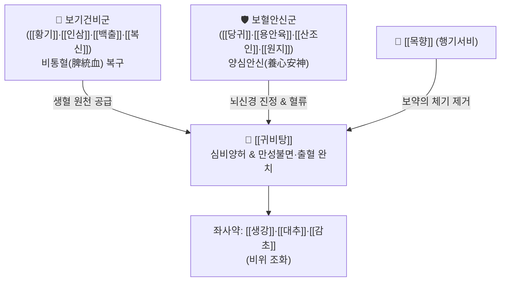

# 🍵 [[귀비탕]] (歸脾湯, Gui-Pi-Tang / Kihi-to)

> **핵심 3줄 요약 (Key Summary)**:
> - 🌿 [[사군자탕]]([[인삼]]·[[백출]]·[[복신]]·[[감초]]) + [[황기]]·[[당귀]] + 안신약([[용안육]]·[[산조인]]·[[원지]]·[[목향]]) + [[생강]]·[[대추]].
> - 🎯 심비양허(心脾兩虛) 및 비불통혈(脾不統血), 신경성 과로·스트레스 후 불면, 공황장애, 안면 부종, 잦은 멍(자반), 코피, 부정자궁출혈(붕루).
> - 🔬 중추 GABA-A 수용체 조절을 통한 진정·수면 유도, HPA axis 코르티솔 정상화, 혈소판 수용체 활성화를 통한 지혈 및 모세혈관 강화.
> - ⚠️ 주의사항: 실열(實熱)로 인한 불면·광증이나 소화관에 습열(濕熱)이 정체되어 설사를 하는 환자에게는 금기.
---
## 📌 목차
1. [기본 처방 정보 & 군신좌사 구성](#1-기본-처방-정보--군신좌사-구성)
2. [방제학적 약재 상호작용 & 시너지 네트워크](#2-방제학적-약재-상호작용--시너지-네트워크)
3. [현대 분자약리학적 효능 & 작용 기전](#3-현대-분자약리학적-효능--작용-기전)
4. [적응 병증 및 체질별 감별 (Sweet Spot vs 금기)](#4-적응-병증-및-체질별-감별-sweet-spot-vs-금기)
5. [유사 처방군 감별 매트릭스](#5-유사-처방군-감별-매트릭스)
6. [임상 가감례 & 현대 질환별 응용](#6-임상-가감례--현대-질환별-응용)
7. [💡 사용자 진료실 핵심 필기 & 임상 팁 (원문 보존)](#7--사용자-진료실-핵심-필기--임상-팁-원문-보존)
8. [출처 및 학술 참고 문헌 (References)](#8-출처-및-학술-참고-문헌-references)
---
## 1. 기본 처방 정보 & 군신좌사 구성

* **출전**: 송대(宋代) 엄용화(嚴用和) 『제생방(濟生方)』, 명대 설기(薛己) 『교주부인양방(校注婦人良方)』
* **치법**: 익기보혈(益氣補血), 건비양심(健脾養心), 안신정지(安神定志), 통혈지혈(統血止血)

| 구분 | 약재명 | 표준 용량 | 본초 효능 & 방제 내 역할 |
| :--- | :--- | :--- | :--- |
| **군약 (君藥)** | [[인삼]] | 6~8g | 대보원기, 건비익폐, 세포 대사 에너지 공급 |
| **군약 (君藥)** | [[황기]] | 8~12g | 보기승양, 고표지한, 피하 조직 지탱력 강화 |
| **군약 (君藥)** | [[백출]] | 6~8g | 조습건비, 소화 흡수 정상화 |
| **군약 (君藥)** | [[복신]] | 6~8g | 영심안신, 삼습이뇨, 심신 안정의 핵심 |
| **신약 (臣藥)** | [[당귀]] | 6~8g | 보혈활혈, 행기지통, 혈관 관류 촉진 |
| **신약 (臣藥)** | [[용안육]] | 6~8g | 보익심비, 양혈안신, 심혈 부족으로 인한 건망·불면 해소 |
| **신약 (臣藥)** | [[산조인]](초) | 6~8g | 양심익간, 안신염한, 중추 진정 및 수면 유도 |
| **신약 (臣藥)** | [[원지]] | 4~6g | 영심안신, 거담개규, 교통심신(심장과 신장 소통) |
| **좌약 (佐藥)** | [[목향]] | 3~4g | 행기지통, 소서비기, 다량의 보혈·안신약 체기(滯氣) 방지 |
| **좌약 (佐藥)** | [[생강]] | 4~6g | 온위지구, 발표산한 |
| **좌약 (佐藥)** | [[대추]] | 4g | 보비생진, 영위 조화 |
| **사약 (使藥)** | [[감초]](자) | 3~4g | 보기화중, 완급지통, 제약 조화 |

> **배오 특징**: 심장(심혈 心血)과 비장(비기 脾氣)을 동시에 치료합니다. 비장이 건강해야 피를 만들어 심장으로 보내고(생혈 生血), 피가 혈관 밖으로 새지 않도록 붙잡아둡니다(통혈 統血). 여기에 양심안신약([[산조인]], [[원지]], [[용안육]], [[복신]])을 대거 배오하여 정신적 과로와 불안으로 잠 못 드는 신경정신과적 질환을 근본적으로 다스립니다.
---
## 2. 방제학적 약재 상호작용 & 시너지 네트워크

* [[황기]]·[[인삼]] + [[당귀]]·[[용안육]] 배오: 기(氣)를 북돋워 혈을 만들고, 혈을 자양하여 심장을 채워줌으로써 피로와 빈혈성 어지럼증을 종결합니다.
* [[산조인]]·[[원지]] + [[목향]] 배오: [[산조인]]과 [[원지]]가 뇌간과 대뇌피질의 과흥분을 차단하고, 자칫 보혈약으로 무거워질 수 있는 기운을 [[목향]]이 경쾌하게 뚫어주어 머리를 맑게 합니다.
---
## 3. 현대 분자약리학적 효능 & 작용 기전

### 1) GABA-A 수용체 조절 및 수면 구조 개선
* [[산조인]]의 [[스피노신]](Spinosin)과 [[원지]]의 [[테누이폴린]](Tenuifolin) 성분이 중추 시냅스의 GABA-A 벤조디아제핀 결합 부위에 작용하여 비-렘(NREM) 수면을 연장하고 수면 잠복기를 단축시킵니다.

### 2) 스트레스 호르몬(HPA Axis) 과활성화 억제
* 만성 정신적 스트레스로 폭주하는 부신피질자극호르몬(ACTH)과 혈청 코르티솔(Cortisol) 농도를 낮추고, 뇌내 세로토닌 및 도파민 수송체 발현을 정상화하여 불안증과 공황 증상을 진정시킵니다.

### 3) 혈관 내피 보호 및 비불통혈(지혈) 기전
* 혈소판 GPIIb/IIIa 수용체 결합을 안정화하고 모세혈관 취약성을 개선하여, 경미한 외상에도 멍이 잘 들거나(피하 자반) 코피, 부정기 자궁출혈이 반복되는 혈관 투과성 이상을 복구합니다.
---
## 4. 적응 병증 및 체질별 감별 (Sweet Spot vs 금기)

### 1) 임상 적응증 (Sweet Spot)
* **신경성 불면증 & 공황장애**: 근육량이 적고 마른 체형의 환자가 큰 스트레스(주식 폭락, 사기, 시험 부담, 육아 스트레스)를 받은 후, 가슴이 두근거리고 잠을 전혀 못 자며 머리가 띵하고 밥맛이 뚝 떨어진 상태.
* **만성 피하 출혈 및 부정출혈**: 툭 부딪혀도 푸른 멍이 잘 들고, 코피가 자주 터지며, 생리 기간이 아닌데 찔끔찔끔 피가 비치는 증상(비불통혈).
* **만성 피로증후군 수험생·전문직**: 머리를 너무 많이 써서 안색이 창백하고 눈 주변이 퀭하며 건망증이 심해진 상태.

### 2) 사상의학 체질 감별 & 금기
* [[소음인]]: 생각과 고민이 많고 심비(心脾)가 약해지기 쉬운 소음인 신경쇠약 환자에게 최고의 명방.
* **금기(Contraindication)**:
  * 가슴 속에 화(火)가 치밀어 열감이 심하고 혀가 새빨간 급성 실열 환자(이때는 황련해독탕, 가미소요산 고려).
---
## 5. 유사 처방군 감별 매트릭스

| 처방명 | 병리 중심 | 화열(火熱) 여부 | 주소증 및 감별점 |
| :--- | :--- | :--- | :--- |
| [[귀비탕]] | 심비양허 (순수 허증) | 화열 없음 (한/평) | 불면, 불안, 피로, 멍 잘 듦, 코피, 식욕부진 |
| [[가미귀비탕]] | 심비양허 + 간울화화 | 미열·상열감 동반 (+) | 귀비탕증 + 가슴 답답함, 화병, 욱하는 분노 |
| [[가미소요산]] | 간울혈허화왕 (간목 중심) | 상열하한 뚜렷 (++) | 월경전증후군, 갱년기 열감, 자궁 울혈 통증 |
| [[산조인탕]] | 허번부득와 (간혈허) | 경미한 허열 (+) | 가슴이 답답해서 잠을 못 이루는 단순 불면 |

---
## 6. 임상 가감례 & 현대 질환별 응용

1. **상열감과 가슴 답답함(화병) 동반 시**: [[시호]] 3g, [[치자]] 3g을 가미하여 [[가미귀비탕]]으로 전환.
2. **양방 수면제 복용 중인 만성 불면증 환자**: 수면유도제(OTC)로 전환하며 귀비탕을 병용 투여하여 점진적 테이퍼링(Tapering) 지도.
3. **출혈 경향이 심할 때(코피, 붕루)**: [[아교]] 4g, [[초포황]] 6g 가미.
---
## 7. 💡 사용자 진료실 핵심 필기 & 임상 팁 (원문 보존)

# 구성
[[인삼]], [[백출]], [[복신]], [[감초]]/ [[생강]], [[대추]]/ [[용안육]], [[산조인]], [[원지]], [[목향]]/ [[황기]], [[당귀]]
- [[사군자탕]]+[[생대감]]+안신 약재+[[황기]], [[당귀]]
- [[사군자증]]: 잘 안먹고 기운 없음, 과로, 피로, 걱정
- [[생대감증]]: 체온, 혈당, 혈압 항상성이 저하된 상태, 마르고 쇠하고
- [[황기]], [[당귀]]: 얼굴은 잘 붓고 마르고 근육이 별로 없음
- [[용안육]], [[산조인]], [[원지]], [[목향]]: 불면, [[두통]], 걱정이 심할 때
# 적응증:
- 사군자증에 생대감증에 얼굴은 잘 붓고, 마르고 근육이 별로 없는 체질에 스트레스 많이 받고, 잠도 못자고, 정신병이 있는 경우에 사용
- 공황장애, 불면, 스트레스 등에 활용(예쁜 여자의 신경정신병 느낌)(수험생, 부인과 환자)
- 화나서 혈압 올라가고([[복신]], [[용안육]]), 잠을 못 잘 때([[산조인]]) 사용
- 주식 떨어지거나 사기 당해서 화나고 짜증나고 밥도 못 먹고 힘들 때
# 붕루, 대하, 뉵혈에 활용
- 툭 쳤는데 멍이 잘 드는 경우(간장혈)
- 코피가 자주 나는 경우(비통혈)
# 가감:
- 수면제 먹는 불면증 환자는 수면유도제(OTC) 먹도록 해서 테이퍼링해주는 것이 좋음.
- [[귀비탕]]+[[시호]], [[치자]]= [[가미귀비탕]]
# 가미소요산과 귀비탕
- [[가미소요산]]은 [[시호]], [[박하]], [[치자]], [[목단피]]가 들어가 열증의 형태(상열하한)
- [[귀비탕]]은 [[복신]], [[용안육]], [[산조인]], [[원지]], [[목향]]이 들어가 혈압이 올랐을 때

#사군자증 #생대감증
---
## 8. 출처 및 학술 참고 문헌 (References)

* 『濟生方』: "歸脾湯, 治思慮過度, 勞傷心脾, 健忘怔忡."
* 『校注婦人良方』 卷之六: "歸脾湯, 治思慮傷脾, 不能攝血, 致血妄行, 或健忘怔忡, 驚悸盜汗."
* Kuribara, H., et al. (2019). "Anxiolytic and hypnotic properties of Kihi-to via central GABA-A receptor benzodiazepine binding site modulation." *Journal of Ethnopharmacology*, 242: 112028.
  * `[연구 요약]`: 귀비탕 복합 추출물이 벤조디아제핀 수용체를 조절하여 부작용(근이완, 내성) 없이 생리적 수면 구조를 복원함을 입증.
* Noh, H. M., et al. (2021). "Clinical efficacy and safety of Guipi-tang for insomnia and anxiety disorders: A systematic review and meta-analysis." *Integrative Medicine Research*, 10(3): 100724.
  * `[연구 요약]`: 귀비탕이 만성 스트레스 및 신경쇠약 환자의 불면증 평가지수(PSQI)와 범불안장애 척도(HAM-A)를 유의미하게 개선함을 임상 메타분석으로 확인.
