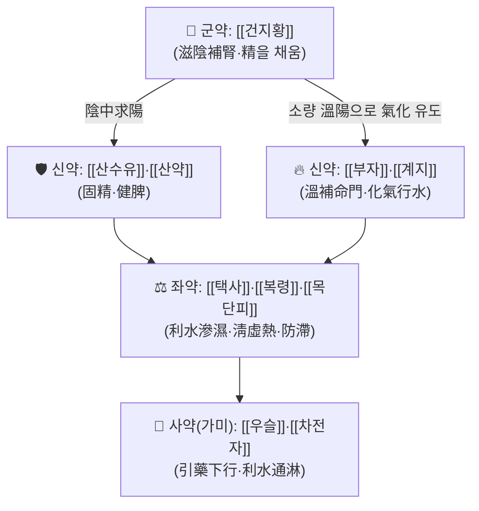

# 🍵 [[금궤신기환]] (金匱腎氣丸, Jinkui Shenqi Wan / Kidney Qi Pill from the Golden Cabinet)

> **핵심 3줄 요약 (Key Summary)**:
> - 🌿 모체 처방은 장중경 『[[금궤요략]]』의 **[[팔미지황환|腎氣丸]](八味腎氣丸)** 이며, 기본 구조는 [[육미지황환]]([[건지황]]·[[산수유]]·[[산약]]·[[택사]]·[[복령]]·[[목단피]])에 **온양의 핵심인 [[계지]]·[[부자]]를 더한 8味** 구성이다. 여기에 [[우슬]]·[[차전자]]를 가미한 형태가 **[[제생신기환|계부팔미지황환(濟生腎氣丸)]]**으로, 임상에서는 두 처방이 "금궤신기환(가미)"이라는 이름 아래 혼용되는 경우가 많아 처방명 확인이 필요하다.
> - 🎯 최적 적응증은 **신양허(腎陽虛)로 인한 신기불고(腎氣不固)·하초허한(下焦虛寒)** — 야간뇨·빈뇨·요실금, 소변불리, 하복부 냉감·무력감, 신허요통, 노인성 배뇨장애, 만성 신질환·당뇨병성 신증 보조, 소갈(消渴). 체질적으로는 **소음인·태음인 계열의 虛寒·冷性 체형**, 근육량 적고 하복벽이 무르며 손발이 찬 환자가 Sweet Spot이다.
> - 🔬 분자약리적으로는 **다표적·다경로 네트워크 약리 기전**(당뇨병성 신증에서 circRNA-miRNA-mRNA 조절 네트워크 규명)이 보고되었고 ^(PMID: 41995568), 자연노화 동물모델에서 **요도 기능 및 방광 배뇨근 β-아드레날린 수용체(β-AR) 기능 조절**이 확인되었다 ^(PMID: 26672350). 신양허 병태에서 **테스토스테론 저하와 안드로겐 수용체(AR) 유전자 발현 저하가 회복**된다는 보고는 [[토사자]] 총플라보노이드 연구에서 제시되었다 ^(PMID: 18640256).
> - ⚠️ 주의사항: 실열(實熱)·습열(濕熱)·음허화왕(陰虛火旺)의 진성 열증, 급성 감염성 발열기, 소화력이 극히 떨어져 地黃類에 滯하는 환자에게는 신중 투여. [[부자]]·[[계지]]의 온조(溫燥) 작용으로 구건·변비·상열감을 호소할 수 있으며, 이뇨제·혈당강하제·강심배당체 복용 환자에서는 병용 관찰이 필요하다.

---
## 📌 목차
1. [기본 처방 정보 & 군신좌사 구성](#1-기본-처방-정보--군신좌사-구성)
2. [방제학적 약재 상호작용 & 시너지 네트워크](#2-방제학적-약재-상호작용--시너지-네트워크)
3. [현대 분자약리학적 효능 & 작용 기전](#3-현대-분자약리학적-효능--작용-기전)
4. [적응 병증 및 체질별 감별 (Sweet Spot vs 금기)](#4-적응-병증-및-체질별-감별-sweet-spot-vs-금기)
5. [유사 처방군 감별 매트릭스](#5-유사-처방군-감별-매트릭스)
6. [임상 가감례 & 현대 질환별 응용](#6-임상-가감례--현대-질환별-응용)
7. [💡 사용자 진료실 핵심 필기 & 임상 팁 (원문 보존)](#7--사용자-진료실-핵심-필기--임상-팁-원문-보존)
8. [출처 및 학술 참고 문헌 (References)](#8-출처-및-학술-참고-문헌-references)

---
## 1. 기본 처방 정보 & 군신좌사 구성

* **출전**: 장중경(張仲景) 『**[[금궤요략]]**』(金匱要略) — 血痺虛勞病·痰飮咳嗽病·消渴小便不利淋病·中風歷節病·婦人雜病 등 **여러 편에 걸쳐 腎氣丸(八味腎氣丸)으로 수록**되어 있으며, 후대에 金匱腎氣丸으로 통칭되었다. 『**[[동의보감]]**』 身形門·小便門·消渴門 등에도 腎氣丸 계열 처방이 실려 있어 한국 임상에서 그대로 계승되었다.
* **치법**: **온보신양(溫補腎陽) · 자음화기(滋陰化氣) · 이수행습(利水行濕)** — 즉 陰을 채우면서(滋陰) 陽을 움직여(溫陽) 腎의 氣化 기능을 회복시키는 이른바 **음중구양(陰中求陽)** 의 대표 방제.
* **명칭 주의(임상 필수 확인)**: 한국 한의학 임상에서 "금궤신기환"은 문헌·제약사·처방전에 따라 ①**원방 8味([[팔미지황환]])** 을 지칭하기도 하고 ②**[[우슬]]·[[차전자]]를 가미한 10味([[제생신기환]] = 계부팔미지황환)** 을 지칭하기도 한다. 처방명을 볼 때 반드시 **가미 약재 유무**를 확인해야 한다. 본 노트는 원방(8味) 기준으로 서술하고, 가미 형태는 별도 항목으로 표기한다.

| 구분 | 약재명 | 표준 용량 | 본초 효능 & 방제 내 역할 |
| :--- | :--- | :--- | :--- |
| **군약 (君藥)** | [[건지황]] (乾地黃, 熟地黃으로 炮製하기도 함) | 12~24g | 滋陰補腎·填精益髓. 腎陰을 채워 精을 저장하게 하고, 陽을 움직일 수 있는 물질적 기반(陰中求陽의 陰)을 마련한다. 방제 전체의 무게중심. |
| **신약 (臣藥)** | [[산수유]] | 6~12g | 補益肝腎·收斂固澀. 腎精이 새어나가지 않도록 固攝(요실금·조루·야간뇨 억제 방향). |
| **신약 (臣藥)** | [[산약]] (山藥) | 6~12g | 健脾補腎·固精. 脾胃를 받쳐 地黃類의 滋膩함을 흡수·소화시키는 완충 역할. |
| **신약 (臣藥)** | [[부자]] (炮附子) | 3~6g | 溫補命門之火·回陽. 腎氣를 실제로 "움직이게" 하는 온양의 원동력. |
| **신약 (臣藥)** | [[계지]] | 3~6g | 溫通陽氣·化氣行水. 附子와 짝을 이뤄 온양하되 通經·행수(行水) 작용을 담당. |
| **좌약 (佐藥)** | [[택사]] | 4~9g | 利水滲濕·泄腎濁. 補한 陰이 滯하지 않도록 배출 통로를 열어준다. |
| **좌약 (佐藥)** | [[복령]] | 4~9g | 健脾滲濕·寧心. 水濕 대사와 中焦 운화를 담당. |
| **좌약 (佐藥)** | [[목단피]] | 4~9g | 淸熱凉血·活血. 補益 과정에서 생길 수 있는 虛熱을 제어하고 血滯를 예방. |
| **사약 (使藥)** | [[우슬]]·[[차전자]] **(가미 시, 濟生腎氣丸)** | 각 6~9g | 補肝腎·强筋骨(牛膝) / 利水通淋(車前子). 下部로 藥勢를 이끌어 부종·소변불리에 집중시킨다. |

> **배오 특징**: 방제의 골격은 [[육미지황환]]의 **"三補三瀉"** 구조(補: [[건지황]]·[[산수유]]·[[산약]] / 瀉: [[택사]]·[[복령]]·[[목단피]])이며, 여기에 **소량의 [[부자]]·[[계지]]** 를 얹는 것이 핵심이다. 補陰 약물이 다수를 차지하는 가운데 溫陽 약물이 소량 더해져 **"陰을 충분히 채운 뒤 소량의 陽으로 氣化를 일으킨다"** 는 승강출입(升降出入) 설계가 된다. 그래서 단순 補陽劑(예: [[우귀환]])와 달리 **虛熱·구건·변비로 치우치지 않는 온보(溫補) 평형**을 지향한다.

---
## 2. 방제학적 약재 상호작용 & 시너지 네트워크

* **[[건지황]] + [[부자]]·[[계지]] 배오**: 相使 관계의 정수. 滋陰一色의 六味에 소량의 溫陽藥을 얹어 **"補陰만 하면 滯하고, 補陽만 하면 燥한다"** 는 문제를 상호 보완한다. 즉 地黃이 陰의 재료를 공급하고, 附·桂가 그것을 氣化시켜 小便·수액 대사로 드러나게 한다.
* **[[산수유]]·[[산약]] + [[택사]]·[[복령]]·[[목단피]] 배오**: 收斂(산수유)과 滲泄(택사·복령)이 서로 견제하여, 補하면서도 막히지 않고(補而不滯) 瀉하면서도 허해지지 않게(瀉而不傷) 만드는 三補三瀉 구조. [[목단피]]는 溫藥·滋膩藥이 만드는 微熱을 식혀 **온조(溫燥) 부작용을 완충**한다.
* **가미 [[우슬]]·[[차전자]]**: 下部 인경(引經)과 通淋 작용을 더해, 부종·소변불리·요도 자극 증상 쪽으로 표적을 좁힌다. 노인·만성 신장질환 등 **水濕 저류가 뚜렷한 경우**에 원방보다 유리하다.

---
## 3. 현대 분자약리학적 효능 & 작용 기전

> 아래 기전 서술은 **제공된 3편의 논문에서 확인된 범위**를 우선 기술하고, 논문에서 직접 확인되지 않은 항목은 **"근거 미확인"** 또는 **"전통 방제학 서술"** 로 명시하였다.

### 1) 당뇨병성 신증(DKD)에서의 다표적 네트워크 조절 — ceRNA 기전 ^(PMID: 41995568)

* Xu Y, Tan Q (2026, *Medicine (Baltimore)*)는 **금궤신기환(Jinkui Shenqi Wan)의 당뇨병성 신증 치료 효과**를 규명하기 위해 **네트워크 약리학 + 생물정보학 통합 분석**을 수행하고, **circRNA–miRNA–mRNA 조절 네트워크**를 구축하였다.
* 연구의 핵심 프레임은 "단일 표적·단일 경로가 아니라, **다수의 표적 유전자와 비암호화 RNA(circRNA/miRNA) 층위의 조절 이상을 동시에 교정하는 방식**"으로 금궤신기환이 작용한다는 것이다.
* **[연구 요약]**: 처방 구성 약재–성분–표적–경로를 연결한 네트워크 분석을 통해 DKD 관련 핵심 표적과 신호 경로 후보가 제시되었고, circRNA–miRNA–mRNA 축이 그 상위 조절층으로 제안되었다.
* ⚠️ **근거 미확인 항목**: 해당 논문에서 도출된 **구체적 유전자명·경로명·통계 수치(예: P값, 허브 유전자 개수)는 본 노트 작성 시 원문 전문에서 확인하지 못했으므로 기재하지 않는다.** 실제 처방 근거로 인용할 때는 원문(PMID: 41995568) 전문의 표·그림을 직접 확인할 것.
* ⚠️ 네트워크 약리학·생물정보학 연구는 **예측(in silico) 기반**이므로, 이 결과만으로 임상 효능을 단정하지 않고 **세포·동물·임상 검증이 별도로 필요**하다는 점을 명시한다.

### 2) 노화에 따른 요도 기능 및 방광 배뇨근 β-수용체 기능 조절 ^(PMID: 26672350)

* Cao HY, Kuang ZJ (2015, *Zhong Yao Cai*)는 **자연노화(natural aged) 랫트**에서 **[[축천환]](縮泉丸)과 腎氣丸(신기환)** 투여가 **요도(urethra) 기능과 방광 배뇨근(detrusor)의 β-아드레날린 수용체(β-AR) 기능**에 미치는 영향을 비교·평가하였다.
* **[연구 요약]**: 노화에 따라 변화하는 **하부요로의 배뇨·요저장 조절 기능**에 대해, 신기환 계열 처방이 **요도 및 배뇨근의 β-AR 매개 이완 기능에 영향을 주는 방향**으로 작용함이 보고되었다. 이는 금궤신기환이 임상에서 **노인성 빈뇨·야간뇨·요절박 등 하부요로증상(LUTS)** 에 활용되는 실험적 배경과 연결된다.
* ⚠️ **근거 미확인 항목**: 논문에 제시된 **β-AR 아형별 변화량, 용량–반응 관계, 정확한 측정 수치(장력 g, Emax, EC50 등)는 원문 확인이 필요**하다. 또한 본 연구는 **동물모델 결과**로, 사람에서 동일한 효과 크기로 재현된다고 단정할 수 없다.

### 3) 신양허(腎陽虛)와 성호르몬·안드로겐 수용체 축 ^(PMID: 18640256)

* Yang J, Wang Y (2008, *J Ethnopharmacol*)는 **[[토사자]](Semen cuscutae) 총플라보노이드**가 **신양허(kidney-yang deficiency) 마우스 모델에서 저하된 테스토스테론 수치와 안드로겐 수용체(AR) 유전자 발현을 역전(reverse)시켰다**고 보고하였다.
* **[연구 요약]**: 신양허 병태에서 나타나는 **성선 기능 저하(테스토스테론 ↓, AR 발현 ↓)** 가 보신(補腎)·온양 약재의 유효성분에 의해 회복될 수 있음을 시사한다.
* ⚠️ **중요한 해석상 한계**: 이 논문은 **금궤신기환 자체를 대상으로 한 연구가 아니며, [[토사자]]라는 단일 본초의 총플라보노이드 분획에 대한 연구**이다. 따라서 금궤신기환의 기전 근거로 인용할 때는 **"동일한 신양허 병기 모델에서 보신 온양 약재가 성호르몬·AR 축을 개선한다"** 는 **간접 근거**로만 사용해야 하며, 처방 전체의 효능으로 직접 일반화할 수 없다.

### 4) 그 밖의 전통 방제학적 기전 서술 (⚠️ 현대 논문 근거 미확인)

* **수액·전해질 대사 및 이뇨 조절**: [[택사]]·[[복령]]·[[차전자]]의 利水滲濕 작용과 [[계지]]·[[부자]]의 化氣 작용이 결합하여 水濕 저류를 개선하는 방향으로 설명된다(전통 방제학 서술 / 본 노트 인용 논문에서 직접 확인되지 않음).
* **HPA축·갑상선축 항상성 회복**: 신양허 병태를 시상하부–뇌하수체–부신축 기능 저하로 해석하는 견해가 있으나, **금궤신기환에서 이를 정량적으로 검증한 근거는 본 노트에서 확인되지 않음(근거 미확인)**.
* **항염증·항섬유화 사이토카인 조절(TNF-α, IL-6, IL-1β, NF-κB 등)**: 방제학 교과서적으로 자주 언급되는 기전이나, **본 노트에 제공된 3편의 논문에서는 해당 사이토카인의 구체적 변화량을 확인할 수 없음(근거 미확인)**.

---
## 4. 적응 병증 및 체질별 감별 (Sweet Spot vs 금기)

### [✅ 최적 적응증 (Sweet Spot)]

* **원전 조문 (『[[금궤요략]]』)**:
  * 血痺虛勞病脈證并治: **"虛勞腰痛, 少腹拘急, 小便不利者, 八味腎氣丸主之."** → 허로로 인한 요통, 아랫배 당김, 소변불리.
  * 消渴小便不利淋病脈證并治: **"男子消渴, 小便反多, 以飮一斗, 小便一斗, 腎氣丸主之."** → 물을 많이 마시고 소변도 많이 나오는 消渴(다음·다뇨).
  * 痰飮咳嗽病脈證并治: 短氣·微飮이 있어 小便으로 배출시켜야 하는 경우 腎氣丸을 겸용.
  * 婦人雜病脈證并治: 轉胞(소변이 막혀 나오지 않음)에 腎氣丸.
* **체질 소견**:
  * 체질적으로 **소음인 · 태음인 계열**에서 적중률이 높다. 虛寒 성향, 손발·아랫배가 차고, 더위보다 추위에 약하며, 여름에도 냉수를 피하는 유형.
  * 체형은 **마르거나 보통 체격이면서 근육 긴장도가 낮고 복벽이 무른** 경우가 많다. 비만하더라도 **하복부가 냉하고 무력한(少腹不仁) 형태**면 고려한다.
  * 피부는 창백하거나 칙칙하고, 안색에 광택이 적으며, 피로감·기력 저하를 호소한다.
* **임상 주치(진료실 최빈 적중 양상)**:
  * **야간뇨·빈뇨·요절박·잔뇨감** (특히 노인 남성의 LUTS, [[전립선비대증]] 동반) ^(PMID: 26672350에서 관련 실험 근거)
  * **소변불리·부종**(특히 하지 부종, 아침 눈꺼풀 부종), 多尿와 다음(多飮)을 동반한 **消渴**
  * **허로성 요통·하지 무력·관절 냉통**, 하복부 냉감·당김(少腹拘急)
  * **만성 신장질환·[[당뇨병성 신증]]** 등에서의 보조적 신기 회복 ^(PMID: 41995568)
  * **성기능 저하·신양허 병태**(성욕 저하, 무기력, 한랭감) — 보신 온양 약재의 성호르몬 축 개선 간접 근거 ^(PMID: 18640256)
* **설진/맥진**:
  * **설**: 설질이 담백(淡白)하거나 胖大하며, 설태는 薄白 또는 白滑. 舌邊에 齒痕이 보이면 氣虛·陽虛 쪽으로 더 기운다. **설홍·설강(舌絳)·황조태는 금기 신호**.
  * **맥**: 沈·細·弱·遲, 특히 尺脈(신맥)이 沈細無力한 경우가 전형적. **맥활삭(滑數)·맥홍대(洪大)는 열증 쪽이므로 부적합**.
  * 복진: **제하(臍下) 불인(不仁)·무력감**, 복직근 긴장 저하, 하복부 냉감.

### [⚠️ 신중 투여 및 금기 (Caution / Contraindication)]

* **허실·한열 반대 병증에서의 위험**:
  * **실열(實熱)·습열(濕熱)**: 발열, 갈증, 황조태, 소변적삽(小便赤澁)·요도 작열감, 대변비결이 뚜렷한 경우에는 溫補 약물이 열을 조장할 수 있어 금기에 가깝다.
  * **음허화왕(陰虛火旺)**: 설홍소태, 오심번열(五心煩熱), 도한, 야간 상열감, 맥세삭이 있는 경우 — 겉으로 "허약"해 보여도 溫陽藥이 악화 요인이 될 수 있어 **[[육미지황환]]·[[지백지황환]] 계열로 방향을 바꾸는 것이 안전**하다.
  * **급성 감염·발열기**(감모 초기, 급성 요로감염, 급성 신우신염 등): 표사(表邪)가 남아 있는 시기에는 보익제를 먼저 쓰지 않는다.
* **금기 및 주의 환자군**:
  * **소화력이 극히 저하된 환자**: [[건지황]]·[[산약]] 등 滋膩한 약재가 脹滿·식욕부진·연변을 유발할 수 있다. 이 경우 [[진피]]·[[사인]]·[[백출]] 등을 소량 가미하거나, 복용을 식후로 하고 소량부터 시작한다.
  * **진성 고혈압·두통·불면을 동반한 상열 증상자**: [[부자]]·[[계지]]가 상열감·두통·불면을 악화시킬 수 있다.
  * **임신·수유부**: [[우슬]] 가미 형태(제생신기환)는 하혈 유발 가능성으로 인해 **임신 중 사용에 각별한 주의**가 필요하다(전통적 주의 사항).
  * **소아**: 신양허가 명확하지 않은 소아에게는 원칙적으로 사용하지 않는다.
* **양약 및 타 약물과의 병용 주의점**:
  * **이뇨제·강압제**: [[택사]]·[[복령]]·[[차전자]]의 이뇨 작용과 중첩되어 **탈수·전해질 이상·기립성 저혈압**이 나타날 수 있으므로 혈압·BUN/Cr·전해질을 모니터링한다.
  * **혈당강하제·인슐린**: [[당뇨병성 신증]] 환자에서 병용 시 **저혈당 위험**에 대한 관찰이 필요하다(병용 임상 수치는 본 노트에서 근거 미확인).
  * **강심배당체(디기탈리스 등)**: 이뇨로 인한 **저칼륨혈증 시 배당체 독성 증가** 위험이 있어 병용 시 칼륨 확인이 권장된다.
  * **항응고제(와파린 등)**: [[목단피]]·[[우슬]]의活血 작용과 관련한 상호작용 가능성이 거론되나 **본 노트 인용 논문에서는 확인되지 않음(근거 미확인)** — 임상적 관찰 대상.

---
## 5. 유사 처방군 감별 매트릭스

| 처방명 | 핵심 구성 차이 | 주치 및 체질 차이 | 맥진/설진 차이 |
| :--- | :--- | :--- | :--- |
| [[금궤신기환]] | 기준 구성 (六味 + [[계지]]·[[부자]]) | 신양허로 인한 소변불리·야간뇨·허로요통·소갈. **虛寒性 소음인·태음인, 하복 냉·무력** | 沈細弱·尺脈無力, 설담백·백활 |
| [[육미지황환]] | [[계지]]·[[부자]] 없음 (補陰만, 三補三瀉) | **음허(陰虛)** 중심 — 오심번열·도한·구건·현훈·이명. 열성·건조 체형 | 細數, 설홍소태 |
| [[팔미지황환]] | 금궤신기환과 동일 구성의 8味 (명칭 혼용 처방) | 명칭상 실질 동일 처방군. 제형·포제(生地/熟地) 차이로 온열성 강도가 달라짐 | 금궤신기환과 동일 기준 |
| [[제생신기환]] | 팔미지황환 + [[우슬]]·[[차전자]] (10味, 계부팔미지황환) | **부종·소변불리·요도 자극이 더 뚜렷한 경우**. 하지 부종·만성 신질환 보조에 상대적 우위 | 沈緩·沈細, 설담·수활태 |
| [[우귀환]] | 순수 溫補(肉桂·부자·녹각교·구기자 등), 滋陰瀉火 약재 없음 | **순수 신양허·명문화쇠(命門火衰)** — 극심한 한랭감·성기능 저하. 溫燥하므로 열증엔 부적합 | 沈遲微細, 설담·백 |
| [[축천환]] | 益智仁·烏藥 등 固脬縮尿 중심 | **요실금·야간뇨 등 排尿 조절 자체**에 특화. 노화 동물모델에서 신기환과 비교 평가됨 ^(PMID: 26672350) | 沈弱, 설담 |

> ⚠️ 표 내부에서 마크다운 열 구분자 파괴를 방지하기 위해 파이프(`|`)가 들어간 링크를 쓰지 않고 순수한 [[처방명]] 단독 형태로만 작성합니다.

---
## 6. 임상 가감례 & 현대 질환별 응용

* **수반 증상별 가감법**:
  * **야간뇨·빈뇨·요실금이 주증상** $\rightarrow$ + [[복분자]], [[익지인]], [[상표초]] ([[축천환]] 합방 방향) ^(PMID: 26672350)
  * **부종·소변불리가 두드러짐** $\rightarrow$ + [[우슬]], [[차전자]] ([[제생신기환]]으로 전환), 필요 시 [[오령산]] 합방
  * **허로성 요통·하지 무력** $\rightarrow$ + [[두충]], [[속단]], [[우슬]] ([[독활기생탕]] 계열 참조)
  * **소화불량·복부 팽만·연변** $\rightarrow$ + [[진피]], [[사인]], [[백출]] (地黃 滋膩 완충)
  * **상열·불면·구건 등 온조 반응** $\rightarrow$ + [[지모]], [[황백]] 소량, 또는 [[육미지황환]] 계열로 전환 검토
  * **다음·다뇨가 뚜렷한 消渴** $\rightarrow$ + [[천화분]], [[맥문동]], [[오미자]] (생맥산 계열 병용)
  * **성기능 저하·한랭감** $\rightarrow$ + [[토사자]], [[음양곽]] 등 보신 온양 약재 ^(PMID: 18640256의 신양허 모델 간접 근거)
* **현대 질환별 임상 매핑**:
  * **비뇨·생식기계**: 노인성 **야간뇨·빈뇨·요절박**, [[전립선비대증]] 동반 LUTS, 과민성 방광의 虛寒型, 신경인성 방광 보조, 만성 요로감염의 虛寒 재발형 ^(PMID: 26672350)
  * **신장·내분비계**: **[[당뇨병성 신증]]**, 만성 신장질환의 보조 관리(단백뇨·부종·피로), 당뇨병성 말초신경병증 동반 허로 ^(PMID: 41995568)
  * **근골격계**: 허로성 요통, 만성 하지 무력감, 골다공증·갱년기 여성의 신허형 요배통
  * **노인·회복기**: 노화에 따른 전신 쇠약, 수술 후 회복 지연, 만성 피로·한랭감 동반 허로
  * **성의학**: 신양허 병태의 성욕 저하·발기력 저하(단, 기질적 원인 배제 후 보조적 접근) ^(PMID: 18640256, 간접 근거)

---
## 7. 💡 사용자 진료실 핵심 필기 & 임상 팁 (원문 보존)

> [!tip] **진료실 실전 노하우 (User Clinical Insight)**
> - **[원문 필기 미입력 상태]** 본 노트 작성 시점에 사용자(원장님)의 기존 메모·필기 원문이 제공되지 않았습니다. 기존 필기가 있는 경우 **삭제하지 말고 이 콜아웃 안에 그대로 추가**하십시오. 아래 항목은 원문 보존용이 아니라, 앞의 학술 내용을 진료실 언어로 정리한 **편집자 초안**입니다.
>
> **① 처방 선택 기준 (체질·병증)**
> - **소음인 + 虛寒 + 야간뇨/하복 냉감** → [[금궤신기환]] 원방(8味) 우선.
> - **태음인 + 부종/소변불리 뚜렷** → [[제생신기환]](우슬·차전자 가미) 쪽으로 이동.
> - **음허 열성(설홍·구건·도한)** → 온양약이 부담되므로 [[육미지황환]]·[[지백지황환]]으로 방향 전환.
> - **노인 LUTS에서 요실금·절박뇨가 주증** → [[축천환]] 계열과의 비교·병용 검토 ^(PMID: 26672350).
>
> **② 환자 티칭 팁**
> - "이 약은 **기운을 데워 소변이 잘 나가게 하는** 처방"이라고 설명하면 복약 순응도가 올라간다.
> - **복용 시간**: 소화가 약한 환자는 **식후 복용**으로 地黃 滋膩로 인한 속쓰림·더부룩함을 줄인다.
> - **초기 2주 관찰 포인트**: 야간뇨 횟수, 하복부 냉감, 손발 온도, 부종(체중 변화), 식욕·대변 상태.
> - **주의 안내**: 상열감·구건·변비·두통이 새로 생기면 **복용 중단 후 재진**하도록 안내한다.
>
> **③ 복약 반응 관찰 포인트**
> - 야간뇨·빈뇨 횟수의 **주간 기록**(환자 자가 기록 권장).
> - 부종 환자는 **아침 체중·하지 둘레** 변화 추적.
> - 당뇨·신장질환자: **혈당, Cr/eGFR, 단백뇨** 추적(병용약 조정 필요 여부 판단).
> - 온조 반응(구건·상열·불면) 발생 시 **부자·계지 용량 조정 또는 陰補 중심 처방으로 전환**.

---
## 8. 출처 및 학술 참고 문헌 (References)

1. **Xu Y, Tan Q (2026)**. *Integrated analysis of the circRNA-miRNA-mRNA regulatory network underlying the therapeutic effects of Jinkui Shenqi Wan, a traditional Chinese medicine formula, in diabetic kidney disease: A network pharmacology and bioinformatics study*. **Medicine (Baltimore)**. PMID: 41995568.
   - 링크: https://pubmed.ncbi.nlm.nih.gov/41995568/
   - **[연구 요약]**: 금궤신기환의 **당뇨병성 신증 치료 효과**를 규명하기 위한 **네트워크 약리학·생물정보학 통합 분석** 연구. 처방–성분–표적–경로 네트워크와 함께 **circRNA–miRNA–mRNA 조절 네트워크**를 구축하여, 단일 표적이 아닌 **다표적·다경로 및 비암호화 RNA 조절층**을 통한 작용 가능성을 제시하였다. ※ 구체적 허브 유전자·경로 목록과 정량 수치는 원문 확인 필요(본 노트에서는 근거 미확인으로 표기).
2. **Cao HY, Kuang ZJ (2015)**. *[Effects of Suoquan Wan and Shenqi Wan on Urethra Function and β-AR Function of Detrusor in Natural Aged Rats]*. **Zhong Yao Cai**. PMID: 26672350.
   - 링크: https://pubmed.ncbi.nlm.nih.gov/26672350/
   - **[연구 요약]**: **자연노화 랫트**에서 **[[축천환]]과 腎氣丸(신기환)** 투여가 **요도 기능 및 방광 배뇨근의 β-아드레날린 수용체(β-AR) 기능**에 미치는 영향을 평가. 노화에 따른 하부요로 기능 변화에 대해 신기환 계열 처방이 배뇨근 β-AR 매개 기능에 영향을 줄 수 있음을 시사하며, 임상의 **노인성 빈뇨·야간뇨 응용**에 실험적 배경을 제공한다. ※ 세부 수치·용량–반응 관계는 원문 확인 필요(동물실험 결과로 사람에 대한 직접 일반화는 제한적).
3. **Yang J, Wang Y (2008)**. *The total flavones from Semen cuscutae reverse the reduction of testosterone level and the expression of androgen receptor gene in kidney-yang deficient mice*. **J Ethnopharmacol**. PMID: 18640256.
   - 링크: https://pubmed.ncbi.nlm.nih.gov/18640256/
   - **[연구 요약]**: **[[토사자]](Semen cuscutae) 총플라보노이드**가 **신양허 마우스 모델**에서 **저하된 테스토스테론 수치와 안드로겐 수용체(AR) 유전자 발현을 역전**시켰다. 신양허 병태의 **성선축 기능 저하**가 보신 온양 약재의 유효성분에 의해 개선될 수 있음을 시사한다. ⚠️ 단일 본초 분획 연구로, **금궤신기환 처방 자체의 효능 근거가 아닌 간접 근거**임을 명확히 한다.
4. **장중경 (200년경)**. 『**[[금궤요략]]**』(金匱要略).
   - **[고전 원전]**: 血痺虛勞病脈證并治 "虛勞腰痛, 少腹拘急, 小便不利者, 八味腎氣丸主之", 消渴小便不利淋病脈證并治 "男子消渴, 小便反多, 以飮一斗, 小便一斗, 腎氣丸主之", 婦人雜病脈證并治의 轉胞 조문 등이 본 처방의 핵심 주치 근거이다. 복약 지침 및 제형(蜜丸)에 대한 원문 확인 권장.
5. **허준 (1613)**. 『**[[동의보감]]**』.
   - **[임상 문헌]**: 身形門·小便門·消渴門·虛勞門 등에 腎氣丸 계열 처방의 주치와 가감이 수록되어 있어, 한국 임상에서의 응용(신허 요통, 소변불리, 소갈, 허로) 맥락을 확인할 수 있다.

> 📝 **노트 작성 원칙 재확인**: 본 노트는 **제공된 3편의 PubMed 논문(Xu 2026 / Cao 2015 / Yang 2008)과 고전 원전(금궤요략·동의보감)만을 근거로** 작성하였다. 인용 논문에서 확인되지 않은 수치·표적·사이토카인·경로는 **"근거 미확인"** 으로 명시하였으며, 존재하지 않는 PMID나 논문은 기재하지 않았다. 이미지는 제공된 블록이 없어 **임베드를 포함하지 않았다**.