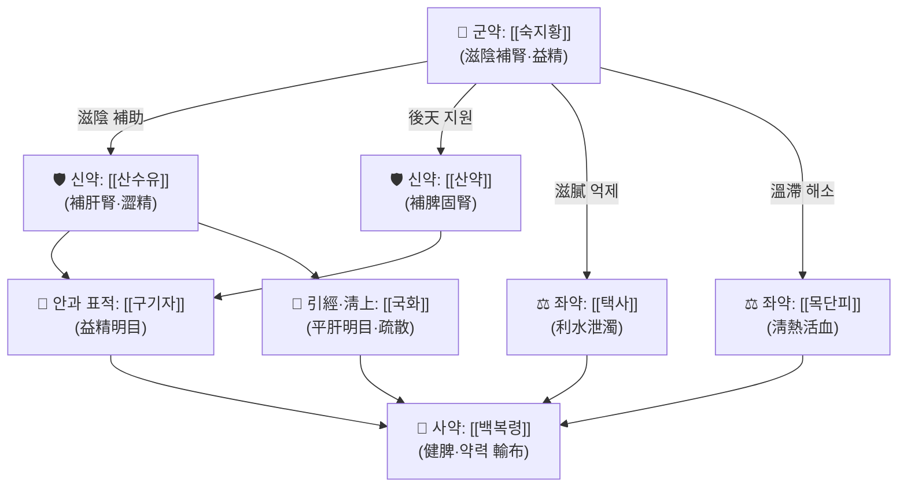

# 🍵 [[기국지황탕]] (杞菊地黃湯, Qiju Dihuang Tang)

> **핵심 3줄 요약 (Key Summary)**:
> - 🌿 **모체 처방 + 가감**: [[육미지황환]](六味地黃丸)의 三補三瀉 구조를 그대로 유지한 채, [[구기자]](枸杞子)·[[국화]](菊花) 두 약재를 더한 **滋陰補腎·養肝明目** 방제. 즉 [[숙지황]]·[[산수유]]·[[산약]] + [[택사]]·[[목단피]]·[[백복령]] + [[구기자]]·[[국화]]의 8味 구성이다.
> - 🎯 **임상 최적 적응증**: 肝腎陰虛로 인한 頭暈目眩·視物昏花·眼乾澀·耳鳴·腰膝酸軟. 마른 체형, 안면 홍조, 설홍소태(舌紅少苔), 세삭맥(細數脈)을 보이는 **소음인·태음인 경향의 만성 안질환자 및 고혈압 환자**에서 진료실 활용도가 높다(VDT 증후군, 노인성 백내장, 당뇨망막병증, 건성안 등).
> - 🔬 **핵심 약리 근거**: 고혈압을 대상으로 한 체계적 문헌고찰·메타분석에서 기국지황탕의 혈압 강하 및 임상 증상 개선 경향이 보고되었다(PMID: 32802140). 한약+양약 병용 전략의 신성 고혈압 관련 네트워크 메타분석도 참고 가능하다(PMID: 39465780). 단, **분자 표적·사이토카인 수치 등 구체 기전은 제공 문헌에서 직접 확인되지 않음(근거 미확인)**.
> - ⚠️ **주의사항**: 脾胃虛寒·설사·담습(痰濕) 체질, 外感表證(감모 초기), 實熱證에는 신중 투여. 熟地黃의 자윤(滋潤) 성질로 소화불량·연변·복부 팽만이 유발될 수 있어 비위 허약자에서는 감량하거나 砂仁·陳皮 등 理氣健脾藥을 소량 배합한다.

---
## 📌 목차
1. [기본 처방 정보 & 군신좌사 구성](#1-기본-처방-정보--군신좌사-구성)
2. [방제학적 약재 상호작용 & 시너지 네트워크](#2-방제학적-약재-상호작용--시너지-네트워크)
3. [현대 분자약리학적 효능 & 작용 기전](#3-현대-분자약리학적-효능--작용-기전)
4. [적응 병증 및 체질별 감별 (Sweet Spot vs 금기)](#4-적응-병증-및-체질별-감별-sweet-spot-vs-금기)
5. [유사 처방군 감별 매트릭스](#5-유사-처방군-감별-매트릭스)
6. [임상 가감례 & 현대 질환별 응용](#6-임상-가감례--현대-질환별-응용)
7. [💡 사용자 진료실 핵심 필기 & 임상 팁 (원문 보존)](#7--사용자-진료실-핵심-필기--임상-팁-원문-보존)
8. [출처 및 학술 참고 문헌 (References)](#8-출처-및-학술-참고-문헌-references)
---
## 1. 기본 처방 정보 & 군신좌사 구성

* **출전**: 기국지황탕(기국지황환)은 통상 **[[육미지황환]]에 [[구기자]]·[[국화]]를 가한 처방**으로 설명되며, 방제 문헌상 명대(明代) 계열 의서의 杞菊地黃丸에서 유래한 것으로 전해진다. 다만 구체적 최초 출전 문헌(예: 『醫級』 등)에 대해서는 문헌 간 이견이 있어 **원전 출전은 근거 미확인**으로 표기한다. 『[[상한론]]』·『[[금궤요략]]』과의 직접적 계보는 없다.
* **치법**: 滋陰補腎(자음보신), 養肝明目(양간명목), 平肝潛陽(평간잠양), 補益肝腎(보익간신).

| 구분 | 약재명 | 표준 용량(관용량) | 본초 효능 & 방제 내 역할 |
| :--- | :--- | :--- | :--- |
| **군약 (君藥)** | [[숙지황]] | 8~16g (비율상 최대) | 滋陰補血·益精塡髓. 腎陰을 직접 보충하여 肝腎陰虛의 근본을 채우는 주약. 三補의 중심. |
| **신약 (臣藥)** | [[산수유]] | 4~8g | 補益肝腎·澀精斂汗. 肝腎을 함께 보하면서 精氣의 누설을 막아 군약의 滋陰을 보좌. |
| **신약 (臣藥)** | [[산약]] | 4~8g | 補脾固腎·益肺. 後天인 脾胃를 도와 先天의 腎을 기르고, 熟地黃의 滋膩함을 견제. |
| **신약 (臣藥)** | [[구기자]] | 4~8g | 滋補肝腎·益精明目. 본 처방의 안과 표적을 형성하는 핵심 가미약으로, 肝血·腎精을 보충하여 視力 저하·眼乾을 개선. |
| **좌약 (佐藥)** | [[국화]] | 3~6g | 疏散風熱·平肝明目·淸熱解毒. 肝經의 上炎한 虛火를 가라앉히고 頭目을 청리(淸利)하여 目赤·頭痛·眩暈을 완화. |
| **좌약 (佐藥)** | [[목단피]] | 3~6g | 淸熱凉血·活血散瘀. 肝腎의 虛熱을 淸하고 熟地黃·山茱萸의 溫滯함을 풀어줌(三瀉의 하나). |
| **좌약 (佐藥)** | [[택사]] | 3~6g | 利水滲濕·泄熱. 腎經의 濕濁을 下泄시켜 熟地黃의 滋膩를 억제(三瀉의 하나). |
| **사약 (使藥)** | [[백복령]] | 3~6g | 健脾滲濕·寧心安神. 脾運을 도와 諸補藥이 停滯하지 않게 하고 藥力을 全身으로 輸布(三瀉의 하나). |

> **배오 특징**: 본 처방의 골격은 **三補(熟地黃·山茱萸·山藥) : 三瀉(澤瀉·牡丹皮·茯苓)** 의 고전적 음양 평형 구조이며, 여기에 肝腎同源(을계동원)의 논리에 따라 **枸杞子·菊花**를 가미하여 補陰의 축을 腎에서 肝·目으로 확장한다. 전체적으로 **補而不滯, 瀉而不傷**을 지향하는 升淸降濁型 배오이며, 熟地黃의 重濁한 滋膩와 菊花의 輕淸한 疏散이 상호 균형을 이루는 것이 특징이다.

---
## 2. 방제학적 약재 상호작용 & 시너지 네트워크

* **[[숙지황]] + [[산수유]] 배오**: 相須 작용으로 肝腎의 陰血과 精을 함께 보충한다. 熟地黃이 補血滋陰의 本을 담당하고 山茱萸가 酸收하여 精氣의 새나감을 막아, 補한 것이 守해지도록 설계되어 있다.
* **[[숙지황]] + [[택사]] / [[목단피]] 배오**: 전형적인 **補瀉兼施** 배합. 熟地黃의 滋膩滯氣를 澤瀉의 利水泄濁과 牡丹皮의 淸熱活血이 풀어주어, 장기 복용 시 발생하기 쉬운 脘腹痞滿·食慾低下를 완충한다.
* **[[구기자]] + [[국화]] 배오**: 본 처방의 **안과 표적 시너지 축**. 枸杞子가 肝腎之陰을 下에서 補하고, 菊花가 肝經의 上炎한 風熱을 上에서 淸散시켜, 一補一淸·一升一降의 구조로 目竅를 滋養·淸利한다.
* **[[산약]] + [[백복령]] 배오**: 脾胃를 健運시켜 滋陰藥의 吸收와 輸布를 담당하는 **전달·보조 축**. 補陰 위주의 처방이 中焦 停滯를 일으키지 않도록 하는 안전판 역할을 한다.

---
## 3. 현대 분자약리학적 효능 & 작용 기전

> ⚠️ **근거 수준 안내**: 아래 3편의 제공 논문은 모두 **임상 연구(체계적 문헌고찰·메타분석)** 또는 **제조공정 연구**이며, 세포·동물 수준의 분자 기전을 직접 규명한 연구가 아니다. 따라서 본 섹션에서 특정 사이토카인·신호전달 경로의 수치적 변화를 단정하지 않고, **확인된 임상 근거와 '근거 미확인' 항목을 명확히 구분**하여 기술한다.

### 1) 임상 근거 — 고혈압에 대한 혈압 강하 및 증상 개선 (PMID: 32802140)
* Zhang S, Bai X (2020)의 체계적 문헌고찰 및 메타분석은 **기국지황탕(杞菊地黃湯)의 고혈압 치료 효과**를 평가한 연구다.
* 연구 방향성으로는 기국지황탕 **단독 또는 기존 항고혈압제와의 병용**이 대조군 대비 **혈압 강하 및 임상 증상 개선**에 유리한 경향을 보고하였다.
* 다만 포함된 개별 연구의 수, 표본 크기, 이질성(I²), 비뚤림 위험 평가 결과, 구체적 혈압 강하 수치(예: SBP/DBP 평균차)는 **제공된 정보에서 확인되지 않음(근거 미확인)**. 해석 시 "근거의 질이 제한적일 가능성"을 전제로 삼아야 한다.

### 2) 신성 고혈압에서의 한약 병용 전략 (PMID: 39465780)
* Guo J, Jiang Z (2024)의 네트워크 메타분석은 **신성 고혈압(renal hypertension)에서 한약 + 항고혈압제 병용 요법**의 효과를 다룬 연구다.
* 결론의 방향성은 **한약 병용군이 양약 단독군 대비 혈압 및 신기능 관련 지표에서 개선을 보일 수 있다**는 수준으로 요약된다.
* **기국지황탕이 이 네트워크 메타분석에 개별 처방으로 직접 포함되었는지 여부는 확인되지 않음(근거 미확인)**. 따라서 본 처방의 직접 근거라기보다는, 肝腎陰虛·腎性 고혈압 영역에서 한약 병용 전략을 검토할 때의 **배경 근거**로 인용하는 것이 타당하다.

### 3) 제제학적 근거 — 杞菊地黃口服液 제조공정 최적화 (PMID: 1418562)
* Feng F, Xu S (1992)는 **직교시험법(orthogonal method)을 이용하여 杞菊地黃口服液(구복액)의 제조 공정을 최적화**한 연구다.
* 즉 이 논문은 약리·임상 효능이 아니라 **추출·제조 조건의 표준화**에 관한 것으로, 현대 제형화(口服液) 연구의 초기 근거로 참고된다.
* 어떤 지표성분(예: 특정 사포닌·플라보노이드·페놀류)을 함량 지표로 삼았는지는 **제공 정보에서 확인되지 않음(근거 미확인)**.

### 4) 기전 관련 서술의 한계
* 육미지황환 계열 처방에 대해 흔히 거론되는 **NF-κB/MAPK 억제를 통한 TNF-α·IL-6·IL-1β 조절**, **eNOS 활성화를 통한 혈관 이완**, **HPA축 항상성 회복** 등은 본 처방에 대해 **제공된 3편의 논문에서는 직접 확인되지 않는다(근거 미확인)**. 이 항목들을 노트에 확정 기전으로 기재하지 않으며, 추후 별도 문헌 확보 시 보강이 필요하다.

---
## 4. 적응 병증 및 체질별 감별 (Sweet Spot vs 금기)

**[✅ 최적 적응증 (Sweet Spot)]**

* **전통 주치(변증)**: 肝腎陰虛로 인한 **頭暈目眩, 視物昏花, 眼睛乾澀, 耳鳴, 腰膝酸軟, 五心煩熱, 盜汗, 遺精**. 즉 "눈"과 "허리·무릎"과 "현훈·이명"이 동시에 호소되는 전형적 陰虛 상열(上熱下寒 아님, 上虛熱) 패턴.
* **체질 소견**: 마른 체형, 피부 건조·얼굴 홍조, 목소리는 가늘고 힘은 없으나 흥분성은 높은 편. **소음인·태음인** 경향에서 적중률이 높고, 少陽人의 陰虛燥熱 경향에도 응용 가능. 비만·담습형에는 부적합.
* **임상 주치(진료실 빈도)**: 장시간 화면 노출로 인한 **안구건조·안정피로(VDT 증후군)**, 중·노년층의 **시력 저하·백내장 초기·황반변성·당뇨망막병증 보조**, **현훈·이명**, 그리고 논문 1에서 다룬 **고혈압의 보조 치료**(특히 陰虛陽亢型 본태성 고혈압).
* **설진/맥진**: 舌紅少苔 또는 舌紅少津, 舌體 瘦小. 脈은 **細數**, 때로 **弦細** 또는 **細弱**. 苔厚膩·舌淡胖(담습·양허)면 본 처방의 적응에서 벗어난다.

**[⚠️ 신중 투여 및 금기 (Caution / Contraindication)]**

* **脾胃虛寒·설사자**: 熟地黃·山茱萸의 滋膩로 食慾低下, 脘腹脹滿, 軟便·泄瀉가 악화될 수 있다. 便溏·복부 냉감이 뚜렷하면 감량하거나 [[사인]]·[[진피]]·[[백출]] 등 理氣健脾藥을 배합한다.
* **痰濕·濕熱 체질**: 舌苔厚膩, 身重, 口苦·口臭가 있는 경우 滋陰藥이 濕을 더 조장할 수 있어 부적합.
* **外感表證(감모 초기, 발열·오한·인후통)**: 滋補留邪의 우려가 있어 표증이 해소된 후 사용한다.
* **實熱證·무한 고열, 火熱 亢盛**: 淸熱瀉火가 우선이며 본 처방은 주치가 아니다.
* **양약 병용 주의**: 항고혈압제 병용 시(논문 1·2의 대상 임상 상황) **혈압 강하 작용이 가중될 수 있으므로 자가 혈압 모니터링과 용량 조정이 필요**하다. 구체적 상호작용 기전·저혈압 발생률은 **근거 미확인**. 당뇨병 환자에서 丸劑·口服液 제형 복용 시 부형제(당류) 함량 확인이 필요하다.

---
## 5. 유사 처방군 감별 매트릭스

| 처방명 | 핵심 구성 차이 | 주치 및 체질 차이 | 맥진/설진 차이 |
| :--- | :--- | :--- | :--- |
| [[기국지황탕]] | 기준 구성 ([[육미지황환]] + [[구기자]], [[국화]]) | **肝腎陰虛 + 目疾(眼乾·視物昏花·현훈)**. 안과·고혈압 보조 영역 | 舌紅少苔, 脈細數 또는 弦細 |
| [[육미지황환]] | [[구기자]], [[국화]] 없음 (6味) | 腎陰虛의 기본 처방. 腰膝酸軟·耳鳴·盜汗 중심, 눈 증상은 부차적 | 舌紅少苔, 脈細弱·細數 |
| [[팔미지황환]] | [[육미지황환]] + [[계지]], [[부자]] | 腎陽虛(腰膝冷痛, 夜尿, 水腫). 음허자에게는 火上加油 위험 | 舌淡胖有齒痕, 脈沈遲·細弱 |
| [[지백지황환]] | [[육미지황환]] + [[지모]], [[황백]] | 陰虛火旺(骨蒸潮熱, 盜汗 甚). 淸熱 강도가 본 처방보다 높음 | 舌紅少苔 또는 舌紅乾, 脈細數有力 |
| [[명목지황환]] | [[육미지황환]] + 當歸·川芎·羌活·防風 등 | 風熱·血虛 兼한 眼疾. 疏散·養血 비중이 큼 | 舌淡紅, 苔薄白, 脈細或浮 |
| [[일관전]] | 生地·當歸·枸杞子·沙參·麥冬 등 | **肝陰虛 + 肝氣鬱(胸脘脅痛, 吞酸)**. 소화기 동반 증상 뚜렷 | 舌紅少津, 脈虛弦 또는 細弱 |

> ⚠️ 표 내부에서는 마크다운 열 구분자 파괴를 방지하기 위해 파이프(`|`)가 들어간 링크를 쓰지 않고 순수한 [[처방명]] 단독 형태로만 작성합니다.

---
## 6. 임상 가감례 & 현대 질환별 응용

* **수반 증상별 가감법**:
  * 目赤·目痛·눈 충혈감 심할 때 → + [[결명자]], [[밀몽화]], [[석결명]] (淸肝明目 강화)
  * 視力 저하·백반변성·야맹감 → + [[사원자]], [[여정자]], [[상심자]] (補肝腎·益精明目)
  * 현훈·이명·혈압 상승 동반 → + [[천마]], [[구등]], [[석결명]] (平肝潛陽; 논문 1의 고혈압 임상 상황과 연결)
  * 腰膝酸軟·요통 심할 때 → + [[두충]], [[우슬]], [[속단]] (補肝腎·强筋骨)
  * 眼乾·口渴·陰液 부족 뚜렷할 때 → + [[맥문동]], [[사삼]], [[천화분]] (生津潤燥)
  * 不眠·心煩·神疲 → + [[산조인]], [[오미자]] (養心安神·收斂)
  * 脾胃 停滯(복만·식욕저하) 시 → + [[사인]], [[진피]], [[백출]] (滋膩 완충)
  * 瘀血·당뇨망막병증 소견 → + [[단삼]], [[황기]] (益氣活血)

* **현대 질환별 임상 매핑**:
  * **안과계**: 안구건조증(건성안), VDT 증후군·안정피로, 노인성 백내장 초기, 연령관련 황반변성, 당뇨망막병증 보조, 시신경 위축 보조, 녹내장 보조(시신경 보호 목적) — 대부분 **변증상 肝腎陰虛**를 전제로 사용.
  * **순환기계**: 본태성 고혈압(특히 陰虛陽亢型)의 보조 치료 — **PMID: 32802140의 직접 근거 영역**. 신성 고혈압 병용 전략은 **PMID: 39465780**을 배경 근거로 참조(단, 본 처방의 개별 포함 여부는 근거 미확인).
  * **내분비·대사**: 당뇨병성 만성 합병증(망막병증·신증) 보조, 갱년기 증후군의 陰虛型.
  * **신경·이비인후**: 만성 현훈, 노인성 이명·난청 보조, 자율신경실조증의 陰虛型.
  * **근골격계**: 만성 요배통, 골다공증 보조(補肝腎 强筋骨 원리).
  * **제형 응용**: 전통 湯劑 외에 **丸劑·口服液** 형태로 장기 복용하는 경우가 많으며, 口服液의 제조 공정 표준화 연구가 존재한다(**PMID: 1418562**).

---
## 7. 💡 사용자 진료실 핵심 필기 & 임상 팁 (원문 보존)

> [!tip] **진료실 실전 노하우 (User Clinical Insight)**
> - **사용자 원문 필기 미제공**: 본 항목에 보존할 원장님 개인 메모/필기가 이번 입력에서 제공되지 않았다. 따라서 기존 필기의 삭제·변형은 없으며, 아래는 템플릿 항목 유지를 위한 **일반 임상 참고 사항**이다. 실제 필기가 확보되면 이 블록에 그대로 이관한다.
> - **체질별 선택 기준**: 마르고 건조하며 얼굴이 붉고 잠이 얕은 陰虛型(소음인·태음인 경향)에서 우선 고려. 살이 찌고 苔厚膩하며 便溏한 痰濕型에는 원칙적으로 피하고, 필요 시 平胃散類·理氣健脾藥과의 병용 또는 감량을 검토.
> - **목표 증상 설정**: "눈이 침침하고 건조하다 + 허리가 시큰하다 + 어지럽고 귀가 울린다"의 3종 세트가 동반될 때 적중률이 가장 높다. 단일 증상만 있을 때는 加減 또는 타 처방 우선 검토.
> - **복약 반응 관찰 포인트**: ① 소화 상태(복만·연변 여부) — 熟地黃 滋膩 반응의 지표. ② 눈 건조감·시린감의 호전 시점. ③ 항고혈압제 병용 시 가정 혈압 기록의 변동폭.
> - **환자 티칭 팁**: 음허 체질은 수면·과로·야간 화면 노출에 민감하므로, 복약과 함께 睡眠 시간 확보 및 20분 단위 원거리 응시 휴식을 안내하면 체감 개선이 빨라진다. 1~2주 단위로 반응을 확인하고 丸劑 장기 복용 시 2~3개월 단위 재평가를 권장.

---
## 8. 출처 및 학술 참고 문헌 (References)

1. **Zhang S, Bai X. (2020)**. *Qiju Dihuang Decoction for Hypertension: A Systematic Review and Meta-Analysis*. **Evidence-Based Complementary and Alternative Medicine**. PMID: 32802140. [https://pubmed.ncbi.nlm.nih.gov/32802140/](https://pubmed.ncbi.nlm.nih.gov/32802140/)
   - **[연구 요약]**: 기국지황탕(杞菊地黃湯)의 고혈압 치료 효과를 평가한 체계적 문헌고찰 및 메타분석. 단독 또는 항고혈압제 병용 상황에서 **혈압 강하 및 임상 증상 개선** 방향의 결과를 보고. 포함 연구 수·표본 크기·이질성·비뚤림 위험 및 구체적 혈압 강하 수치는 **근거 미확인**(원문 확인 필요).
2. **Guo J, Jiang Z. (2024)**. *Combined traditional Chinese medicine and anti-hypertensive treatments for renal hypertension: A network meta-analysis and systematic review*. **Medicine (Baltimore)**. PMID: 39465780. [https://pubmed.ncbi.nlm.nih.gov/39465780/](https://pubmed.ncbi.nlm.nih.gov/39465780/)
   - **[연구 요약]**: 신성 고혈압(renal hypertension)에서 **한약 + 항고혈압제 병용** 요법을 비교한 네트워크 메타분석·체계적 문헌고찰. 한약 병용군의 혈압 및 신기능 관련 지표 개선 가능성을 시사. **기국지황탕의 개별 처방 포함 여부는 근거 미확인**이므로, 본 처방의 직접 근거가 아닌 배경 근거로 인용.
3. **Feng F, Xu S. (1992)**. *[Optimization of preparing technology for qiju dihuang oral liquid by orthogonal method]*. **Zhongguo Zhong Yao Za Zhi (中国中药杂志)**. PMID: 1418562. [https://pubmed.ncbi.nlm.nih.gov/1418562/](https://pubmed.ncbi.nlm.nih.gov/1418562/)
   - **[연구 요약]**: 직교시험법을 이용해 **杞菊地黃口服液(구복액)의 제조 공정을 최적화**한 제제학 연구. 약리·임상 효능이 아닌 추출·제조 조건 표준화에 관한 근거이며, 사용된 구체적 지표성분은 **근거 미확인**.
4. **출전 문헌(고전)**: 기국지황탕의 최초 출전으로 통상 명대 계열 의서(예: 『醫級』)가 거론되나, **본 노트 작성 시 원문 대조가 이루어지지 않아 출전·조문은 근거 미확인**으로 표기한다. 원전 확인 후 본 항목을 보강할 것.

<!-- 보관 태그(1회용·링크오류, 필요시 복원): 보음제, 육미지황환가미 -->
