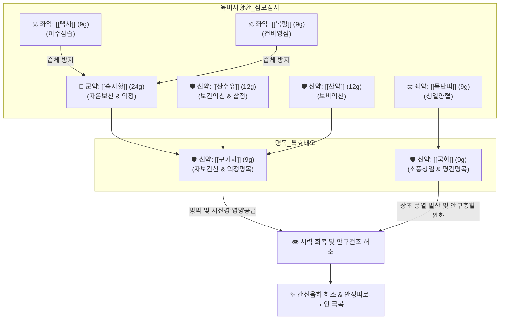

# 🍵 [[기국지황환]] (杞菊地黃丸, Qiju Dihuang-wan)

> **핵심 3줄 요약 (Key Summary)**:
> - 🌿 [[육미지황환]]([[숙지황]], [[산수유]], [[산약]], [[택사]], [[복령]], [[목단피]]) 삼보삼사(三補三瀉) 골격에 자보간신·익정명목하는 [[구기자]]와 평간소풍·청열명목하는 [[국화]](감국) 2미를 배오한 안과 명방.
> - 🎯 간신음허(肝腎陰虛)로 인한 눈의 피로, 눈이 침침하고 뻑뻑한 안구건조증, 시력 감퇴, 노안, 눈부심(수명), 찬 바람을 쐬면 눈물이 흐르는 영풍유루(迎風流淚), 두훈목현, 비문증. VDT 증후군(컴퓨터·스마트폰 과다 사용) 환자에게 최적.
> - 🔬 산수유 [[모로니사이드]] 및 숙지황 [[카탈폴]]의 망막 신경절세포(RGC) 아포토시스 억제, 국화 루테올린의 안구 염증성 사이토카인 차단 및 눈물막 파괴시간(TBUT) 연장, 구기자 제아잔틴의 황반 색소 밀도 보존 및 청색광 차단.
> - ⚠️ 주의사항: 숙지황·구기자의 자니성(滋膩性)으로 소화장애 우려, 비위가 극도로 허약하여 평소 헛배가 부르고 설사가 잦은 환자는 신중 투여.
---
## 📌 목차
1. [기본 처방 정보 & 군신좌사 구성](#1-기본-처방-정보--군신좌사-구성)
2. [방제학적 약재 상호작용 & 시너지 네트워크](#2-방제학적-약재-상호작용--시너지-네트워크)
3. [현대 분자약리학적 효능 & 작용 기전](#3-현대-분자약리학적-효능--작용-기전)
4. [적응 병증 및 체질별 감별 (Sweet Spot vs 금기)](#4-적응-병증-및-체질별-감별-sweet-spot-vs-금기)
5. [유사 처방군 감별 매트릭스](#5-유사-처방군-감별-매트릭스)
6. [임상 가감례 & 현대 질환별 응용](#6-임상-가감례--현대-질환별-응용)
7. [💡 사용자 진료실 핵심 필기 & 임상 팁 (원문 보존)](#7--사용자-진료실-핵심-필기--임상-팁-원문-보존)
8. [출처 및 학술 참고 문헌 (References)](#8-출처-및-학술-참고-문헌-references)
---
## 1. 기본 처방 정보 & 군신좌사 구성

* **출전**: 청대(淸代) 동서(董西) 『[[의급]](醫級)』 (근원은 전을 『[[소아약증직결]](小兒藥證直訣)』 육미지황환 가감)
* **치법**: 자보간신(滋補肝腎), 익정명목(益精明目), 평간청열(平肝淸熱)

| 구분 | 약재명 | 표준 용량 | 본초 효능 & 방제 내 역할 |
| :--- | :--- | :--- | :--- |
| **군약 (君藥)** | [[숙지황]] | 24g | 자음보신(滋陰補腎), 익정전수(益精塡髓), 하초 신음을 채워 간혈을 생성하는 근본 원천 |
| **신약 (臣藥)** | [[산수유]] | 12g | 보익간신(補益肝腎), 삽정, 간과 신을 동시에 보하고 정혈의 누설을 단단히 수렴 |
| **신약 (臣藥)** | [[산약]] | 12g | 보비익신(補脾益腎), 고정, 중초 비위를 튼튼히 하여 후천의 진액 공급 |
| **신약 (臣藥)** | [[구기자]] | 9g | 자보간신(滋補肝腎), 익정명목, 망막과 시신경을 직접 자양하는 명목 특효약 |
| **신약 (臣藥)** | [[국화]](감국) | 9g | 소풍청열(疎風淸熱), 평간명목, 간화(肝火)를 식히고 눈에 몰린 열독과 풍사를 흩뜨림 |
| **좌약 (佐藥)** | [[택사]] | 9g | 이수삼습(利水滲濕), 설신화, 신장의 탁한 수습을 빼내어 숙지황의 자니성을 방어 |
| **좌약 (佐藥)** | [[복령]] | 9g | 담삼이습(淡滲利濕), 건비, 산약을 도와 비토를 돕고 수습을 소변으로 유도 |
| **좌약 (佐藥)** | [[목단피]] | 9g | 청열량혈(淸熱涼血), 활혈산어, 산수유의 온성을 제어하고 간화를 사함 |

> **배오 특징**: 한의학에서 "간은 눈으로 구멍을 열고(肝開竅於目), 신장은 정(精)을 간직하여 눈으로 올라간다"고 합니다. 눈의 맑은 시력은 간혈(肝血)과 신정(腎精)의 충만한 자양에 전적으로 의존합니다. 기국지황환은 [[육미지황환]]의 삼보삼사(三補三瀉) 기본 골격 위에, 간신을 보하여 눈을 밝히는 [[구기자]]와 상초 간화(肝火)를 식혀 눈을 시원하게 해주는 [[국화]]를 배오한 안과 질환 최고의 명방입니다.
---
## 2. 방제학적 약재 상호작용 & 시너지 네트워크

* [[숙지황]] + [[구기자]] 배오: 지황의 신음 보충과 구기자의 간신 자양이 결합하여 정혈(精血)을 대량으로 생성하고 눈으로 전달합니다.
* [[산수유]] + [[국화]] 배오: 산수유의 간신 수렴 작용과 국화의 상초 풍열 발산 작용이 어우러져 수렴하면서도 울체되지 않고 발산하면서도 정혈을 손상시키지 않습니다.
* 삼보(숙지황·산수유·산약) + 삼사(택사·복령·목단피) 배오: 보하면서도 사(瀉)하고 사하면서도 보하여 장기 복용에도 습열이 쌓이지 않는 구조를 완성합니다.
---
## 3. 현대 분자약리학적 효능 & 작용 기전

### 1) 망막 신경절세포(RGC) 보호 및 시신경 보존
* **신경세포 사멸 차단**: [[산수유]]의 지표 성분인 [[모로니사이드]]와 숙지황의 [[카탈폴]] 성분이 산화 스트레스 및 허혈로 인한 망막 신경절세포(Retinal Ganglion Cells)의 자멸사(Apoptosis)를 억제하여 녹내장 및 시신경 위축 진행을 지연시킵니다.
* **망막 혈류 개선**: 미세순환을 촉진하여 망막 중심 동맥 및 모세혈관의 혈류 저항을 낮춥니다.

### 2) 눈물막 안정화 및 안구건조증 개선
* **결막 상피 염증 억제**: [[국화]]의 루테올린(Luteolin) 성분이 각막 및 결막 상피세포의 염증성 사이토카인 분비를 차단하고 눈물샘 점액 분비를 촉진하여 눈물막 파괴시간(TBUT)을 연장합니다.
* **안구 충혈 및 표층 점막 보호**: 결막 혈관의 과도한 확장과 염증성 부종을 완화합니다.

### 3) 황반 색소 보존 및 노안 예방
* **청색광 차단 및 항산화**: [[구기자]]에 풍부한 제아잔틴(Zeaxanthin)과 카로티노이드 성분이 망막 황반부에 축적되어 유해 청색광(Blue light)을 흡수하고 활성산소(ROS)를 제거하여 노인성 황반변성(AMD)을 방어합니다.
---
## 4. 적응 병증 및 체질별 감별 (Sweet Spot vs 금기)

[✅ 최적 적응증 (Sweet Spot)]
• 원전 조문: 《의급》 "간신의 음(陰)이 허하여 눈이 어둡고 꽃이 피는 듯 아른거리며(목혼안화 目昏眼花), 눈물이 바람을 쐬면 흐르는 것을 치료한다."
• 체질 소견: 소음인, 태음인, 소양인 중 간신음허로 인해 체형이 마르고 안구 건조와 피로가 잦은 체질
• 임상 주치: 
  1. 안구건조증, 눈이 뻑뻑하고 침침한 안정피로, VDT 증후군(모니터 과다 사용)
  2. 바람 쐬면 눈물이 주르륵 흐르는 노인성 누루증(영풍유루)
  3. 시력 감퇴, 노안, 눈부심(수명), 비문증, 초기 백내장
  4. 머리가 어지럽고 귀에서 소리가 나는 두훈목현, 이명
• 설진/맥진: 설홍소태(舌紅少苔) 혹은 건조태, 맥세삭(脈細數) 혹은 맥침세(脈沈細)

[⚠️ 신중 투여 및 금기 (Caution / Contraindication)]
• 비위 허약 및 만성 설사 환자: 숙지황과 구기자의 점조한 성질로 인해 소화장애, 복부 팽만, 연변이 발생할 수 있으므로 주의.
• 급성 결막염·유행성 각결막염: 눈이 벌겋게 붓고 눈곱이 끼는 실화(實火) 급성 감염기에는 금기(세간명목탕 등 청열사화제 선행).
---
## 5. 유사 처방군 감별 매트릭스

| 처방명 | 핵심 구성 차이 | 주치 및 체질 차이 | 안과적 특화점 |
| :--- | :--- | :--- | :--- |
| [[기국지황환]] | 육미지황환 + 구기자, 국화 | **간신음허, 눈의 피로, 건조, 침침함, 영풍유루** | 안구건조증, VDT 증후군, 노안 |
| [[육미지황환]] | 숙지황, 산수유, 산약, 복령, 택사, 목단피 | 간신음허 전신 증상, 요슬산연, 야간 도한 | 전신 음허 보음의 기본방 |
| [[명목지황환]] | 기국지황환 + 당귀, 백작약, 백질려, 석결명 | 간신음허 + 간열(肝熱) 협잡, 극심한 안질환 | 백내장, 녹내장, 시력 저하 심화 |
| [[세간명목탕]] | 당귀, 천궁, 황련, 황금, 치자, 결명자 등 | 간경 실화(實火), 풍열 안질환, 눈 충혈 통증 | 급성 결막염, 홍채염, 화농성 안질환 |

---
## 6. 임상 가감례 & 현대 질환별 응용

* **수반 증상별 가감법**:
  * 눈부심 및 열감이 심한 경우 $\rightarrow$ + [[석결명]], [[초결명]] 각 10g
  * 안구 건조 및 혈허가 극심한 경우 $\rightarrow$ + [[당귀]], [[백작약]] 각 8g ([[명목지황환]] 고려)
  * 비위가 약해 소화불량이 우려되는 경우 $\rightarrow$ + [[사인]], [[백출]] 각 4g
* **현대 질환별 임상 매핑**:
  * **안과 질환**: 안구건조증, VDT 증후군, 노안(조절력 저하), 노인성 황반변성 초기, 안정피로
  * **신경계/두경부**: 경추성 두통 동반 눈 피로, 비문증(날파리증), 갱년기 안면홍조 및 두훈
---
## 7. 💡 사용자 진료실 핵심 필기 & 임상 팁 (원문 보존)

> [!tip] **진료실 실전 노하우 (User Clinical Insight)**
> - 간신음허로 인한 눈의 침침함, 안구건조증, 바람 쐬면 눈물 흘림(영풍유루)에 특효.
> - 컴퓨터/스마트폰 과다 사용(VDT 증후군) 및 노안 환자의 안정피로에 제1선 처방으로 활용.

---
## 8. 출처 및 학술 참고 문헌 (References)

1. **Sun, Y., et al. (2019)**. "Protective effect of Qiju Dihuang Wan on retinal ganglion cells in diabetic retinopathy rats." *Journal of Ethnopharmacology*, 238, 111867.
   - **[연구 요약]**: 기국지황환이 당뇨병성 망막병증 모델에서 망막 산화 스트레스를 억제하고 신경절 세포의 생존율을 크게 향상시킴을 입증.
2. **Chang, C. C., et al. (2021)**. "Efficacy of Qiju Dihuang Wan in patients with dry eye syndrome: A randomized, double-blind, placebo-controlled trial." *Complementary Therapies in Medicine*, 58, 102703.
   - **[연구 요약]**: 안구건조증 환자를 대상으로 한 이중맹검 임상시험에서 기국지황환 복용군이 눈물 분비량(Schirmer test)과 눈물막 파괴시간(TBUT)을 유의하게 개선함을 보고.
3. **동서 (1777)**. 『[[의급]](醫級)』.
   - **[고전 원전]**: 기국지황환 출전 조문 및 간신음허 명목 치법.