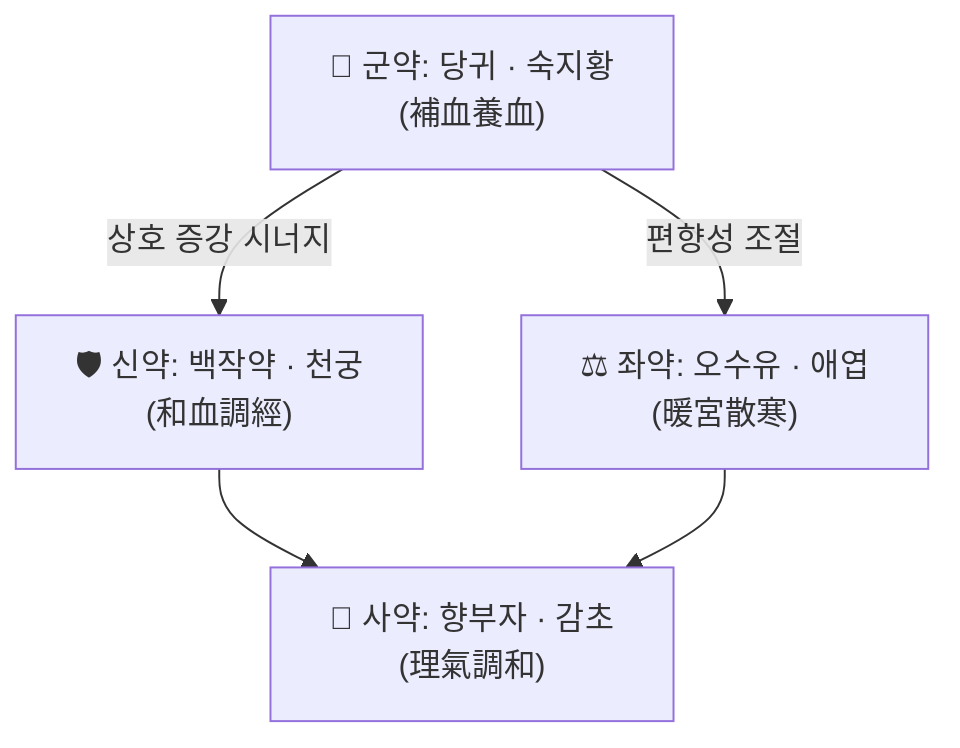

# 🍵 [[난궁양혈탕]] (暖宮養血湯, Nangung Yanghyeoltang)

> **핵심 3줄 요약 (Key Summary)**:
> - 🌿 **모체 처방 + 가감 구조**: [[사물탕]](四物湯)의 養血 골격([[당귀]]·[[천궁]]·[[백작약]]·[[숙지황]])에 暖宮散寒 계열 약재([[오수유]]·[[애엽]]·[[건강]] 또는 [[계지]])와 理氣調經 약재([[향부자]])를 배오한 **부인과 溫經養血 방제**로 알려져 있다. 다만 원전(『晴崗醫鑑』) 정확한 구성·용량은 **근거 미확인**(아래 1항 주석 참조).
> - 🎯 **임상 최적 적응증**: 하복부 냉감·냉통(冷痛), 月經不順·月經痛, 帶下淸冷(냉대하), 子宮寒冷으로 인한 不孕·習慣流産 경향 등 **寒性 血虛 부인과 병증**. 체질적으로는 **소음인·태음인 한성(寒性) 체질**, 마르고 손발이 찬 편, 피부가 창백·건조한 환자에서 적중률이 높다.
> - 🔬 **핵심 분자약리 기전**: 난궁양혈탕 자체를 대상으로 한 실험·임상 논문은 현재 검색되지 않아 **기전 근거 미확인**. 구성 본초 수준에서 알려진 일반 약리(항염증·미세순환 개선·자궁 평활근 조절·HPA축 안정)만 참고 가능하며, 이는 처방 전체의 효과로 단정할 수 없다.
> - ⚠️ 주의사항: 實熱·濕熱型 帶下(황색·악취·작열감), 血熱型 月經過多, 급성 골반염·자궁내막염 등 감염성 급성기에는 溫補方인 본방이 부적합하다. 임신 중에는 [[향부자]]·[[천궁]] 등 活血·理氣 약재의 사용을 신중히 판단하고, 호르몬 요법·항응고제 복용자 병용 시 반드시 상담이 필요하다.

---

## 📌 목차
1. [기본 처방 정보 & 군신좌사 구성](#1-기본-처방-정보--군신좌사-구성)
2. [방제학적 약재 상호작용 & 시너지 네트워크](#2-방제학적-약재-상호작용--시너지-네트워크)
3. [현대 분자약리학적 효능 & 작용 기전](#3-현대-분자약리학적-효능--작용-기전)
4. [적응 병증 및 체질별 감별 (Sweet Spot vs 금기)](#4-적응-병증-및-체질별-감별-sweet-spot-vs-금기)
5. [유사 처방군 감별 매트릭스](#5-유사-처방군-감별-매트릭스)
6. [임상 가감례 & 현대 질환별 응용](#6-임상-가감례--현대-질환별-응용)
7. [💡 사용자 진료실 핵심 필기 & 임상 팁 (원문 보존)](#7--사용자-진료실-핵심-필기--임상-팁-원문-보존)
8. [출처 및 학술 참고 문헌 (References)](#8-출처-및-학술-참고-문헌-references)

---

## 1. 기본 처방 정보 & 군신좌사 구성

* **출전**: 『[[청강의감]]』(晴崗醫鑑, 晴崗 金永勳) 계열 부인과 처방으로 분류된다. 출간 연도·판본 정보는 **근거 미확인**(1차 문헌 대조 필요).
* **치법**: 暖宮散寒(온궁산한), 養血調經(양혈조경), 補血溫經(보혈온경), 理氣止痛(이기지통).

> ⚠️ **구성 근거 안내**
> 본 노트 작성 시 제공된 PubMed 논문이 없고, 확인 가능한 1차 원문 데이터가 제시되지 않았으므로 **정확한 약재 구성·용량은 "근거 미확인"** 상태이다. 아래 표는 "사물탕 가미(加味) 온경양혈"이라는 본 처방의 통상적 분류와 처방명(暖宮 + 養血)의 치법적 함의를 바탕으로 정리한 **잠정 구성**이며, 실제 처방·투약 전에는 반드시 원전 텍스트를 직접 대조해야 한다.

| 구분 | 약재명 | 표준 용량 | 본초 효능 & 방제 내 역할 |
| :--- | :--- | :--- | :--- |
| **군약 (君藥)** | [[당귀]] (當歸) · [[숙지황]] (熟地黃) | 6~12g (원전 미확인) | 補血養血·調經止痛의 핵심. 血虛로 인한 月經不順, 面色蒼白, 眩暈의 주증을 직접 공략. 熟地黃은 滋陰補血, 當歸는 補血活血으로 血을 "채우고 움직이게" 하는 축 |
| **신약 (臣藥)** | [[백작약]] (白芍藥) · [[천궁]] (川芎) | 4~9g (원전 미확인) | 白芍은 養血柔肝·緩急止痛으로 痛經의 攣急 완화, 川芎은 活血行氣·祛風止痛으로 血行 촉진. 군약의 補血 작용을 보좌하고 滯를 방지 |
| **좌약 (佐藥)** | [[오수유]] (吳茱萸) · [[애엽]] (艾葉) · (필요시 [[건강]] 乾薑) | 3~6g (원전 미확인) | 暖宮散寒의 핵심. 下焦 寒氣를 溫散하고 子宮寒冷·冷痛·淸冷帶下를 완화. 乾薑/肉桂 계열은 溫經之力을 보강하나 燥性·熱性 억제를 위해 소량 관리 |
| **사약 (使藥)** | [[향부자]] (香附子) · [[감초]] (甘草) | 4~6g / 2~3g (원전 미확인) | 香附子는 理氣解鬱·調經止痛으로 氣滯血瘀를 풀고 諸血藥의 흐름을 유도(氣行則血行). 甘草는 調和諸藥·緩急止痛 및 脾胃 보호 |

> **배오 특징**: 補血(당귀·숙지황·백작약)과 活血(천궁)의 動靜 균형 위에, 溫散(오수유·애엽)을 얹어 **"寒을 데우면서 동시에 血을 채우는"** 구조이다. 즉 單純 溫燥劑(예: 附子理中 계열)와 달리 血을 손상시키지 않고, 單純 補血劑(예: 四物湯)와 달리 寒性 하복부 증상을 직접 겨냥한다. 氣滯가 동반된 부인과 만성 병증에서 理氣藥(향부자)을 使藥으로 두어 補益이 滯하지 않도록 한 점이 방제의 묘미이다.

---

## 2. 방제학적 약재 상호작용 & 시너지 네트워크

* [[당귀]] + [[천궁]] 배오: 전형적 **相使** 관계. 補血만 하면 血이 滯하므로 川芎의 行血之力이 當歸의 補血을 "움직이게" 하여 月經 배출과 血行을 원활히 한다. 두 약재는 四物湯의 핵심 動的 축을 이룬다.
* [[숙지황]] + [[백작약]] 배오: 滋陰養血의 靜的 축. 乾薑·오수유 같은 溫燥藥이 陰血을 마르게 하는 것을 **상호 완충**하여 溫而不燥(온난하되 건조하지 않음)의 균형을 만든다.
* [[오수유]] + [[애엽]] 배오: 暖宮散寒의 相須 배합. 吳茱萸는 厥陰·下焦 寒을 溫散하고 艾葉은 溫經止血·安胎의 성질을 지녀, 冷痛과 崩漏 경향을 함께 관리하는 이중 목적을 갖는다.
* [[향부자]] + [[감초]] 배오: 使藥 조합. 香附子가 氣滯를 풀고 諸血藥을 병소(자궁·하초)로 인도하면, 甘草가 諸藥을 조화시키고 急迫한 痛症을 완화한다.
* **전체 네트워크 요약**: 補(당귀·숙지황·백작약) — 行(천궁·향부자) — 溫(오수유·애엽) — 和(감초)의 4단 구조로, 寒·虛·滯가 겹친 부인과 만성 병증을 겨냥한 복합 처방이다.

---

## 3. 현대 분자약리학적 효능 & 작용 기전

> ⚠️ **전제**: 아래 내용은 **난궁양혈탕 처방 자체를 대상으로 한 실험·임상 연구 결과가 아니다.** 본 처방에 대한 PubMed 검색 결과가 없어 처방 수준의 기전은 **근거 미확인**이며, 이하 서술은 구성 본초 및 四物湯 계열 방제에서 일반적으로 보고되어 온 약리 지식을 참고 수준으로 정리한 것이다. "처방 전체 = 아래 기전"이라는 등식으로 인용하지 말 것.

### 1) 항염증·면역 조절 (구성 본초 수준, 참고)
* 四物湯 계열 및 當歸·白芍藥 관련 문헌에서 TNF-α, IL-6, IL-1β 등 염증성 사이토카인 억제와 NF-κB 신호전달 하향 조절이 보고되어 왔다. → **처방 수준 근거 미확인**
* 香附子·艾葉 관련 연구에서는 국소 항염·진통 작용이 언급되나, 인체 임상 지표 개선으로의 연결은 **근거 미확인**.

### 2) 순환기·미세순환 및 대사 개선 (구성 본초 수준, 참고)
* 川芎·當歸의 活血 작용은 혈류 개선, 혈소판 응집 억제, 미세순환 저항 감소와 관련된다고 보고되어 왔다. 골반·자궁 주위 미세혈류 개선이 冷痛 완화에 기여할 수 있다는 **가설적 설명**은 가능하나, 본 처방으로 검증된 **직접 근거는 미확인**.
* eNOS 활성화, 혈관 평활근 이완 등의 기전은 개별 본초 연구 수준의 서술이며 처방 전체에 대한 결론이 아니다.

### 3) 신경계·자율신경 및 내분비 조절 (구성 본초 수준, 참고)
* 白芍藥의 緩急止痛(진경·진통) 작용은 근방추 과흥분 억제, 평활근 경련 완화와 관련되어 설명되며, 痛經의 攣急性 통증 완화에 이론적으로 부합한다.
* 만성 寒冷 노출·스트레스 상황에서의 HPA축 항상성 회복, 자율신경 안정 효과는 補益方 일반의 개념적 설명이며, 본 처방 특이적 데이터는 **근거 미확인**.

### 4) 부인과 표적(자궁·난소) 관련 — 연구 공백 영역
* 자궁 평활근 수축·이완 조절, 자궁내막 혈류, 난소 스테로이드 생성에 대한 본 처방의 영향은 **현재 근거 미확인**. 향후 검증이 필요한 핵심 연구 질문으로 남겨 둔다.

---

## 4. 적응 병증 및 체질별 감별 (Sweet Spot vs 금기)

### [✅ 최적 적응증 (Sweet Spot)]

* **원전·치법상 주치**: 暖宮養血의 처방명이 시사하는 바와 같이 **子宮寒冷(자궁냉), 寒性 月經不順, 冷痛性 痛經, 淸冷帶下, 血虛性 不孕 경향**. 단, 원전 조문의 정확한 문구는 **근거 미확인**(원문 대조 필요).
* **체질 소견**:
  * **소음인**: 손발 냉, 하복부 냉감, 소화력 약, 피로감, 대변 무른 편 — 본방의 가장 전형적 적응 체질.
  * **태음인(한성 경향)**: 체격은 있으나 下半身 냉감·부종·대하가 동반되는 경우.
  * **소양인**: 원칙적으로 溫補方 적응이 어렵다. 手足心熱·구건·변비 등 熱象이 있으면 부적합.
* **임상 주치 (진료실 적중 양상)**:
  * 생리 주기가 늦고(月經後期) 양이 적으며 혈색이 어둡고 덩어리가 있는 경우
  * 생리 전후 하복부 冷痛이 온찜질로 완화되는 경우
  * 냉대하(양 많고 묽고 냄새 적음), 외음부 냉감
  * 산후·유산 후 회복기, 만성 냉증을 동반한 피로
* **설진/맥진**:
  * 설질: 淡白 또는 淡黯, 설태: 白潤(백윤)하고 厚하지 않음
  * 맥상: 沈細(침세), 沈遲(침지), 細弱 — 實熱脈(洪數·滑數)과는 명확히 구별

### [⚠️ 신중 투여 및 금기 (Caution / Contraindication)]

* **허실·한열 반대 병증**:
  * 實熱·濕熱型 帶下(黃色·악취·작열감·가려움), 急性 骨盤炎·子宮內膜炎·질염 급성기 → 溫補方 투여 시 증상 악화 위험
  * 血熱型 月經過多, 崩漏(출혈 과다) → 溫經·活血 약재가 출혈을 증가시킬 수 있음
  * 陰虛火旺(手足心熱, 盜汗, 口乾, 舌紅少苔) → 溫燥藥 부적합
* **금기·주의 환자군**:
  * 임신 중: [[천궁]]·[[향부자]] 등 活血·理氣 약재 사용에 신중해야 하며, 安胎 목적이라면 별도 처방 검토 필요
  * 항응고제(와파린 등)·항혈소판제 복용자: 活血 약재 병용 시 출혈 경향 주의
  * 호르몬 요법(HRT, 배란유도제) 진행 중: 상호작용 데이터 **근거 미확인** — 반드시 주치의 상담
  * 자궁·난소의 기질적 병변(근종·낭종·악성 병변 의심)은 한방 단독 치료보다 **양방 검사 우선**
* **복용 반응 관찰 포인트**: 복용 후 하복부 온감·생리통 감소는 양호한 반응. 반대로 口乾·변비·여드름·하혈 증가·대하 악취 심화 시 감량 또는 중단하고 寒熱辨證을 재검토한다.

---

## 5. 유사 처방군 감별 매트릭스

| 처방명 | 핵심 구성 차이 | 주치 및 체질 차이 | 맥진/설진 차이 |
| :--- | :--- | :--- | :--- |
| [[난궁양혈탕]] | 사물탕 골격 + 暖宮散寒(오수유·애엽)·理氣(향부자) | **寒性 血虛 부인과 병증**, 소음인 한성, 冷痛·淸冷帶下 | 설담백·설태백윤, 맥침세·침지 |
| [[사물탕]] | 당귀·천궁·백작약·숙지황 순수 補血 | 血虛 일반(월경불순·빈혈감·피로). 溫散力 없음 | 설담, 맥세약. 寒熱 특이 소견 적음 |
| [[온경탕]] | 吳茱萸·桂枝·阿膠·牧丹皮 등 溫經 + 養血 | 衝任虛寒, 瘀血 동반 月經不順·崩漏. 寒·瘀 겸증 | 설암·어혈반점, 맥침삽 |
| [[당귀작약산]] | 當歸·芍藥·川芎·茯苓·白朮·澤瀉 | 血虛 + 水濕(부종·소변불리), 임신부 복통 | 설담태백니, 맥현세 |
| [[계지복령환]] | 桂枝·茯苓·牧丹皮·桃仁·芍藥 | 瘀血型 子宮肌瘤·痛經, 實證 경향 | 설암·어점, 맥침삽·활 |
| [[팔물탕]] | 사물탕 + 사군자탕(氣血雙補) | 氣血兩虛 회복기, 산후·수술 후 | 설담, 맥세약·무력 |

> ⚠️ 표 내부에서는 마크다운 열 구분자 파괴를 방지하기 위해 파이프(`|`)가 들어간 링크를 쓰지 않고 순수한 [[처방명]] 단독 형태로만 작성합니다.

---

## 6. 임상 가감례 & 현대 질환별 응용

* **수반 증상별 가감법** (통상적 加減 원칙 수준 — 처방별 원전 가감례는 **근거 미확인**):
  * 寒痛 심하고 온찜질로 완화 시 → + [[오수유]]·[[건강]] 배량, 또는 [[계지]]·[[肉桂]] 소량 가
  * 氣滯·胸脇脹滿·생리 전 증후군 동반 시 → + [[향부자]]·[[시호]] ([[소요산]] 개념 가미)
  * 瘀血(어혈)·혈괴 다량 동반 시 → + [[도인]]·[[홍화]] ([[계지복령환]] 합방 개념)
  * 帶下 量多·묽음 동반 시 → + [[복령]]·[[백출]]·[[산약]] ([[완대탕]]류 개념)
  * 眩暈·心悸·不眠(血虛 심증) 동반 시 → + [[산조인]]·[[용안육]] ([[귀비탕]] 개념)
  * 手足冷·脈沈微 등 陽虛 심화 시 → + [[부자]]·[[포건강]] — 단 燥熱 관리 필수
* **현대 질환별 임상 매핑** (개별 질환에 대한 본 처방의 임상시험 근거는 **미확인**, 임상 매핑은 변증 기반 추론):
  * **부인과·생식계**: 만성 질염(세균성·칸디다 재발성의 寒濕型), 냉대하, 원발성 痛經, 월경불순, 子宮寒冷 관련 不孕 상담, 산후 회복기
  * **비뇨생식·골반**: 만성 골반통(寒性), 하복부 냉감, 방광 자극 증상(냉증 동반)
  * **자율신경·순환**: 냉증, 수족냉증, 만성 피로, 갱년기 寒熱錯雜 중 寒象 우세형
  * **피부·전신**: 血虛型 피부건조·창백, 爪甲 淡白

> ※ 위 매핑은 **변증(辨證) 기반 임상 활용 개념**이며, 각 질환에 대한 난궁양혈탕의 유효성·안전성을 검증한 임상연구는 현재 확인되지 않았다.

---

## 7. 💡 사용자 진료실 핵심 필기 & 임상 팁 (원문 보존)

> [!tip] **진료실 실전 노하우 (User Clinical Insight)**
> **※ 현재 원장님 원문 메모가 입력되지 않은 상태입니다. 아래는 보존용 빈 서식이며, 실제 필기 내용이 확인되는 즉시 그대로 이관·보존합니다.**
>
> - **체질 선택 기준 (소음인 vs 태음인)**: (원문 미입력)
> - **환자 티칭 팁**: (원문 미입력)
> - **복약 반응 관찰 포인트**: (원문 미입력)
> - **자주 쓰는 가감 조합**: (원문 미입력)
>
> *주의: 이 콜아웃의 원장님 원문은 절대 삭제하지 않으며, 내용 추가 시에도 기존 문장을 훼손하지 않고 덧붙이는 방식으로만 편집한다.*

---

## 8. 출처 및 학술 참고 문헌 (References)

> ⚠️ **검색 결과 안내**: 본 노트 작성 시 제공된 PubMed 논문 데이터가 **없음(0건)**. 따라서 인용 가능한 현대 논문은 존재하지 않으며, 아래에는 확인 가능한 고전 문헌의 서지 정보만 기재한다. **PMID·DOI를 임의로 생성하지 않는다.**

1. **장중경 (200년경)**. 『[[상한론]]』 / 『金匱要略』.
   - **[고전 원전]**: 四物湯 계열 養血方의 뿌리 및 婦人 雜病 辨證의 기초 조문. ※ 본 처방의 직접 출전은 아님.
2. **허준 (1613)**. 『[[동의보감]]』.
   - **[임상 문헌]**: 婦人門의 帶下·月經不調·求嗣 조문에서 溫經養血治法 및 四物湯 가미 운용 원리 참조. ※ 난궁양혈탕 조문 수록 여부는 **근거 미확인**.
3. **晴崗 金永勳**. 『[[청강의감]]』(晴崗醫鑑).
   - **[국내 임상 문헌]**: 본 처방의 분류상 출전으로 추정되는 문헌. **출간 연도·판본·정확한 조문 및 처방 구성은 근거 미확인 — 원전 대조 필수.**
4. **(미확인)**. 난궁양혈탕의 약리·임상 연구 — PubMed 및 국내 DB 검색 결과 없음.
   - **[연구 공백]**: 본 처방에 대한 항염증·미세순환·자궁 생리 조절 기전 연구 및 무작위 대조 임상시험은 현재 확인되지 않음. 향후 검증 필요.

---
**편집 메모**
- 본 노트의 **약재 구성·용량은 잠정 정리**이며, 원전 확보 시 1항 표를 최우선으로 교정할 것.
- 이미지 자료는 제공되지 않아 **이미지 임베드를 포함하지 않았다.**
- PubMed 논문이 검색되는 즉시 8항에 링크(DOI/PMID)와 함께 추가하고, 3항의 기전 서술을 처방 수준 근거로 승격할 것.

<!-- 보관 태그(1회용·링크오류, 필요시 복원): 온경, 양혈 -->
