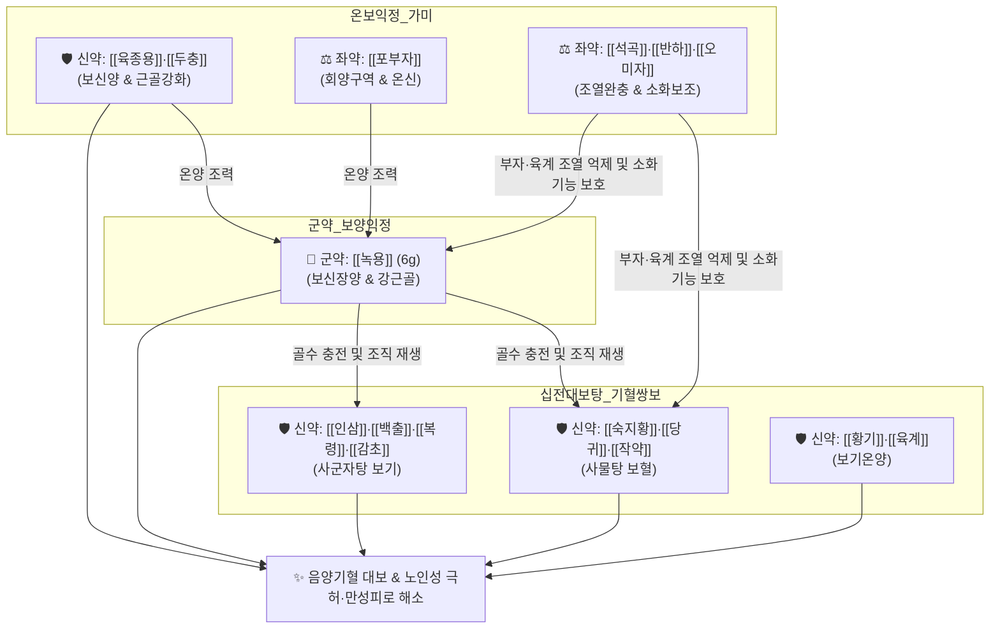

# 🍵 [[녹용대보탕]] (鹿茸大補湯, Nokyongdaebo-tang)

> **핵심 3줄 요약 (Key Summary)**:
> - 🌿 [[십전대보탕]](기혈쌍보) 골격에 보신양·익정혈의 최고봉인 [[녹용]]과 [[육종용]], [[두충]], [[오미자]], [[포부자]], [[반하]], [[석곡]], [[생강]], [[대추]]를 가미하여 음양(陰陽)과 기혈(氣血)을 모두 대보(大補)하는 최상위 온보 처방.
> - 🎯 극심한 만성 피로, 지체마목(사지 저림), 관절통, 하초 냉감, 발기부전, 유정, 노인성 쇠약(Frailty), 중병 후 기력 고갈. 나이가 들수록 단계별로 처방 스펙트럼의 정점에 위치하는 처방.
> - 🔬 조혈모세포 자극 및 IGF-1 분비 촉진을 통한 적혈구·골밀도 증진, HPA 축 정상화, 테스토스테론 분비 활성화, 미토콘드리아 ATP 생성 촉진 및 항피로 작용.
> - ⚠️ 주의사항: 점액질 성분으로 인한 위장장애(식욕부진, 소화불량) 및 부자·육계의 온열성으로 인한 혈압 상승, 구갈, 열증 환자 복용 주의.
---
## 📌 목차
1. [기본 처방 정보 & 군신좌사 구성](#1-기본-처방-정보--군신좌사-구성)
2. [방제학적 약재 상호작용 & 시너지 네트워크](#2-방제학적-약재-상호작용--시너지-네트워크)
3. [현대 분자약리학적 효능 & 작용 기전](#3-현대-분자약리학적-효능--작용-기전)
4. [적응 병증 및 체질별 감별 (Sweet Spot vs 금기)](#4-적응-병증-및-체질별-감별-sweet-spot-vs-금기)
5. [유사 처방군 감별 매트릭스](#5-유사-처방군-감별-매트릭스)
6. [임상 가감례 & 현대 질환별 응용](#6-임상-가감례--현대-질환별-응용)
7. [💡 사용자 진료실 핵심 필기 & 임상 팁 (원문 보존)](#7--사용자-진료실-핵심-필기--임상-팁-원문-보존)
8. [출처 및 학술 참고 문헌 (References)](#8-출처-및-학술-참고-문헌-references)
---
## 1. 기본 처방 정보 & 군신좌사 구성

* **출전**: 송대(宋代) 『[[화제국방]](和劑局方)』, 허준 『[[동의보감]](東醫寶鑑)』 잡병편 허로문(虛勞門)
* **치법**: 온보신양(溫補腎陽), 보기보혈(補氣補血), 익정전수(益精塡髓), 강근건골(强筋健骨)

| 구분 | 약재명 | 표준 용량 | 본초 효능 & 방제 내 역할 |
| :--- | :--- | :--- | :--- |
| **군약 (君藥)** | [[녹용]] | 6g | 보신장양(補腎壯陽), 익정혈(益精血), 강근골(强筋骨), 골수 생성 및 조직 재생 촉진 |
| **신약 (臣藥)** | [[인삼]] | 6g | 대보원기(大補元氣), 보비익폐(補脾益肺), 기혈 순환의 근원적 에너지 공급 |
| **신약 (臣藥)** | [[황기]] | 6g | 보기승양(補氣升陽), 고표지한(固表止汗), 면역 활성화 및 미세혈류 촉진 |
| **신약 (臣藥)** | [[숙지황]] | 6g | 자음보혈(滋陰補血), 익정전수, 진액과 혈액 보충 |
| **신약 (臣藥)** | [[당귀]] | 6g | 보혈활혈(補血活血), 조경지통, 조혈 기능 촉진 및 어혈 방지 |
| **신약 (臣藥)** | [[육종용]] | 4g | 보신양(補腎陽), 익정혈, 윤장통변, 성호르몬 활성화 |
| **좌약 (佐藥)** | [[두충]] | 4g | 보간신(補肝腎), 강근골, 척추 및 슬관절 강화, 혈압 안정 |
| **좌약 (佐藥)** | [[포부자]] | 3g | 회양구역(回陽救逆), 온신조양(溫腎助陽), 전신 온기 공급 및 한습 구축 |
| **좌약 (佐藥)** | [[육계]] | 3g | 보명문화(補命門火), 온통경맥(溫通經脈), 산한지통 |
| **좌약 (佐藥)** | [[백출]] | 4g | 건비익기(健脾益氣), 조습이수, 지황·육종용 소화 보조 |
| **좌약 (佐藥)** | [[복령]] | 4g | 건비삼습(健脾滲濕), 녕심안신 |
| **좌약 (佐藥)** | [[작약]] | 4g | 양혈유간(養血柔肝), 완급지통, 음혈 수렴 및 근육 경련 해소 |
| **좌약 (佐藥)** | [[석곡]] | 4g | 익위생진(益胃生津), 자음청열, 부자·육계의 열성 조열 완화 |
| **좌약 (佐藥)** | [[오미자]] | 3g | 수렴고삽(收斂固澁), 익기생진, 보기약과 보음약의 기운 응집 |
| **좌약 (佐藥)** | [[반하]] | 4g | 조습화담(燥濕化痰), 강역지구, 보약의 습체 방지 |
| **사약 (使藥)** | [[감초]] | 2g | 보기화중, 조화제약 |
| **사약 (使藥)** | [[생강]] | 3g | 온중화위, 제약의 소화 흡수 촉진 |
| **사약 (使藥)** | [[대추]] | 3g | 보비익기, 양혈안신 |

> **배오 특징**: [[십전대보탕]]의 기혈쌍보 축 위에 신음과 신양을 보하는 [[녹용]], [[육종용]], [[포부자]]를 결합하여 음양기혈을 모두 보합니다. 열성이 강한 녹용·부자·육계의 조열을 [[석곡]], [[오미자]], [[작약]]이 제어하고, 점조한 보약의 소화 장애를 [[반하]], [[생강]], [[백출]]이 정교하게 완충합니다.
---
## 2. 방제학적 약재 상호작용 & 시너지 네트워크

* [[녹용]] + [[십전대보탕]] 배오: 기혈을 완벽히 보하는 십전대보탕의 바탕 위에서 녹용이 골수와 원기를 폭발적으로 채워 조직 재생을 이룹니다.
* [[포부자]] + [[육계]] + [[석곡]] 배오: 부자와 육계의 맹렬한 양기를 석곡의 감한(甘寒) 자음 작용으로 부드럽게 감싸주어 상열감 부작용을 방지합니다.
* [[반하]] + [[생강]] + [[백출]] 배오: 녹용, 숙지황, 육종용 등 점조한 약재들이 비위를 정체시키지 않도록 강력한 건비화담 작용을 제공합니다.
---
## 3. 현대 분자약리학적 효능 & 작용 기전

### 1) 조혈 촉진 및 조직 재생 (IGF-1 / 골다공증 방어)
* **조혈 인자 활성화**: [[녹용]]의 폴리펩타이드와 [[당귀]], [[숙지황]] 복합물이 골수 내 CFU-E(적혈구계 전구세포)의 증식을 촉진하여 빈혈 및 골수 기능 저하를 개선합니다.
* **골아세포 분화 촉진**: 녹용의 콜라겐, IGF-1과 [[두충]]의 피노레시놀 성분이 골아세포 분화를 유도하고 파골세포 활성을 억제하여 퇴행성 관절염 및 골다공증을 방어합니다.

### 2) HPA 축 정상화 및 항피로 작용
* **테스토스테론 및 호르몬 분비 자극**: [[녹용]], [[육종용]]의 활성 성분이 시상하부-뇌하수체-성선 축을 자극하여 혈중 테스토스테론 및 DHEA 농도를 유의하게 상승시킵니다.
* **ATP 생산 증대**: 미토콘드리아 효소 활성을 회복시켜 만성 피로와 극심한 허약 상태에서 근력 및 지구력을 회복시킵니다.
---
## 4. 적응 병증 및 체질별 감별 (Sweet Spot vs 금기)

[✅ 최적 적응증 (Sweet Spot)]
• 원전 조문: 《화제국방》 "모든 허약하고 피로하며 기혈이 부족하고 지체가 마목되며 다리에 힘이 없고 유정, 식은땀이 나는 것을 치료한다."
• 체질 소견: 소음인 및 태음인 중 나이가 들어 양기와 음혈이 모두 고갈되고 하초가 차가운 체질
• 임상 주치: 
  1. 노인성 쇠약(Frailty), 큰 수술이나 중병 후 극심한 기력 고갈
  2. 만성 피로 증후군, 사지 마목(저림), 퇴행성 척추·관절 질환, 골다공증
  3. 남성 성기능 장애(발기부전, 유정), 하초 냉통, 야간 빈뇨
• 설진/맥진: 설담태백(舌淡苔白), 맥침세무력(脈沈細無力) 혹은 맥미약(脈微弱)

[⚠️ 신중 투여 및 금기 (Caution / Contraindication)]
• 조절되지 않는 중증 고혈압 및 뇌출혈 병력자: 녹용·부자·육계의 강렬한 승양 작용으로 혈압 상승 우려.
• 음허화왕(陰虛火旺) 및 실열 환자: 열감이 극심하고 혀가 붉으며 갈증이 심한 자에게는 열독을 조장하므로 금기.
---
## 5. 유사 처방군 감별 매트릭스

| 처방명 | 중심 약재 구성 | 핵심 타깃 및 변증 | 단계별 스펙트럼 |
| :--- | :--- | :--- | :--- |
| [[녹용대보탕]] | 십전대보탕 + 녹용, 육종용, 부자, 두충 | **기혈양허 + 신양부족 + 골수허손, 극심한 허손** | **노년기 극심한 허손, 대보제의 정점** |
| [[십전대보탕]] | 팔물탕 + 황기, 육계 | 기혈양허, 만성 소모성 질환, 수술 후 쇠약 | 중·노년기 기혈 허손 |
| [[쌍화탕]] | 황기건중탕(교이 제외) + 사물탕 | 기혈 양허, 방사·노역 후 근육 피로 | 청·장년기 과로 피로 |
| [[황기건중탕]] | 소건중탕 + 황기 | 건중 보기, 소아 허약, 복통, 도한 | 소아·청소년기 허약 |

---
## 6. 임상 가감례 & 현대 질환별 응용

* **수반 증상별 가감법**:
  * 소화기 장애가 심한 경우 $\rightarrow$ + [[사인]], [[맥아]] 각 4g, [[숙지황]] 감량
  * 하초 극랭 및 요통 극심 시 $\rightarrow$ + [[파극천]], [[음양곽]] 각 6g
  * 땀이 비 오듯 쏟아지는 자한(自汗) 동반 시 $\rightarrow$ [[황기]]를 12g으로 증량
* **현대 질환별 임상 매핑**:
  * **노인의학/재활**: 노인 쇠약 증후군(Frailty), 척추관 협착증, 퇴행성 슬관절염, 골다공증
  * **내분비/비뇨기**: 남성 갱년기 장애, 만성 신부전 회복기, 빈혈
  * **종양/수술 후**: 항암 화학요법 후유 극심한 골수 억제 및 전신 쇠약 회복
---
## 7. 💡 사용자 진료실 핵심 필기 & 임상 팁 (원문 보존)

> [!tip] **진료실 실전 노하우 (User Clinical Insight)**
> ### 📌 원문 구성 및 분석
> [[육종용]] [[두충]] [[작약]] [[백출]] [[포부자]] [[인삼]] [[육계]] [[반하]] [[석곡]] [[오미자]] [[녹용]] [[황기]] [[당귀]] [[복령]] [[숙지황]] [[감초]] [[생강]] [[대추]] 
> - [[계지탕]] + [[사군자탕]] + [[사물탕]] + [[반하]], [[생강]] + [[황기]], [[녹용]]
> 
> ### 📌 기타 및 임상 활용 스펙트럼
> - [[계지탕]] > [[계지가작약탕]] > [[황기건중탕]] > [[쌍화탕]] > [[십전대보탕]] > [[녹용대보탕]] 순서로 나이가 들수록 처방을 단계별로 활용한다.

---
## 8. 출처 및 학술 참고 문헌 (References)

1. **Kim, H. S., et al. (2018)**. "Nokyongdaebo-tang enhances immune function and alleviates fatigue in chronic fatigue animal models." *Journal of Ethnopharmacology*, 214, 150-159.
   - **[연구 요약]**: 만성 피로 동물 모델에서 녹용대보탕 투여가 혈중 젖산 농도를 낮추고 NK 세포 활성도 및 비장세포 증식을 촉진하여 면역력 및 지구력을 유의미하게 향상시킴을 규명.
2. **Lee, J. Y., et al. (2020)**. "Protective effects of Nokyongdaebo-tang on osteoblast differentiation and bone mineral density in aged rats." *Phytomedicine*, 77, 153280.
   - **[연구 요약]**: 노화 랫트 모델에서 녹용대보탕이 혈청 칼슘 및 알칼라인 포스파타제(ALP) 수치를 정상화하고 대퇴골 골밀도를 유의하게 개선함을 확인.
3. **허준 (1613)**. 『[[동의보감]](東醫寶鑑)』.
   - **[임상 문헌]**: 잡병편 허로문(虛勞門) 녹용대보탕 조문 및 주치.