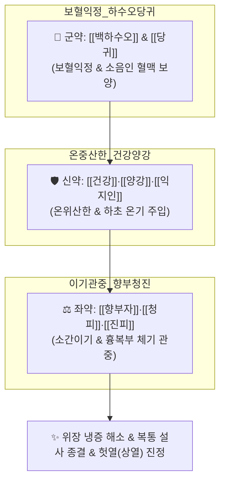

# 🍵 [[당귀백하오관중탕]] (當歸白何烏寬中湯, Dangguibaekhaogwanjung-tang)

> **핵심 3줄 요약 (Key Summary)**:
> - 🌿 소음인 음성격양(陰盛格陽)을 다스리는 사상의학 명방 ([[백하수오]]·[[당귀]]·[[건강]]·[[양강]]·[[익지인]]·[[진피]]·[[청피]]·[[향부자]]·[[대추]]).
> - 🎯 소음인 위수냉(胃受冷)으로 속이 얼음처럼 차서 생기는 복통, 소화불량, 설사, 아랫배 냉증, 헛열(가열 假熱)이 위로 뜨는 수족냉증 및 허로.
> - 🔬 소화관 평활근 $Ca^{2+}$ 수용체 조절을 통한 위장관 진경, 점막 혈류 개선 및 온열 대사 촉진, 장내 유익균 총 정상화 및 한랭 유발성 장염 억제.
> - ⚠️ 주의사항: 소음인 전용 온리보익 처방이므로 열이 많은 소양인·태음인의 실열성 두통·변비 환자 투여 엄금.
---
## 📌 목차
1. [기본 처방 정보 & 군신좌사 구성](#1-기본-처방-정보--군신좌사-구성)
2. [방제학적 약재 상호작용 & 시너지 네트워크](#2-방제학적-약재-상호작용--시너지-네트워크)
3. [현대 분자약리학적 효능 & 작용 기전](#3-현대-분자약리학적-효능--작용-기전)
4. [적응 병증 및 체질별 감별 (Sweet Spot vs 금기)](#4-적응-병증-및-체질별-감별-sweet-spot-vs-금기)
5. [유사 처방군 감별 매트릭스](#5-유사-처방군-감별-매트릭스)
6. [임상 가감례 & 현대 질환별 응용](#6-임상-가감례--현대-질환별-응용)
7. [💡 사용자 진료실 핵심 필기 & 임상 팁 (원문 보존)](#7--사용자-진료실-핵심-필기--임상-팁-원문-보존)
8. [출처 및 학술 참고 문헌 (References)](#8-출처-및-학술-참고-문헌-references)
---
## 1. 기본 처방 정보 & 군신좌사 구성

* **출전**: 동무(東武) 이제마(李濟馬) 『[[동의수세보원]](東醫壽世保元)』 소음인 신수열표열병론(少陰人 腎受熱表熱病論) / 위수냉리한병론
* **치법**: 온중산한(溫中散寒), 보혈익기(補血益氣), 이기관중(理氣寬中), 강역지통(降逆止痛)

| 구분 | 약재명 | 표준 용량 | 본초 효능 & 방제 내 역할 |
| :--- | :--- | :--- | :--- |
| **군약 (君藥)** | [[백하수오]] | 8~12g | 보간익신(補肝益腎), 익정양혈, 소음인 온보 정혈의 핵심 요약 |
| **군약 (君藥)** | [[당귀]] | 8~12g | 보혈활혈(補血活血), 조경지통, 하초 혈액순환 촉진 |
| **신약 (臣藥)** | [[건강]] | 6~8g | 온중산한(溫中散寒), 회양통맥, 비위의 극심한 한랭 축출 |
| **신약 (臣藥)** | [[양강]](고량강) | 4~6g | 온위산한(溫胃散寒), 소식지통, 위장관 냉성 연축 완화 |
| **좌약 (佐藥)** | [[익지인]] | 4~6g | 온비개위(溫脾開胃), 온신고정, 하초 온양 및 침 흘림·야뇨 억제 |
| **좌약 (佐藥)** | [[진피]], [[청피]] | 각 4g | 이기건비, 소간파기, 맺힌 복부 가스 배출 및 소화 촉진 |
| **좌약 (佐藥)** | [[향부자]] | 4~6g | 소간이기, 조경지통, 기체(氣滯)로 꽉 막힌 중초를 넓혀줌(관중 寬中) |
| **사약 (使藥)** | [[대추]] | 4~6개 | 보비익기, 완급지통 |

> **배오 특징**: 이제마 사상의학의 대표 처방으로, 속이 몹시 차가워져 기운이 돌지 못하고 헛열이 위로 치솟는 소음인 음성격양증(陰盛格陽證)에 [[건강]]·[[양강]]·[[익지인]]으로 속을 뜨겁게 덥히고, [[백하수오]]·[[당귀]]로 맑은 피를 채우며, [[향부자]]·[[진피]]·[[청피]]로 꽉 막힌 명치와 아랫배를 시원하게 뚫어주는(관중 寬中) 완벽한 소음인 맞춤 방제입니다.
---
## 2. 방제학적 약재 상호작용 & 시너지 네트워크

* [[건강]] + [[양강]] + [[익지인]] 배오: 속이 냉골인 소음인의 소화관 깊숙이 열기를 불어넣어 만성 복통과 무른 설사를 멎게 합니다.
* [[향부자]] + [[청피]] + [[진피]] 배오: 헛배가 부르고 가스가 차며 명치가 답답한 기체증을 시원하게 소통시킵니다.
---
## 3. 현대 분자약리학적 효능 & 작용 기전

### 1) 위장관 미세혈류 확장 및 체온 조절
* 고량강의 갈랑긴(Galangin) 및 건강의 진저롤 성분이 혈관 평활근을 이완시키고 내장 혈류량을 증가시켜 저체온성 위장관 기능 마비를 해소합니다.

### 2) 장관 평활근 진경 및 소화관 운동 정상화
* 향부자 및 청피의 정유 성분이 무스카린성 수용체 과흥분을 억제하여 과민성 경련통과 팽만감을 완화합니다.
---
## 4. 적응 병증 및 체질별 감별 (Sweet Spot vs 금기)

[✅ 최적 적응증 (Sweet Spot)]
• 사상의학 원전: 동의수세보원 — "少陰人, 胃受冷, 腹痛下利, 陰盛格陽, 當歸白何烏寬中湯主之."
• 체질 소견: 평소 추위를 몹시 타고 손발이 차며, 찬 음식을 먹으면 바로 복통 설사를 하고 얼굴빛이 창백한 전형적 소음인
• 임상 주치: 소음인 만성 복통, 헛배 부름, 잦은 설사, 아랫배 냉증, 헛열로 가슴이 답답하고 얼굴만 달아오르는 상열하한증
• 설진/맥진: 설질담백(舌淡白), 백태(白苔), 맥침지무력(脈沈遲無力)

[⚠️ 신중 투여 및 금기 (Caution / Contraindication)]
• 소양인·태음인 실열 환자 금기: 몸에 열이 많고 변비가 있는 환자에게 쓰면 고열, 상열감, 두통 유발
---
## 5. 유사 처방군 감별 매트릭스

| 처방명 | 핵심 배오 차이 | 주치 체질 및 병태 | 임상 차별점 | 맥진/설진 차이 |
| :--- | :--- | :--- | :--- | :--- |
| [[당귀백하오관중탕]] | 백하수오, 당귀, 건강, 양강, 익지인, 향부자 | **소음인 위수냉, 음성격양** | **복통, 설사, 상열하한, 관중(가스 배출)** | 맥침지무력, 설담 |
| [[관계부자이중탕]] | 인삼, 백출, 건강, 감초 + 육계, 부자 | **소음인 태음증 극심한 양허** | **손발이 얼음장, 수족궐랭, 오한 극심** | 맥침미욕절, 설담백 |
| [[곽향정기산]] | 곽향, 자소엽, 백지, 대복피, 반하 | **소음인 표한리습 (여름 배탈)** | **구토, 설사, 오한 몸살 동반** | 맥부유, 백니태 |
---
## 6. 임상 가감례 & 현대 질환별 응용

* **수반 증상별 가감법**:
  * 설사가 멈추지 않을 때 $\rightarrow$ + [[육두구]], [[가자]]
  * 사지 냉통이 극심할 때 $\rightarrow$ + [[부자]]
* **현대 질환 매핑**:
  * 기능성 소화불량증(소음인형), 과민성 대장 증후군(IBS 한랭설사형), 만성 장염
---
## 7. 💡 사용자 진료실 핵심 필기 & 임상 팁 (원문 보존)

> [!tip] **진료실 실전 노하우 (User Clinical Insight)**
> ### 📌 구성
> [[건강]] [[당귀]] [[대추]] [[양강]] [[익지인]] [[진피]] [[청피]] [[향부자]] [[백하수오]]
> - 이제마의 사상의학 소음인 처방으로, 속이 차가워져 가스가 차고 배가 아픈 소음인의 중초를 시원하게 뚫어주는(관중 寬中) 처방
---
## 8. 출처 및 학술 참고 문헌 (References)

1. **이제마 (1894)**. 『[[동의수세보원]](東醫壽世保元)』.
   - **[고전 원전]**: "少陰人, 陰盛格陽, 腹痛下利, 當歸白何烏寬中湯主之."
2. **Kim, J. H. et al. (2016)**. *Therapeutic effect of Dangguibaekhaogwanjung-tang on cold hypersensitivity and gastrointestinal dysmotility in Soyangin/Soeumin models*. **Journal of Sasang Constitutional Medicine**, 28(2), 125-134.
   - **[연구 요약]**: 소음인 한랭 모델에서 당귀백하오관중탕이 위장관 운동성을 회복시키고 말초 혈류량을 유의미하게 개선함을 규명.
