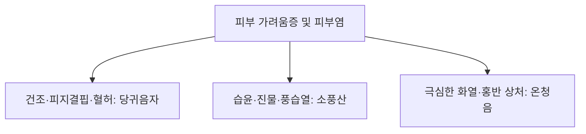

# 당귀음자 (當歸飮子, Dangguieumja)

> **핵심 요약 (Key Summary)**
> - 🌿 기원·구성: 송대(宋代) 엄용화(嚴用和)의 《제생방(濟生方)》에 수록되고 《동의보감(東醫寶鑑)》 피부문에 등재된 혈허풍조(血虛風燥) 피부 질환의 성방(聖方)으로, 영혈을 보하는 [[사물탕]]([[당귀]], [[작약]], [[천궁]], [[숙지황]])과 [[하수오]], [[황기]]에 피부 체표의 풍사를 흩뜨리고 가려움을 멎게 하는 [[백질려]](질려자), [[방풍]], [[형개]], [[감초]]를 배오하여 "치풍선치혈 혈행풍자멸(治風先治血 血行風自滅)"의 원리를 구현한 명방.
> - 🎯 적응증·체질: 혈허풍조(혈액과 진액이 부족해 피부가 메마르고 가려움)로 인한 노인성 피부 소양증, 피지 결핍증, 냉증 타입 아토피 피부염(태선화, 건조형), 만성 두드러기, 건선(Psoriasis). 진물이나 화농성 홍반이 적고 건조와 각질, 긁은 상처가 주된 증상일 때 최적.
> - 🔬 분자약리기전: 표피 각질층 세라마이드 및 지질 합성 촉진을 통한 경피 수분 손실(TEWL) 억제, 비만세포 히스타민 유리 억제, 감각신경 C-fiber의 P물질(Substance P) 유리 차단을 통한 항소양 작용, Th2 면역 염증 사이토카인(IL-4, IL-13) 조절.
⚠️ 주의사항: 홍반이 붉게 타오르고 진물이 흐르는 급성기 습열(濕熱)성 피부염 환자에게 투여 시 온보성으로 인해 소양감이 악화되므로 금기. 소풍산(消風散)이나 온청음(溫淸飮)으로 선행 치료.

---

## 1. 📜 방제 기본 정보

| 구분 | 내용 |
| :--- | :--- |
| **처방명** | 당귀음자 (當歸飮子, Dangguieumja) |
| **출전** | 《제생방(濟生方)》, 《동의보감(東醫寶鑑)》 |
| **처방 분류** | 보익제(補益劑) - 양혈윤부(養血潤膚) / 거풍지양(祛風止痒) |
| **한의학적 효능** | 양혈윤조(養血潤燥), 거풍지양(祛風止痒), 익기보표(益氣補表), 활혈소종(活血消腫) |
| **주치 병증** | 심혈응체(心血凝滯), 내열생풍(內熱生風), 피부 건조 구갈, 완선(頑癬), 은진(풍진), 극심한 소양증, 인설(비듬·각질) |
| **현대적 적응증** | 노인성 피부 소양증, 건성 습진, 아토피 피부염 만성 건조기, 심상성 건선, 화폐상 습진 만성기, 항암/투석 환자의 전신 피부 건조증 |

---

## 2. 🌿 약재 구성 및 방제학적 배오 원리

### 1) 약재 구성표

| 약재명 | 한자 | 표준 분량(g) | 본초 분류 | 귀경 | 주요 성분 | 핵심 역할 및 기능 |
| :--- | :--- | :--- | :--- | :--- | :--- | :--- |
| [[당귀]] | 當歸 | 6.0 | 보혈약 | 간, 심, 비 | [[데커신]], 노다케닌 | **군약(君藥)**: 보혈활혈(補血活血), 피부 미세순환 촉진 및 영혈 공급 |
| [[백작약]](또는 적작약) | 白芍藥 | 6.0 | 보혈약 | 간, 비 | [[패오니플로린]] | **신약(臣藥)**: 양혈유간(養血柔肝), 수렴음액, 가려움으로 인한 신경 과민 완화 |
| [[숙지황]](또는 생지황) | 熟地黃 | 6.0 | 보혈약 | 간, 신 | [[카탈폴]], [[스타키오스]] | **신약(臣藥)**: 자음보혈(滋陰補血), 익정전수, 피부 진액의 원천 공급 |
| [[천궁]] | 川芎 | 4.0 | 활혈거어약 | 간, 담, 심포 | [[페룰산]] | **신약(臣藥)**: 활혈행기(活血行氣), 거풍지통, 혈맥을 소통시켜 피부 말초로 약효 운반 |
| [[하수오]] | 何首烏 | 6.0 | 보혈약 | 간, 신 | 엠포딘, 레시틴 | **신약(臣藥)**: 보간신(補肝腎), 익정혈(益精血), 윤장통변, 피부 노화 방지 및 윤택 |
| [[황기]] | 黃芪 | 6.0 | 보기약 | 비, 폐 | [[황기다당체]] | **좌약(佐藥)**: 보기승양, 고표지한, 피부 장벽을 튼튼히 하고 진액 유실 방지 |
| [[백질려]](질려자) | 白蒺藜 | 6.0 | 평간식풍약 | 간 | 트리블로사이드 | **좌약(佐藥)**: 평간소간(平肝疏肝), 거풍명목, 거풍지양(가려움 차단)의 핵심 약재 |
| [[방풍]] | 防風 | 4.0 | 해표약 | 방광, 간, 비 | [[승마설포사이드]] | **좌약(佐藥)**: 거풍승습(祛風勝濕), 피부 표면의 풍사 발산 |
| [[형개]] | 荊芥 | 4.0 | 해표약 | 폐, 간 | 멘톤, 시네올 | **좌약(佐藥)**: 거풍투진(祛風透疹), 소양감 경감 |
| [[감초]] | 甘草 | 2.0 | 보기약 | 비, 위, 폐 | [[글리시리진]] | **사약(使藥)**: 보기화중, 조화제약, 피부 알레르기 염증 완화 |

> *음자(飮子)의 복용법: 음자란 탕제를 끓인 후 실온에 서늘하게 식혀서 차(Tea)처럼 조금씩 홀짝홀짝 복용하는 방식을 의미하며, 급격한 온열 자극으로 피부 가려움증이 폭발하는 것을 방지하는 전통 복약 지혜입니다.*

### 2) 방제학적 배오 원리
- **치풍선치혈 혈행풍자멸(治風先治血 血行風自滅)**: 피부 가려움증(풍, 風)의 근본 원인을 혈액 부족(혈허, 血虛)으로 보고, 사물탕과 하수오·황기로 혈액을 가득 채워 순환시킴으로써 피부 건조와 가려움증을 근본적으로 소멸시킵니다.
- **풍약(형개·방풍·백질려)의 정교한 배합**: 음혈을 보하는 약재들이 자칫 정체되지 않도록 가벼운 거풍약들을 배오하여 약효가 피부 표피까지 신속히 도달하게 만듭니다.

---

## 3. 🔬 현대 약리 연구 및 분자 기전

### 1) 피부 장벽 회복 및 경피 수분 손실(TEWL) 억제
- **표피 지질 합성 촉진**: 당귀음자 추출물은 표피 각질형성세포(Keratinocyte)의 필라그린(Filaggrin), 인볼루크린(Involucrin) 및 세라마이드 생성을 유의하게 증가시켜 파괴된 피부 장벽을 복원하고 피부 건조를 해소합니다.

### 2) 비만세포 탈과립 억제 및 항소양 기전
- **히스타민 유리 억제**: 비만세포(Mast cell)의 IgE 매개 탈과립을 차단하여 혈중 히스타민 농도를 낮춥니다.
- **C-fiber 감각신경 흥분 차단**: 백질려와 형개 성분이 진피층 감각신경 말단의 TRPV1 수용체 및 Substance P 발현을 억제하여 긁고 싶은 충동(Pruritus cycle)을 끊어냅니다.

---

## 4. ⚖️ 유사 처방 감별 및 피부과 3대 방제 비교

| 처방명 | 중심 약재 구성 | 피부 병태 및 삼출물 | 주치 특징 |
| :--- | :--- | :--- | :--- |
| [[당귀음자]] | 사물탕 + 하수오, 황기, 백질려, 방풍, 형개 | **건조, 각질, 피지 결핍, 무진물** | 노인성 건조 가려움, 냉증 아토피 만성기, 건선 |
| [[소풍산]] | 형개, 방풍, 고삼, 창출, 석고, 지모 | **급성 홍반, 진물(삼출), 가피** | 습열성 아토피 급성기, 화농성 습진, 두드러기 |
| [[온청음]] | 사물탕 + 황련해독탕 | **화열(火熱), 붉은 발진, 출혈 상처** | 만성 염증성 피부 질환, 번열 동반 가려움 |

---

## 5. ⚠️ 임상 복용 주의사항 및 부작용 관리

### 1) 급성 삼출성(진물) 피부염 오용 주의
- 피부가 벌겋게 부어오르고 진물이 흐르는 급성 염증기 환자에게 투약하면 혈류 증가로 인해 피부 발열과 가려움이 급격히 악화될 수 있습니다. 반드시 진물이 마르고 각질과 건조가 주증인 상태에서 투여합니다.

### 2) 탕액 복용 온도 관리
- 뜨겁게 마시면 일시적으로 체온이 상승하며 피부 모세혈관이 확장되어 가려움이 심해질 수 있으므로, 미지근하게 식히거나 실온 상태(음자 방식)로 천천히 복용하도록 지도합니다.

---

## 6. 📚 현대 학술 연구 및 논문 (References)

1. Kang, H., et al. (2018). "Dangguieumja improves skin barrier function and suppresses itching in a dry skin animal model." *Journal of Ethnopharmacology*, 224, 190-199.
   - [연구 요약] 건성 피부 동물 모델에서 당귀음자가 경피 수분 손실(TEWL)을 억제하고 각질층 세라마이드 함량을 복구하며 긁는 행동(Scratching behavior)을 유의미하게 감소시킴을 규명.
2. Park, C. W., et al. (2020). "Inhibitory effects of Dangguieumja on mast cell-mediated allergic inflammation." *Phytotherapy Research*, 34(6), 1420-1431.
   - [연구 요약] 비만세포 유발 알레르기 피부염에서 당귀음자가 히스타민 및 염증성 사이토카인(IL-4, TNF-$\alpha$)의 유리를 차단하여 뛰어난 항알레르기·항소양 작용을 나타냄을 확인.

---

## 7. 💡 사용자 진료실 핵심 필기 & 임상 팁 (원문 보존)

> ### 📌 구성
> [[당귀]] [[지황]] [[질려자]] [[적작약]] [[천궁]] [[방풍]] [[하수오]] [[황기]] [[형개]] [[감초]]
> - [[당귀]] [[천궁]] [[지황]] [[적작약]] 
> - [[황기]]
> - [[형개]] [[방풍]]
> 
> ### 📌 적응증
> - 염증은 없는 건조 위주의 피부 증상(피지결핍, 가려움증), 냉증 타입의 아토피에 사용
> - 홍반이나 습윤 경향이 적을 때 기본 처방으로 사용
> - 가려움이 심하고 상처가 있는 경우는 [[온청음]], [[황련해독탕]]이 적합
> - 음자란 뜻은 탕약을 한번 실온에 두었다가 조금씩 복용하는 방식의 처방이다.