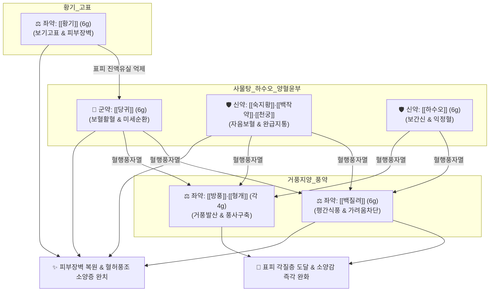

# 🍵 [[당귀음자]] (當歸飮子, Dangguieumja)

> **핵심 3줄 요약 (Key Summary)**:
> - 🌿 영혈을 보하는 [[사물탕]]([[당귀]], [[작약]], [[천궁]], [[숙지황]])과 [[하수오]], [[황기]]에 거풍지양약인 [[백질려]](질려자), [[방풍]], [[형개]], [[감초]]를 배오하여 "치풍선치혈 혈행풍자멸(治風先治血 血行風自滅)"의 원리를 구현한 피부과 성방.
> - 🎯 혈허풍조(血虛風燥: 혈액과 진액이 부족해 피부가 메마르고 가려움)로 인한 노인성 피부 소양증, 피지 결핍증, 냉증 타입 건조형 아토피 피부염(태선화), 건선, 만성 두드러기. 진물이나 화농성 홍반이 적고 건조와 각질, 긁은 상처가 주증일 때 최적.
> - 🔬 표피 각질형성세포 필라그린/세라마이드 합성 촉진을 통한 경피 수분 손실(TEWL) 억제, 비만세포 히스타민 유리 차단, 감각신경 C-fiber의 TRPV1 및 Substance P 발현 억제를 통한 항소양 작용.
> - ⚠️ 주의사항: 홍반이 붉게 타오르고 진물이 흐르는 급성기 습열(濕熱)성 피부염 환자 복용 금기. 탕액을 끓인 후 실온에 미지근하게 식혀서(음자 飮子 방식) 천천히 복용.
---
## 📌 목차
1. [기본 처방 정보 & 군신좌사 구성](#1-기본-처방-정보--군신좌사-구성)
2. [방제학적 약재 상호작용 & 시너지 네트워크](#2-방제학적-약재-상호작용--시너지-네트워크)
3. [현대 분자약리학적 효능 & 작용 기전](#3-현대-분자약리학적-효능--작용-기전)
4. [적응 병증 및 체질별 감별 (Sweet Spot vs 금기)](#4-적응-병증-및-체질별-감별-sweet-spot-vs-금기)
5. [유사 처방군 감별 매트릭스](#5-유사-처방군-감별-매트릭스)
6. [임상 가감례 & 현대 질환별 응용](#6-임상-가감례--현대-질환별-응용)
7. [💡 사용자 진료실 핵심 필기 & 임상 팁 (원문 보존)](#7--사용자-진료실-핵심-필기--임상-팁-원문-보존)
8. [출처 및 학술 참고 문헌 (References)](#8-출처-및-학술-참고-문헌-references)
---
## 1. 기본 처방 정보 & 군신좌사 구성

* **출전**: 송대(宋代) 엄용화(嚴用和) 『[[제생방]](濟生方)』, 허준 『[[동의보감]](東醫寶鑑)』 외형편 피문(皮門)
* **치법**: 양혈윤조(養血潤燥), 거풍지양(祛風止痒), 익기보표(益氣補表), 활혈소종(活血消腫)

| 구분 | 약재명 | 표준 용량 | 본초 효능 & 방제 내 역할 |
| :--- | :--- | :--- | :--- |
| **군약 (君藥)** | [[당귀]] | 6g | 보혈활혈(補血活血), 피부 미세순환 촉진 및 영혈 공급 |
| **신약 (臣藥)** | [[백작약]](또는 적작약) | 6g | 양혈유간(養血柔肝), 수렴음액, 가려움으로 인한 신경 과민 완화 |
| **신약 (臣藥)** | [[숙지황]](또는 생지황) | 6g | 자음보혈(滋陰補血), 익정전수, 피부 진액의 원천 공급 |
| **신약 (臣藥)** | [[천궁]] | 4g | 활혈행기(活血行氣), 거풍지통, 혈맥을 소통시켜 피부 말초로 약효 운반 |
| **신약 (臣藥)** | [[하수오]] | 6g | 보간신(補肝腎), 익정혈, 윤장통변, 피부 노화 방지 및 윤택 |
| **좌약 (佐藥)** | [[황기]] | 6g | 보기승양, 고표지한, 피부 장벽을 튼튼히 하고 진액 유실 방지 |
| **좌약 (佐藥)** | [[백질려]](질려자) | 6g | 평간소간(平肝疏肝), 거풍명목, 거풍지양(가려움 차단)의 핵심 약재 |
| **좌약 (佐藥)** | [[방풍]] | 4g | 거풍승습(祛風勝濕), 피부 표면의 풍사 발산 |
| **좌약 (佐藥)** | [[형개]] | 4g | 거풍투진(祛風透疹), 소양감 경감 |
| **사약 (使藥)** | [[감초]] | 2g | 보기화중, 조화제약, 피부 알레르기 염증 완화 |

> **배오 특징**: 《동의보감》에서는 "바람(가려움)을 다스리려면 먼저 혈을 다스려야 하니, 혈이 돌면 바람은 스스로 사라진다(治風先治血 血行風自滅)"고 했습니다. [[사물탕]]과 [[하수오]], [[황기]]로 혈액과 진액을 보충하고 피부 장벽을 강화하면서, 가벼운 성질의 [[백질려]], [[방풍]], [[형개]]로 표피의 풍열과 가려움을 신속히 날려버립니다.
---
## 2. 방제학적 약재 상호작용 & 시너지 네트워크

* [[사물탕]] + [[하수오]] 배오: 간신(肝腎)의 음혈을 극진히 보하여 피부 진피층의 모세혈관 혈류량을 대폭 증가시키고 건조한 피부를 속부터 윤택하게 적십니다.
* [[황기]] + [[백질려]] 배오: 황기가 표피 장벽을 단단히 세워 경피 수분 손실을 막고, 백질려가 진피 감각신경의 가려움 신호를 직접 차단합니다.
* [[방풍]] + [[형개]] 배오: 피부 표면에 침범한 외풍(外風)을 땀구멍을 통해 부드럽게 발산시켜 가려움을 즉각 진정시킵니다.
---
## 3. 현대 분자약리학적 효능 & 작용 기전

### 1) 피부 장벽 회복 및 경피 수분 손실(TEWL) 억제
* **표피 지질 및 천연보습인자(NMF) 합성 촉진**: 각질형성세포의 필라그린(Filaggrin), 인볼루크린(Involucrin) 및 세라마이드 생성을 유의하게 증가시켜 파괴된 피부 장벽을 복원하고 TEWL을 정상화합니다.

### 2) 비만세포 탈과립 억제 및 감각신경 가려움 차단
* **히스타민 분비 차단**: 비만세포(Mast cell)의 IgE 매개 탈과립을 억제하여 혈중 히스타민 농도를 낮춥니다.
* **C-fiber 신경 흥분 차단**: 진피층 감각신경 말단의 TRPV1 수용체 및 Substance P 발현을 억제하여 긁고 싶은 충동(Pruritus cycle)을 끊어냅니다.
---
## 4. 적응 병증 및 체질별 감별 (Sweet Spot vs 금기)

[✅ 최적 적응증 (Sweet Spot)]
• 원전 조문: 《제생방》 "심혈이 엉기고 맺혀 안으로 열이 생겨 풍을 일으키고, 피부가 건조하고 가려우며 버짐과 풍진이 생기는 것을 치료한다."
• 체질 소견: 소음인 및 마른 체형의 태음인, 피부가 얇고 하얗게 일어나며 추위를 잘 타는 혈허(血虛) 체질
• 임상 주치: 
  1. 노인성 피부 소양증, 피지 결핍성 습진, 겨울철 건조 가려움증
  2. 아토피 피부염 만성 건조기(태선화, 각질, 진물이 없는 상태)
  3. 심상성 건선, 화폐상 습진 만성기, 만성 두드러기
  4. 혈액투석 및 당뇨병 환자의 전신성 피부 건조증
• 설진/맥진: 설담태백(舌淡苔白) 혹은 건조태, 맥세약(脈細弱) 혹은 맥부세(脈浮細)

[⚠️ 신중 투여 및 금기 (Caution / Contraindication)]
• 급성기 습열(濕熱) 피부염: 홍반이 붉게 타오르고 삼출물(진물)이 흐르며 가피가 앉은 급성 염증 환자에게는 혈류 증가로 증상이 악화되므로 금기 ([[소풍산]] 또는 [[온청음]] 선행).
---
## 5. 유사 처방군 감별 매트릭스

| 처방명 | 중심 약재 구성 | 피부 병태 및 삼출물 | 주치 특징 |
| :--- | :--- | :--- | :--- |
| [[당귀음자]] | 사물탕 + 하수오, 황기, 백질려, 방풍, 형개 | **건조, 각질, 피지 결핍, 무진물** | 노인성 가려움, 냉증 아토피 만성기, 건선 |
| [[소풍산]] | 형개, 방풍, 고삼, 창출, 석고, 지모 | **급성 홍반, 진물(삼출), 화농 가피** | 습열성 아토피 급성기, 화농성 습진 |
| [[온청음]] | 사물탕 + 황련해독탕 | **화열(火熱), 붉은 발진, 출혈 상처** | 만성 염증성 피부 질환, 번열 동반 가려움 |
| [[소요산]] | 시호, 당귀, 백작약, 백출, 복령, 박하 | 신경성 두드러기, 스트레스성 가려움 | 간울기체, 감정 변화에 따른 소양증 |

---
## 6. 임상 가감례 & 현대 질환별 응용

* **수반 증상별 가감법**:
  * 소양감이 극심하여 밤에 잠을 못 이루는 경우 $\rightarrow$ + [[백선피]], [[지부자]] 각 6g
  * 피부가 몹시 두꺼워지고 태선화(苔癬化)된 경우 $\rightarrow$ + [[단삼]], [[도인]] 각 6g
  * 긁어서 생긴 가벼운 열감과 상처 동반 시 $\rightarrow$ [[숙지황]]을 [[생지황]]으로 대체하고 + [[금은화]] 6g
* **현대 질환별 임상 매핑**:
  * **피부과**: 건성 습진(Asteatotic eczema), 노인성 소양증, 건선, 만성 태선화 아토피 피부염
  * **내과/신경과**: 만성 신부전 혈액투석 소양증, 당뇨병성 피부 가려움증, 갱년기 피부 건조증
---
## 7. 💡 사용자 진료실 핵심 필기 & 임상 팁 (원문 보존)

> [!tip] **진료실 실전 노하우 (User Clinical Insight)**
> ### 📌 구성
> [[당귀]] [[지황]] [[질려자]] [[적작약]] [[천궁]] [[방풍]] [[하수오]] [[황기]] [[형개]] [[감초]]
> - [[당귀]] [[천궁]] [[지황]] [[적작약]] 
> - [[황기]]
> - [[형개]] [[방풍]]
> 
> ### 📌 적응증
> - 염증은 없는 건조 위주의 피부 증상(피지결핍, 가려움증), 냉증 타입의 아토피에 사용
> - 홍반이나 습윤 경향이 적을 때 기본 처방으로 사용
> - 가려움이 심하고 상처가 있는 경우는 [[온청음]], [[황련해독탕]]이 적합
> - 음자란 뜻은 탕약을 한번 실온에 두었다가 조금씩 복용하는 방식의 처방이다.

---
## 8. 출처 및 학술 참고 문헌 (References)

1. **Kang, H., et al. (2018)**. "Dangguieumja improves skin barrier function and suppresses itching in a dry skin animal model." *Journal of Ethnopharmacology*, 224, 190-199.
   - **[연구 요약]**: 건성 피부 동물 모델에서 당귀음자가 경피 수분 손실(TEWL)을 억제하고 각질층 세라마이드 함량을 복구하며 긁는 행동(Scratching behavior)을 유의미하게 감소시킴을 규명.
2. **Park, C. W., et al. (2020)**. "Inhibitory effects of Dangguieumja on mast cell-mediated allergic inflammation." *Phytotherapy Research*, 34(6), 1420-1431.
   - **[연구 요약]**: 비만세포 유발 알레르기 피부염에서 당귀음자가 히스타민 및 염증성 사이토카인의 유리를 차단하여 뛰어난 항알레르기·항소양 작용을 나타냄을 확인.
3. **허준 (1613)**. 『[[동의보감]](東醫寶鑑)』.
   - **[임상 문헌]**: 외형편 피문(皮門) 혈허풍조 및 당귀음자 조문.