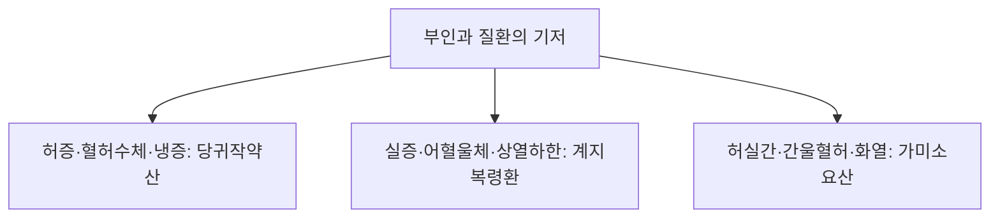

# 당귀작약산 (當歸芍藥散, Tokishakuyakusan)

> **핵심 요약 (Key Summary)**
> - 🌿 기원·구성: 후한(後漢) 장중경(張仲景)의 《금궤요략(金匱要略)》 부인임신병편에 수록된 처방으로, 혈허(血虛)를 다스리는 [[당귀]], [[작약]], [[천궁]]과 수습(水濕) 정체를 해소하는 [[복령]], [[백출]](또는 [[창출]]), [[택사]]를 정교하게 배오하여 간비(肝脾)를 조화시키고 혈액순환과 수액 대사를 정상화하는 부인과 최고의 성방(聖方).
> - 🎯 적응증·체질: 체력이 허약하고 수척하며 안색이 창백하고 냉증(수족냉증, 하복냉증)과 빈혈 경향이 있는 여성의 하복부 산통(쥐어짜는 복통), 부종, 어지럼증, 심계항진, [[월경곤란증]], 배란장애, [[자궁근종]], 불임증. 임신 중에도 안심하고 투여할 수 있는 대표적 안태약(安胎藥)이자 호흡성 후각장애 개선제.
> - 🔬 분자약리기전: 시상하부-뇌하수체-난소(HPO axis) 혈류 촉진 및 에스트로겐 수용체 조절(HRT 유사 작용), [[패오니플로린]]의 자궁 평활근 과수축 억제, 골반강 및 두면부 미세혈관 확장, 후구(Olfactory bulb) 내 신경성장인자(NGF, BDNF) 발현 촉진을 통한 후각신경 회복.
⚠️ 주의사항: 혈열(血熱)이나 실증으로 인한 월경과다 환자에게는 출혈량을 늘릴 수 있으므로 주의. 심한 위장 무력자에게 택사의 한성(寒性)으로 인한 소화불량 발생 시 감량 투여.

---

## 1. 📜 방제 기본 정보

| 구분 | 내용 |
| :--- | :--- |
| **처방명** | 당귀작약산 (當歸芍藥散, Tokishakuyakusan) |
| **출전** | 《금궤요략(金匱要略)》 |
| **처방 분류** | 보익제(補益劑) - 양혈조경(養血調經) / 건비이습(健脾利濕) / 안태제(安胎劑) |
| **한의학적 효능** | 양혈유간(養血柔肝), 건비이습(健脾利濕), 활혈지통(活血止痛), 조경안태(調經安胎) |
| **주치 병증** | 부인 임신 중 복중 규통(疐痛, 쥐어짜는 복통), 혈허수체(血虛水滯), 두훈(頭暈), 심계, 소변불리, 월경통, 하지부종 |
| **현대적 적응증** | [[월경곤란증]], 무배란성 월경이상, 불임증, [[자궁근종]], 갱년기 증후군(냉증, 부종, 두통), 임신 중 절박유산 예방, 호흡성 후각장애(부비동염 후유증) |

---

## 2. 🌿 약재 구성 및 방제학적 배오 원리

### 1) 약재 구성표

| 약재명 | 한자 | 표준 분량(g) | 본초 분류 | 귀경 | 주요 성분 | 핵심 역할 및 기능 |
| :--- | :--- | :--- | :--- | :--- | :--- | :--- |
| [[작약]](백작약/적작약) | 芍藥 | 12.0 | 보혈약 | 간, 비 | [[패오니플로린]], 페오놀 | **군약(君藥)**: 양혈유간(養血柔肝), 완급지통(緩急止痛), 대량 투여로 자궁 평활근 경련 억제 및 복통 완화 |
| [[당귀]] | 當歸 | 4.0 | 보혈약 | 간, 심, 비 | [[데커신]], 노다케닌 | **신약(臣藥)**: 보혈활혈(補血活血), 조경지통(調經止痛), 영혈을 보하고 말초 혈액순환 촉진 |
| [[천궁]] | 川芎 | 4.0 | 활혈거어약 | 간, 담, 심포 | [[페룰산]], 리구스티라이드 | **신약(臣藥)**: 활혈행기(活血行氣), 거풍지통(祛風止痛), 당귀·작약과 함께 혈액의 울체를 풀어줌 |
| [[택사]] | 澤瀉 | 6.0 | 이수삼습약 | 신, 방광 | [[알리스몰]], [[알리솔]] | **좌약(佐藥)**: 이수청열(利水淸熱), 세포 간질의 불필요한 수분 저류와 부종을 소변으로 배출 |
| [[복령]] | 茯苓 | 6.0 | 이수삼습약 | 심, 비, 신 | [[파키만]], 베타-글루칸 | **좌약(佐藥)**: 건비삼습(健脾滲濕), 녕심안신(寧心安神), 수액 대사 정상화 및 두근거림 안정 |
| [[백출]](또는 [[창출]]) | 白朮 | 6.0 | 보기약 | 비, 위 | [[아트락틸로딘]] | **좌사약(佐使藥)**: 건비조습(健脾燥濕), 비기를 튼튼히 하여 수습 생성을 근원적으로 억제 |

### 2) 방제학적 배오 원리
- **혈허(血虛)와 수체(水滯)를 동시에 해결하는 방제학적 걸작**: 부인과 질환의 핵심 원인인 "혈액 부족과 미세순환 장애(혈허어혈)"와 "체액 정체 및 부종(수음습담)"을 단 하나의 처방으로 통합 치료합니다.
- **삼혈약(三血藥) + 삼수약(三水藥)의 조화**:
  - 작약·당귀·천궁이 간혈(肝血)을 보하고 혈액을 소통시켜 혈류량을 증대시키고,
  - 복령·백출·택사가 비기(脾氣)를 북돋워 조직 간질의 수분을 신장으로 배출시킵니다.
- **안태(安胎)의 안정성**: 자궁을 자극하는 강렬한 파혈제나 설사제가 일체 배제되어 있어, 임신 중 복통이나 부종이 발생했을 때 태아를 안전하게 보호하면서 모체의 이상을 바로잡습니다.

---

## 3. 🔬 현대 약리 연구 및 분자 기전

### 1) HPO 축(시상하부-뇌하수체-난소 축) 조절 및 호르몬 보조 효과
- **호르몬대체요법(HRT) 유사 작용**: 난소 혈류량을 유의미하게 증가시켜 난포 자극 호르몬(FSH) 및 황체형성 호르몬(LH)에 대한 난소 수용체의 감수성을 정상화하고, 배란을 유도하며 황체기 프로게스테론 분비를 촉진합니다.
- **골반강 혈류 개선 및 자궁근 진경**: [[작약]]의 패오니플로린이 자궁 평활근의 비정상적 과수축을 억제하여 심한 월경통과 조기 자궁 수축을 완화합니다.

### 2) 후구(Olfactory Bulb) 신경재생 및 후각장애 회복
- **신경영양인자(NGF, BDNF) 분비 촉진**: [[만성 부비동염]]이나 상기도 감염 후 발생한 신경성 후각장애 환자에서 당귀작약산 투여가 후각 수용기 및 후구 뉴런의 신경재생 인자를 상향 조절하여 손상된 후각신경의 재생을 촉진함이 규명되었습니다.

---

## 4. ⚖️ 유사 처방 감별 및 부인과 3대 방제 비교

| 처방명 | 중심 약재 구성 | 체격 및 환자 상태 | 핵심 변증 및 특징 |
| :--- | :--- | :--- | :--- |
| [[당귀작약산]] | 당귀, 작약, 복령, 백출, 택사, 천궁 | 허약, 수척, 안색 창백, 근육 과긴장 | 혈허수체(血虛水滯), 하복냉통, 하지부종, 빈혈, 안태약 |
| [[계지복령환]] | 계지, 복령, 목단피, 도인, 작약 | 건장, 비만 경향, 안면 홍조, 어혈 압통 | 실증 어혈(瘀血), 하복부 저항압통, 월경혈 흑자색 덩어리 |
| [[가미소요산]] | 시호, 당귀, 백작약, 백출, 치자, 목단피 | 중간 체형, 신경 예민, 스트레스 | 간울혈허(肝鬱血虛) + 화열, 상열감, 심번, 유방통, 기분 기복 |

---

## 5. ⚠️ 임상 복용 주의사항 및 부작용 관리

### 1) 실증(實證) 열성 월경과다 주의
- 자궁 출혈이 지속되거나 체격이 매우 건실하고 열이 많은 환자에게 오용할 경우 활혈 작용으로 인해 출혈 기간이 연장될 수 있으므로, 반드시 한열과 허실을 감별합니다.

### 2) 위장관 소화 상태 관찰
- 택사의 이수 성분과 생약 분말 제형 특성상 평소 위장이 극도로 냉하고 연변을 보는 환자는 복용 초기 가벼운 소화불량을 호소할 수 있습니다. 따뜻한 미온수로 식후 30분 복용하도록 지도합니다.

---

## 6. 📚 현대 학술 연구 및 논문 (References)

1. Usuki, S., et al. (2002). "The herbal medicine Tokishakuyakusan stimulates the secretion of progesterone and estradiol by human granulosa cells." *The American Journal of Chinese Medicine*, 30(4), 585-594.
   - [연구 요약] 인간 난포 과립막 세포 실험에서 당귀작약산이 프로게스테론과 에스트라디올의 합성을 직접 촉진하여 배란 장애 및 황체기 결함을 개선함을 확인.
2. Ogawa, T., et al. (2018). "Tokishakuyakusan stimulates olfactory function recovery through up-regulation of nerve growth factor in mice with sensorineural olfactory disorder." *Frontiers in Pharmacology*, 9, 785.
   - [연구 요약] 감각신경성 후각장애 마우스 모델에서 당귀작약산이 비강 점막 및 후구 내 NGF 발현을 유도하여 후각 기능의 유의미한 회복을 유도함을 입증.

---

## 7. 💡 사용자 진료실 핵심 필기 & 임상 팁 (원문 보존)

> ### 📌 구성
> [[적작약]], [[창출]], [[택사]], [[복령]], [[천궁]], [[당귀]]
> 
> ### 📌 적응증
> - 체력이 저하되어 있는 환자(마르고 수척)에 냉증과 빈혈 경향이 있고, 복통, 근육통, 과긴장이 있는 경우 사용
> - 안태약으로 임신 중에도 사용하기 좋은 순한 처방
> - [[자궁근종]], [[월경곤란증]], 배란장애, 두근거림이나 정신 증상(흥분, 우울)에 활용
> 
> ### 📌 약리 작용
> - 호르몬 보조 작용, 혈류 순환 개선, 배란유발, 자궁수축 억제, 후구 신경성장인자 증가 작용
> - 호르몬보충요법과 동등한 효과가 있다는 연구도 있다.
> - 하복부, 두면부 혈류량 증가와 근긴장 이완을 통해 HPO축의 순환을 원활하게 하여 호르몬 문제 등을 개선하는 것으로 보임
> - [[만성 부비동염]]과 같은 호흡성 후각장애에 후구 신경성장인자를 증가시키는 작용이 있어 후각신경을 회복시킴