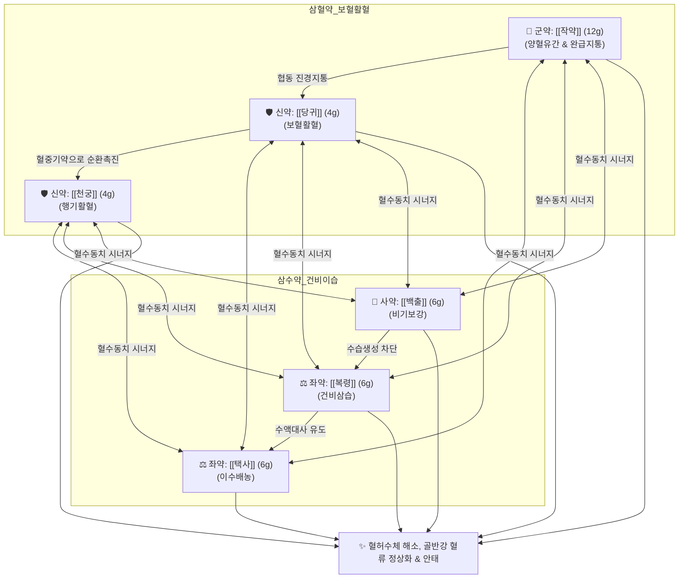

# 🍵 [[당귀작약산]] (當歸芍藥散, Tokishakuyakusan)

> **핵심 3줄 요약 (Key Summary)**:
> - 🌿 삼혈약(三血藥: [[작약]](군약, 대량 배오) + [[당귀]] + [[천궁]]) + 삼수약(三水藥: [[복령]] + [[백출]](또는 [[창출]]) + [[택사]]) 6미로 구성된 장중경의 부인과 성방(聖方).
> - 🎯 체력이 허약하고 수척하며 안색이 창백하고 냉증(수족냉증, 하복냉증)과 빈혈 경향이 있는 여성의 하복부 산통(쥐어짜는 복통), 부종, 어지럼증, 심계항진, [[월경곤란증]], 배란장애, [[자궁근종]], 불임증. 임신 중에도 안심하고 투여할 수 있는 대표적 안태약(安胎藥)이자 호흡성 후각장애 개선제.
> - 🔬 시상하부-뇌하수체-난소(HPO axis) 혈류 촉진 및 에스트로겐/프로게스테론 분비 유도(HRT 유사 작용), [[패오니플로린]]의 자궁 평활근 과수축 억제, 골반강 및 두면부 미세혈류 확장, 후구(Olfactory bulb) 신경성장인자(NGF, BDNF) 발현을 통한 후각신경 회복.
> - ⚠️ 주의사항: 실열(實熱)이나 실증으로 인한 월경과다 환자에게는 출혈량을 늘릴 수 있으므로 주의. 심한 위장 허냉자에게 택사로 인한 소화불량 발생 시 감량 투여.
---
## 📌 목차
1. [기본 처방 정보 & 군신좌사 구성](#1-기본-처방-정보--군신좌사-구성)
2. [방제학적 약재 상호작용 & 시너지 네트워크](#2-방제학적-약재-상호작용--시너지-네트워크)
3. [현대 분자약리학적 효능 & 작용 기전](#3-현대-분자약리학적-효능--작용-기전)
4. [적응 병증 및 체질별 감별 (Sweet Spot vs 금기)](#4-적응-병증-및-체질별-감별-sweet-spot-vs-금기)
5. [유사 처방군 감별 매트릭스](#5-유사-처방군-감별-매트릭스)
6. [임상 가감례 & 현대 질환별 응용](#6-임상-가감례--현대-질환별-응용)
7. [💡 사용자 진료실 핵심 필기 & 임상 팁 (원문 보존)](#7--사용자-진료실-핵심-필기--임상-팁-원문-보존)
8. [출처 및 학술 참고 문헌 (References)](#8-출처-및-학술-참고-문헌-references)
---
## 1. 기본 처방 정보 & 군신좌사 구성

* **출전**: 후한(後漢) 장중경(張仲景) 『[[금궤요략]](金匱要略)』 부인임신병편(婦人妊娠病篇)
* **치법**: 양혈유간(養血柔肝), 건비이습(健脾利濕), 활혈지통(活血止痛), 조경안태(調經安胎)

| 구분 | 약재명 | 표준 용량 | 본초 효능 & 방제 내 역할 |
| :--- | :--- | :--- | :--- |
| **군약 (君藥)** | [[작약]](백작약/적작약) | 12g | 양혈유간(養血柔肝), 완급지통(緩急止痛), 대량 투여로 자궁 평활근 경련 억제 및 복통 완화 |
| **신약 (臣藥)** | [[당귀]] | 4g | 보혈활혈(補血活血), 조경지통(調經止痛), 영혈을 보하고 말초 혈액순환 촉진 |
| **신약 (臣藥)** | [[천궁]] | 4g | 활혈행기(活血行氣), 거풍지통(祛風止痛), 당귀·작약과 함께 혈액의 울체를 풀어줌 |
| **좌약 (佐藥)** | [[택사]] | 6g | 이수청열(利水淸熱), 세포 간질의 불필요한 수분 저류와 부종을 소변으로 배출 |
| **좌약 (佐藥)** | [[복령]] | 6g | 건비삼습(健脾滲濕), 녕심안신(寧心安神), 수액 대사 정상화 및 두근거림 안정 |
| **좌사약 (佐使藥)** | [[백출]](또는 [[창출]]) | 6g | 건비조습(健脾燥濕), 비기를 튼튼히 하여 수습 생성을 근원적으로 억제 |

> **배오 특징**: 삼혈약(작약·당귀·천궁)으로 혈허(血虛)와 어혈을 풀고, 삼수약(복령·백출·택사)으로 수체(水滯)와 부종을 배출합니다. 간(肝)의 혈액 부족과 비(脾)의 수습 정체를 동시에 해결하는 간비동치(肝脾同治)의 묘방입니다.
---
## 2. 방제학적 약재 상호작용 & 시너지 네트워크

* [[작약]] + [[당귀]] 배오: 당귀의 보혈활혈과 작약의 양혈유간이 결합하여 자궁과 골반강의 혈류량을 급증시키고 근긴장을 완화합니다.
* [[당귀]] + [[천궁]] 배오: 혈을 보하는 당귀와 혈을 돌리는 천궁이 결합(불휴귀궁)하여 어혈이 생기지 않도록 혈액 순환을 완벽하게 추동합니다.
* [[백출]] + [[복령]] + [[택사]] 배오: 조직 간질에 정체된 불필요한 수분을 소변으로 배출하여 하지 부종과 어지럼증, 두근거림을 해소합니다.
---
## 3. 현대 분자약리학적 효능 & 작용 기전

### 1) HPO 축(시상하부-뇌하수체-난소 축) 조절 및 호르몬 보조 효과
* **호르몬대체요법(HRT) 유사 작용**: 난소 혈류량을 유의미하게 증가시켜 난포 자극 호르몬(FSH) 및 황체형성 호르몬(LH)에 대한 난소 수용체의 감수성을 정상화하고, 배란을 유도하며 황체기 프로게스테론 분비를 촉진합니다.
* **골반강 혈류 개선 및 자궁근 진경**: [[작약]]의 [[패오니플로린]]이 자궁 평활근의 비정상적 과수축을 억제하여 심한 월경통과 조기 자궁 수축을 완화합니다.

### 2) 후구(Olfactory Bulb) 신경재생 및 후각장애 회복
* **신경영양인자(NGF, BDNF) 분비 촉진**: [[만성 부비동염]]이나 상기도 감염 후 발생한 신경성 후각장애 환자에서 당귀작약산 투여가 후각 수용기 및 후구 뉴런의 신경재생 인자를 상향 조절하여 손상된 후각신경의 재생을 촉진함이 규명되었습니다.
---
## 4. 적응 병증 및 체질별 감별 (Sweet Spot vs 금기)

[✅ 최적 적응증 (Sweet Spot)]
• 원전 조문: 《금궤요략》 "부인이 임신하여 배가 쥐어짜듯 아픈 것(腹中疐痛)을 다스린다."
• 체질 소견: 소음인 및 수척한 태음인, 근육량이 적고 피부가 희거나 창백하며 손발과 아랫배가 차가운 체질
• 임상 주치: 
  1. 하복부 산통, 생리통([[월경곤란증]]), 무배란성 월경이상, 불임증
  2. 임신 중 복통 및 부종(안태약으로 안전 투여)
  3. [[자궁근종]], 갱년기 증후군(냉증, 하지부종, 어지럼증, 심계항진)
  4. [[만성 부비동염]] 후유증 등 호흡성/감각신경성 후각장애
• 설진/맥진: 설담태백(舌淡苔白) 혹은 치흔설(齒痕舌), 맥침세(脈沈細) 혹은 맥현세(脈弦細)

[⚠️ 신중 투여 및 금기 (Caution / Contraindication)]
• 실열성 월경과다: 체격이 건실하고 열이 많으며 출혈량이 극심한 환자에게는 활혈 작용으로 출혈이 늘 수 있으므로 금기.
• 비위 허냉 및 심한 설사 환자: 택사의 이수 한성으로 소화불량이나 연변이 발생할 수 있으므로 주의.
---
## 5. 유사 처방군 감별 매트릭스

| 처방명 | 핵심 구성 차이 | 주치 및 체질 차이 | 맥진/설진 차이 |
| :--- | :--- | :--- | :--- |
| [[당귀작약산]] | 작약, 당귀, 천궁, 복령, 백출, 택사 | **허증·혈허수체, 마르고 찬 체질, 복통, 부종, 안태약** | 설담치흔, 맥침세 |
| [[계지복령환]] | 계지, 복령, 목단피, 도인, 작약 | 실증 어혈, 단단하고 비만한 체형, 안면 홍조, 하복부 압통 | 설암(청자색), 맥침규 |
| [[가미소요산]] | 시호, 당귀, 백작약, 백출, 치자, 목단피 | 간울혈허 + 화열, 신경 예민, 상열감, 가슴 답답, 유방통 | 설홍태박황, 맥현삭 |
| [[온경탕]] | 오수유, 맥문동, 당귀, 작약, 아교, 생강 등 | 충임허한(衝任虛寒), 극심한 하초 냉증, 부정출혈, 건조 | 설담무태, 맥침지 |

---
## 6. 임상 가감례 & 현대 질환별 응용

* **수반 증상별 가감법**:
  * 하복부 냉통 극심 시 $\rightarrow$ + [[육계]], [[포부자]] 각 4g
  * 기허(氣虛) 및 권태감 동반 시 $\rightarrow$ + [[황기]], [[인삼]] 각 6g
  * 어혈 덩어리가 심한 경우 $\rightarrow$ + [[도인]], [[목단피]] 각 4g
* **현대 질환별 임상 매핑**:
  * **부인과/산과**: 월경곤란증, 희발월경, 다낭성난소증후군(PCOS) 보조, 습관성 유산 예방, 자궁근종
  * **이비인후과**: 상기도 감염 및 부비동염 후유 호흡성 후각장애
  * **자율신경계**: 수족냉증, 기립성 어지럼증, 갱년기 부종 및 심계
---
## 7. 💡 사용자 진료실 핵심 필기 & 임상 팁 (원문 보존)

> [!tip] **진료실 실전 노하우 (User Clinical Insight)**
> ### 📌 구성
> [[적작약]], [[창출]], [[택사]], [[복령]], [[천궁]], [[당귀]]
> 
> ### 📌 적응증
> - 체력이 저하되어 있는 환자(마르고 수척)에 냉증과 빈혈 경향이 있고, 복통, 근육통, 과긴장이 있는 경우 사용
> - 안태약으로 임신 중에도 사용하기 좋은 순한 처방
> - [[자궁근종]], [[월경곤란증]], 배란장애, 두근거림이나 정신 증상(흥분, 우울)에 활용
> 
> ### 📌 약리 작용
> - 호르몬 보조 작용, 혈류 순환 개선, 배란유발, 자궁수축 억제, 후구 신경성장인자 증가 작용
> - 호르몬보충요법과 동등한 효과가 있다는 연구도 있다.
> - 하복부, 두면부 혈류량 증가와 근긴장 이완을 통해 HPO축의 순환을 원활하게 하여 호르몬 문제 등을 개선하는 것으로 보임
> - [[만성 부비동염]]과 같은 호흡성 후각장애에 후구 신경성장인자를 증가시키는 작용이 있어 후각신경을 회복시킴

---
## 8. 출처 및 학술 참고 문헌 (References)

1. **Usuki, S., et al. (2002)**. "The herbal medicine Tokishakuyakusan stimulates the secretion of progesterone and estradiol by human granulosa cells." *The American Journal of Chinese Medicine*, 30(4), 585-594.
   - **[연구 요약]**: 인간 난포 과립막 세포 실험에서 당귀작약산이 프로게스테론과 에스트라디올의 합성을 직접 촉진하여 배란 장애 및 황체기 결함을 개선함을 확인.
2. **Ogawa, T., et al. (2018)**. "Tokishakuyakusan stimulates olfactory function recovery through up-regulation of nerve growth factor in mice with sensorineural olfactory disorder." *Frontiers in Pharmacology*, 9, 785.
   - **[연구 요약]**: 감각신경성 후각장애 마우스 모델에서 당귀작약산이 비강 점막 및 후구 내 NGF 발현을 유도하여 후각 기능의 유의미한 회복을 유도함을 입증.
3. **장중경 (200년경)**. 『[[금궤요략]](金匱要略)』.
   - **[고전 원전]**: 부인임신병편(婦人妊娠病篇) 복중규통 및 안태 조문.