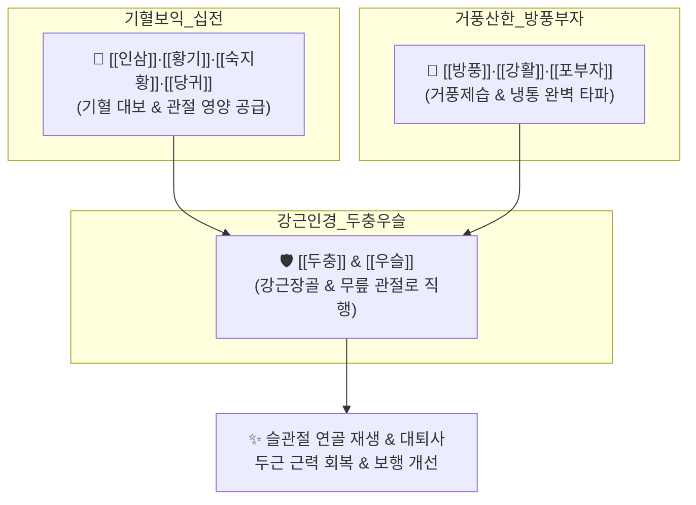

# 🍵 [[대방풍탕]] (大防風湯, Daebangpung-tang)

> **핵심 3줄 요약 (Key Summary)**:
> - 🌿 [[십전대보탕]](기혈대보) + 거풍승습의 [[방풍]]·[[강활]] + 강근장골의 [[두충]]·[[우슬]] + 온경산한의 [[부자]] 배오 ([[숙지황]]·[[백작약]]·[[천궁]]·[[당귀]]·[[방풍]]·[[우슬]]·[[두충]]·[[강활]]·[[인삼]]·[[백출]]·[[황기]]·[[포부자]]·[[감초]]·[[생강]]·[[대추]]).
> - 🎯 마르고 허약한 사람의 무릎 통증(슬안풍 膝眼風, 학슬풍 鶴膝風), 퇴행성 슬관절염, 류마티스 관절염 후기 관절 변형, 허리와 무릎의 시림 및 보행 장애.
> - 🔬 관절 활막 염증성 사이토카인(IL-1β, TNF-α) 억제, 연골 기질 분해 효소(MMP-3, MMP-13) 차단, 대퇴사두근 근위축 완화 및 관절강 미세순환 개선.
> - ⚠️ 주의사항: 부자 함유로 음허화왕(열증 관절염, 관절 발적 열감) 환자 금기, 급성기 통풍성 관절염 발작기 금기.
---
## 📌 목차
1. [기본 처방 정보 & 군신좌사 구성](#1-기본-처방-정보--군신좌사-구성)
2. [방제학적 약재 상호작용 & 시너지 네트워크](#2-방제학적-약재-상호작용--시너지-네트워크)
3. [현대 분자약리학적 효능 & 작용 기전](#3-현대-분자약리학적-효능--작용-기전)
4. [적응 병증 및 체질별 감별 (Sweet Spot vs 금기)](#4-적응-병증-및-체질별-감별-sweet-spot-vs-금기)
5. [유사 처방군 감별 매트릭스](#5-유사-처방군-감별-매트릭스)
6. [임상 가감례 & 현대 질환별 응용](#6-임상-가감례--현대-질환별-응용)
7. [💡 사용자 진료실 핵심 필기 & 임상 팁 (원문 보존)](#7--사용자-진료실-핵심-필기--임상-팁-원문-보존)
8. [출처 및 학술 참고 문헌 (References)](#8-출처-및-학술-참고-문헌-references)
---
## 1. 기본 처방 정보 & 군신좌사 구성

* **출전**: 송대(宋代) 진사양(陳思讓) 경험방, 허준 『[[동의보감]](東醫寶鑑)』 풍문(風門) 학슬풍(鶴膝風)
* **치법**: 익기보혈(益氣補血), 거풍승습(祛風勝濕), 온경지통(溫經止痛), 강근장골(强筋壯骨)

| 구분 | 약재명 | 표준 용량 | 본초 효능 & 방제 내 역할 |
| :--- | :--- | :--- | :--- |
| **군약 (君藥)** | [[방풍]] | 8g | 거풍승습(祛風勝濕), 지통, 관절에 침입한 풍습 한사를 몰아냄 |
| **군약 (君藥)** | [[포부자]] | 4g | 회양구역, 온경산한(溫經散寒), 한사를 몰아내고 관절 냉통을 즉각 진통 |
| **신약 (臣藥)** | [[숙지황]], [[당귀]] | 각 6g | 자음양혈(滋陰養血), 조혈 촉진 및 관절 연골에 영양 공급 |
| **신약 (臣藥)** | [[황기]], [[인삼]] | 각 6g | 대보원기(大補元氣), 고표익위, 무릎을 지탱하는 기력과 혈류 추진력 보강 |
| **신약 (臣藥)** | [[백출]], [[감초]] | 각 4g | 건비익기, 완급지통 |
| **좌약 (佐藥)** | [[우슬]], [[두충]] | 각 6g | 보간신, 강근골, 인혈하행하여 약효를 무릎 관절로 직행 |
| **좌약 (佐藥)** | [[강활]], [[천궁]] | 각 4g | 거풍승습, 활혈지통, 관절낭 유착 및 신경통 해소 |
| **좌약 (佐藥)** | [[백작약]] | 6g | 양혈유간, 완급지통, 슬관절 주변 근건 경련 이완 |
| **사약 (使藥)** | [[생강]], [[대추]] | 각 3g | 온위화중, 영위 조화 |

> **배오 특징**: 다리와 무릎이 학의 다리처럼 가늘어지고 무릎뼈만 크게 튀어나오는 학슬풍(鶴膝風: 만성 관절 쇠약)을 치료하기 위해, [[십전대보탕]]의 기혈쌍보력에 [[우슬]]·[[두충]]의 관절 지탱력, 그리고 [[방풍]]·[[강활]]·[[부자]]의 풍한습(風寒濕) 몰아내기를 하나로 묶은 **허약자 무릎 통증의 절대 명방**입니다.
---
## 2. 방제학적 약재 상호작용 & 시너지 네트워크

* [[부자]] + [[방풍]] + [[강활]] 배오: 차갑고 습한 사기가 관절 깊숙이 박혀 시리고 쑤시는 풍한습비를 몰아냅니다.
* [[황기]] + [[우슬]] + [[두충]] 배오: 뼈와 힘줄을 튼튼히 하고 다리로 피를 몰아주어 무릎이 꺾이고 힘이 빠지는 것을 막습니다.
---
## 3. 현대 분자약리학적 효능 & 작용 기전

### 1) 관절 연골 분해 효소(MMP) 억제 및 연골 기질 보호
* 관절 활막 세포에서 염증성 사이토카인(IL-1β, TNF-α)에 의해 유도되는 연골 기질 분해 효소인 MMP-3 및 MMP-13 발현을 현저히 억제하여 관절 간격 협착을 방지합니다.

### 2) 대퇴사두근 근위축 방지 및 근력 강화
* 고령 퇴행성 관절염 환자에서 발생하는 슬관절 주변 근육(대퇴사두근)의 위축을 억제하고 근섬유 단백질 합성을 촉진하여 보행 안정성을 향상시킵니다.

### 3) 만성 관절강 미세혈류 촉진 및 진통
* [[포부자]](히게나민)와 [[우슬]] 성분이 관절강 내 모세혈관 관류를 개선하여 한랭 노출 시 악화되는 시림과 뻣뻣한 조조강직을 완화합니다.
---
## 4. 적응 병증 및 체질별 감별 (Sweet Spot vs 금기)

[✅ 최적 적응증 (Sweet Spot)]
• 원전 조문: 동의보감 — "治鶴膝風, 膝脛細小, 關節腫大, 疼痛不可忍, 步履艱難." (학슬풍으로 다리는 가늘어지고 무릎 관절만 부어올라 통증을 참기 어렵고 걷기 힘든 것을 다스린다.)
• 체질 소견: 평소 몸이 마르고 근육량이 적으며 기운이 없고, 비 오거나 찬바람 불면 무릎이 시리고 쑤시는 허약 체질
• 임상 주치: 마르고 허약한 환자의 퇴행성 슬관절염, 슬안풍(무릎 오금과 슬개골 주변 냉통), 관절 변형성 류마티스 관절염 후기, 보행 곤란
• 설진/맥진: 설질담백(舌淡白), 백태(白苔), 맥침세무력(脈沈細無力) 혹은 맥현완

[⚠️ 신중 투여 및 금기 (Caution / Contraindication)]
• 열성 관절염 금기: 무릎이 붉게 붓고 만지면 열감이 펄펄 끓는 급성 화농성 관절염, 통풍 발작기에는 금기 ([[월비가출탕]] 적용)
---
## 5. 유사 처방군 감별 매트릭스

| 처방명 | 핵심 배오 차이 | 주치 타깃 및 체질 | 임상 차별점 | 맥진/설진 차이 |
| :--- | :--- | :--- | :--- | :--- |
| [[대방풍탕]] | 십전대보탕 + 방풍, 강활, 우슬, 두충, 부자 | **마르고 허약한 사람 (#마른증)** | **극심한 무릎 통증, 학슬풍, 하지 무력** | 맥침세무력, 설담 |
| [[독활기생탕]] | 독활, 상기생, 두충, 우슬, 세신, 사물탕 등 | **허리와 무릎 통증 겸유** | **요통과 무릎 통증이 함께 올 때 다용** | 맥세약, 설담홍 |
| [[오적산]] | 마황, 창출, 진피, 후박, 지각, 건강 등 | **통통하고 찬 기운에 체한 실증** | **체격 건실, 전신 냉통, 소화불량 동반** | 맥침지유력, 백태 |
---
## 6. 임상 가감례 & 현대 질환별 응용

* **수반 증상별 가감법**:
  * 무릎 부종과 관절 삼출액(물 참) 심할 때 $\rightarrow$ + [[방기]], [[의이인]]
  * 뼈마디 쑤심과 찌르는 통증 심할 때 $\rightarrow$ + [[몰약]], [[유향]], [[현호색]]
* **현대 질환별 임상 매핑**:
  * **정형외과**: 퇴행성 슬관절염(OA), 슬개대퇴 통증 증후군, 만성 무릎 활액막염
  * **류마티스내과**: 만성 류마티스 관절염 관해기 쇠약 및 관절통
---
## 7. 💡 사용자 진료실 핵심 필기 & 임상 팁 (원문 보존)

> [!tip] **진료실 실전 노하우 (User Clinical Insight)**
> ### 📌 구성:
> [[숙지황]] [[작약]] [[천궁]] [[당귀]] [[방풍]] [[우슬]] [[두충]] [[강활]] [[인삼]] [[감초]] [[생강]] [[부자]] [[백출]] [[황기]] [[대추]]
> 
> ### 📌 적응증:
> - 마르고 허약한 사람의 무릎 통증에 활용
---
## 8. 출처 및 학술 참고 문헌 (References)

1. **허준 (1613)**. 『[[동의보감]](東醫寶鑑)』.
   - **[고전 원전]**: "治鶴膝風, 氣血俱虛, 寒濕侵襲, 大防風湯主之."
2. **Choi, H. S. et al. (2017)**. *Chondroprotective effects of Daebangpung-tang on osteoarthritis via suppression of MMPs and inflammatory cytokines*. **BMC Complementary Medicine and Therapies**, 17, 245.
   - **[연구 요약]**: 대방풍탕 투여가 연골 세포의 MMP-13 분비를 차단하고 연골 두께를 보존하여 골관절염 통증과 보행 기능을 유의하게 개선함을 확인.