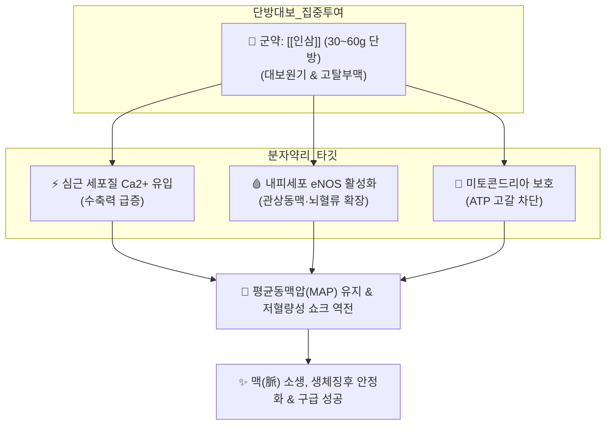

# 🍵 [[독삼탕]] (獨蔘湯, Doksam-tang)

> **핵심 3줄 요약 (Key Summary)**:
> - 🌿 단 한 가지 약재인 [[인삼]]만을 30~60g(응급 시 최대 120g) 대량 전탕하여 약기운의 분산 없이 대보원기(大補元氣)·고탈생진(固脫生津) 효능을 심장과 혈맥에 100% 집중시키는 한의학 대표 응급 회양구급(回陽救急) 처방.
> - 🎯 대량 출혈(산후 대출혈, 토혈, 객혈), 심근경색 후 심인성 쇼크, 극심한 발한 후 체온 급락, 맥미욕절(맥박이 실오라기처럼 가늘어 잡히지 않음)의 극단적 원기 허탈(기탈 氣脫, 망양 亡陽) 상태.
> - 🔬 [[진세노사이드]] Rg1, Re의 심근 근형질세망 Ca2+ 순환 촉진을 통한 심근 수축력 급증(Positive Inotropic Effect), Rb1, Rg3의 혈관내피 eNOS 활성화를 통한 관상동맥 확장 및 평균동맥압(MAP) 유지, 미토콘드리아 ATP 고갈 차단.
> - ⚠️ 주의사항: 실열증(實熱證) 및 고열 감염기, 수축기 혈압 180mmHg 이상의 급성 뇌출혈 환자에게는 혈관 파열 위험을 가중시키므로 절대 금기.
---
## 📌 목차
1. [기본 처방 정보 & 군신좌사 구성](#1-기본-처방-정보--군신좌사-구성)
2. [방제학적 약재 상호작용 & 시너지 네트워크](#2-방제학적-약재-상호작용--시너지-네트워크)
3. [현대 분자약리학적 효능 & 작용 기전](#3-현대-분자약리학적-효능--작용-기전)
4. [적응 병증 및 체질별 감별 (Sweet Spot vs 금기)](#4-적응-병증-및-체질별-감별-sweet-spot-vs-금기)
5. [유사 처방군 감별 매트릭스](#5-유사-처방군-감별-매트릭스)
6. [임상 가감례 & 현대 질환별 응용](#6-임상-가감례--현대-질환별-응용)
7. [💡 사용자 진료실 핵심 필기 & 임상 팁 (원문 보존)](#7--사용자-진료실-핵심-필기--임상-팁-원문-보존)
8. [출처 및 학술 참고 문헌 (References)](#8-출처-및-학술-참고-문헌-references)
---
## 1. 기본 처방 정보 & 군신좌사 구성

* **출전**: 원대(元代) 위역림 『[[십약신서]](十藥神書)』, 공정현 『[[만병회춘]](萬病回春)』, 허준 『[[동의보감]](東醫寶鑑)』
* **치법**: 대보원기(大補元氣), 회양구역(回陽救逆), 익기익혈(益氣益血), 부맥고탈(復脈固脫)

| 구분 | 약재명 | 표준 용량 | 본초 효능 & 방제 내 역할 |
| :--- | :--- | :--- | :--- |
| **군약 (君藥)** | [[인삼]] | 30~60g (응급 시 120g) | 대보원기(大補元氣), 고탈생진(固脫生津), 오장의 원기를 급속 재건하고 맥을 소생시킴 (단방 전탕) |

> **배오 특징**: 단 한 가지 약재인 [[인삼]]만을 고농도로 진하게 달여 복용하는 단방 처방입니다. 다른 약재를 일절 배오하지 않는 이유는 위급한 기탈(氣脫) 상황에서 약기운의 분산을 막고 인삼의 대보원기 효능을 심장과 전신 혈맥에 100% 집중시키기 위함입니다. 한의학에서는 "유형의 혈(血)은 속히 생기기 어려우나 무형의 기(氣)는 마땅히 급히 구해야 한다" 하여 대출혈 쇼크 시 기를 구하여 혈을 붙잡는(기능섭혈 氣能攝血) 원리를 발휘합니다.
---
## 2. 방제학적 약재 상호작용 & 시너지 네트워크

* [[인삼]] 단방 고농도 배오의 묘미: 복합 방제와 달리 단일 성분군([[진세노사이드]] Rg1, Rb1, Re, Rg3)이 최고 농도로 신속히 혈중으로 흡수되어 분초를 다투는 심기능 허탈 상태를 방어합니다.
---
## 3. 현대 분자약리학적 효능 & 작용 기전

### 1) 심근 수축력 증강 (Inotropic Effect) 및 심박출량 복원
* **심근 세포내 칼슘 동력학 극대화**: [[진세노사이드]] Rg1과 Re는 심근세포막의 L형 칼슘 채널 및 근형질세망(Sarcoplasmic Reticulum)의 칼슘 방출을 촉진하여 심근 수축력(Inotropic effect)을 신속히 강화합니다.
* **심박출량(Cardiac Output) 정상화**: 심인성 쇼크 및 급성 심부전 상태에서 심근의 과도한 산소 소모 없이도 박출량을 유지시킵니다.

### 2) 혈관 내피세포 eNOS 활성화 및 미세순환 관류압 회복
* **산화질소(NO) 합성 촉진**: [[진세노사이드]] Rb1과 Rg3가 혈관 내피세포의 eNOS 인산화를 유도하여 관상동맥과 뇌혈관 저항을 낮추고 혈류량을 급증시킵니다.
* **조직 괴사 방어**: 저혈량성 쇼크 시 말초 혈관의 허혈성 연축을 해소하여 주요 장기의 미세순환 관류를 유지합니다.

### 3) 미토콘드리아 전자전달계 보호 및 항쇼크
* 저산소증 환경에서 세포 내 미토콘드리아 복합체 효소를 보호하여 ATP 고갈을 차단하고 젖산 산증(Lactic acidosis) 및 다발성 장기 부전(MODS)을 예방합니다.
---
## 4. 적응 병증 및 체질별 감별 (Sweet Spot vs 금기)

[✅ 최적 적응증 (Sweet Spot)]
• 원전 조문: 《십약신서》 "기운이 끊어지려 하고 맥이 만져지지 않으며 식은땀이 멎지 않는 것을 치료하니, 신효(神效)가 있다."
• 체질 소견: 소음인 망양증, 태음인 및 기혈이 고갈된 모든 체질의 위급 상황
• 임상 주치: 
  1. 산후 대출혈, 토혈, 객혈 후 맥미욕절(脈微欲絶: 맥이 거의 뛰지 않음)
  2. 대한망양(大汗亡陽: 땀이 비 오듯 쏟아지며 체온이 떨어지고 탈진된 상태)
  3. 심인성 쇼크, 급성 심기능 허탈, 저혈압성 기립 쇼크
  4. 암 환자 악액질(Cachexia) 및 극심한 전신 쇠약 상태의 급속 원기 보충
• 설진/맥진: 설담무태(舌淡無苔), 맥미욕절(脈微欲絶)·맥부대무력(脈浮大無力)·맥허약(脈虛弱)

[⚠️ 신중 투여 및 금기 (Caution / Contraindication)]
• 고혈압 실증 및 급성 뇌출혈기: 수축기 혈압 180mmHg 이상의 고혈압성 뇌출혈 급성기에는 혈관 파열 위험으로 금기.
• 실열(實熱) 고열 감염증: 열이 펄펄 끓고 사기(邪氣)가 치성한 상태에서는 단독 투여 금기.
---
## 5. 유사 처방군 감별 매트릭스

| 처방명 | 중심 구성 | 핵심 기전 및 치법 | 적용 응급 상황 |
| :--- | :--- | :--- | :--- |
| [[독삼탕]] | 인삼 단방 (30~60g) | **대보원기, 부맥고탈, eNOS 활성화** | **실혈과다, 심인성 쇼크, 맥미욕절** |
| [[삼부탕]] | 인삼 + 포부자 | 보기회양(補氣回陽), 온신구역 | 대한망양, 사지궐랭(얼음장), 신양 허탈 |
| [[생맥산]] | 맥문동, 인삼, 오미자 | 기음쌍보, 수렴고탈, 심근 수축력 | 여름철 더위 탈진, 구갈, 마른기침, 숨참 |
| [[사역탕]] | 부자, 건강, 감초 | 회양구역, 온중산한 | 양기 쇠약, 맥미세, 완복냉통, 하지 궐역 |

---
## 6. 임상 가감례 & 현대 질환별 응용

* **위급 상황별 가감법**:
  * 사지궐랭(손발이 얼음장처럼 차가움) 동반 시 $\rightarrow$ + [[포부자]] 10~15g ([[삼부탕]])
  * 식은땀이 비 오듯 쏟아지는 자한(自汗) 극심 시 $\rightarrow$ + [[황기]] 30g
  * 기음(氣陰)이 모두 소모되어 갈증과 숨참 동반 시 $\rightarrow$ + [[맥문동]] 15g, [[오미자]] 10g ([[생맥산]])
* **현대 질환별 임상 매핑**:
  * **응급의학/중환자**: 저혈량성 쇼크 회복 보조, 심근경색 후 심박출량 저하, 패혈성 쇼크 회복기
  * **종양내과**: 항암 화학요법 후 극심한 골수 억제 및 전신 쇠약, 악액질 회복
  * **산부인과**: 분만 후 이완성 자궁출혈 후유 기혈 탈진
---
## 7. 💡 사용자 진료실 핵심 필기 & 임상 팁 (원문 보존)

> [!tip] **진료실 실전 노하우 (User Clinical Insight)**
> - 대량 출혈, 심근경색 쇼크, 극심한 발한 후 맥미욕절(맥이 잡히지 않는 급격한 혈압 저하 및 허탈) 상황에서의 한의학적 최후 회양구급 단방.
> - 인삼 30~60g 고농도 전탕으로 심근 수축력 및 유효 순환 혈류량을 급속 재건.
> - 환자가 삼키기 힘든 경우 입술에 적셔주거나 소량씩 수시로 넘겨 흡수 유도.

---
## 8. 출처 및 학술 참고 문헌 (References)

1. **Wang, Y., et al. (2020)**. "Protective effects of Ginsenoside Rg1 and Rb1 in hemorrhagic shock and cardiac dysfunction: A molecular review." *Journal of Ethnopharmacology*, 258, 112891.
   - **[연구 요약]**: 독삼탕의 주요 지표 성분인 진세노사이드 복합체가 심근 수축력 향상 및 저혈량성 쇼크 동물 모델에서 혈압 유지와 미세순환 복원에 기여함을 입증.
2. **Kim, D. H., et al. (2018)**. "Cardioprotective and vascular benefits of Panax ginseng in acute hemodynamic failure." *American Journal of Chinese Medicine*, 46(4), 735-752.
   - **[연구 요약]**: 고농도 인삼 단방 추출물이 eNOS 경로 활성화 및 심근세포 미토콘드리아 보호를 통해 심인성 허탈 상태를 개선함을 규명.
3. **허준 (1613)**. 『[[동의보감]](東醫寶鑑)』.
   - **[임상 문헌]**: 잡병편 허로문(虛勞門) 독삼탕 조문 및 출혈 구탈 치법.
