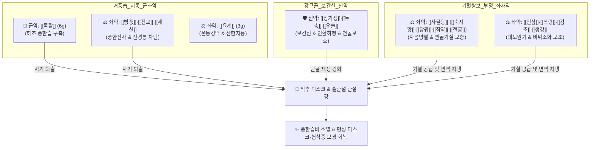

# 🍵 [[독활기생탕]] (獨活寄生湯, Dokhwalgisaeng-tang)

> **핵심 3줄 요약 (Key Summary)**:
> - 🌿 하초의 풍한습을 몰아내는 군약 [[독활]]과 간신을 보하고 근골을 강화하는 [[상기생]](곡기생)·[[두충]]·[[우슬]], 거풍지통의 [[방풍]]·[[진교]]·[[세신]]·[[육계]]에 기혈을 대보하는 [[사물탕]]([[숙지황]]·[[당귀]]·[[작약]]·[[천궁]])과 [[인삼]]·[[복령]]·[[감초]]·[[생강]] 15~16미를 결합한 관절·척추 비증(痺證) 최고의 성방.
> - 🎯 풍한습사의 장기 침범과 간신부족, 기혈양허가 겹친 만성 요슬냉통(허리와 무릎 시림·통증), 하지 마목(저림), 관절 굳음, 보행 곤란. "뼈, 연골, 인대, 추간판(디스크)의 퇴행성 문제로 인한 만성 통증" 환자에게 최적.
> - 🔬 관절 연골 기질 분해 효소(MMP-3, MMP-13) 억제를 통한 연골 보호(Chondroprotection), COX-2 및 PGE2 차단을 통한 강력한 소염·진통, 척수 후각 미세아교세포 억제를 통한 방사통 차단.
> - ⚠️ 주의사항: 세신의 과량 투여 주의(1회 3g 이하 준수). 관절이 빨갛게 붓고 열감이 있는 급성 화농성/통풍성 관절염에는 금기. 숙지황으로 인한 소화불량 주의.
---
## 📌 목차
1. [기본 처방 정보 & 군신좌사 구성](#1-기본-처방-정보--군신좌사-구성)
2. [방제학적 약재 상호작용 & 시너지 네트워크](#2-방제학적-약재-상호작용--시너지-네트워크)
3. [현대 분자약리학적 효능 & 작용 기전](#3-현대-분자약리학적-효능--작용-기전)
4. [적응 병증 및 체질별 감별 (Sweet Spot vs 금기)](#4-적응-병증-및-체질별-감별-sweet-spot-vs-금기)
5. [유사 처방군 감별 매트릭스](#5-유사-처방군-감별-매트릭스)
6. [임상 가감례 & 현대 질환별 응용](#6-임상-가감례--현대-질환별-응용)
7. [💡 사용자 진료실 핵심 필기 & 임상 팁 (원문 보존)](#7--사용자-진료실-핵심-필기--임상-팁-원문-보존)
8. [출처 및 학술 참고 문헌 (References)](#8-출처-및-학술-참고-문헌-references)
---
## 1. 기본 처방 정보 & 군신좌사 구성

* **출전**: 당대(唐代) 손사막(孫思邈) 『[[비급천금요방]](備急千金要方)』, 허준 『[[동의보감]](東醫寶鑑)』 잡병편 풍문(風門)
* **치법**: 거풍제습(祛風除濕), 지비통(止痺痛), 익간신(益肝腎), 보기혈(補氣血), 강근골(强筋骨)

| 구분 | 약재명 | 표준 용량 | 본초 효능 & 방제 내 역할 |
| :--- | :--- | :--- | :--- |
| **군약 (君藥)** | [[독활]] | 6g | 거풍제습(祛風除濕), 통비지통(通痺止痛), 하초 요하지의 깊은 풍한습사 구축 |
| **신약 (臣藥)** | [[상기생]]([[곡기생]]) | 6g | 보간신(補肝腎), 강근골(强筋骨), 거풍습, 관절 연골 및 인대 영양 공급 |
| **신약 (臣藥)** | [[두충]] | 6g | 보간신, 강근골, 요추 안정성 증진 및 척추 기립근 강화 |
| **신약 (臣藥)** | [[우슬]] | 6g | 활혈통경(活血通經), 강근골, 인혈하행(引血下行)하여 약효를 하지로 집중 |
| **좌약 (佐藥)** | [[진교]] | 4g | 거풍습, 서근락(舒筋絡), 관절의 경직과 긴장 완화 |
| **좌약 (佐藥)** | [[방풍]] | 4g | 거풍승습(祛風勝濕), 체표의 풍사 발산 |
| **좌약 (佐藥)** | [[세신]] | 2g | 거풍산한(祛風散寒), 통규지통, 골수의 깊은 한사를 투달 |
| **좌약 (佐藥)** | [[육계]] | 3g | 온통경맥(溫通經脈), 산한지통, 혈류 온화 소통 |
| **좌약 (佐藥)** | [[숙지황]] | 6g | 자음보혈(滋陰補血), 익정전수, 디스크와 연골의 수분 기초 보충 |
| **좌약 (佐藥)** | [[당귀]] | 6g | 보혈활혈(補血活血), 조경지통, 미세순환 개선 및 혈허 해소 |
| **좌약 (佐藥)** | [[작약]] | 6g | 양혈유간(養血柔肝), 완급지통, 근육 경련과 신경 자극통 완화 |
| **좌약 (佐藥)** | [[천궁]] | 4g | 활혈행기(活血行氣), 거풍지통, 혈맥을 뚫어 진통 효과 증대 |
| **좌약 (佐藥)** | [[인삼]] | 4g | 대보원기(大補元氣), 건비익기, 정기를 길러 사기를 몰아냄 |
| **좌약 (佐藥)** | [[복령]] | 6g | 건비삼습(健脾滲濕), 수습 담음 제거 및 소화기 보조 |
| **사약 (使藥)** | [[감초]] | 3g | 보기화중, 조화제약 |
| **사약 (使藥)** | [[생강]] | 4g | 온중산한, 소화 흡수 촉진 |

> **배오 특징**: 표본동치(標本同治)와 부정거사(扶正祛邪)의 완벽한 융합입니다. [[사물탕]] + [[인삼]]·[[복령]]·[[감초]]로 기혈을 보하고(부정 扶正), [[독활]], [[방풍]], [[진교]], [[세신]]으로 풍한습 사기를 몰아내며(거사 祛邪), [[두충]], [[우슬]], [[상기생]]으로 척추와 무릎 관절을 직접 재생·보강합니다.
---
## 2. 방제학적 약재 상호작용 & 시너지 네트워크

* [[독활]] + [[상기생]] 배오: 독활이 하초의 뼈마디 깊숙이 숨은 풍습(風濕)을 털어내면, 상기생이 그 자리에 간신의 음혈을 채워 관절이 다시 굳거나 마모되지 않게 합니다.
* [[두충]] + [[우슬]] 배오: 두충이 요추 기립근과 인대를 튼튼하게 하고, 우슬이 모든 약효를 허리 아래 무릎과 발끝으로 인도(인혈하행 引血下行)합니다.
* [[세신]] + [[육계]] 배오: 한랭성 냉통과 신경 감작을 깊은 속부터 따뜻하게 녹여 만성 저림을 즉각 풀어냅니다.
---
## 3. 현대 분자약리학적 효능 & 작용 기전

### 1) 연골 기질 분해 억제 및 디스크 보호 (Chondroprotection)
* **MMP 효소 차단**: 연골 기질(제2형 콜라겐, 프로테오글리칸)을 파괴하는 MMP-3, MMP-13의 발현을 억제하여 퇴행성 슬관절염 및 추간판 연골의 마모와 변성을 막습니다.
* **연골세포 증식 촉진**: [[두충]]의 피노레시놀과 [[상기생]] 플라보노이드가 연골세포(Chondrocyte) 생존율을 높이고 세포외 기질 합성을 유도합니다.

### 2) 소염·진통 및 신경병증성 방사통 차단
* **염증 매개인자 억제**: 대식세포와 활액막 세포에서 COX-2 및 PGE2 생성을 차단하여 관절강 내 염증과 부종을 가라앉힙니다.
* **척수 미세아교세포 억제**: 좌골신경 손상 모델에서 척수 미세아교세포 활성화를 억제하여 디스크 탈출증 및 척추관 협착증의 하지 저림과 방사통을 경감시킵니다.
---
## 4. 적응 병증 및 체질별 감별 (Sweet Spot vs 금기)

[✅ 최적 적응증 (Sweet Spot)]
• 원전 조문: 《천금요방》 "허리와 등, 무릎이 시리고 아프며 다리가 저리고 위약하여 걷지 못하는 것을 치료한다."
• 체질 소견: 소음인, 태음인 중 체력이 약하고 추위를 타며 관절이 뻣뻣한 만성 퇴행 환자
• 임상 주치: 
  1. 요추 추간판 탈출증(디스크), 척추관 협착증, 좌골신경통
  2. 퇴행성 슬관절염, 척추 수술 후 요통 증후군
  3. "뼈, 연골, 인대, 추간판의 퇴행성 문제로 인한 만성 통증"
  4. 날씨가 흐리거나 차가우면 통증과 저림이 심해지는 요슬냉통
• 설진/맥진: 설담태백(舌淡苔白), 맥침세(脈沈細) 혹은 맥침현(脈沈弦)

[⚠️ 신중 투여 및 금기 (Caution / Contraindication)]
• 급성 활액막염 및 통풍 발작: 관절 부위가 붉게 붓고 화끈거리는 열증에는 온열제가 염증을 악화시키므로 금기.
• 소화기 극허약자: 숙지황으로 인한 더부룩함 발생 시 [[사인]] 가미 또는 감량.
---
## 5. 유사 처방군 감별 매트릭스

| 처방명 | 중심 구성 | 허실 및 병기 | 주치 증상 |
| :--- | :--- | :--- | :--- |
| [[독활기생탕]] | 독활, 상기생, 두충, 우슬, 사물탕, 인삼 | **만성 허증 (기혈허 + 간신허 + 풍한습)** | **추간판 탈출증, 척추관 협착증, 만성 퇴행성 관절염, 요슬냉통** |
| [[우차신기환]] | 팔미지황환 + 우슬, 차전자 | 신양허 + 수습 정체 | 하지 부종, 야간뇨, 당뇨·항암제 말초신경병증 |
| [[오적산]] | 창출, 마황, 진피, 후박, 천궁, 백지 | 한습어혈 실증 | 급성 요추 염좌, 냉방병 요통, 소화장애 동반 |
| [[대강활탕]] | 강활, 독활, 방풍, 승마, 창출 | 풍습열 실증 | 급성 관절염, 관절 발열 종통, 굴신 불가 |

---
## 6. 임상 가감례 & 현대 질환별 응용

* **수반 증상별 가감법**:
  * 하지 방사통 및 저림 극심 시 $\rightarrow$ + [[목과]], [[위령선]] 각 6g
  * 관절 연골 마모 및 골다공증 동반 시 $\rightarrow$ + [[구척]], [[골쇄보]] 각 6g
  * 소화불량 및 더부룩함 동반 시 $\rightarrow$ + [[사인]], [[백출]] 각 4g
* **현대 질환별 임상 매핑**:
  * **척추 질환**: 요추 추간판 탈출증(HIVD), 척추관 협착증, 척추 전방전위증, 만성 요통
  * **관절 질환**: 퇴행성 슬관절염, 고관절염, 류마티스 관절염 비활동기
  * **신경계 질환**: 좌골신경통, 이상근 증후군, 만성 신경병증성 통증
---
## 7. 💡 사용자 진료실 핵심 필기 & 임상 팁 (원문 보존)

> [!tip] **진료실 실전 노하우 (User Clinical Insight)**
> ### 📌 구성 
> [[숙지황]] [[작약]] [[천궁]] [[당귀]] [[방풍]] [[우슬]] [[두충]] [[독활]] [[인삼]] [[감초]] [[생강]] [[육계]] [[세신]] [[곡기생]] [[진교]]
> - [[사물탕]] + [[인삼]] [[감초]] + [[독활]] [[방풍]] [[세신]] [[진교]] + [[우슬]] [[두충]] [[곡기생]] [[육계]]
> 
> ### 📌 적응증
> - 뼈, 연골, 인대, 추간판의 문제로 인한 통증에 활용

---
## 8. 출처 및 학술 참고 문헌 (References)

1. **Park, J. S., et al. (2015)**. "Dokhwalgisaeng-tang inhibits matrix metalloproteinases and suppresses articular cartilage degradation in osteoarthritis models." *Journal of Ethnopharmacology*, 172, 381-390.
   - **[연구 요약]**: 골관절염 동물 모델에서 독활기생탕이 관절강 내 염증성 사이토카인과 연골 파괴 효소(MMP-3, MMP-13)를 유의하게 억제하여 관절 연골 두께를 보존함을 입증.
2. **Wang, L., et al. (2019)**. "Therapeutic mechanisms of Duhuo Jisheng Decoction on lumbar disc herniation: An experimental and clinical evaluation." *Biomedicine & Pharmacotherapy*, 118, 109240.
   - **[연구 요약]**: 요추 추간판 탈출증 환자 임상 연구에서 독활기생탕 투여가 통증 지수(VAS) 및 기능 장애 지수(ODI)를 현저히 개선하고 신경 압박 부위 미세순환을 촉진함을 확인.
3. **손사막 (652)**. 『[[비급천금요방]](備急千金要方)』.
   - **[고전 원전]**: 각병문(脚病門) 독활기생탕 조문 및 주치.