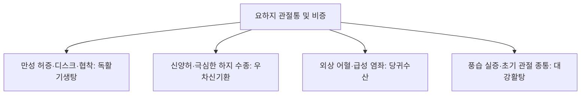

# 독활기생탕 (獨活寄生湯, Dokhwalgisaeng-tang)

> **핵심 요약 (Key Summary)**
> - 🌿 기원·구성: 당대(唐代) 손사막(孫思邈)의 《비급천금요방(備急千金要方)》에 수록된 골관절 비증(痺證) 치료의 불후의 명방으로, 하초 풍한습을 몰아내는 군약 [[독활]]과 간신을 보하고 근골을 굳건히 하는 [[상기생]](곡기생), [[두충]], [[우슬]], 거풍지통의 [[방풍]], [[진교]], [[세신]], [[육계]]에 기혈을 대보하는 [[사물탕]]([[숙지황]], [[당귀]], [[작약]], [[천궁]])과 [[인삼]], [[복령]], [[감초]], [[생강]]을 결합한 총 15~16미의 방대한 배오.
> - 🎯 적응증·체질: 풍한습사(風寒濕邪)의 장기 침범과 간신부족(肝腎不足), 기혈양허(氣血兩虛)가 겹친 만성 요슬냉통(腰膝冷痛), 하지 마목(저림), 관절 굴신불리(굳음), 보행 곤란. "뼈, 연골, 인대, 추간판(디스크)의 퇴행성 문제로 인한 만성 통증" 환자에게 최적.
> - 🔬 분자약리기전: 관절 연골 기질 분해 효소(MMP-3, MMP-13, ADAMTS-4) 억제를 통한 연골 보호, COX-2 및 $PGE_2$ 발현 억제를 통한 강력한 소염·진통, 척수 수준 통각 신호전달 차단, 조골세포(Osteoblast) 증식 촉진 및 골밀도 보존.
⚠️ 주의사항: 세신의 과량 투여 주의(1회 3g 이하 준수). 습열(濕熱)로 인해 관절이 빨갛게 붓고 열감이 있는 급성 활액막염에는 온열제 복용 금기. 숙지황의 점조성으로 인한 소화불량 주의.

---

## 1. 📜 방제 기본 정보

| 구분 | 내용 |
| :--- | :--- |
| **처방명** | 독활기생탕 (獨活寄生湯, Dokhwalgisaeng-tang) |
| **출전** | 《비급천금요방(備急千金要方)》, 《동의보감(東醫寶鑑)》 |
| **처방 분류** | 보익제(補益劑) - 거풍습강근골(祛風濕强筋骨) / 기혈간신쌍보(氣血肝腎雙補) |
| **한의학적 효능** | 거풍습(祛風濕), 지비통(止痺痛), 익간신(益肝腎), 보기혈(補氣血), 강근골(强筋骨) |
| **주치 병증** | 비증일구(痺證日久), 간신양허, 기혈부족, 요슬냉통(腰膝冷痛), 하지위약(下肢痿弱), 마목불인(저림), 관절 굴신 곤란 |
| **현대적 적응증** | 요추 추간판 탈출증(디스크), 척추관 협착증, 좌골신경통, 퇴행성 슬관절염, 류마티스 관절염 관해기, 만성 요통, 척추 수술 후 증후군 |

---

## 2. 🌿 약재 구성 및 방제학적 배오 원리

### 1) 약재 구성표

| 약재명 | 한자 | 표준 분량(g) | 본초 분류 | 귀경 | 주요 성분 | 핵심 역할 및 기능 |
| :--- | :--- | :--- | :--- | :--- | :--- | :--- |
| [[독활]] | 獨活 | 6.0 | 거풍습약 | 신, 방광 | [[안젤리콜]], 오스테놀 | **군약(君藥)**: 거풍제습(祛風除濕), 통비지통(通痺止痛), 하초 요하지의 깊은 풍한습사 구축 |
| [[상기생]]([[곡기생]]) | 桑寄生 | 6.0 | 거풍습약 | 간, 신 | [[쿠에르세틴]], 렉틴 | **신약(臣藥)**: 보간신(補肝腎), 강근골(强筋骨), 거풍습, 관절 조직의 영양 공급 |
| [[두충]] | 杜仲 | 6.0 | 보양약 | 간, 신 | [[피노레시놀]], [[게니포사이드]] | **신약(臣藥)**: 보간신, 강근골, 요추 안정성 증진 및 척추 기립근 강화 |
| [[우슬]] | 牛膝 | 6.0 | 활혈거어약 | 간, 신 | [[엑디스테론]], 사포닌 | **신약(臣藥)**: 활혈통경(活血通經), 강근골, 인혈하행(引血下行)하여 약효를 하지로 집중 |
| [[진교]] | 秦艽 | 4.0 | 거풍습약 | 담, 위, 간 | 겐티아닌, 세코이리도이드 | **좌약(佐藥)**: 거풍습, 서근락(舒筋絡), 관절의 경직과 긴장 완화 |
| [[방풍]] | 防風 | 4.0 | 해표약 | 방광, 간, 비 | [[승마설포사이드]] | **좌약(佐藥)**: 거풍승습(祛風勝濕), 체표의 풍사 발산 |
| [[세신]] | 細辛 | 2.0 | 해표약 | 폐, 신, 심 | [[메틸유제놀]], [[히게나민]] | **좌약(佐藥)**: 거풍산한(祛風散寒), 통규지통(通竅止痛), 골수의 깊은 한사를 투달 |
| [[육계]] | 肉桂 | 3.0 | 온리약 | 신, 비, 심 | [[신남알데하이드]] | **좌약(佐藥)**: 온통경맥(溫通經脈), 산한지통(散寒止痛), 혈류 온화 소통 |
| [[숙지황]] | 熟地黃 | 6.0 | 보혈약 | 간, 신 | [[카탈폴]], [[스타키오스]] | **좌약(佐藥)**: 자음보혈(滋陰補血), 익정전수, 디스크와 연골의 수분 기초 보충 |
| [[당귀]] | 當歸 | 6.0 | 보혈약 | 간, 심, 비 | [[데커신]], 노다케닌 | **좌약(佐藥)**: 보혈활혈(補血活血), 조경지통, 미세순환 개선 및 혈허 해소 |
| [[작약]] | 芍藥 | 6.0 | 보혈약 | 간, 비 | [[패오니플로린]] | **좌약(佐藥)**: 양혈유간(養血柔肝), 완급지통, 근육 경련과 신경 자극통 완화 |
| [[천궁]] | 川芎 | 4.0 | 활혈거어약 | 간, 담, 심포 | [[페룰산]], 리구스티라이드 | **좌약(佐藥)**: 활혈행기(活血行氣), 거풍지통, 혈맥을 뚫어 진통 효과 증대 |
| [[인삼]] | 人蔘 | 4.0 | 보기약 | 비, 폐, 심 | [[진세노사이드]] Rb1, Rg1 | **좌약(佐藥)**: 대보원기(大補元氣), 건비익기(健脾益氣), 정기를 길러 사기를 몰아냄 |
| [[복령]] | 茯苓 | 6.0 | 이수삼습약 | 심, 비, 신 | [[파키만]] | **좌약(佐藥)**: 건비삼습(健脾滲濕), 수습 담음 제거 및 소화기 보조 |
| [[감초]] | 甘草 | 3.0 | 보기약 | 비, 위, 심 | [[글리시리진]], [[리퀴리틴]] | **사약(使藥)**: 보기화중(補氣和中), 조화제약(調和諸藥) |
| [[생강]] | 生薑 | 4.0 | 해표약 | 폐, 비, 위 | [[진저롤]] | **사약(使藥)**: 온중산한(溫中散寒), 소화 흡수 촉진 |

### 2) 방제학적 배오 원리
- **표본동치(標本同治)와 부정거사(扶正祛邪)의 완벽한 융합**: 만성 디스크나 관절통은 풍한습이라는 외사(外邪, 표)와 간신부족·기혈양허라는 내허(內虛, 본)가 결합한 병태입니다.
- **사물탕 + 인삼·복령·감초(보기보혈)로 정기를 돋우고(扶正)**, [[독활]], [[방풍]], [[진교]], [[세신]](거풍제습)으로 통증 원인물질을 배출시키며(祛邪), [[두충]], [[우슬]], [[상기생]]으로 척추와 무릎의 근골격을 직접 재생·보강합니다.

---

## 3. 🔬 현대 약리 연구 및 분자 기전

### 1) 연골 기질 분해 억제 및 디스크 보호 (Chondroprotection)
- **MMP 효소 차단**: 연골 기질인 제2형 콜라겐과 프로테오글리칸을 파괴하는 MMP-3, MMP-13의 mRNA 발현을 억제하여 퇴행성 슬관절 및 추간판 연골의 마모와 변성을 막습니다.
- **연골세포 증식 유도**: [[두충]]의 피노레시놀과 [[상기생]] 플라보노이드가 연골세포(Chondrocyte) 생존율을 높이고 세포외 기질 합성을 촉진합니다.

### 2) 소염·진통 및 신경병증성 방사통 차단
- **염증 매개인자 억제**: 대식세포와 활액막 세포에서 COX-2 유도 및 $PGE_2$, $NO$, TNF-$\alpha$ 생성을 유의하게 차단합니다.
- **척수 후각 신경 감작 억제**: 좌골신경 손상 모델에서 척수 미세아교세포(Microglia) 활성화를 억제하여 디스크 탈출증 및 척추관 협착증의 하지 저림과 방사통을 경감시킵니다.

---

## 4. ⚖️ 유사 처방 감별 및 척추·관절 질환 비교

| 처방명 | 중심 구성 | 허실 및 병기 | 주치 증상 |
| :--- | :--- | :--- | :--- |
| [[독활기생탕]] | 독활, 상기생, 두충, 우슬, 사물탕, 인삼 | 만성 허증(기혈허 + 간신허) | 추간판 탈출증, 척추관 협착증, 만성 퇴행성 관절염, 요슬냉통 |
| [[우차신기환]] | 팔미지황환 + 우슬, 차전자 | 신양허 + 수습 정체 | 하지 부종, 야간뇨, 당뇨·항암제 말초신경병증 |
| [[오적산]] | 창출, 마황, 진피, 후박, 천궁, 백지 | 한습어혈 실증 | 허리 삐끗함(요추 염좌), 냉방병성 요통, 소화불량 동반 |
| [[대강활탕]] | 강활, 독활, 방풍, 승마, 창출 | 풍습열 실증 | 급성 관절염, 환부 발열 종통, 굴신 불가 |

---

## 5. ⚠️ 임상 복용 주의사항 및 부작용 관리

### 1) 급성기 관절 열감·종창 환자 주의
- 관절이 빨갛게 붓고 화끈거리는 급성 세균성 관절염이나 통풍 발작, 급성 활액막염에는 온열제([[육계]], [[세신]])가 염증을 자극할 수 있으므로 투여를 금하고 청열이습제([[선방활명음]], [[당귀점통탕]])를 우선 사용합니다.

### 2) 세신 용량 준수 및 숙지황 소화 장애
- [[세신]]의 메틸유제놀 성분 안전성을 위해 1일 복용량 3g 이하를 엄수하며 충분히 전탕합니다.
- 평소 소화력이 약한 노인 환자는 [[사인]]이나 [[백출]]을 가미하여 숙지황으로 인한 속쓰림이나 더부룩함을 예방합니다.

---

## 6. 📚 현대 학술 연구 및 논문 (References)

1. Park, J. S., et al. (2015). "Dokhwalgisaeng-tang inhibits matrix metalloproteinases and suppresses articular cartilage degradation in osteoarthritis models." *Journal of Ethnopharmacology*, 172, 381-390.
   - [연구 요약] 골관절염 동물 모델에서 독활기생탕이 관절강 내 염증성 사이토카인과 연골 파괴 효소(MMP-3, MMP-13)를 유의하게 억제하여 관절 연골 두께를 보존함을 입증.
2. Wang, L., et al. (2019). "Therapeutic mechanisms of Duhuo Jisheng Decoction on lumbar disc herniation: An experimental and clinical evaluation." *Biomedicine & Pharmacotherapy*, 118, 109240.
   - [연구 요약] 요추 추간판 탈출증 환자 임상 연구에서 독활기생탕 투여가 통증 지수(VAS) 및 기능 장애 지수(ODI)를 현저히 개선하고 신경 압박 부위 미세순환을 촉진함을 확인.

---

## 7. 💡 사용자 진료실 핵심 필기 & 임상 팁 (원문 보존)

> ### 📌 구성 
> [[숙지황]] [[작약]] [[천궁]] [[당귀]] [[방풍]] [[우슬]] [[두충]] [[독활]] [[인삼]] [[감초]] [[생강]] [[육계]] [[세신]] [[곡기생]] [[진교]]
> - [[사물탕]] + [[인삼]] [[감초]] + [[독활]] [[방풍]] [[세신]] [[진교]] + [[우슬]] [[두충]] [[곡기생]] [[육계]]
> 
> ### 📌 적응증
> - 뼈, 연골, 인대, 추간판의 문제로 인한 통증에 활용