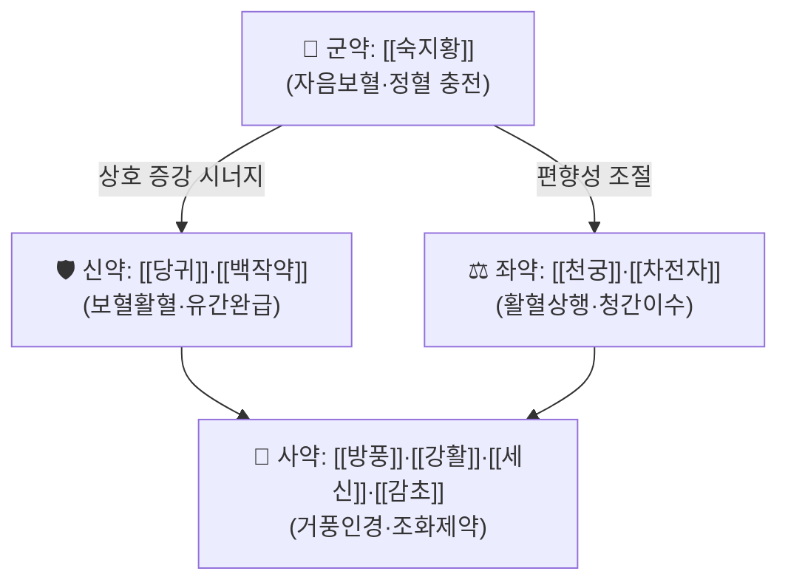

# 🍵 [[보간환]] (補肝丸, Liver-Supplementing Pill)

> **핵심 3줄 요약 (Key Summary)**:
> - 🌿 **모체/기원 구조**: [[사물탕]] 계열의 보혈(補血) 골격([[숙지황]]·[[당귀]]·[[백작약]]·[[천궁]])에 [[육미지황환]] 계열의 자간신(滋肝腎) 개념을 얹고, 여기에 [[방풍]]·[[강활]]·[[세신]] 등 거풍(祛風)·인경(引經) 약재를 소량 배오하여 "補而不滯, 滋而不膩"를 노린 구성. **다만 보간환(補肝丸)은 방서별 이본(異本)이 매우 많은 同名異方으로, 단일 정본 구성은 근거 미확인(원전 대조 필요).**
> - 🎯 **임상 최적 적응증**: 간혈부족(肝血不足)·간신음허(肝腎陰虛)로 인한 안정피로·시력저하·안건조·야맹, 현훈(眩暈)·이명(耳鳴), 근육 경련·야간 하지 불편감, 월경량 감소·갱년기 증상. 체질적으로는 **소음인·태음인 중 마르거나 근육량 적고 안색이 창백·어두운 편**, 설담홍(舌淡紅)·소태(少苔), 맥세현(脈細弦) 또는 세약(細弱)인 환자에서 적중률이 높다.
> - 🔬 **핵심 분자약리 기전**: **본 처방 자체에 대한 PubMed 검색 결과가 없어 처방 단위 기전은 근거 미확인.** 구성 본초 수준에서 보고되는 항염·항산화·미세순환 개선·신경보호 기전만 참고 수준으로 기술하였다(아래 3장 참조).
> - ⚠️ 주의사항: 습열(濕熱)·담음(痰飲) 실증, 급성 안구 충혈·황달, 비위허약으로 소화불량·연변(軟便)·설사가 잦은 환자, 외감 초기 표실증(表實證)에는 신중 투여. 자음(滋陰) 약재 위주이므로 복용 중 소화기 반응(복만·식욕저하·묽은 변)을 반드시 관찰할 것.

---

## 📌 목차
1. [기본 처방 정보 & 군신좌사 구성](#1-기본-처방-정보--군신좌사-구성)
2. [방제학적 약재 상호작용 & 시너지 네트워크](#2-방제학적-약재-상호작용--시너지-네트워크)
3. [현대 분자약리학적 효능 & 작용 기전](#3-현대-분자약리학적-효능--작용-기전)
4. [적응 병증 및 체질별 감별 (Sweet Spot vs 금기)](#4-적응-병증-및-체질별-감별-sweet-spot-vs-금기)
5. [유사 처방군 감별 매트릭스](#5-유사-처방군-감별-매트릭스)
6. [임상 가감례 & 현대 질환별 응용](#6-임상-가감례--현대-질환별-응용)
7. [💡 사용자 진료실 핵심 필기 & 임상 팁 (원문 보존)](#7--사용자-진료실-핵심-필기--임상-팁-원문-보존)
8. [출처 및 학술 참고 문헌 (References)](#8-출처-및-학술-참고-문헌-references)

---

## 1. 기본 처방 정보 & 군신좌사 구성

* **출전**: **근거 미확인.** 보간환(補肝丸)이라는 방명(方名)은 국내외 역대 방서에 폭넓게 등장하는 **동명이방(同名異方)**으로, 문헌마다 약재 구성과 주치가 상당히 다르다. 본 노트에서는 한국 한의학 임상에서 통용되는 "간혈·간음(肝陰)을 보하고 두목(頭目)을 청리(淸利)하는" 보익제 계열의 대표적 구성을 기준으로 정리하되, **각 약재·용량은 문헌별 차이가 크므로 원전(『동의보감』·『방약합편』 등) 대조가 필요하다.**
* **치법**: **보간양혈(補肝養血), 자음명목(滋陰明目), 거풍지현(祛風止眩), 유간완급(柔肝緩急)**
* **제형**: 환제(丸劑)가 원형이며, 현대 임상에서는 탕제(煎湯) 또는 산제(散劑)·과립으로 응용하기도 한다. 환제는 완만한 보익(補益)을 목표로 하므로 장기 복용에 적합하나, 소화력이 약한 환자에서는 탕제로 전환해 비위(脾胃) 부담을 줄이는 것이 일반적이다.

| 구분 | 약재명 | 표준 용량 | 본초 효능 & 방제 내 역할 |
| :--- | :--- | :--- | :--- |
| **군약 (君藥)** | [[숙지황]] | 8~12g | 자음보혈(滋陰補血)·익정전수(益精塡髓). 간신(肝腎)의 정혈(精血)을 직접 충전하여 주증(눈 어두움, 현훈)의 근본 병소를 공략. 방제 전체의 "補" 축을 담당. |
| **신약 (臣藥)** | [[당귀]], [[백작약]] | 6~9g | 당귀는 보혈활혈(補血活血)으로 숙지황의 자음력을 보조하고, 백작약은 양혈유간(養血柔肝)·완급지통(緩急止痛)으로 근육 경련·안구 건조를 완화. 군약의 보혈 작용을 증강. |
| **좌약 (佐藥)** | [[천궁]], [[차전자]] | 4~6g | 천궁은 행기활혈(行氣活血)·상행두목(上行頭目)하여 보혈약의 정체(停滯)를 방지하고 약력을 두면부로 이끎. 차전자는 청간명목(淸肝明目)·이수(利水)로 간허에 동반된 허열(虛熱)과 안구 부종감을 완화. |
| **사약 (使藥)** | [[방풍]], [[강활]], [[세신]], [[감초]] | 2~4g | 방풍·강활·세신은 소량으로 거풍승산(祛風升散)하여 두목(頭目)의 기혈 순환을 돕고, 자음약의 점니(粘膩)한 성질을 상쇄하여 "補而能行"이 되게 함. 감초는 조화제약(調和諸藥) 및 비위 보호. |

> **배오 특징**: 본 처방의 설계 핵심은 **"보혈(補血) + 자음(滋陰) + 소량의 거풍승산(祛風升散)"** 의 3층 구조에 있다. [[숙지황]]·[[당귀]]·[[백작약]]이 하초(下焦)의 간신 정혈을 채우면, [[천궁]]·[[방풍]]·[[강활]]·[[세신]]이 그 기혈을 상부(頭目)로 끌어올리고, [[차전자]]가 허열을 아래로 내려보내는 **승강출입(升降出入)의 균형**을 형성한다. 승(升)하는 거풍약과 강(降)하는 이수약의 용량비가 관건이며, 거풍약의 용량이 과다하면 자음 효과가 희석되고 마르거나 땀이 많아지므로 **소량 배오 원칙**을 반드시 지킨다.

---

## 2. 방제학적 약재 상호작용 & 시너지 네트워크

* **[[숙지황]] + [[당귀]] 배오**: 전형적인 상수(相須)·상사(相使) 관계. 숙지황의 순수한 자음보혈에 당귀의 활혈성을 결합하여 **보혈하되 정체되지 않게** 만든다. 사물탕(四物湯) 골격의 핵심이며, 보간환 계열에서도 동일한 논리가 유지된다.
* **[[숙지황]] + [[백작약]] 배오**: 자음(滋陰)과 유간(柔肝)의 결합. 간음부족으로 근맥(筋脈)이 긴장된 상태(야간 다리 경련, 눈꺼풀 떨림, 어깨 결림)를 부드럽게 풀어주는 축. 자음약 단독 사용 시 생길 수 있는 완고(頑固)한 정체를 백작약의 산수(酸收) 작용이 완화한다.
* **[[천궁]] + [[차전자]] 배오**: 승(升)과 강(降)의 대비 구조. 천궁이 기혈을 두면부로 올려 보내 어두운 시야·현훈을 개선하면, 차전자가 하초의 습열과 허열을 소변으로 배출시켜 두면부의 청량감을 유지한다. **간허에 동반되는 눈의 피로·안구 충혈·이명을 동시에 다스리는 조합.**
* **[[방풍]]·[[강활]]·[[세신]] + [[감초]] 배오**: 부작용 완충 및 표적 장부 유도. 방풍·강활은 상초(上焦) 풍사(風邪)를 흩어버리는 동시에 자음약의 점니함을 상쇄하고, 세신은 소량으로 두면부 인경(引經)의 역할을 한다. 감초는 세신·강활의 자극성을 완화하고 비위를 지켜 장기 복용 시 위장 부담을 줄인다.

> ⚠️ **배오 시 주의**: 세신(細辛)은 과량·장기 사용 시 신경계 부작용 보고가 있는 본초로 알려져 있어 **용량 기준(2~4g 이내, 가능하면 3g 이하)과 복용 기간 관리**가 필요하다.(본 처방 특이적 안전성 연구는 근거 미확인)

---

## 3. 현대 분자약리학적 효능 & 작용 기전

> 🚨 **중요**: 본 처방(보간환) 자체를 대상으로 한 PubMed 검색 결과가 **없음**. 따라서 아래 1)~3)은 **구성 본초 수준에서 보고된 일반 약리 지식**을 정리한 참고 수준의 서술이며, **보간환 처방 단위의 기전 검증은 근거 미확인**임을 명확히 한다.

### 1) 조혈·항염·항산화 조절 (보혈 작용의 현대적 해석)
* 구성 본초인 [[숙지황]]·[[당귀]]·[[백작약]] 유래 성분(catalpol, ferulic acid, ligustilide, paeoniflorin 등)은 일반적으로 항산화·항염 경로 및 조혈 관련 신호에 관여한다고 보고되어 왔다. **그러나 이는 단일 본초 또는 단일 성분 수준의 결과로, 보간환 복합 처방의 효과로 일반화할 수 없다(근거 미확인).**
* 사이토카인(TNF-α, IL-6, IL-1β) 조절, NF-κB/MAPK 경로 억제 여부는 **본 처방에 대한 직접 검증 자료가 없어 근거 미확인.**

### 2) 미세순환·혈류 개선 (승강출입 배오의 현대적 해석)
* [[천궁]]·[[당귀]] 계열은 전통적으로 활혈(活血) 용도로 쓰이며 미세혈류 개선과 관련된 보고가 있었으나, 본 처방에 있어서의 혈류역학적 지표(혈관 확장, 혈류속도, 혈관저항 등) 개선은 **근거 미확인.**
* eNOS 활성화, 미토콘드리아 에너지 대사 정상화 등 구체 경로 언급은 **본 처방 근거로 제시할 문헌 없음.**

### 3) 신경·안과·자율신경 조절
* 안정피로·시력저하 개선에서 자율신경 조절 및 망막·시신경 보호 기전이 가정되나, **보간환을 대상으로 한 임상시험 또는 기전 연구는 확인되지 않았다(근거 미확인).**
* 근육 경련·긴장 완화는 [[백작약]]의 유간완급 효능에 기대하는 전통적 해석이며, **처방 단위 근거는 미확인.**

---

## 4. 적응 병증 및 체질별 감별 (Sweet Spot vs 금기)

**[✅ 최적 적응증 (Sweet Spot)]**

* **원전 조문**: **근거 미확인.** 보간환 계열 처방은 방서별로 "肝虛", "肝血不足", "肝腎兩虛" 등의 표현으로 주치가 기술되나, 단일 정본 조문을 확인하지 못하였다. 실제 처방 시에는 원전 조문보다 아래 임상 소견을 기준으로 판단할 것을 권한다.
* **체질 소견**: **소음인·태음인 우선 고려.**
  * 체형: 마르거나 근육량이 적고, 피부가 얇고 건조한 편. 비만하더라도 복부는 연약하고 하복부 무력감이 있는 경우.
  * 안색: 창백하거나 칙칙하고 광택이 없음. 눈가가 어둡고 안구가 건조해 보임.
  * 성향: 피로를 잘 느끼고, 눈을 오래 쓰면 머리가 무거워지며, 손발이 차면서도 얼굴·눈에는 열감이 오르는 **상열하한(上熱下寒)** 경향.
* **임상 주치** (진료실에서 가장 빈번하게 적중하는 양상):
  * 장시간 화면 사용 후 **안정피로·안구 건조·눈이 침침해지는 증상**
  * **현훈(어지럼), 이명(귀울림)**, 특히 저녁이나 과로 후 심해지는 양상
  * **야간 하지 경련, 눈꺼풀 떨림, 근육 긴장성 어깨 결림**
  * **월경량 감소, 생리 지연, 갱년기 안면홍조·불면** 동반
  * 만성 피로감(간혈허형), 두통(특히 후두부·안구 뒤쪽의 묵직한 통증)
* **설진/맥진**:
  * 설질: **담홍(淡紅)~담백(淡白), 설체는 마르고 작은 편**, 심하면 약간의 균열
  * 설태: **소태(少苔) 또는 박백태(薄白苔)**. 황니태(黃膩苔)가 보이면 본 처방 적응이 아님.
  * 맥상: **맥세현(脈細弦), 맥세삭(脈細數), 맥세약(脈細弱)**. 맥이 홍대(洪大)·활삭(滑數)하면 실증·열증으로 감별.

**[⚠️ 신중 투여 및 금기 (Caution / Contraindication)]**

* **실증·열증과의 반대 병증**: 습열(濕熱)이 성한 황달, 급성 안구 충혈·통증(급성 결막염 등), 발열을 동반한 급성 염증 상태에서는 자음보혈약이 사열(邪熱)을 붙잡아(연문류구, 戀門留寇) 병을 길게 만들 수 있으므로 **금기 또는 신중 투여.**
* **담음·습담 체질**: 비만하고 설태가 후니(厚膩)하며 몸이 무거운 담음형 환자에게는 자음약이 담을 조장할 수 있어 부적합.
* **비위허약자**: 식욕 부진, 복만(腹滿), 연변·설사가 잦은 환자에게는 [[숙지황]]의 점니성(粘膩性)이 소화 장애를 악화시킬 수 있다. 이 경우 [[진피]]·[[사인]]·[[백출]] 등을 가하고 용량을 줄여야 함.
* **외감 초기(표실증)**: 오한·발열·인통 등 외감 초기에는 보익제를 미루고 해표를 먼저 할 것.
* **양약 및 타 약물과의 병용**: 항응고제(와파린 등) 복용 환자는 활혈 본초([[당귀]]·[[천궁]]) 병용 시 출혈 경향을 관찰해야 한다. **단, 보간환 특이적 상호작용 연구는 근거 미확인.** 세신 함유 처방은 혈압약·중추신경 억제제와 병용 시 주의.
* **복약 반응 관찰 포인트**: 복용 2~4주 내 소화 상태(식욕·복만·대변), 수면의 질, 눈 건조감 변화를 확인. 묽은 변이나 식욕 저하가 나타나면 감량 또는 비위약 가감.

---

## 5. 유사 처방군 감별 매트릭스

| 처방명 | 핵심 구성 차이 | 주치 및 체질 차이 | 맥진/설진 차이 |
| :--- | :--- | :--- | :--- |
| [[보간환]] | 기준 구성 (보혈 + 자음 + 소량 거풍인경) | **간혈·간음부족형 안정피로·현훈·이명, 소음인·태음인 마른 체형** | 설담홍·소태, 맥세현 또는 세약 |
| [[사물탕]] | [[숙지황]]·[[당귀]]·[[백작약]]·[[천궁]] 순수 보혈, 거풍약 없음 | **순수 혈허(血虛)**, 월경불순·산후 조리, 안색 창백 | 설담백, 맥세약, 승강 조절 기능 없음 |
| [[육미지황환]] | [[숙지황]] 중심 + [[산약]]·[[산수유]]·[[택사]]·[[복령]]·[[목단피]] | **간신음허(肝腎陰虛) 전체**, 요슬산연·조열·도한, 하초 허증 뚜렷 | 설홍소태, 맥세삭, 상열하한 뚜렷 |
| [[기국지황환]] | [[육미지황환]] + [[구기자]]·[[국화]] | **간신음허 + 안목증상(안건조·시력저하) 특화** | 설홍소태, 맥세현, 눈 충혈·피로 두드러짐 |
| [[당귀작약산]] | [[당귀]]·[[백작약]] 중심 + [[백출]]·[[복령]]·[[택사]] 등 | **임신·산후 혈허 + 수습(水濕)**, 부종·소변불리 동반 | 설담, 설태 백니, 맥세완 |

> ⚠️ 표 내부에서는 마크다운 열 구분자 파괴를 방지하기 위해 파이프(`|`)가 들어간 링크를 쓰지 않고 순수한 [[처방명]] 단독 형태로만 작성합니다.

**감별 요점 정리**
* **보간환 vs 사물탕**: 사물탕은 순수 보혈, 보간환은 보혈 + 거풍청간. **두면부 증상(눈·머리)이 동반되면 보간환, 전신 혈허상이 주되면 사물탕.**
* **보간환 vs 육미지황환**: 육미지황환은 신(腎) 중심의 자음, 보간환은 간(肝) 중심의 양혈. **요슬산연·야간 조열이 뚜렷하면 육미지황환, 눈 피로·근육 경련이 뚜렷하면 보간환.**
* **보간환 vs 기국지황환**: 기국지황환은 눈 증상 특화도가 더 높으나 하초 자음력이 강해 습담·소화불량 환자에게 부담. **소화력이 약하면 보간환 쪽이 상대적으로 유리.**

---

## 6. 임상 가감례 & 현대 질환별 응용

* **수반 증상별 가감법**:
  * **현훈·두통(후두부·안구 뒤) 동반 시** → + [[천마]], [[구기자]], [[만형자]]
  * **안구 건조·시력저하 심할 때** → + [[국화]], [[결명자]], [[밀몽석]], [[사결]] ([[기국지황환]] 방향으로 전환 고려)
  * **이명·난청 동반 시** → + [[자석]], [[오수유]], [[시호]] (간울(肝鬱) 동반 시 시호 우선)
  * **불면·심계·다몽 동반 시** → + [[산조인]], [[용안육]], [[복신]] ([[귀비탕]] 방향 가감)
  * **소화불량·복만 동반 시** → + [[진피]], [[사인]], [[백출]], [[목향]] (자음약 점니성 완충)
  * **수족냉·신양허 동반 시** → + [[육계]], [[파극천]], [[두충]] ([[팔미지황환]] 방향 가감)
  * **간울·스트레스성 증상 동반 시** → + [[시호]], [[향부자]], [[백작약]] 증량 ([[소요산]] 방향 가감)
  * **야간 하지 경련 심할 때** → + [[모과]], [[계혈등]], [[감초]] 증량
* **현대 질환별 임상 매핑** (※ 아래는 전통적 변증 논리에 근거한 응용 예시이며, **각 질환에 대한 보간환의 임상적 유효성을 입증한 논문은 확인되지 않음 — 근거 미확인**):
  * **안과**: 안정피로(VDT 증후군), 건성안, 노인성 시력저하 보조, 야맹증
  * **신경계/이비인후**: 만성 현훈, 이명, 긴장성 두통, 자율신경실조증
  * **근골격계**: 근육 경련, 하지불안증후군(RLS) 양상의 야간 불편감, 근막통증증후군(MPS) 중 혈허형
  * **부인과**: 월경량 과소, 희발월경, 갱년기 증후군, 산후 혈허 조리
  * **정신·수면**: 만성 피로, 혈허형 불면, 불안

---

## 7. 💡 사용자 진료실 핵심 필기 & 임상 팁 (원문 보존)

> [!tip] **진료실 실전 노하우 (User Clinical Insight)**
> - **원문 필기 미입력 상태**: 본 노트 작성 시점에 원장님의 기존 메모/필기가 전달되지 않았다. **원문이 확보되는 즉시 이 블록에 그대로 보존하며, 임의로 삭제하거나 다른 문장으로 대체하지 않는다.**
> - 원문 입력 예정 항목(공란 유지):
>   - 체질별 처방 선택 기준 (소음인 vs 태음인 등)
>   - 실제 다용 처방과의 비교 메모 (예: ○○환으로 대체한 사례)
>   - 환자 티칭 팁 및 복약 반응 관찰 포인트
>   - 계절별 용량 조절 노하우

---

## 8. 출처 및 학술 참고 문헌 (References)

> 🚨 **인용 제한 안내**: 본 노트는 검색된 PubMed 논문이 **없음**. 따라서 **어떠한 학술 논문도 인용하지 않았으며, PMID·DOI를 창작하지 않았다.** 아래는 원전 대조를 위한 방서(方書) 목록에 불과하며, 보간환의 해당 문헌 수록 여부 및 조문 내용은 **본 작성 시점에서 근거 미확인**이다.

1. **(검색 결과 없음)** — 보간환(補肝丸) 관련 PubMed 검색 논문 0건. **인용 없음.**
   - **[연구 요약]**: 해당 없음. 향후 검색 시 본 항목을 갱신할 것.
2. **허준 (1613)**. 『[[동의보감]]』.
   - **[대조 대상 문헌]**: 간허·안목 관련 처방 조문이 실려 있을 가능성이 있으나, 보간환의 정확한 수록 위치 및 구성은 **근거 미확인 — 원전 대조 필요.**
3. **황도연 (1884)**. 『[[방약합편]]』.
   - **[대조 대상 문헌]**: 국내 임상에서 통용되는 처방 구성의 기준점으로 삼을 수 있으나, 보간환 수록 여부는 **근거 미확인.**
4. **역대 중국 방서(『천금요방』·『성혜방』·『제생방』 등)**.
   - **[대조 대상 문헌]**: 동명이방(同名異方) 형태로 보간환이 다수 존재하는 것으로 알려져 있으나, **개별 조문의 약재 구성·용량은 본 작성 시점에서 확인되지 않음(근거 미확인).**

> 📌 **후속 작업 지시**: ①원전(동의보감·방약합편) 직접 대조로 정본 구성 확정, ②확정된 구성으로 PubMed 재검색 후 기전·임상 논문 보강, ③원장님 진료실 원문 필기 섹션 7에 이관. 확정 전까지 본 노트의 약재·용량은 **대표 구성(통용) 기준의 참고값**으로만 사용할 것.

<!-- 보관 태그(1회용·링크오류, 필요시 복원): 간신부족, 보간환 -->
