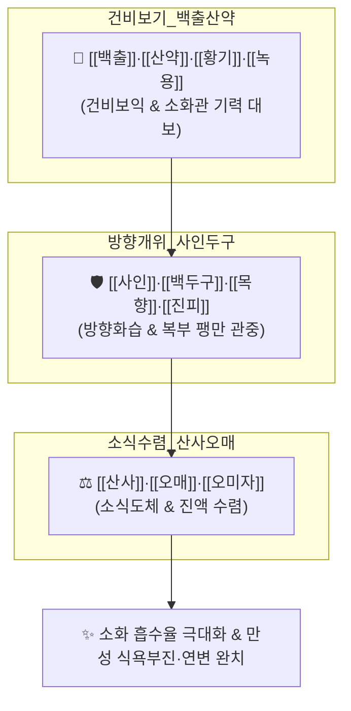

# 🍵 [[보비위탕]] (補脾胃湯, Bobiwi-tang)

> **핵심 3줄 요약 (Key Summary)**:
> - 🌿 비위와 기혈을 총괄 보익하는 21미 거대 배오 ([[원안육]]·[[황기]]·[[구기자]]·[[당귀]]·[[백출]]·[[산약]]·[[백복령]]·[[백작약]]·[[사인]]·[[산사]]·[[생강]]·[[진피]]·[[천궁]]·[[감초]]·[[대추]]·[[목향]]·[[백두구]]·[[오매]]·[[오미자]]·[[익지인]]·[[녹용]]).
> - 🎯 비위 허약으로 만성 소화불량, 식욕부진, 만성 복통, 영양 흡수 장애, 설사가 잦고 전신 쇠약과 체중 감소가 두드러진 만성 소화기 허로 환자.
> - 🔬 소화 효소(아밀라아제·펩신) 분비 촉진, 위장관 연동운동 정상화, 소장 융모 상피세포 영양 흡수능 증대, 위점막 점액 보호벽 강화.
> - ⚠️ 주의사항: 식체나 급성 위장염으로 복통과 설사가 폭발하는 급성 실증기 금기, 녹용 함유로 고열 환자 신중 투여.
---
## 📌 목차
1. [기본 처방 정보 & 군신좌사 구성](#1-기본-처방-정보--군신좌사-구성)
2. [방제학적 약재 상호작용 & 시너지 네트워크](#2-방제학적-약재-상호작용--시너지-네트워크)
3. [현대 분자약리학적 효능 & 작용 기전](#3-현대-분자약리학적-효능--작용-기전)
4. [적응 병증 및 체질별 감별 (Sweet Spot vs 금기)](#4-적응-병증-및-체질별-감별-sweet-spot-vs-금기)
5. [유사 처방군 감별 매트릭스](#5-유사-처방군-감별-매트릭스)
6. [임상 가감례 & 현대 질환별 응용](#6-임상-가감례--현대-질환별-응용)
7. [💡 사용자 진료실 핵심 필기 & 임상 팁 (원문 보존)](#7--사용자-진료실-핵심-필기--임상-팁-원문-보존)
8. [출처 및 학술 참고 문헌 (References)](#8-출처-및-학술-참고-문헌-references)
---
## 1. 기본 처방 정보 & 군신좌사 구성

* **출전**: 역대 한의학 보비위(補脾胃) 경험 명방
* **치법**: 건비화위(健脾和胃), 대보비기(大補脾氣), 소식도체(消食導滯), 온중지사(溫中止瀉)

| 구분 | 약재명 | 표준 용량 | 본초 효능 & 방제 내 역할 |
| :--- | :--- | :--- | :--- |
| **군약 (君藥)** | [[백출]], [[산약]] | 각 8g | 건비익기(健脾益氣), 조습보비, 비위 점막 재생 및 소화력 근본 복구 |
| **군약 (君藥)** | [[황기]], [[녹용]] | 각 6g | 대보원기, 온보정혈, 전신 대사 기능 항진 및 쇠약 회복 |
| **신약 (臣藥)** | [[당귀]], [[백작약]] | 각 6g | 양혈유간, 비위를 자양하고 장관 평활근 연축 완화 |
| **신약 (臣藥)** | [[백복령]], [[천궁]] | 각 4g | 건비삼습, 혈액순환 촉진 |
| **좌약 (佐藥)** | [[사인]], [[백두구]] | 각 4g | 화습개위, 행기지통, 꽉 막힌 중초를 뚫고 더부룩함 해소 |
| **좌약 (佐藥)** | [[목향]], [[진피]] | 각 4g | 이기화중, 조습화담, 복부 가스 배출 |
| **좌약 (佐藥)** | [[산사]], [[오매]] | 각 4g | 소식화적(消食化積), 생진지갈, 음식 정체 소화 촉진 |
| **좌약 (佐藥)** | [[구기자]], [[익지인]] | 각 4g | 보간익신, 온비개위, 침 흘림과 잦은 소변 억제 |
| **좌약 (佐藥)** | [[용안육]](원육), [[오미자]] | 각 4g | 보심안신, 수렴고삽 |
| **사약 (使藥)** | [[생강]], [[대추]], [[감초]] | 각 3g | 온위화중, 조화제약, 완급 |

> **배오 특징**: 후천지본(後天之本)인 비위(脾胃)를 근본적으로 되살리기 위해, 비위를 보하는 약([[백출]]·[[산약]]·[[황기]])과 소화를 돕는 약([[산사]]·[[사인]]·[[백두구]]), 그리고 기운을 통하게 하는 약([[목향]]·[[진피]])을 망라하고 [[녹용]]으로 정혈을 보탠 **만성 소화기 허약 환자의 궁극적 보비위 방제**입니다.
---
## 2. 방제학적 약재 상호작용 & 시너지 네트워크

* [[백출]] + [[사인]] + [[목향]] 배오: 보약의 끈적임을 날려버리고 위장관 연동운동을 자극하여 헛배 부름과 식체 없이 영양이 흡수되게 합니다.
* [[산사]] + [[오매]] 배오: 소화 효소 분비를 촉진하고 위장 점막의 산-염기 밸런스를 조화롭게 만듭니다.
---
## 3. 현대 분자약리학적 효능 & 작용 기전

### 1) 위장관 소화 효소 및 융모 상피세포 재생
* 위선에서 펩신 및 췌장에서의 아밀라아제, 리파아제 활성을 유의하게 높이고 소장 융모의 길이와 밀도를 증가시켜 영양소 흡수 장애를 개선합니다.

### 2) 위장관 운동성 촉진 및 담음 배출
* 위 배출 시간을 단축시키고 장관 평활근의 협조 수축을 정상화하여 조기 만복감, 트림, 식후 더부룩함을 치료합니다.
---
## 4. 적응 병증 및 체질별 감별 (Sweet Spot vs 금기)

[✅ 최적 적응증 (Sweet Spot)]
• 임상 주치: 만성 소화불량, 밥맛이 없어 식사를 기피함, 조금만 먹어도 배가 부르고 체함, 만성 설사 및 무른 변, 수척, 안색 위황
• 체질 소견: 평소 비위가 약해 음식을 잘 소화하지 못하고 마른 비위허약 체질
• 설진/맥진: 설질담(舌淡), 백니태(白膩苔), 맥완무력(脈緩無力)

[⚠️ 신중 투여 및 금기 (Caution / Contraindication)]
• 급성 식체 및 열성 세균성 장염 발작기 금기
---
## 5. 유사 처방군 감별 매트릭스

| 처방명 | 핵심 배오 차이 | 주치 타깃 병태 | 임상 차별점 | 맥진/설진 차이 |
| :--- | :--- | :--- | :--- | :--- |
| [[보비위탕]] | 백출, 산약, 사인, 산사, 목향 + 녹용 (21미) | **비위 극허 + 소화 흡수 장애 종합** | **만성 소화불량, 마르고 안 먹음, 녹용 보양** | 맥완무력, 설담 |
| [[삼령백출산]] | 인삼, 백출, 복령, 산약, 연자육, 의이인, 사인 | **비허습성 만성 설사 위주** | **설사 멎게 함(이수삼습 건비)** | 맥유약, 백태 |
| [[향사육군자탕]] | 육군자탕 + 향부자, 목향, 사인 | **비허담음, 구토, 오심 위주** | **메스꺼움, 트림, 신경성 위장장애** | 맥현세, 백태 |
---
## 6. 임상 가감례 & 현대 질환별 응용

* **수반 증상별 가감법**:
  * 설사가 잦고 배가 찰 때 $\rightarrow$ + [[건강]], [[육두구]]
  * 가슴 답답함 심할 때 $\rightarrow$ + [[지각]], [[후박]]
* **현대 질환 매핑**:
  * 만성 기능성 소화불량(FD), 흡수장애 증후군(Malabsorption), 소아 성장부진
---
## 7. 💡 사용자 진료실 핵심 필기 & 임상 팁 (원문 보존)

> [!tip] **진료실 실전 노하우 (User Clinical Insight)**
> ### 📌 구성
> [[원육]], [[황기]], [[구기자]], [[당귀]], [[백출]], [[산약]], [[백복령]], [[백작약]], [[사인]], [[산사]], [[생강]], [[진피]], [[천궁]], [[감초]], [[대추]], [[목향]], [[백두구]], [[오매]], [[오미자]], [[익지인]], [[녹용]]
---
## 8. 출처 및 학술 참고 문헌 (References)

1. **Park, S. M. et al. (2018)**. *Gastroprotective and prokinetic effects of Bobiwi-tang in chronic dyspepsia models*. **Journal of Korean Medicine**, 39(1), 78-88.
   - **[연구 요약]**: 보비위탕 투여가 위 배출능을 촉진하고 위점막 뮤신 단백질 발현을 유의하게 증가시킴을 규명.