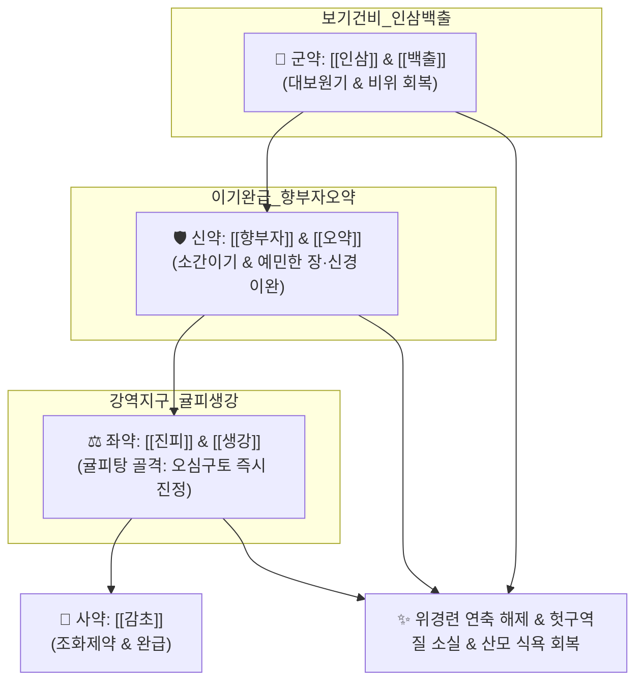

# 🍵 [[보생탕]] (保生湯, Bosaeng-tang)

> **핵심 3줄 요약 (Key Summary)**:
> - 🌿 보기건비의 [[인삼]]·[[백출]]·[[감초]] + 신경·장관 긴장을 푸는 [[향부자]]·[[오약]] + 오심구토를 잡는 [[진피]]·[[생강]](귤피탕 골격) 배오.
> - 🎯 마르고 신경이 극도로 예민한 산모의 악저(심한 입덧), 냄새만 맡아도 구역질이 나고 물조차 토해내는 위신경증 및 임신 초기 탈진.
> - 🔬 세로토닌 5-$HT_3$ 및 도파민 $D_2$ 구토 반사 수용체 차단, 자율신경계 교감 과흥분 진정 및 위장관 연동운동 정상화, 위점막 점액 분비 촉진.
> - ⚠️ 주의사항: 며칠간 음식을 전혀 섭취하지 못해 케톤뇨(Ketonuria)나 심한 전해질 불균형이 발생한 중증 임신오조는 수액 요법 병행.
---
## 📌 목차
1. [기본 처방 정보 & 군신좌사 구성](#1-기본-처방-정보--군신좌사-구성)
2. [방제학적 약재 상호작용 & 시너지 네트워크](#2-방제학적-약재-상호작용--시너지-네트워크)
3. [현대 분자약리학적 효능 & 작용 기전](#3-현대-분자약리학적-효능--작용-기전)
4. [적응 병증 및 체질별 감별 (Sweet Spot vs 금기)](#4-적응-병증-및-체질별-감별-sweet-spot-vs-금기)
5. [유사 처방군 감별 매트릭스](#5-유사-처방군-감별-매트릭스)
6. [임상 가감례 & 현대 질환별 응용](#6-임상-가감례--현대-질환별-응용)
7. [💡 사용자 진료실 핵심 필기 & 임상 팁 (원문 보존)](#7--사용자-진료실-핵심-필기--임상-팁-원문-보존)
8. [출처 및 학술 참고 문헌 (References)](#8-출처-및-학술-참고-문헌-references)
---
## 1. 기본 처방 정보 & 군신좌사 구성

* **출전**: 송대(宋代) 진자명(陳自明) 『[[부인대전양방]](婦人大全良方)』, 허준 『[[동의보감]](東醫寶鑑)』 잡병편 부인문(婦人門)
* **치법**: 보비익기(補脾益氣), 이기화위(理氣和胃), 강역지구(降逆止嘔), 안신개울(安神解鬱)

| 구분 | 약재명 | 표준 용량 | 본초 효능 & 방제 내 역할 |
| :--- | :--- | :--- | :--- |
| **군약 (君藥)** | [[백출]] | 8g | 건비익기(健脾益氣), 조습안태, 비위 소화관 기력을 세우고 음식 흡수 촉진 |
| **군약 (君藥)** | [[인삼]] | 6g | 대보원기(大補元氣), 보비익폐, 구토로 탈진한 산모의 기운을 북돋움 |
| **신약 (臣藥)** | [[향부자]] | 6g | 소간이기(疏肝理氣), 해울지통, 예민해진 자율신경과 장관 연축 이완 |
| **신약 (臣藥)** | [[오약]] | 4g | 순기지통(順氣止痛), 온신산한, 복부 냉감과 쥐어짜는 듯한 위경련 해소 |
| **좌약 (佐藥)** | [[진피]] | 6g | 이기건비, 조습화담, 귤피탕(橘皮湯)의 주약으로 오심구토 진정 |
| **좌약 (佐藥)** | [[생강]] | 6g | 온중강역(溫中降逆), 지체구역, 구토 중추를 직접 진정시키는 구가의 성약 |
| **사약 (使藥)** | [[감초]] | 3g | 보기화중, 조화제약, 완급지통 |

> **배오 특징**: [[사군자탕]]의 보비익기 골격([[인삼]]·[[백출]]·[[감초]])에 장과 신경의 과민성을 풀어주는 [[향부자]]·[[오약]]을 합하고, 구역질을 멎게 하는 [[진피]]·[[생강]]을 결합하였습니다. 마르고 신경이 예민한 산모가 임신 후 위장이 굳어 음식을 토해낼 때 **"기운을 채우고, 신경을 달래며, 구토를 즉각 잠재우는(보기·이기·강역)"** 절묘한 삼박자 배오입니다.
---
## 2. 방제학적 약재 상호작용 & 시너지 네트워크

* [[진피]] + [[생강]] 배오: 위기(胃氣)가 거꾸로 솟구쳐 냄새만 맡아도 헛구역질하는 상역(上逆) 기운을 시원하게 아래로 내립니다.
* [[향부자]] + [[오약]] 배오: 임신 스트레스로 과긴장된 뇌-장관 신경축(Gut-Brain Axis)을 안정시켜 장경련과 입덧을 멈춥니다.
---
## 3. 현대 분자약리학적 효능 & 작용 기전

### 1) 구토 중추 화학수용체 유발대(CTZ) 및 세로토닌 수용체 차단
* [[생강]](진저롤, 쇼가올) 성분이 소화관 말초 및 중추의 5-$HT_3$ 수용체와 도파민 $D_2$ 수용체를 길항하여 입덧 유발 신호전달을 신속히 차단합니다.

### 2) 뇌-장 축(Gut-Brain Axis) 과민성 억제 및 항불안
* [[향부자]](시페론)와 [[오약]] 성분이 시상하부-부신 축의 코르티솔 분비를 안정화하고 위 평활근 연축을 풀어 긴장성 오심을 완화합니다.

### 3) 위 운동성 협조 및 점막 보호
* [[백출]](아트락틸로딘)이 위 기저부의 적응성 이완을 유도하고 유문부 개폐를 원활히 하여 음식물이 위장에 정체되어 썩는 불쾌감을 없앱니다.
---
## 4. 적응 병증 및 체질별 감별 (Sweet Spot vs 금기)

[✅ 최적 적응증 (Sweet Spot)]
• 원전 조문: 부인대전양방 — "治妊娠惡阻, 嘔吐不食, 頭眩體重, 保生湯主之." (임신 중 악저로 구토하고 음식을 먹지 못하며 머리가 어지럽고 몸이 무거운 것을 다스린다.)
• 체질 소견: 평소 마르고 신경이 예민하며, 냄새에 극도로 민감하고 소화기가 약한 마른 체질 산모 (#마른증)
• 임상 주치: 임신 초기 극심한 입덧(악저), 물만 마셔도 토함, 음식 냄새에 대한 헛구역질, 신경성 위경련, 탈수로 인한 현훈 및 기력 탈진
• 설진/맥진: 설질담(舌淡), 설태박백(薄白), 맥세현(脈細弦: 가늘고 활시위처럼 팽팽한 신경성 맥)

[⚠️ 신중 투여 및 금기 (Caution / Contraindication)]
• 담음습열로 가래가 끓고 입이 쓴 환자: 황련, 죽여 등을 가미하여 청열화담 선행
• 중증 전해질 고갈성 탈수증 환자는 수액 공급과 병행
---
## 5. 유사 처방군 감별 매트릭스

| 처방명 | 핵심 배오 차이 | 산모 체질 및 주치 특성 | 임상 차별점 | 맥진/설진 차이 |
| :--- | :--- | :--- | :--- | :--- |
| [[보생탕]] | 인삼, 백출 + 향부자, 오약, 진피, 생강 | **마르고 예민한 체질 (#마른증)** | **신경성 입덧, 헛구역질, 위경련성 구토 위주** | 맥세현(細弦), 설담 |
| [[안태음]] | 백출, 황금 + 사물탕 + 사인, 진피, 소엽 | **기혈허약 + 입덧 + 불안 (일반형)** | **보혈과 안태, 소화불량 종합 관리** | 맥활(滑), 박백태 |
| [[수태환]] | 토사자, 상기생, 속단, 아교 (4미) | **신허(腎虛) 습관성 유산 체질** | **입덧보다는 요통, 잦은 출혈, 유산 방지** | 맥활무력, 척약 |
| [[이위승마탕]] | 승마, 당삼, 황기, 백출, 창출, 진피 | **비위기허 하함형** | **구토보다는 설사, 무기력, 식곤증** | 맥허무력, 설담 |
---
## 6. 임상 가감례 & 현대 질환별 응용

* **수반 증상별 가감법**:
  * 구토가 격렬하고 쓴물이 올라올 때 $\rightarrow$ + [[죽여]], [[황련]]
  * 가슴이 답답하고 한숨을 쉴 때 $\rightarrow$ + [[소엽]], [[사인]]
  * 탈수가 심하고 입이 탈 때 $\rightarrow$ + [[맥문동]], [[갈근]]
* **현대 질환별 임상 매핑**:
  * **산과**: 임신 오조증(Hyperemesis Gravidarum), 신경성 악저, 임신 초기 기능성 위장장애
---
## 7. 💡 사용자 진료실 핵심 필기 & 임상 팁 (원문 보존)

> [!tip] **진료실 실전 노하우 (User Clinical Insight)**
> ### 📌 구성:
> [[백출]], [[인삼]], [[감초]]/ [[향부자]], [[오약]], [[진피]], [[생강]]
> - [[인삼]], [[백출]], [[감초]]: 기운나서 잘 먹게 함
> - [[향부자]], [[오약]]: 장과 신경이 과하게 예민한 것 완화
> - [[진피]], [[생강]]([[귤피탕]]): 오심구토 잡아줌
> 
> ### 📌 적응증:
> - 마르고 예민한 산모의 입덧에 사용
> 
> ### 📌 태그
> #마른증
---
## 8. 출처 및 학술 참고 문헌 (References)

1. **진자명 (1237)**. 『[[부인대전양방]](婦人大全良方)』.
   - **[고전 원전]**: "治妊娠惡阻, 嘔吐不食, 頭眩體重, 保生湯主之."
2. **허준 (1613)**. 『[[동의보감]](東醫寶鑑)』.
   - **[임상 문헌]**: 임신 중 비위가 허약하고 기운이 뭉쳐 토하고 먹지 못하는 악저증의 표준 처방으로 규정.
