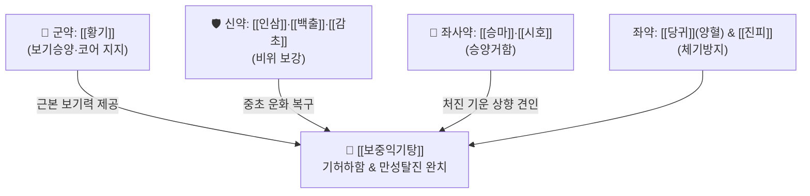

# 🍵 [[보중익기탕]] (補中益氣湯, Bu-Zhong-Yi-Qi-Tang / Hochuekkito)

> **핵심 3줄 요약 (Key Summary)**:
> - 🌿 [[황기]](군약) + [[인삼]]·[[백출]]·[[감초]] + [[당귀]]·[[진피]] + [[승마]]·[[시호]]. (땀 과다 배출 고려 [[복령]] 제외).
> - 🎯 기허하함(氣虛下陷), 에너지 소모가 극심한 마른 체질(고생형, Blue collar)의 코어근육 탈진, 수술 후 회복, 암 환자 피로, 장기하수(위하수·탈항).
> - 🔬 자연살해세포(NK cell) 면역 활성화, 골격근 미토콘드리아 생합성(PGC-1$\alpha$) 촉진, 평활근 긴장도 복원 및 MRSA 감염 방어능 증강.
> - ⚠️ 주의사항: 체내에 실열(實熱)이나 습열(濕熱)이 가득 차 있는 환자, 간양상항으로 혈압이 높고 상열감이 심한 환자는 두통·혈압 상승 주의.
---
## 📌 목차
1. [기본 처방 정보 & 군신좌사 구성](#1-기본-처방-정보--군신좌사-구성)
2. [방제학적 약재 상호작용 & 시너지 네트워크](#2-방제학적-약재-상호작용--시너지-네트워크)
3. [현대 분자약리학적 효능 & 작용 기전](#3-현대-분자약리학적-효능--작용-기전)
4. [적응 병증 및 체질별 감별 (Sweet Spot vs 금기)](#4-적응-병증-및-체질별-감별-sweet-spot-vs-금기)
5. [유사 처방군 감별 매트릭스](#5-유사-처방군-감별-매트릭스)
6. [임상 가감례 & 현대 질환별 응용](#6-임상-가감례--현대-질환별-응용)
7. [💡 사용자 진료실 핵심 필기 & 임상 팁 (원문 보존)](#7--사용자-진료실-핵심-필기--임상-팁-원문-보존)
8. [출처 및 학술 참고 문헌 (References)](#8-출처-및-학술-참고-문헌-references)
---
## 1. 기본 처방 정보 & 군신좌사 구성

* **출전**: 금원사대가(金元四大家) 이고(李杲, 이동원 李東垣) 『비위론(脾胃論)』
* **치법**: 보중익기(補中益氣), 승양거함(升陽擧陷), 감온제열(甘溫除熱)

| 구분 | 약재명 | 표준 용량 | 본초 효능 & 방제 내 역할 |
| :--- | :--- | :--- | :--- |
| **군약 (君藥)** | [[황기]] | 12~18g | 보기승양(補氣升陽), 고표지한, 근막 및 체표 지지력 강화의 핵심 |
| **신약 (臣藥)** | [[인삼]] | 6~9g | 대보원기, 건비익폐, 세포 대사 에너지 부스팅 |
| **신약 (臣藥)** | [[백출]] | 6~9g | 조습건비, 비위 운화 촉진 |
| **신약 (臣藥)** | [[감초]](자) | 4~6g | 보기화중, 감온제열(달고 따뜻한 기운으로 허열을 꺼줌) |
| **좌약 (佐藥)** | [[당귀]] | 4~6g | 보혈양음, 기수혈행(氣隨血行), 기허로 인한 미세순환 저하 보완 |
| **좌약 (佐藥)** | [[진피]] | 4~6g | 이기화위, 다량의 보기약 복용 시 발생할 수 있는 복부 팽만과 기체 방지 |
| **좌사약 (佐使藥)** | [[승마]] | 2~3g | 승거청양(升擧淸陽), 비기가 하초로 처지는 것을 끌어올림 |
| **좌사약 (佐使藥)** | [[시호]] | 2~3g | 소간해울, 승양, [[승마]]와 짝을 이루어 청기를 상승시킴 |

> **배오 특징**: [[사군자탕]]에서 이뇨 작용으로 수분을 빼내는 [[복령]]을 과감히 제거했습니다. 극심한 노동과 운동으로 이미 땀을 흠뻑 흘려 진액이 마른 상태를 배려한 고도의 처방 설계입니다. 여기에 [[황기]]를 군약으로 증량하고, 가벼운 성질의 [[승마]]·[[시호]]를 소량 배오하여 아래로 무너져 내린 비위의 청양(淸陽)을 머리와 전신으로 끌어올립니다(승양거함).
---
## 2. 방제학적 약재 상호작용 & 시너지 네트워크

* [[황기]] + [[승마]]·[[시호]] 배오: 보기약의 대표인 [[황기]]가 아래로 처진 장기 평활근과 코어 근육에 긴장력을 불어넣고, [[승마]]와 [[시호]]가 인경(引經)하여 양기를 상부로 이끌어 올리는 완벽한 승거(升擧) 역학을 달성합니다.
* [[황기]] + [[당귀]] 배오: 당귀보혈탕(當歸補血湯)의 배오비(기 5 : 혈 1)를 수용하여, 극도로 소모된 육체노동자 및 수술 후 환자의 혈액 생성을 강력히 촉진합니다.
---
## 3. 현대 분자약리학적 효능 & 작용 기전

### 1) 자연살해세포(NK Cell) 활성화 및 면역 회복
* [[황기다당체]](Astragalus polysaccharides)와 [[진세노사이드]] 성분이 면역세포의 수지상세포 성숙과 NK세포 세포독성(Cytotoxicity)을 유의하게 증가시키고, 감염병 및 종양에 대한 방어능을 회복시킵니다.

### 2) PGC-1$\alpha$ 신호 전달 및 골격근 미토콘드리아 재생
* 골격근 세포 내 PPAR$\gamma$ coactivator 1$\alpha$(PGC-1$\alpha$) 발현을 촉진하여 만성 탈진 환자의 미토콘드리아 수와 대사 효율을 복원함으로써 만성 피로와 근위축을 개선합니다.

> 🧬 **현대 학술 근거 (2026-09-07 B-7 패치)**
> - 근위축 회복 근거: cisplatin 유발 근위축 마우스 모델에서 [[보중익기탕]](Hochuekkito)이 지근(slow-twitch) 특이적 microRNA 상향을 동반하며 근위축 회복을 촉진 — PGC-1α·미토콘드리아 재생 설명과 부합하는 최신 동물 근거(PMID 40487396).

### 3) 내장 평활근 긴장도 회복 및 콜라겐 합성
* 복벽과 장간막 평활근의 아세틸콜린 수용체 감수성을 개선하고 결합조직의 콜라겐 교차결합을 도와 위하수, 자궁하수, 탈항 증상을 물리적으로 복원합니다.

### 4) 메티실린 내성 황색포도상구균(MRSA) 감염 방어능
* 숙주 면역계를 강화하여 호중구의 탐식능을 높이고, 항생제 내성 균주에 대한 체내 내인성 항균 펩타이드 분비를 촉진합니다.
> 🧬 **현대 학술 근거 (2026-09-07 B-7 패치)** — PubChem 실측 분자 앵커: 황기 지표 사포닌 아스트라갈로사이드 IV(Astragaloside IV) CID **13943297** · 분자식 C₄₁H₆₈O₁₄ · MW 785.0

🔬 **분자 구조** (Wikimedia Commons, Public Domain)

![[Astragaloside_IV_구조.png|430]]
> [그림] 아스트라갈로사이드 IV(Astragaloside IV, C₄₁H₆₈O₁₄) 분자 구조 — 출처: Wikimedia Commons (Astragaloside IV Structure.svg)

> 🧬 **현대 학술 근거 (2026-09-07 B-7 패치)** — 감염 방어
> - 폐렴구균 비강 집락 마우스에서 [[보중익기탕]]이 침습성 감염으로의 진행과 패혈증 발병을 유의하게 억제(비강 집락 자체에는 영향 없음) — MRSA 등 감염 방어능 항목을 지지하는 최신 동물 근거(PMID 38677389).

---
## 4. 적응 병증 및 체질별 감별 (Sweet Spot vs 금기)

### 1) 임상 적응증 (Sweet Spot)
* **육체노동자·운동선수 탈진(Blue collar 증후군)**: 공사장 노동, 마라톤, 고강도 웨이트 트레이닝 후 땀을 비 오듯 흘리고 진이 완전히 빠져 몸이 흐물흐물해진 마른 체형 환자.
* **장기하수증**: 위하수(밥 먹으면 아래로 쏠림), 탈항(배변 시 항문 돌출), 자궁하수, 요실금.
* **수술 후 및 암 환자 전신 쇠약**: 소화흡수기능 장애, 악액질(Cachexia), 극심한 식욕부진과 권태감.
* **기허발열(氣虛發熱)**: 과로 후 오후가 되면 으슬으슬 미열이 오르는 허열(虛熱) 증상.

> 🧬 **현대 학술 근거 (2026-09-07 B-7 패치)**
> - 장기 피로 임상 근거: Post-COVID-19 condition(PCC) 환자의 전신 피로에 [[보중익기탕]]을 처방한 일본 단일센터 탐색적 전향 연구에서 피로 경과를 정량 추적(PMID 40004921).

### 2) 사상의학 체질 감별 & 금기
* [[소음인]]: 땀을 많이 흘리면 기운이 바닥나는 소음인 망양증(亡陽證)과 비기허증에 명약.
* **금기(Contraindication)**:
  * 비만하고 체내에 습열이 많은 태음인이나 혈압이 높고 상열감이 심한 소양인은 두통, 안면홍조 유발 가능.
---
## 5. 유사 처방군 감별 매트릭스

| 처방명 | 중심 병리 | 특징적 병증 | 배오 차이점 |
| :--- | :--- | :--- | :--- |
| [[보중익기탕]] | 비기하함 (기허하함) | 마른 체질 탈진, 다한, 장기하수, 미열 | [[황기]] 군약, [[복령]] 제외, 승마·시호 가미 |
| [[사군자탕]] | 단순 비위기허 | 식욕부진, 소화불량, 전신 무력 | 복령 포함, 보기 기본방 |
| [[생맥산]] | 기음양허 (폐기·폐음 손상) | 마른기침, 극심한 갈증, 구갈 | 맥문동·오미자·인삼 (청서익기) |
| [[청서익기탕]] | 서습내조 (여름철 더위먹음) | 더위 먹고 사지권태, 소변적축 | 창출·황백 가미로 청열이습 |

---
## 6. 임상 가감례 & 현대 질환별 응용

1. **상열감과 두통이 약간 나타날 때**: [[승마]], [[시호]]를 1~2g으로 감량하고, [[백작약]] 4g 가미.
2. **기침과 가래를 동반할 때**: [[반하]] 4g, [[맥문동]] 6g 가미.
3. **만성 설사 및 복통 동반 시**: [[백작약]]을 빼고 [[목향]], [[사인]]을 각 3g 가미.
---
## 7. 💡 사용자 진료실 핵심 필기 & 임상 팁 (원문 보존)

# 구성:
[[인삼]], [[백출]], [[감초]]/ [[진피]], [[당귀]], [[황기]]/ [[시호]], [[승마]]
- [[사군자탕]]+[[당귀]], [[황기]](마른 체질)+[[시호]], [[승마]](세포 탈진, 코어근육 탈진)
- 고생해서 땀이 너무 많이 빠졌을테니, [[복령]]은 제거함
# 적응증:
- 잘 안먹기도 하는데, 에너지를 너무 많이 써서 마른 체질(고생형)이고, 일을(운동) 너무 많이 해서 몸에 힘이 잘 안들어가고 느근해진 경우에 사용
- 공사장에서 일하거나 운동을 너무해서 땀도 많이나고, 몸에 진이 다 빠진 환자에게 사용(Blue collar)
- 수술 후의 체력 저하, 소화흡수기능 장애 등에 활용
- 암 환자에서의 피로 개선, 부작용과 식욕 부진, 전신권태감 회복, 골 장애 개선 등에 활용
# 약리작용
- 자연살해세포(NK cell) 등의 면역기능 활성화, 영양상태 개선, 메티실린 내성 황색포도암균 방어능 증강, 항염증, 골다공증 개선, 항알레르기, 감염 방어, 피부손상억제 작용이 있음.

#마른증
---
## 8. 출처 및 학술 참고 문헌 (References)

* 『脾胃論』 卷中 補氣通口: "補中益氣湯, 治勞倦所傷, 氣高而喘, 身熱而煩, 脈洪大而虛, 怠惰嗜臥, 四肢無力."
* * **Dan K et al. (2018)**. Mechanism of Action of the Anti-Influenza Virus Active Kampo (Traditional Japanese Herbal) Medicine, Hochuekkito. *Pharmacology*, 101: 148-155. [PMID: 29275416](https://pubmed.ncbi.nlm.nih.gov/29275416/)
* * **Sekine H et al. (2025)**. Hochuekkito accelerates recovery from cisplatin induced-muscle atrophy accompanied by slow-twitch fiber-specific microRNA upregulation in mice. *Frontiers in pharmacology*, 16: 1502563. [PMID: 40487396](https://pubmed.ncbi.nlm.nih.gov/40487396/)
