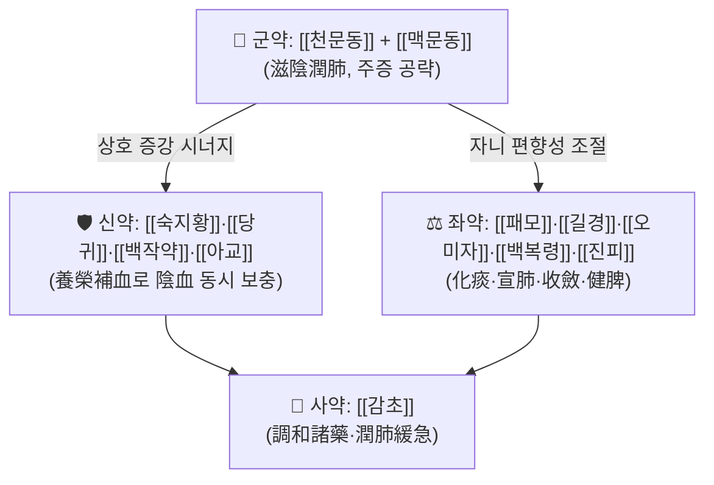

# 🍵 [[보폐양영전]] (保肺養榮煎, Baofei Yangrong Jian)

> **핵심 3줄 요약 (Key Summary)**:
> - 🌿 **모체/기원 처방 + 가감 구조**: 養榮 계열 처방([[인삼양영탕]] 등)의 보혈·보기 골격에 補肺陰 약재([[천문동]]·[[맥문동]]·[[아교]])와 化痰止咳 약재([[패모]]·[[길경]]·[[오미자]])를 배오한 **보폐양영(補肺養榮) + 화담지해(化痰止咳)** 복합 구조로 이해된다. 다만 원문 구성·용량은 **근거 미확인**이며, 본 노트의 구성 표는 방제학적 유추에 기반한 잠정안이다.
> - 🎯 **임상 최적 적응증**: 만성·재발성 마른기침, 인후 건조, 야간 기침 악화, 객담 소량·점조(粘稠), 도한(盜汗)·오심번열(五心煩熱) 등 **폐음허(肺陰虛) 병기**를 시사하는 환자. 체질적으로는 마른 체형, 피부·점막 건조, 만성 소모성 질환 이력자에서 상대적으로 적합하다고 보나 **정량적 체질-적응 근거는 미확인**이다.
> - 🔬 **핵심 분자약리 기전**: 본 처방 자체를 표적으로 한 PubMed 색인 연구는 **검색되지 않았다(근거 미확인)**. 개별 구성 본초 단위의 항염·항산화·점액조절 기전(예: [[맥문동]] 사포닌, [[오미자]] 리그난, [[패모]] 알칼로이드)은 일반 본초약리 지식에 해당하나, 처방 단위 기전으로의 환원은 **미검증**이다.
> - ⚠️ 주의사항: 痰濕壅盛(습담 과다)·脾胃虛寒으로 인한 설사·식욕부진 환자, 實熱型 급성 감염 초기에는 자음(滋陰) 처방이 병사를 끌어들일 수 있으므로 신중 투여한다. 아교 등 동물성 교질 약재는 소화불량·복만을 유발할 수 있고, 당귀·숙지황 등 자윤(滋潤) 약재는 연변(軟便)·설사를 악화시킬 수 있다. 임신부·소아·만성 신질환자에 대한 안전성 자료는 근거 미확인.

---
## 📌 목차
1. [기본 처방 정보 & 군신좌사 구성](#1-기본-처방-정보--군신좌사-구성)
2. [방제학적 약재 상호작용 & 시너지 네트워크](#2-방제학적-약재-상호작용--시너지-네트워크)
3. [현대 분자약리학적 효능 & 작용 기전](#3-현대-분자약리학적-효능--작용-기전)
4. [적응 병증 및 체질별 감별 (Sweet Spot vs 금기)](#4-적응-병증-및-체질별-감별-sweet-spot-vs-금기)
5. [유사 처방군 감별 매트릭스](#5-유사-처방군-감별-매트릭스)
6. [임상 가감례 & 현대 질환별 응용](#6-임상-가감례--현대-질환별-응용)
7. [💡 사용자 진료실 핵심 필기 & 임상 팁 (원문 보존)](#7--사용자-진료실-핵심-필기--임상-팁-원문-보존)
8. [출처 및 학술 참고 문헌 (References)](#8-출처-및-학술-참고-문헌-references)
---
## 1. 기본 처방 정보 & 군신좌사 구성

* **출전**: 『[[청강의감]]』(淸江醫鑑) 계열 문헌으로 분류됨(노트 태그 기준). **원문 권차·조문 번호·원문 문구는 근거 미확인**으로, 처방집 대조 검증이 필요하다.
* **치법**: 보폐양영(補肺養榮), 자음윤폐(滋陰潤肺), 화담지해(化痰止咳), 청열지도(淸熱止盜)
* **분류 위치**: _의학/02_약리/처방/02_보익제 (보익제 중에서도 **보음파(補陰派)** 에 속하며, 補氣 위주의 [[사군자탕]] 계열 · 補血 위주의 [[사물탕]] 계열과 구별된다)

### 잠정 복원 구성표 (⚠️ 원문 대조 필요)

> 아래 구성은 ① 처방명의 '補肺' + '養榮' 조어 구조, ② 노트 태그(화담지해·기침·폐음허), ③ 養榮湯·補肺湯 계열 방제의 통상 골격에 근거한 **방제학적 유추안**이다. 실제 『청강의감』 원문 구성과 일치하지 않을 수 있으므로, 처방 사용 전 반드시 원전 또는 공인 처방집과 대조할 것.

| 구분 | 약재명 | 표준 용량 | 본초 효능 & 방제 내 역할 |
| :--- | :--- | :--- | :--- |
| **군약 (君藥)** | [[천문동]] | 통용 6~10g (원문 용량 근거 미확인) | 潤肺止咳·滋陰潤燥. 폐음 휴손으로 인한 마른기침·인후건조의 주증을 직접 공략하는 자음윤폐의 핵심 |
| **군약 (君藥)** | [[맥문동]] | 통용 6~10g (원문 용량 근거 미확인) | 養陰潤肺·益胃生津. 君藥 對로 肺胃陰液을 동시 보충하며 천문동의 潤性을 보좌 |
| **신약 (臣藥)** | [[숙지황]] | 통용 6~10g (원문 용량 근거 미확인) | 滋陰補血·益精塡髓. '養榮'의 榮血 충실을 담당하는 자음보혈의 중추 |
| **신약 (臣藥)** | [[당귀]] | 통용 6~9g (원문 용량 근거 미확인) | 補血活血·潤腸. 血中氣藥으로 음혈을 보하면서 肺氣 순환을 돕는다 |
| **신약 (臣藥)** | [[백작약]] | 통용 6~9g (원문 용량 근거 미확인) | 養血斂陰·柔肝止痛. 陰血을 수렴하여 肺陰 소모를 억제하고 흉협 긴장을 완화 |
| **신약 (臣藥)** | [[아교]] | 통용 3~6g (원문 용량 근거 미확인) | 補血滋陰·潤肺止血. 폐음허성 각혈·담중혈사(痰中血絲)에 대한 보폐지혈 표적 |
| **좌약 (佐藥)** | [[패모]] | 통용 4~6g (원문 용량 근거 미확인) | 淸熱化痰·潤肺止咳. 君藥의 滋膩함을 制約하면서 化痰止咳를 담당하는 핵심 佐藥 |
| **좌약 (佐藥)** | [[길경]] | 통용 4~6g (원문 용량 근거 미확인) | 宣肺利咽·祛痰排膿. 肺氣를 宣開하여 기침·인통을 완화하고 諸藥을 肺로 引經 |
| **좌약 (佐藥)** | [[오미자]] | 통용 3~6g (원문 용량 근거 미확인) | 斂肺滋腎·生津斂汗. 肺氣를 收斂하여 만성 기침과 盜汗을 동시에 조절 |
| **좌약 (佐藥)** | [[백복령]] | 통용 4~6g (원문 용량 근거 미확인) | 健脾滲濕·寧心安神. 자음약의 濡濕 편향성을 制約하고 脾胃運化를 보호 |
| **좌약 (佐藥)** | [[진피]] | 통용 3~5g (원문 용량 근거 미확인) | 理氣健脾·燥濕化痰. 補陰藥의 滯氣를 방지하는 行氣 완충제 |
| **사약 (使藥)** | [[감초]] | 통용 2~3g (원문 용량 근거 미확인) | 調和諸藥·潤肺止咳·緩急. 全方의 藥性을 조화하고 인후 자극을 완화 |

> **배오 특징**: 본 처방의 방제 논리는 **"潤而勿滯(윤하면서 정체시키지 않음)"** 이다. 즉 補陰(천문동·맥문동·숙지황·아교)으로 肺陰을 채우고, 그로 인해 발생하는 滋膩(자니, 끈적여 소화를 방해하는 성질)를 行氣化痰(진피·길경·패모)과 健脾滲濕(복령)으로 상쇄하며, [[오미자]]로 收斂시켜 肺氣가 새어나가지 않게 하는 **補—行—收의 3단 구조**를 이룬다. 승강(升降) 측면에서는 [[길경]]의 宣(상승·발산)과 [[오미자]]의 收(하강·수렴)가 짝을 이루어 肺의 宣肅 기능을 균형 있게 회복시키는 것을 목표로 한다.
>
> **복약 지침(문헌 근거 미확인, 일반적 관행)**: 원문 복법(복용법)은 확인되지 않았다. 통상적으로 水煎服하며, 자음제 특성상 空腹 또는 食前 복용이 吸收에 유리하다는 것이 일반적 관행이나, 위장이 약한 환자에서는 食後로 조정한다. 滋膩 약재가 많으므로 장기 복용 시 脾胃 반응(식욕·대변)을 주기적으로 점검한다.

---
## 2. 방제학적 약재 상호작용 & 시너지 네트워크

* **[[천문동]] + [[맥문동]] 배오 (相須)**: 동일 歸經(肺·胃)을 공유하는 對藥으로, 潤肺와 生津을 분담하여 肺胃陰虛 전반을 커버한다. 두 약재 모두 甘·苦·寒 性味로 방향성이 일치하여 중복이 아니라 **강도 보강**으로 작용한다.
* **[[숙지황]] + [[당귀]] + [[백작약]] 배오 (相使, 養榮 골격)**: [[사물탕]]의 핵심 보혈 3약 구조를 차용한 것으로 보이며, 補血하여 陰의 물질적 기반을 마련한다. "血爲氣母", "津血同源" 원리에 따라 補血이 곧 補肺陰의 간접 경로가 된다는 논리다.
* **[[천문동]]·[[맥문동]] + [[진피]]·[[백복령]] 배오 (相畏·相制)**: 자음약의 滋膩는 痰濕을 조장하고 脾胃를 억제할 수 있다. [[진피]]의 理氣燥濕과 [[백복령]]의 健脾滲濕이 이 편향성을 **완충**하여, 보음 처방이 장기 복용에서도 脾胃 부담을 최소화하도록 설계된 구조다.
* **[[길경]] + [[오미자]] 배오 (宣收 對待)**: 宣肺로 痰을 배출시키는 方向과 斂肺로 氣를 붙잡는 方向을 동시에 두어, 咳를 멈추면서도 痰을 남기지 않는 **상반상성(相反相成)** 배오. 만성 기침에서 止咳만 하고 痰을 조장하는 실수를 방지한다.
* **[[패모]] + [[길경]] 배오 (相須)**: 둘 다 肺經 化痰止咳藥으로, [[패모]]는 潤化痰, [[길경]]은 宣化痰을 담당하여 痰의 質(점조 vs 다량)에 따라 상호 보완한다.
* **[[아교]] + [[백복령]]·[[감초]] 배오 (使藥의 완충)**: 阿膠의 膠質은 위장 정체를 유발할 수 있으므로, 健脾 佐藥과 調和 使藥이 이를 받쳐 **보혈 보음의 이득은 취하고 소화 부담은 줄이는** 설계로 해석된다.
* **[[감초]]의 使藥 역할**: 甘味로 諸藥을 조화시키고, 潤肺止咳·緩急 작용으로 기침으로 인한 인후·기관지 자극을 완화하며, 全方 寒性을 다소 中和한다.

> ⚠️ 위 배오 해석은 방제학적 **논리 재구성**이며, 『청강의감』 원문에 명시된 배오 의도가 아니다(근거 미확인). 실제 처방 구성이 확인되면 본 섹션을 재작성해야 한다.

---
## 3. 현대 분자약리학적 효능 & 작용 기전

> **선행 고지**: 본 처방(保肺養榮煎)을 직접 표적으로 한 PubMed 색인 논문은 **검색되지 않았다**. 따라서 아래 서술은 처방 단위 근거가 아니라 **개별 구성 본초의 일반 본초약리 지식**에 기반한 가설적 매핑이며, 처방 단위 효능으로 환원하는 것은 **근거 미확인**이다.

### 1) 기관지 점액·기침 반사 조절 (가설)
* [[길경]]의 사포닌 계열 성분과 [[패모]]의 알칼로이드 계열 성분은 전통적으로 祛痰·止咳 작용이 보고되어 온 본초이며, 점액 粘度 저하 및 기침 반사 역치 상승에 관여할 것으로 추정된다.
* [[천문동]]·[[맥문동]]의 스테로이드 사포닌 계열은 점막 건조 완화(潤肺)와 관련된 보습·점액 분비 정상화 기전이 거론되나, **본 처방 단위 검증 자료는 미확인**.

### 2) 항염증·면역 조절 (가설)
* 補陰 계열 본초 전반에서 NF-κB 경로 억제, TNF-α·IL-6 등 전염증성 사이토카인 감소가 개별 본초 연구로 보고된 바 있다. 다만 구체적 수치(억제율·IC50 등)는 **본 처방에 대해 미확인**이므로 이 노트에서는 제시하지 않는다.
* [[오미자]]의 리그난(예: schisandrin 계열)은 항산화·간보호 기전으로 널리 연구된 성분군이나, 기침/폐음허와의 연결은 **근거 미확인**.

### 3) 자율신경·만성 소모 상태 조절 (가설)
* 만성 기침·도한·오심번열로 대표되는 폐음허 병기는 임상적으로 자율신경 긴장 이상 및 만성 염증성 소모 상태와 겹칠 수 있다. [[오미자]]의 斂汗, [[백작약]]의 柔肝, [[백복령]]의 安神 작용이 HPA 축 및 자율신경 항상성 회복에 기여할 것이라는 **전통적 해석**이 있으나, 측정된 지표는 확인되지 않았다.

### 4) 영양·대사·조혈 (가설)
* [[아교]]·[[숙지황]]·[[당귀]]는 전통적으로 補血藥으로 분류되며, 철분·아미노산·콜라겐 유래 펩타이드 공급 및 조혈 관련 기전이 개별 수준에서 논의된다. 그러나 처방 단위 임상 지표(혈색소, 페리틴 등) 개선 여부는 **근거 미확인**.

> 📌 **정리**: 본 섹션은 현 시점에서 **"기전 가설 목록"** 으로만 사용하고, 임상 근거로 인용하지 않는다. 향후 처방 단위 연구가 확보되면 PMID와 함께 재작성할 것.

---
## 4. 적응 병증 및 체질별 감별 (Sweet Spot vs 금기)

### [✅ 최적 적응증 (Sweet Spot)]

* **원전 조문**: 『청강의감』 원문 조문 **근거 미확인**. 본 노트에서는 원문 인용을 하지 않는다.
* **핵심 병기**: 肺陰虛 → 肺失濡潤 → 宣肅失調. 즉 "폐가 윤택함을 잃어 기침이 멈추지 않는" 상태.
* **체질 소견(임상 관행 수준, 정량 근거 미확인)**:
  * 마른 체형, 체중 감소 경향, 피부·점막(입술·혀·인후·비강) 건조
  * 만성 소모성 질환 이력, 장기간 기침으로 인한 피로감
  * 도한(盜汗), 오심번열(五心煩熱), 오후 조열감
  * 사상의학적 체질 매핑은 **직접 대응 근거 미확인**. 다만 임상적으로 陰虛 소인이 뚜렷한 환자, 즉 消瘦·乾燥·慢性 경향을 보이는 환자에서 상대적으로 고려된다.
* **임상 주치(진료실 적중 양상)**:
  * 수주~수개월 지속되는 **마른기침 또는 소량의 점조한 객담**을 동반한 기침
  * 야간·새벽 악화, 대화·찬 공기·건조 환경 노출 시 악화
  * 인후 이물감·건조감·쉰 목소리, 痰中血絲(가래에 실핏줄)
  * 항생제·기관지확장제 반응이 불충분한 만성 기침
  * 감염 후 기침(post-infectious cough)이 2주 이상 지속되며 陰虛 징후를 동반하는 경우
* **설진/맥진 소견**:
  * 舌: 舌紅少苔 또는 舌紅無苔, 舌面乾燥, 裂紋
  * 脈: 細數(세삭) 또는 細弱, 虛數. 肺陰虛 진행 시 脈細無力
  * 감별 포인트: 苔厚膩하면 痰濕이 우세한 것이므로 본 처방보다 化痰 위주 처방을 먼저 고려한다.

### [⚠️ 신중 투여 및 금기 (Caution / Contraindication)]

* **痰濕壅盛型 기침**: 舌苔가 白厚膩 또는 黃厚膩하고 객담이 다량·묽은 경우. 자음약이 痰을 助長하여 오히려 기침이 늘고 胸悶이 심해질 수 있다.
* **脾胃虛寒·消化不利**: 평소 식욕 부진, 脘腹脹滿, 軟便·설사 경향. [[숙지황]]·[[아교]]·[[맥문동]] 등 滋膩·滑腸 약재가 증상을 악화시킬 수 있다. 필요 시 [[백출]]·[[사인]]·[[진피]] 등을 加하거나 砂仁拌蒸 등 炮制로 완충한다.
* **實熱型 급성 감염 초기**: 고열·인통·황색 농성 객담이 뚜렷한 급성 세균성 기관지염·폐렴 초기에는 補陰 위주 처방이 병사를 留滯시킬 수 있으므로, 청열해표·청열해독 처방을 먼저 운용하고 회복기로 이행하면서 본 처방을 검토한다.
* **한열(寒熱) 반대 병증**: 陽虛로 인한 寒性 기침(수양성 콧물, 惡寒, 四肢冷, 舌淡)에는 부적합하다. 이 경우 [[소청룡탕]] 계열이나 補氣·溫肺 처방이 우선이다.
* **동물성 교질 약재 알레르기**: [[아교]]는 동물 유래 교질로, 특정 동물 단백 알레르기 환자에서 주의한다.
* **양약 병용 주의점**: 본 처방-양약 상호작용 데이터는 **근거 미확인**. 특히 와파린 등 항응고제 복용 환자에서 [[당귀]] 등 活血類 및 [[아교]] 병용 시 출혈 경향을 관찰하며 신중히 접근한다(이론적 우려, 확인된 상호작용 보고 미확인).
* **특수 집단**: 임신부, 수유부, 소아, 중증 간·신기능 저하자에 대한 안전성 자료는 **근거 미확인**.

---
## 5. 유사 처방군 감별 매트릭스

| 처방명 | 핵심 구성 차이 | 주치 및 체질 차이 | 맥진/설진 차이 |
| :--- | :--- | :--- | :--- |
| [[보폐양영전]] | 기준 구성(보음 + 양혈 + 화담지해) | **폐음허성 만성 마른기침, 소모성·건조 경향 환자** | 기준: 舌紅少苔, 脈細數 |
| [[인삼양영탕]] | 보기·온보 중심([[인삼]]·[[황기]]·[[계피]]·[[백출]] 위주), 자음·화담력 약함 | 기혈양허 전반, 피로·식욕부진·허로 손상. 기침은 부수 증상 | 舌淡苔白, 脈細弱無力 — 虛寒 경향 |
| [[자음강화탕]] | 자음강화 중심([[천문동]]·[[맥문동]]·[[숙지황]]·[[오미자]]·[[진피]]), 화담지해 약함 | 폐신음허로 인한 만성 기침·천식, 腎陰까지 손상된 단계 | 舌紅少苔 또는 無苔, 脈細數無力 |
| [[보폐탕]] | 보폐기 중심, 化痰止咳 배오 단순 | 폐기허로 인한 기침·단기(短氣)·자한. 건조 소견은 상대적으로 약함 | 舌淡, 脈虛弱 |
| [[청조구폐탕]] | 溫燥(涼燥) 대응, 宣肺潤肺 중심 | 秋燥型 마른기침, 발병 시기·계절성 뚜렷, 급성적 | 舌紅少津, 脈浮細 또는 浮數 |

> 위 표의 유사 처방들은 실제 처방명이며 각각의 구체적 감별은 해당 노트를 참조한다. [[보폐양영전]]의 행은 **잠정 구성 기준으로 작성된 것**이므로, 원문 구성 확인 후 재검토가 필요하다(근거 미확인).

---
## 6. 임상 가감례 & 현대 질환별 응용

> ⚠️ 아래 가감례는 방제학적·임상 관행적 제안이며, 본 처방의 원문 가감례는 **근거 미확인**이다. 실제 처방 전 원전 대조 및 환자 상태 평가를 우선한다.

* **수반 증상별 가감법**:
  * 인후통·인후 건조가 심할 때 $\rightarrow$ + [[현삼]] · [[맥문동]] 증량 (潤喉生津)
  * 도한·오심번열이 뚜렷할 때 $\rightarrow$ + [[지모]] · [[황백]] (滋陰降火, [[대보음환]] 계열 논리)
  * 야간 기침로 수면 장애가 클 때 $\rightarrow$ + [[오미자]] 증량 · [[산조인]] (斂肺安神)
  * 담이 점조하고 배출 곤란할 때 $\rightarrow$ + [[과루인]] · [[천패모]] (潤化痰)
  * 각혈·혈담 동반 시 $\rightarrow$ + [[백급]] · [[삼칠근]] (止血, 단 원인 감별 필수)
  * 소화불량·脘腹脹滿 동반 시 $\rightarrow$ + [[사인]] · [[백출]] · [[목향]] (健脾理氣, 자음약의 滯氣 완충)
  * 천명·기관지 과민성이 동반될 때 $\rightarrow$ + [[선복화]] · [[행인]] (降氣止咳)
  * 식욕 부진·연변 경향 시 $\rightarrow$ + [[산약]] · [[편두]] (健脾, 滋膩 완화)
* **현대 질환별 임상 매핑(가설적 응용, 처방 단위 임상 근거 미확인)**:
  * **호흡기계**: 감염 후 만성 기침, 만성 기관지염의 건조형, 기침이형 천식의 陰虛 경향 아형, 알레르기성 기침의 아토피·건조 피부 동반형, 기관지확장증의 안정기 보조(단, 감염 급성기 제외), 결핵 치료 후 잔류 기침 및 소모성 회복기(⚠️ 항결핵제 병용 시 반드시 협진)
  * **이비인후과계**: 만성 인후염(건조형), 후비루로 인한 자극성 기침, 음성 피로·쉰 목소리
  * **전신·대사**: 만성 소모성 질환의 회복기 보조, 방사선·항암 치료 후 陰虛·乾燥 증상(⚠️ 종양 치료 중 처방은 반드시 주치의 협진)
  * **신경·자율신경**: 만성 기침로 인한 수면장애, 도한을 동반한 자율신경실조증
* **주의**: 위 매핑은 전통적 변증(폐음허)과 현대 질환군을 **증상·병기 수준에서 대응시킨 것**이며, 특정 질환에 대한 유효성 근거가 아니다.

---
## 7. 💡 사용자 진료실 핵심 필기 & 임상 팁 (원문 보존)

> [!tip] **진료실 실전 노하우 (User Clinical Insight)**
> - **원장님 원문 메모: 이 노트 작성 시점에 별도로 제공된 사용자 필기 데이터가 없습니다.** 따라서 삭제·축소한 원문은 없으며, 본 섹션은 공란 상태로 보존됩니다.
> - 추후 진료실 메모가 입력되면 아래 항목 형식으로 **원문 그대로** 옮겨 적고, 본 노트의 다른 섹션과 충돌할 경우 원장님 필기를 우선합니다.
> - [ ] 처방 선택 기준 메모 (예: 소음인 vs 태음인, 마른 체형 vs 습담형 감별 포인트)
> - [ ] 실제 처방 용량 및 加減 예시 (원장님 관행 용량)
> - [ ] 복약 반응 관찰 포인트 (기침 감소 시점, 도한 변화, 대변·식욕 변화)
> - [ ] 환자 티칭 팁 (복약 중 금기 음식, 건조 환경 관리, 수분 섭취 등)
> - [ ] 본 처방이 효과 없었던 증례와 그 이유에 대한 기록

---
## 8. 출처 및 학술 참고 문헌 (References)

> ⚠️ **본 노트는 PubMed 검색 결과가 0건이었습니다.** 따라서 인용 가능한 현대 학술 논문이 없으며, 아래에는 고전 문헌 서지와 근거 공백 상태를 기록합니다. 존재하지 않는 PMID·논문을 임의로 생성하지 않았습니다.

1. **PubMed / 학술 데이터베이스 검색 결과 (본 노트 작성 시점)**
   - **[검색 결과]**: "保肺養榮煎 / Baofei Yangrong Jian" 관련 색인 논문 **검색되지 않음**.
   - **[의미]**: 본 처방의 분자약리 기전, 임상 시험, 병용 연구 등 현대적 근거는 현재 확보되지 않았다. 노트 내 기전 서술은 전적으로 개별 본초 단위 일반 지식 및 방제학적 유추에 의존한다.

2. **『[[청강의감]]』(淸江醫鑑)** — 출전으로 태그에 명시됨.
   - **[고전 원전 / 서지 미확인]**: 저자, 편찬 연도, 판본, 해당 처방의 수록 권차 및 원문 문구가 **확인되지 않았다**. 본 노트의 구성표는 원문 대조 없이 작성된 잠정안이므로, 실제 처방 사용 전 반드시 원전을 확인해야 한다.

3. **허준 (1613)**. 『[[동의보감]]』.
   - **[참고 배경]**: 補肺·養榮·化痰止咳 계열 처방의 전통적 분류와 본초 효능 기술의 일반적 배경으로 참조 가능. 단, 『동의보감』에 본 처방이 수록되어 있는지는 **근거 미확인**.

4. **사용자 제공 데이터**
   - **[노트 메타데이터]**: 소속 "_의학/02_약리/처방/02_보익제", 태그(처방, 보익제, 화담지해, 기침, 폐음허, 청강의감) — 본 노트의 분류 및 적응 방향 설정의 근거로 사용됨.
   - **[이미지]**: 제공된 이미지 블록 없음 — 본 노트에는 이미지 임베드를 포함하지 않았다.

---

### 🔍 본 노트의 신뢰도 자기점검 (Self-Audit)

| 항목 | 상태 |
| :--- | :--- |
| 출전 문헌 | 태그 기준 『청강의감』 — **서지·조문 미확인** |
| 처방 구성·용량 | **근거 미확인** (방제학적 유추안으로 작성) |
| 군신좌사 배속 | **근거 미확인** (유추) |
| 분자약리 기전 | **처방 단위 근거 미확인**, 개별 본초 수준의 일반 지식만 |
| 임상 적응증 | 전통 변증(폐음허) 논리에 기반, **처방 단위 임상 근거 미확인** |
| 가감례 | **근거 미확인** (관행적 제안) |
| PubMed 인용 | **0건 — 인용 없음** |
| 사용자 원문 메모 | **미제공 — 보존할 원문 없음** |

> 📌 **후속 작업 지침**: 『청강의감』 원문(또는 공인 처방집)에서 본 처방의 실제 구성·용량·주치 조문을 확인한 뒤, ① 구성표 ② 군신좌사 ③ 배오 해석 ④ 적응증 항목을 순차적으로 교정할 것. 교정 전까지는 본 노트를 **처방 결정의 단독 근거로 사용하지 않는다.**

<!-- 보관 태그(1회용·링크오류, 필요시 복원): 폐음허 -->
