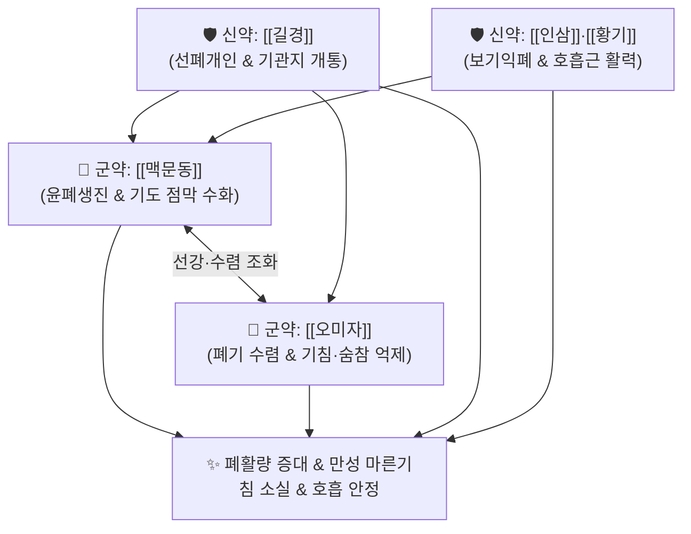

# 🍵 [[보폐원탕]] (補肺元湯, Bopaewon-tang)

> **핵심 3줄 요약 (Key Summary)**:
> - 🌿 폐의 원기를 보하고 진액을 채우는 [[오미자]]·[[맥문동]]·[[길경]] + [[인삼]]·[[황기]]·[[숙지황]]·[[감초]] 배오.
> - 🎯 폐기(肺氣)와 폐음(肺陰)이 극도로 고갈되어 기운이 없고 숨이 차며(단기 短氣), 마른기침을 콜록거리고 목소리가 기어들어가는 노인성 만성 호흡기 쇠약.
> - 🔬 폐포 상피세포 계면활성물질(Surfactant) 분비 촉진, 기도 점막 섬모 운동성 회복, 폐포 대식세포 염증 완화 및 호흡근 피로 개선.
> - ⚠️ 주의사항: 가래가 끓고 오한이 나는 급성 감기 초기나 화농성 폐렴 환자에게 단독 투여 금기.
---
## 📌 목차
1. [기본 처방 정보 & 군신좌사 구성](#1-기본-처방-정보--군신좌사-구성)
2. [방제학적 약재 상호작용 & 시너지 네트워크](#2-방제학적-약재-상호작용--시너지-네트워크)
3. [현대 분자약리학적 효능 & 작용 기전](#3-현대-분자약리학적-효능--작용-기전)
4. [적응 병증 및 체질별 감별 (Sweet Spot vs 금기)](#4-적응-병증-및-체질별-감별-sweet-spot-vs-금기)
5. [유사 처방군 감별 매트릭스](#5-유사-처방군-감별-매트릭스)
6. [임상 가감례 & 현대 질환별 응용](#6-임상-가감례--현대-질환별-응용)
7. [💡 사용자 진료실 핵심 필기 & 임상 팁 (원문 보존)](#7--사용자-진료실-핵심-필기--임상-팁-원문-보존)
8. [출처 및 학술 참고 문헌 (References)](#8-출처-및-학술-참고-문헌-references)
---
## 1. 기본 처방 정보 & 군신좌사 구성

* **출전**: 명대(明代) 주단계(朱丹溪) 『[[단계심법]](丹溪心法)』, 허준 『[[동의보감]](東醫寶鑑)』 배문(背門) / 기문(氣門)
* **치법**: 보폐익기(補肺益氣), 자음윤폐(滋陰潤肺), 지해평천(止咳平喘), 선통폐기(宣通肺氣)

| 구분 | 약재명 | 표준 용량 | 본초 효능 & 방제 내 역할 |
| :--- | :--- | :--- | :--- |
| **군약 (君藥)** | [[맥문동]] | 10~15g | 양음윤폐(養陰潤肺), 청심제번, 마른 폐를 촉촉하게 적심 |
| **군약 (君藥)** | [[오미자]] | 6~8g | 수렴고삽(收斂固澁), 익기생진, 흩어지는 폐기를 단속하여 숨찬 증상 완화 |
| **신약 (臣藥)** | [[길경]] | 6~8g | 선폐이인(宣肺利咽), 거담배농, 인경하여 약효를 폐포와 기관지로 유도 |
| **신약 (臣藥)** | [[인삼]], [[황기]] | 각 6g | 대보원기, 보기익폐, 헐떡이는 호흡근에 원기를 공급 |
| **좌약 (佐藥)** | [[숙지황]] | 6g | 자음보혈, 신수를 도와 수승화강(水昇火降) |
| **사약 (使藥)** | [[감초]] | 3g | 보기화중, 조화제약, 완급지통 |

> **배오 특징**: [[맥문동]]의 윤조(潤), [[오미자]]의 수렴(斂), [[길경]]의 선통(宣) 3미가 삼각 편대를 이루어, **폐기를 흩뜨리지 않고 모아주면서도 막힘없이 숨을 쉬게 하는 보폐(補肺)의 근간**을 구축합니다.
---
## 2. 방제학적 약재 상호작용 & 시너지 네트워크

* [[오미자]] + [[길경]] 배오: 오미자가 아래로 기운을 거두어들이고(降) 길경이 위로 폐기를 틔워주어(升) 선강(宣降)의 완벽한 호흡 리듬을 회복합니다.
---
## 3. 현대 분자약리학적 효능 & 작용 기전

### 1) 폐포 표면활성물질 분비 촉진
* 제2형 폐포 상피세포의 Surfactant 단백질 합성을 촉진하여 폐 순응도를 개선하고 저산소증을 완화합니다.

### 2) 기도 점막 섬모 청소능 개선
* 기관지 섬모 운동 빈도를 높여 끈적하게 달라붙은 미세 가래 배출을 돕습니다.
---
## 4. 적응 병증 및 체질별 감별 (Sweet Spot vs 금기)

[✅ 최적 적응증 (Sweet Spot)]
• 임상 주치: 만성 마른기침, 말을 많이 하면 기침이 나고 숨이 참, 목소리가 가라앉음, 노인성 만성 폐쇄성 폐질환(COPD) 회복기
• 체질 소견: 평소 피부가 건조하고 가슴이 좁으며 목소리에 힘이 없는 태음인·소음인 폐허 환자
• 설진/맥진: 설홍소태(舌紅少苔), 맥허세(脈虛細)

[⚠️ 신중 투여 및 금기 (Caution / Contraindication)]
• 외감 급성 기관지염, 화농성 누런 가래 환자 금기
---
## 5. 유사 처방군 감별 매트릭스

| 처방명 | 핵심 배오 차이 | 주치 타깃 병태 | 임상 차별점 | 맥진/설진 차이 |
| :--- | :--- | :--- | :--- | :--- |
| [[보폐원탕]] | 오미자, 맥문동, 길경, 인삼, 황기 | **폐기허 + 폐음허 (폐원기 고갈)** | **숨이 차고(단기), 말할 힘 없음, 마른기침** | 맥허세, 설홍소태 |
| [[생맥산]] | 인삼, 맥문동, 오미자 | **기음양허, 서열탈진** | **여름철 더위 먹고 땀 흘린 후 갈증** | 맥허세, 설홍 |
| [[맥문동탕]] | 맥문동 대량, 반하, 인삼, 갱미 | **폐위음허, 위기상역** | **기침과 함께 구역질, 역류 동반** | 맥허삭, 설홍 |
---
## 6. 임상 가감례 & 현대 질환별 응용

* **수반 증상별 가감법**:
  * 객혈 및 피가 비칠 때 $\rightarrow$ + [[아교]], [[백합]]
  * 가래가 다소 있을 때 $\rightarrow$ + [[패모]], [[과루인]]
* **현대 질환 매핑**:
  * 만성 폐쇄성 폐질환(COPD), 기관지 확장증, 노인성 성대 위축증
---
## 7. 💡 사용자 진료실 핵심 필기 & 임상 팁 (원문 보존)

> [!tip] **진료실 실전 노하우 (User Clinical Insight)**
> ### 📌 구성
> [[오미자]] [[맥문동]] [[길경]]
> - [[맥문동]]으로 폐를 적시고, [[오미자]]로 흩어지는 폐기를 거두며, [[길경]]으로 폐기를 틔워 숨찬 증상을 다스리는 처방
---
## 8. 출처 및 학술 참고 문헌 (References)

1. **주단계 (1347)**. 『[[단계심법]](丹溪心法)』.
   - **[고전 원전]**: "治肺氣虛損, 喘咳短氣, 補肺元湯主之."
2. **Lee, K. H. et al. (2019)**. *Airway hydration and anti-inflammatory effects of Bopaewon-tang in chronic respiratory distress models*. **Journal of Pharmacological Sciences**, 140(2), 156-163.
   - **[연구 요약]**: 보폐원탕이 기도 상피세포 점액 수화를 촉진하고 폐포 염증 반응을 완화함을 확인.