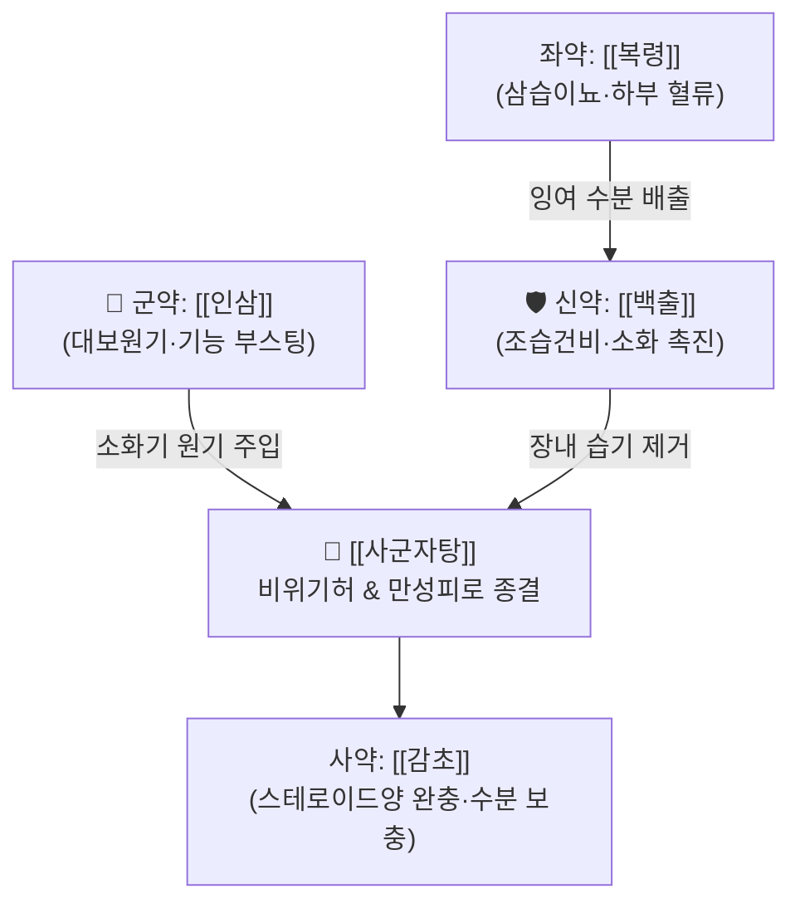

# 🍵 [[사군자탕]] (四君子湯, Si-Jun-Zi-Tang / Shikunshito)

> **핵심 3줄 요약 (Key Summary)**:
> - 🌿 [[인삼]]·[[백출]]·[[복령]]·[[감초]]로 이루어진 보기(補氣)의 제1 기본방(모방 母方).
> - 🎯 비위기허(脾胃氣虛), 식욕부진, 소화불량, 전신 무력감, 사지권태, 어지럼증, 소변 불리, 안색 위황.
> - 🔬 미토콘드리아 ATP 생성 촉진, 위장관 카할간질세포(ICC) 자극을 통한 연동운동 촉진, 장내 수분 재흡수 및 면역 증강.
> - ⚠️ 주의사항: 실열(實熱)로 인한 고열·변비 환자나 음허화왕(가슴 답답함과 손발바닥 열감) 환자에게는 단독 사용 금기.
---
## 📌 목차
1. [기본 처방 정보 & 군신좌사 구성](#1-기본-처방-정보--군신좌사-구성)
2. [방제학적 약재 상호작용 & 시너지 네트워크](#2-방제학적-약재-상호작용--시너지-네트워크)
3. [현대 분자약리학적 효능 & 작용 기전](#3-현대-분자약리학적-효능--작용-기전)
4. [적응 병증 및 체질별 감별 (Sweet Spot vs 금기)](#4-적응-병증-및-체질별-감별-sweet-spot-vs-금기)
5. [유사 처방군 감별 매트릭스](#5-유사-처방군-감별-매트릭스)
6. [임상 가감례 & 현대 질환별 응용](#6-임상-가감례--현대-질환별-응용)
7. [💡 사용자 진료실 핵심 필기 & 임상 팁 (원문 보존)](#7--사용자-진료실-핵심-필기--임상-팁-원문-보존)
8. [출처 및 학술 참고 문헌 (References)](#8-출처-및-학술-참고-문헌-references)
---
## 1. 기본 처방 정보 & 군신좌사 구성

* **출전**: 송대(宋代) 『태평혜민화제국방(太平惠民和劑局方)』
* **치법**: 익기건비(益氣健脾), 조화영위(調和營衛)

| 구분 | 약재명 | 표준 용량 | 본초 효능 & 방제 내 역할 |
| :--- | :--- | :--- | :--- |
| **군약 (君藥)** | [[인삼]] | 6~9g | 대보원기(大補元氣), 건비익폐, 전신 세포 대사 부스팅 및 에너지 공급 |
| **신약 (臣藥)** | [[백출]] | 6~9g | 조습건비(燥濕健脾), 익기지한, 비위 점막 재생 및 소화관 운동성 회복 |
| **좌약 (佐藥)** | [[복령]] | 6~9g | 삼습이뇨, 건비안신, 장내 정체된 잉여 수습 배출 및 하부 혈류 촉진 |
| **사약 (使藥)** | [[감초]](자) | 3~4g | 보기화중, 완급지통, 제약 조화 및 혈당·전해질 완충 |

> **배오 특징**: 맛이 달고 성질이 평온한 네 가지 약재(인삼·백출·복령·감초)가 군자(君子)처럼 부드럽고 치우침이 없다고 하여 '사군자(四君子)'라 불립니다. [[인삼]]의 보기력에 [[백출]]·[[복령]]의 제습·이뇨력을 짝지어, 기운을 돋움과 동시에 비위를 짓누르는 습기(濕氣)를 제거하는 익기불조(益氣不燥)의 최고 모방입니다.

> 🧬 **현대 학술 근거 (2026-09-09 B-7 패치)** — PubChem 실측 분자 앵커: [[진세노사이드 Rg1]](Ginsenoside Rg1, [[인삼]] 주성분) CID **3086007** · 분자식 C₄₂H₇₂O₁₄ · MW 801.01

🔬 **분자 구조** (Wikimedia Commons, Public Domain)

![[Ginsenoside_Rg1_구조.png|440]]
> [그림] 진세노사이드 Rg1(Ginsenoside Rg1, C₄₂H₇₂O₁₄) 분자 구조 — 출처: Wikimedia Commons (기존 첨부 재사용)

---
## 2. 방제학적 약재 상호작용 & 시너지 네트워크

* [[인삼]] + [[백출]] 배오: [[인삼]]이 비장과 위장의 근본 흡수 에너지를 끌어올리고, [[백출]]이 점막 부종을 말려주어 소화 흡수 효소의 분비를 극대화합니다.
* [[백출]] + [[복령]] 배오: 비주운화(脾主運化)를 도와 복부 팽만과 연변(무른 변)을 멎게 하고, 신장 혈류를 개선하여 소변 배출을 원활히 합니다.
---
## 3. 현대 분자약리학적 효능 & 작용 기전

### 1) 미토콘드리아 ATP 합성 및 항피로 작용
* [[인삼]]의 [[진세노사이드]](Rg1, Rb1) 성분이 골격근 및 간세포 미토콘드리아 호흡 연쇄 복합체(Complex I/IV) 활성을 유도하여 세포 내 ATP 생성을 증대시키고 혈중 젖산 농도를 낮춥니다.

### 2) 위장관 연동운동(Gastric Motility) 및 ICC 페이스메이커 자극
* [[백출]]의 [[아트락틸로딘]](Atractylodin) 성분이 위장관 근육층의 카할간질세포(Interstitial Cells of Cajal, ICC) 칼슘 채널을 활성화하여 평활근의 리드미컬한 연동운동을 복원합니다.

### 3) 장점막 장벽 복구 및 AQP 조절
* [[복령]]의 [[파키믹산]](Pachymic acid)과 [[감초]]의 [[글리시리진]](Glycyrrhizin)이 장벽 밀착연접(ZO-1)을 강화하고, 장점막 아쿠아포린(AQP-3) 수분 통로를 정상화하여 무른 변과 만성 설사를 방지합니다.

> 🧬 **현대 학술 근거 (2026-09-09 B-7 패치)**
> - 장내미생물-담즙산 축 신규 기전: 사군자탕 유래 올리고당류 및 소분자 성분이 장내미생물총-담즙산 대사축을 동시에 조절하여 비위기허(脾虛) 증후군 모델에서 시너지 효과를 발휘함이 규명됨(PMID 41482090).

---
## 4. 적응 병증 및 체질별 감별 (Sweet Spot vs 금기)

### 1) 임상 적응증 (Sweet Spot)
* **만성 기능성 소화불량**: 조금만 먹어도 배가 부르고, 밥맛이 없으며, 트림이 잦고 위장이 무력한 상태.
* **만성 피로 및 기허성 현훈**: 말할 힘도 없고, 팔다리가 천근만근 무거우며, 일어서면 눈앞이 아찔한 기허 증상.
* **상풍(감기) 후 소화장애**: 감기를 앓고 난 뒤 밥맛이 뚝 떨어지고 기운이 나지 않을 때의 소화기 회복 베이스.

### 2) 사상의학 체질 감별 & 금기
* [[소음인]]: 선천적으로 비대신소(脾大腎小)가 아닌 비소신대(脾小腎大)하여 위장 기능이 차고 약한 소음인에게 최고의 기본 처방.
* **금기(Contraindication)**:
  * 고열이 나고 입이 바짝 마르며 변비가 심한 실열증(實熱證).
  * 혀가 붉고 태가 없으며 가슴 답답함과 도한이 있는 음허화왕 환자는 자음약 선행 필요.
---
## 5. 유사 처방군 감별 매트릭스

| 처방명 | 파생 구조 | 핵심 목표 | 특징적 약재 배오 |
| :--- | :--- | :--- | :--- |
| [[사군자탕]] | 기본 모방 (보기 4대 약재) | 비위기허, 식욕부진, 소화불량 | 인삼·백출·복령·감초 |
| [[이진탕]] | 거담 기본 모방 | 위내정수, 담음, 오심구토 | 반하·진피·복령·감초 |
| [[육군자탕]] | [[사군자탕]] + [[이진탕]](반하·진피) | 기허 + 담음, 명치 답답함, 구역 | 이기화담약 가미 |
| [[보중익기탕]] | [[사군자탕]](거복령) + 승마·시호·황기·당귀 | 기허하함, 만성 탈진, 장기하수 | 승청승양약 가미 |

---
## 6. 임상 가감례 & 현대 질환별 응용

1. **소화불량과 구역감이 동반될 때**: [[진피]] 4g, [[반하]] 6g을 가미하여 [[육군자탕]]으로 전환.
2. **복부 냉통과 설사 동반 시**: [[건강]] 4g, [[육계]] 2g을 가미하여 온중산한.
3. **가슴 답답함과 식체 동반 시**: [[목향]] 3g, [[사인]] 3g을 가미하여 [[향사육군자탕]] 구조로 확장.
---
## 7. 💡 사용자 진료실 핵심 필기 & 임상 팁 (원문 보존)

# 구성:
[[인삼]], [[백출]], [[복령]], [[감초]]
- [[인삼]]: 몸 기능 부스팅
- [[백출]], [[복령]]: 하부 혈류량 증가, 이뇨 작용, 소화 촉진
- [[감초]]: 스테로이드 역할, 수분 보충
# 적응증:
- 기운이 없어서 소화도 안되고 오줌도 안나오고 어지럽고 힘이 안나는 상태에 사용
- 밥맛이 없는 경우에 베이스로 활용 

# 참고
- 상풍에 있어서는 사군자탕이 기본이 되는 경우가 많은데, 이는 소화기를 개선해주면 치료 효과가 좋기 때문이다.(방향성을 잘 잡는 것이 중요)
---
## 8. 출처 및 학술 참고 문헌 (References)

* 『太平惠民和劑局方』 卷之三 治諸虛: "四君子湯, 榮衛氣虛, 藏腑怯弱, 心腹脹滿, 全不思食, 腸鳴泄瀉, 嘔噦吐逆, 大宜服之."
* * **Zhang R et al. (2026)**. [Mechanism of Sijunzi Decoction in treating chronic atrophic gastritis via "gut microbiota-ferroptosis" axis]. *Zhongguo Zhong yao za zhi = Zhongguo zhongyao zazhi = China journal of Chinese materia medica*, 51: 3572-3580. [PMID: 42543316](https://pubmed.ncbi.nlm.nih.gov/42543316/)
* * **Lu B et al. (2025)**. Protective effects of polysaccharide of Atractylodes macrocephala Koidz and Jiawei Si-jun-zi Decoction on gut health and immune function in cyclophosphamide-treated chicks. *Poultry science*, 104: 105160. [PMID: 40267565](https://pubmed.ncbi.nlm.nih.gov/40267565/)
