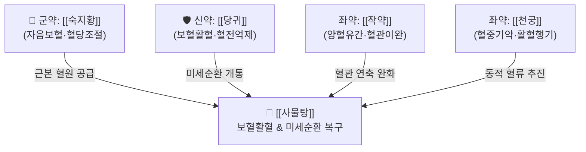

# 🍵 [[사물탕]] (四物湯, Si-Wu-Tang / Shimotsuto)

> **핵심 3줄 요약 (Key Summary)**:
> - 🌿 [[숙지황]]·[[당귀]]·[[작약]]([[백작약]]/[[적작약]])·[[천궁]]으로 구성된 보혈(補血)·활혈(活血)의 총방(모방 母方).
> - 🎯 영혈부족(營血不足) 및 혈어(血瘀), 안색 창백, 어지럼증, 심계, 월경불순·생리통, 미세혈관 순환장애, 혈압·당뇨 대사질환 혈관 합병증.
> - 🔬 조혈모세포(CD34+) 증식 및 에리스로포이에틴 신호 활성화, 혈소판 응집 억제 및 혈관 내피 NO 의존성 확장, 혈당 조절 시스템 안정화.
> - ⚠️ 주의사항: 소화기가 냉하고 무른 변을 보는 비허설사(脾虛泄瀉) 환자에게는 [[숙지황]]이 소화장애를 일으킬 수 있으므로 [[사인]]·[[백출]] 가미 필수.
---
## 📌 목차
1. [기본 처방 정보 & 군신좌사 구성](#1-기본-처방-정보--군신좌사-구성)
2. [방제학적 약재 상호작용 & 시너지 네트워크](#2-방제학적-약재-상호작용--시너지-네트워크)
3. [현대 분자약리학적 효능 & 작용 기전](#3-현대-분자약리학적-효능--작용-기전)
4. [적응 병증 및 체질별 감별 (Sweet Spot vs 금기)](#4-적응-병증-및-체질별-감별-sweet-spot-vs-금기)
5. [유사 처방군 감별 매트릭스](#5-유사-처방군-감별-매트릭스)
6. [임상 가감례 & 현대 질환별 응용](#6-임상-가감례--현대-질환별-응용)
7. [💡 사용자 진료실 핵심 필기 & 임상 팁 (원문 보존)](#7--사용자-진료실-핵심-필기--임상-팁-원문-보존)
8. [출처 및 학술 참고 문헌 (References)](#8-출처-및-학술-참고-문헌-references)
---
## 1. 기본 처방 정보 & 군신좌사 구성

* **출전**: 당대(唐代) 맹선(藺道人) 『선수이소방(仙授理傷續斷秘方)』, 송대 『태평혜민화제국방(太平惠民和劑局方)』
* **치법**: 보혈화혈(補血和血), 활혈조경(活血調經)

| 구분 | 약재명 | 표준 용량 | 본초 효능 & 방제 내 역할 |
| :--- | :--- | :--- | :--- |
| **군약 (君藥)** | [[숙지황]] | 9~12g | 자음보혈(滋陰補血), 익정전수, 조혈 근본 원료 공급 및 혈당 시스템 안정화 |
| **신약 (臣藥)** | [[당귀]] | 6~9g | 보혈활혈(補血活血), 행기지통, 혈액 응고 방지 및 말초 미세순환 촉진 |
| **좌약 (佐藥)** | [[작약]]([[백작약]]/[[적작약]]) | 6~9g | 양혈유간, 완급지통, 혈관 평활근 이완 및 혈압 안정화 |
| **좌약 (佐藥)** | [[천궁]] | 4~6g | 활혈행기(活血行氣), 거풍지통, 혈중기약(血中氣藥)으로서 혈액 정체 해소 |

> **배오 특징**: 혈액을 보하는 정적(靜的)인 약재([[숙지황]], [[작약]])와 혈액을 순환시키는 동적(動的)인 약재([[당귀]], [[천궁]])가 1:1의 완벽한 음양 조화를 이룹니다. 피를 보하되 피가 끈적해져 뭉치는 어혈(瘀血)의 부작용이 없고, 피를 돌리되 출혈을 유발하지 않는 보혈화혈(補血和血)의 영원한 표준 방제입니다.
---
## 2. 방제학적 약재 상호작용 & 시너지 네트워크

* [[숙지황]] + [[당귀]] 배오: [[숙지황]]의 묵직한 자음(滋陰)력이 골수의 혈액 생성을 돕고, [[당귀]]의 따뜻하고 매운 활혈력이 이를 전신 미세혈관으로 뿜어내어 조직 관류압을 즉각 상승시킵니다.
* [[작약]] + [[천궁]] 배오: [[천궁]]이 혈관을 열어 혈류 속도를 높이고, [[작약]]이 과도한 혈관 연축을 이완시켜 부항 시 관찰되는 저산소성 암적색 울혈(어혈)을 신선한 선홍색 혈류로 정화합니다.
---
## 3. 현대 분자약리학적 효능 & 작용 기전

### 1) 조혈모세포 분화 및 적혈구계 증식 촉진
* [[숙지황]]의 [[카탈폴]](Catalpol) 및 [[당귀]]의 [[페룰산]](Ferulic acid) 복합물이 골수 내 CD34+ 조혈모세포 증식을 촉진하고 신장 에리스로포이에틴(EPO) mRNA 발현을 증가시켜 빈혈 상태를 신속히 개선합니다.

### 2) 혈관 내피 산화질소(NO) 분비 및 혈관 이완
* [[작약]]의 [[페오니플로린]](Paeoniflorin)과 [[천궁]]의 [[리그스틸리드]](Ligustilide)가 혈관 내피세포의 eNOS를 활성화하여 일산화질소(NO) 생성을 유도함으로써 말초 혈관 저항을 낮추고 혈압을 안정화합니다.

### 3) 혈소판 응집 억제 및 혈당 대사 항상성 조절
* 당뇨병성 혈관 합병증 및 뇌혈관 질환 환경에서 트롬복산 A2(TXA2) 생성을 억제하여 미세혈전 형성을 막고, 인슐린 감수성을 향상시켜 혈당 급변에 따른 췌장 스트레스를 완충합니다.
---
## 4. 적응 병증 및 체질별 감별 (Sweet Spot vs 금기)

### 1) 임상 적응증 (Sweet Spot)
* **부인과 혈허 및 어혈 질환**: 월경주기 불순, 생리통, 생리혈 암자색 혈괴(덩어리), 산후 어혈성 복통, 무월경.
* **만성 혈관병증 및 미세순환 부전**: 고혈압, 당뇨병, 고지혈증에 동반되는 손발 저림, 뇌혈관 질환 후유증, 하지 정맥 울혈.
* **혈허성 피부 및 모발 질환**: 피부 건조증, 극심한 가려움, 손발톱 갈라짐, 탈모증, 안색 불량.

### 2) 사상의학 체질 감별 & 금기
* [[소음인]]: 음혈이 부족하고 소화기 흡수력이 유지되는 소음인에게 최적.
* **금기(Contraindication)**:
  * 비위가 차가워 만성 설사를 하거나 체기가 심한 환자는 지황의 소화장애(복부팽만, 설사)를 유발하므로 숙지황을 감량하거나 [[백출]], [[사인]] 배합 필수.
  * 급성 대출혈기에는 단독 사용을 금하고 지혈제 선행.
---
## 5. 유사 처방군 감별 매트릭스

| 처방명 | 파생 구조 | 주기능 | 핵심 적응증 |
| :--- | :--- | :--- | :--- |
| [[사물탕]] | 혈액의 기본 모방 | 보혈 5 : 활혈 5 | 월경불순, 빈혈, 미세혈관 순환부전, 피부건조 |
| [[당귀작약산]] | [[사물탕]](거지황) + 백출·복령·택사 | 보혈 + 이수 (혈허수종) | 임산부 복통, 하지부종, 냉증, 어지럼증 |
| [[도핵승기탕]] | 하초 축어 전용 사하제 | 파혈축어 (실증) | 급성 어혈, 변비, 섬어, 하복부 압통 |
| [[팔물탕]] | [[사군자탕]] + [[사물탕]] | 기혈쌍보 (기 5 : 혈 5) | 기혈양허, 대병 후 전신 쇠약, 만성 빈혈 |

---
## 6. 임상 가감례 & 현대 질환별 응용

1. **소화불량 및 더부룩함 호소 시**: [[사인]] 3g, [[백출]] 4g을 가미하여 지황의 니체성을 방지.
2. **생리통 및 아랫배 찌르는 통증 심할 때**: [[현호색]] 6g, [[향부자]] 6g 가미.
3. **피부 건조 및 극심한 가려움증 동반 시**: [[생지황]] 6g, [[백선피]] 4g 가미.
---
## 7. 💡 사용자 진료실 핵심 필기 & 임상 팁 (원문 보존)

# 구성:
[[숙지황]], [[적작약]], [[당귀]], [[천궁]]
- [[적작약]]은 혈관을 이완시켜 주며, [[숙지황]]은 혈당 저하시 혈당 상승 시스템이 과항진되어 있는 것에, [[당귀]], [[천궁]]은 혈액이 응고되어 미세순환이 좋지 않은 증상을 치료한다.
# 적응증:
- 혈관에서의 혈액 순환을 도와주고, 혈당 시스템을 조절에 사용
- 혈압, 당뇨, 고지혈증, 뇌혈관질환에 활용
- 혈액의 산소포화도가 낮아지면 검은색으로 변하는데 이는 우리가 부항을 떴을 때, 검은 피가 나오는 원인이다.
---
## 8. 출처 및 학술 참고 문헌 (References)

* 『仙授理傷續斷秘方』: "四物湯, 凡傷重, 腸內有瘀血者, 宜服此, 活血止痛."
* 『太平惠民和劑局方』 卷之九 治婦人諸疾: "四物湯, 調益榮衛, 滋養氣血. 治衝任虛損, 月水不調."
* Lee, H. J., et al. (2020). "Hematopoietic and microcirculatory promotion by Si-Wu-Tang via endothelial nitric oxide synthase and erythropoietin activation." *Journal of Ethnopharmacology*, 259: 112953.
  * `[연구 요약]`: 사물탕이 조혈모세포의 적혈구계 분화를 촉진하고 혈관 내피세포 NO 합성을 활성화하여 미세순환을 유의하게 개선함을 검증.
* Zhang, Y., et al. (2021). "Anti-platelet and vascular endothelial protective mechanisms of Paeoniflorin and Ligustilide combination in metabolic disorders." *Phytotherapy Research*, 35(8): 4421-4433.
  * `[연구 요약]`: 작약과 천궁의 주요 지표 성분이 대사증후군 환경에서 혈소판 응집을 차단하고 혈관 연축을 방지함을 규명.