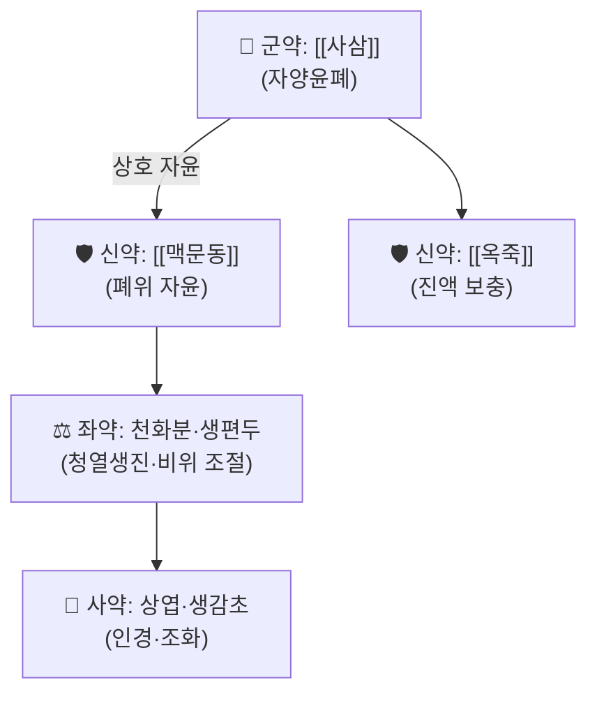

---
aliases:
  - 沙參麥門冬湯
  - Sha Shen Mai Men Dong Tang
  - 사삼맥문동탕
  - 사삼맥동탕
tags:
  - 처방
  - 보익제
  - 온병학
  - 자음윤폐
---

# 🍵 사삼맥문동탕 (沙參麥門冬湯, Sha Shen Mai Men Dong Tang)

> **핵심 3줄 요약 (Key Summary)**:
> - 🌿 기원 처방: 오국통(吳鞠通)의 『[[온병조변]](溫病條辨)』 상초편(上焦篇)에 수록된 자양윤폐(滋養潤肺) 처방. [[사삼]]·[[맥문동]]·[[옥죽]]·[[상엽]](桑葉)·생감초(生甘草)·[[천화분]](天花粉)·생편두(生扁豆) 7가지 약재로 구성.
> - 🎯 임상 적응증: 조상폐위(燥傷肺胃) — 조사(燥邪)로 폐·위의 진액이 손상되어 마른 기침, 각담불리(가래가 잘 나오지 않음), 인후 건조, 설홍소태(舌紅少苔)한 경우.
> - 🔬 현대 임상 연구: 블레오마이신 유발 폐섬유화 동물모델 및 노화 COPD 동물모델에서 TGF-β/Smad3·cGAS-STING-NF-κB 등 경로 조절을 통한 폐 보호 효과가 보고됨(모두 동물모델 수준).
> - ⚠️ 주의사항: 오한·[[발열]]이 뚜렷한 초기 표한증(表寒證) [[감모]], 습담(濕痰)이 왕성한 환자에는 자윤(滋潤) 약재 위주 구성이 표증 해소를 지연시키거나 담습을 조장할 수 있어 신중해야 함.

---

## 📌 목차
1. [기본 처방 정보 & 구성](#1-기본-처방-정보--구성)
2. [방제학적 약재 상호작용 & 시너지 네트워크](#2-방제학적-약재-상호작용--시너지-네트워크)
3. [현대 분자약리학적 효능 & 작용 기전](#3-현대-분자약리학적-효능--작용-기전)
4. [적응 병증 및 체질별 감별 (Sweet Spot vs 금기)](#4-적응-병증-및-체질별-감별-sweet-spot-vs-금기)
5. [유사 처방군 감별 매트릭스](#5-유사-처방군-감별-매트릭스)
6. [임상 가감례 & 현대 질환별 응용](#6-임상-가감례--현대-질환별-응용)
7. [💡 사용자 진료실 핵심 필기 & 임상 팁 (원문 보존)](#7--사용자-진료실-핵심-필기--임상-팁-원문-보존)
8. [출처 및 학술 참고 문헌 (References)](#8-출처-및-학술-참고-문헌-references)

---

## 1. 기본 처방 정보 & 구성

* **출전**: 오국통(吳鞠通, 1758~1836) 『[[온병조변]](溫病條辨)』(1798년) — 상초편(上焦篇).
* **치법**: 자양윤폐(滋養潤肺), 생진양위(生津養胃).

| 구분 | 약재명 | 참고 용량 | 본초 효능 & 방제 내 역할 |
| :--- | :--- | :--- | :--- |
| **군약 (君藥)** | [[사삼]] (沙參) | 9g | 폐음(肺陰)을 자양하고 청화(淸火)하여 마른 기침을 다스림 |
| **신약 (臣藥)** | [[맥문동]] (麥門冬) | 9g | 폐·위의 진액을 자양하고 조(燥)를 적셔줌 |
| **신약 (臣藥)** | [[옥죽]] (玉竹) | 6g | 폐위(肺胃)의 진액을 보하여 사삼·맥문동을 보조 |
| **좌약 (佐藥)** | [[천화분]](天花粉, 화분) | 4.5g | 청열생진(淸熱生津), 위열(胃熱)을 내림 |
| **좌약 (佐藥)** | 생편두(生扁豆) | 4.5g | 비위를 보하여 자윤약의 니체(소화 부담)를 완충 |
| **사약 (使藥)** | [[상엽]](桑葉, 동상엽) | 4.5g | 풍열을 흩고 조(燥)를 적셔 폐로 인경(引經) |
| **사약 (使藥)** | 생감초(生甘草) | 3g | 조화제약(調和諸藥) |

> **배오 특징**: 자윤(滋潤) 약재 위주로 구성되어 있으면서도 생편두를 배합해 비위(脾胃)의 운화 기능이 자윤약에 의해 저해되지 않도록 균형을 맞춘 것이 온병학적 배오의 묘미입니다. [[사삼]]과 [[맥문동]]·[[옥죽]]이 함께 폐위의 음(陰)을 동시에 자양하는 온병학 대표 자윤 배오입니다.

---

## 2. 방제학적 약재 상호작용 & 시너지 네트워크

* [[사삼]] + [[맥문동]] + [[옥죽]] 배오: 세 약재 모두 감담(甘淡)·미한(微寒)하여 폐위의 진액을 동시에 자양하는 온병학의 대표적 자윤 삼총사입니다.
* [[천화분]] + 생편두 배오: 청열생진 작용과 비위 보익 작용이 상호 균형을 이루어, 자윤 약재만으로 구성될 때 생길 수 있는 니체(膩滯, 소화 부담)를 완화합니다.

---

## 3. 현대 분자약리학적 효능 & 작용 기전

* **폐섬유화 동물모델 연구**: 2024년 *Journal of Ethnopharmacology*에 발표된 연구에서 사삼맥문동탕(ShaShen-MaiDong decoction)이 블레오마이신 유발 폐섬유화 마우스 모델에서 TGF-β/Smad3, AKT/MAPK, YAP/TAZ 신호 경로 억제를 통해 섬유화를 완화하는 것으로 보고되었습니다(PMID 39209002).
* **노화·COPD 동물모델 연구**: 2026년 발표된 연구에서 사삼맥문동탕이 노화 COPD 마우스 모델의 폐 기능을 개선하고, cGAS-STING-NF-κB 매개 염증노화(inflammaging)를 억제하는 것으로 보고되었습니다(PMID 42688597).

⚠️ 내용 검토 필요: 두 연구 모두 동물모델(마우스) 기반이며, 사람 대상 무작위대조시험(RCT) 수준의 근거는 이번 검색 범위 내에서 확인되지 않았습니다. 임상 적용 시 이 점을 감안해야 합니다.

---

## 4. 적응 병증 및 체질별 감별 (Sweet Spot vs 금기)

[✅ 최적 적응증 (Sweet Spot)]
* 원전 조문: 조상폐위(燥傷肺胃) — 마른 기침, 각담불리, 인후 건조, 설홍소태(舌紅少苔).
* 임상 주치: 가을철 건조 기침, 만성 인후 건조감, 폐음허(肺陰虛) 경향의 만성 기침. 방사선폐렴·폐섬유화 등 폐 진액 손상이 동반된 병태에 대한 보조 요법 관련 동물실험 연구가 진행 중.

[⚠️ 신중 투여 및 금기 (Caution / Contraindication)]
* 오한·[[발열]]이 뚜렷한 초기 표한증(表寒證) [[감모]]에는 부적합(자윤 약재가 표증 해소를 지연시킬 수 있음).
* 비위허한(脾胃虛寒)으로 무른 대변·[[소화불량]]이 뚜렷한 환자는 신중 투여.

---

## 5. 유사 처방군 감별 매트릭스

| 처방명 | 핵심 구성 차이 | 주치 및 특징 | 맥진/설진 차이 |
| :--- | :--- | :--- | :--- |
| [[사삼맥문동탕]] (본 처방) | [[사삼]]·[[맥문동]]·[[옥죽]]·[[천화분]]·생편두·[[상엽]]·생감초 | 조상폐위(燥傷肺胃) — 온병학 자윤 배오, 위음까지 함께 자양 | 설홍소태(舌紅少苔) |
| [[맥문동탕]] | [[맥문동]]·[[반하]]·[[인삼]]·[[대추]]·[[감초]]·[[갱미]] | 상한론/금궤요략 처방 — 위음·폐음 허약(인대감증), 발작성 기침 | 맥허삭(虛數) |
| [[백합고금탕]] | [[생지황]]·[[숙지황]]·[[맥문동]]·[[백합]]·[[현삼]]·[[패모]]·[[길경]]·[[당귀]]·[[백작약]]·[[감초]] | 폐신(肺腎) 음허 — 혈담을 겸한 만성 기침에 자음강화까지 겸함 | 맥세삭(細數) |

> ⚠️ 표 내부에서는 파이프(`|`)가 들어간 링크를 쓰지 않고 순수한 [[처방명]] 단독 형태로만 작성합니다.

---

## 6. 임상 가감례 & 현대 질환별 응용

* **현대 질환별 임상 매핑**:
  * 가을철 건조 기침, 만성 인후 건조감, 폐음허(肺陰虛) 경향의 만성 기침.
  * 방사선폐렴·폐섬유화 등 폐 진액 손상이 동반된 병태에 대한 보조 요법 관련 동물실험 연구 진행 중(3번 섹션 참고, 사람 대상 RCT 근거는 미확인).
* 원문에 구체적인 가감(加減) 사례는 별도로 기재되어 있지 않습니다.

---

## 7. 💡 사용자 진료실 핵심 필기 & 임상 팁 (원문 보존)

> [!tip] **진료실 실전 노하우 (User Clinical Insight)**
> - 현재 별도로 기록된 원장님 임상 필기가 없습니다. 추후 실전 진료 경험이 누적되면 이 섹션에 추가합니다.

---

## 8. 출처 및 학술 참고 문헌 (References)

1. **오국통(吳鞠通) (1798)**. 『[[온병조변]](溫病條辨)』 상초편.
   - **[고전 원전]**: 조상폐위 조문 및 사삼맥문동탕 원방 출전.
2. **ShaShen-MaiDong decoction attenuates bleomycin-induced pulmonary fibrosis by inhibiting TGF-β/smad3, AKT/MAPK, and YAP/TAZ pathways (2024)**. *Journal of Ethnopharmacology*. PMID: [39209002](https://pubmed.ncbi.nlm.nih.gov/39209002/)
   - **[연구 요약]**: 블레오마이신 유발 폐섬유화 마우스 모델에서 다중 신호 경로 억제를 통한 항섬유화 효과 규명. (저자명 상세는 원문 확인 필요 ⚠️)
3. **Shashen Maidong Decoction Improves Pulmonary Function in Aged Mice With Chronic Obstructive Pulmonary Disease by Inhibiting cGAS-STING-NF-κB-Mediated Inflammaging (2026)**. PMID: [42688597](https://pubmed.ncbi.nlm.nih.gov/42688597/) (PMC13534626)
   - **[연구 요약]**: 노화 COPD 마우스 모델에서 염증노화(inflammaging) 억제를 통한 폐 기능 개선 효과 규명. (저널명·저자명 상세는 원문 확인 필요 ⚠️)

> ⚠️ 내용 검토 필요: 위 2·3번 문헌의 정확한 권·호·페이지 등 상세 서지 정보는 검색 범위 내에서 완전히 확인되지 않아 PMID·제목·확인된 저널명(2번)만 기재했습니다. 정확한 서지 인용이 필요할 경우 PubMed 원문 확인을 권장합니다.
