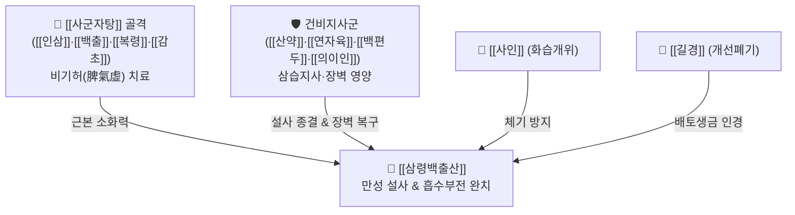

# 🍵 [[삼령백출산]] (參苓白朮散, Shen-Ling-Bai-Zhu-San / Jinryobyakujutsusan)

> **핵심 3줄 요약 (Key Summary)**:
> - 🌿 [[사군자탕]]([[인삼]]·[[백출]]·[[복령]]·[[감초]]) + [[산약]]·[[연자육]]·[[백편두]]·[[의이인]] + [[사인]]·[[길경]].
> - 🎯 비위기허(脾胃氣虛) 및 습담정체, 만성 흡수부전 설사, 식후 소화불량, 영양실조, 배토생금(培土生金)을 통한 만성 기관지염·알레르기 비염.
> - 🔬 소장 융모 상피세포 브러시 보더 효소 활성 복원, 결장 수분 재흡수(AQP) 촉진을 통한 지사 작용, 장-폐 점막 면역 글로불린(sIgA) 분비 증강.
> - ⚠️ 주의사항: 급성 세균성 이질(고열, 후중감, 농혈변)이나 변비가 있는 실열 환자에게는 투여 금기.
---
## 📌 목차
1. [기본 처방 정보 & 군신좌사 구성](#1-기본-처방-정보--군신좌사-구성)
2. [방제학적 약재 상호작용 & 시너지 네트워크](#2-방제학적-약재-상호작용--시너지-네트워크)
3. [현대 분자약리학적 효능 & 작용 기전](#3-현대-분자약리학적-효능--작용-기전)
4. [적응 병증 및 체질별 감별 (Sweet Spot vs 금기)](#4-적응-병증-및-체질별-감별-sweet-spot-vs-금기)
5. [유사 처방군 감별 매트릭스](#5-유사-처방군-감별-매트릭스)
6. [임상 가감례 & 현대 질환별 응용](#6-임상-가감례--현대-질환별-응용)
7. [💡 사용자 진료실 핵심 필기 & 임상 팁 (원문 보존)](#7--사용자-진료실-핵심-필기--임상-팁-원문-보존)
8. [출처 및 학술 참고 문헌 (References)](#8-출처-및-학술-참고-문헌-references)
---
## 1. 기본 처방 정보 & 군신좌사 구성

* **출전**: 송대(宋代) 『태평혜민화제국방(太平惠民和劑局方)』
* **치법**: 익기건비(益氣健脾), 삼습지사(滲濕止瀉), 배토생금(培土生金)

| 구분 | 약재명 | 표준 용량 | 본초 효능 & 방제 내 역할 |
| :--- | :--- | :--- | :--- |
| **군약 (君藥)** | [[인삼]] | 6~8g | 대보원기, 건비익폐, 소화 흡수 기초 활력 공급 |
| **군약 (君藥)** | [[백출]] | 6~8g | 조습건비, 장점막 수종 완화 및 연동 리듬 정상화 |
| **군약 (君藥)** | [[복령]] | 6~8g | 삼습이뇨, 건비안신, 장내 불필요한 잉여 수액 배출 |
| **신약 (臣藥)** | [[산약]] | 6~8g | 보비양위, 삽정지요, 소장 점막 상피 영양 공급 |
| **신약 (臣藥)** | [[연자육]] | 6~8g | 보비지사, 익신고정, 만성 설사 억제 및 장관 안정화 |
| **신약 (臣藥)** | [[백편두]] | 6~8g | 건비화습, 소서지갈, 중초의 비생리적 습기 흡수 |
| **신약 (臣藥)** | [[의이인]] | 8~12g | 건비삼습, 청열배농, 장점막 염증 삼출 완화 |
| **좌약 (佐藥)** | [[사인]] | 3~4g | 화습개위, 행기온중, 다량의 보익약으로 인한 기체 방지 |
| **좌사약 (佐使藥)** | [[길경]] | 3~4g | 개선폐기, 재약상행, 약 기운을 폐로 인도하여 배토생금 완성 |
| **사약 (使藥)** | [[감초]](자) | 3~4g | 보기화중, 완급지통, 제약 조화 |

> **배오 특징**: [[사군자탕]]에 비신(脾腎)을 보하고 설사를 멎게 하는 약재([[산약]], [[연자육]], [[백편두]], [[의이인]])를 대거 추가하여 장벽의 삼출성 수분을 완벽히 흡수합니다. 특히 상초 인경약인 [[길경]]을 배오하여 소화기(토 土)를 튼튼히 함으로써 호흡기(금 金)의 만성 비염·기침을 치료하는 배토생금(培土生金)의 대표 명방입니다.
---
## 2. 방제학적 약재 상호작용 & 시너지 네트워크

* [[산약]]·[[연자육]] + [[백출]]·[[복령]] 배오: 소장의 영양 흡수 면적을 넓혀주고 대장의 과도한 수분 분비를 억제하여 장점막 재생과 지사 효과를 동시에 달성합니다.
* [[사인]] + [[길경]] 배오: [[사인]]이 중초에서 비위를 깨워 기운을 돌리고, [[길경]]이 약 기운을 흉부와 폐로 끌어올려 만성 비염 및 호흡기 분비물(후비루)을 정리합니다.
---
## 3. 현대 분자약리학적 효능 & 작용 기전

### 1) 소장 상피 브러시 보더(Brush Border) 효소 활성화
* 삼령백출산 추출물은 십이지장 및 공장 점막 상피세포의 말타아제(Maltase), 수크라아제(Sucrase), 알칼리인산분해효소(AKP) 활성을 비약적으로 높여 탄수화물과 단백질의 체내 소화 흡수율을 극대화합니다.

### 2) 장 상피 밀착연접 복구 및 장누수 증후군(Leaky Gut) 억제
* 대장 상피세포의 Claudin-1, Occludin 및 ZO-1 발현을 증가시켜 장관 점막 투과성을 정상화하고, 엔도톡신(LPS)의 혈류 유입을 차단합니다.

### 3) 점막 면역 조절 (배토생금 기전)
* 장간막 림프절과 기관지 점막 상피에서 분비형 면역글로불린 A(sIgA) 분비를 촉진하여, 장내 감염과 호흡기 알레르기 염증을 동시에 억제합니다.
---
## 4. 적응 병증 및 체질별 감별 (Sweet Spot vs 금기)

### 1) 임상 적응증 (Sweet Spot)
* **만성 흡수부전성 설사 & 과민성 대장**: 밥만 먹으면 곧바로 화장실로 가며, 대변에 소화되지 않은 음식물이 섞여 나오고, 대변이 묽고 퍼지는 환자.
* **소아 성장부진 및 식욕부진**: 밥을 잘 안 먹고, 체중이 늘지 않으며, 배가 불룩 튀어나오고 감기나 비염을 달고 사는 허약 아동.
* **만성 알레르기 비염 및 호흡기 쇠약**: 기운이 없고 소화가 안 되면서 맑은 콧물, 기침, 후비루가 수개월 이상 지속되는 배토생금 적응증.

### 2) 사상의학 체질 감별 & 금기
* [[소음인]] / [[태음인]]: 비위가 허약하여 만성 연변을 보는 소음인과 호흡기가 약한 태음인 모두에게 탁월.
* **금기(Contraindication)**:
  * 세균성 이질, 급성 식중독으로 인한 복통·발열·농혈변 상태에는 금기(이때는 황련해독탕, 작약탕 사용).
---
## 5. 유사 처방군 감별 매트릭스

| 처방명 | 중심 병소 | 주요 목표 | 배오 차이점 |
| :--- | :--- | :--- | :--- |
| [[삼령백출산]] | 비위(소화관) + 폐(호흡기) | 만성 설사, 영양 흡수부전, 배토생금 | 산약·연자육·백편두·의이인·길경 |
| [[사군자탕]] | 비위 기본 | 단순 소화불량, 전신 무력 | 보기 제1 모방 |
| [[보중익기탕]] | 비기하함 (장기하수) | 마른 체질 탈진, 장기 처짐, 다한 | 황기 군약, 승마·시호 가미 |
| [[이중탕]] | 비위 허한 (냉증) | 복부 냉통, 구토, 극심한 찬 설사 | 인삼·백출·건강·감초 (온중) |

---
## 6. 임상 가감례 & 현대 질환별 응용

1. **소아 만성 설사 및 영양 흡수 불량 시**: [[맥아]] 4g, [[신곡]] 4g 가미하여 소화 촉진.
2. **폐기허로 인한 식은땀(자한) 및 기침 동반 시**: [[오미자]] 4g, [[맥문동]] 6g 가미.
3. **아랫배가 차고 냉통이 있을 때**: [[육계]] 2g, [[건강]] 4g 가미.
---
## 7. 💡 사용자 진료실 핵심 필기 & 임상 팁 (원문 보존)

# 구성
[[사군자탕]] [[산약]] [[연자육]] [[길경]] [[사인]] [[백편두]] [[의이인]]
---
## 8. 출처 및 학술 참고 문헌 (References)

* 『太平惠民和劑局方』 卷之三 治諸虛: "參苓白朮散, 治脾胃虛弱, 飲食不消, 多困少力, 腹滿泄瀉, 嘔吐反胃."
* * **Huang S et al. (2026)**. Shenling Baizhu powder alleviates non-alcoholic steatohepatitis by reducing PPARα-mediated NLRP3 inflammasome activation. *Frontiers in immunology*, 17: 1797561. [PMID: 42694403](https://pubmed.ncbi.nlm.nih.gov/42694403/)
* **Xia G et al. (2025)**. Shenling Baizhu Powder and Betulin attenuate sepsis-induced intestinal injury by targeting GADD45B/TAOK1/p38 MAPK pathway. *Journal of ethnopharmacology*, 353: 120282. [PMID: 40653040](https://pubmed.ncbi.nlm.nih.gov/40653040/)
