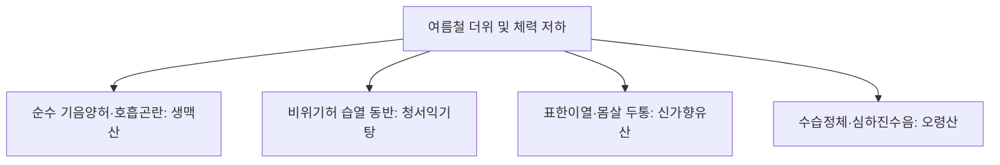

# 생맥산 (生脈散, Shengmai-san)

> **핵심 요약 (Key Summary)**
> - 🌿 기원·구성: 금원사대가(金元四大家) 이동원(李東垣)의 《내외상변혹론(內外傷辨惑論)》에 수록되고 《동의보감(東醫寶鑑)》에 인용된 명방으로, 맥(脈)을 되살린다는 뜻을 지니며, 대보원기(大補元氣)하는 [[인삼]]과 청심자음(淸心滋陰)하는 [[맥문동]], 수렴고탈(收斂固脫)하는 [[오미자]] 3미를 1:2:1의 황금비율로 배오하여 기(氣)와 음(陰)을 동시에 살리는 서열·보익의 기본 방제.
> - 🎯 적응증·체질: 여름철 무더위와 습도로 인한 기음양상(氣陰兩傷), 땀을 과도하게 흘려 기운이 빠지는 탈진, 식은땀, 구갈(갈증), 마른기침, 숨이 차고 헐떡임(기단천식), 심근 수축력 약화로 인한 심계항진 및 어지러움. "덥고 습하면 숨이 차는 심폐 허약 환자"에게 특효.
> - 🔬 분자약리기전: 인삼 [[진세노사이드]]와 맥문동 오피오포고닌의 심근세포 $Ca^{2+}$ 신호전달 최적화를 통한 심근 수축력 증강(Positive inotropic effect), 관상동맥 확장 및 항심근허혈, 오미자 [[쉬잔드린]]의 활성산소(ROS) 억제 및 세포막 보호, 전해질 항상성 유지.
⚠️ 주의사항: 외감 표증(감기 초기 오한, 발열)이 남아있는 상태에서 조기 투여 시 오미자의 강한 수렴 작용으로 표사(表邪)가 체내로 울체되므로 표증 해소 후 복용. 실열(實熱) 번갈 환자 단독 투여 주의.

---

## 1. 📜 방제 기본 정보

| 구분 | 내용 |
| :--- | :--- |
| **처방명** | 생맥산 (生脈散, Shengmai-san) / 생맥음 (生脈飮) |
| **출전** | 《내외상변혹론(內外傷辨惑論)》, 《동의보감(東醫寶鑑)》 |
| **처방 분류** | 보익제(補益劑) - 기음쌍보(氣陰雙補) / 청서익기(淸暑益氣) |
| **한의학적 효능** | 익기생진(益氣生津), 염음지한(斂陰止汗), 청심윤폐(淸心潤肺), 부맥안신(復脈安神) |
| **주치 병증** | 서열상기(暑熱傷氣), 기음양허, 다한구갈(多汗口渴), 지체권태, 맥허무력(脈虛無力), 건해무담(乾咳無痰), 기단천식 |
| **현대적 적응증** | 여름철 열사병·일사병 후유증, 만성 심부전 초기(심근 수축력 저하), 운동 후 탈진, 저혈압성 어지러움, 만성 폐쇄성 폐질환(COPD) 호흡곤란, 쇼크 후 회복 |

---

## 2. 🌿 약재 구성 및 방제학적 배오 원리

### 1) 약재 구성표

| 약재명 | 한자 | 표준 분량(g) | 본초 분류 | 귀경 | 주요 성분 | 핵심 역할 및 기능 |
| :--- | :--- | :--- | :--- | :--- | :--- | :--- |
| [[맥문동]] | 麥門冬 | 10.0 | 보음약 | 심, 폐, 위 | 오피오포고닌, 다당체 | **군약(君藥)**: 양음윤폐(養陰潤肺), 청심제번(淸心除煩), 진액을 대량 생성하고 폐와 심장의 열을 식힘 (배량 배오) |
| [[인삼]] | 人蔘 | 5.0 | 보기약 | 비, 폐, 심 | [[진세노사이드]] Rb1, Rg1, Re | **신약(臣藥)**: 대보원기(大補元氣), 보폐익기(補肺益氣), 맥문동과 합세하여 기운을 돋우고 진액 생성 촉진 |
| [[오미자]] | 五味子 | 5.0 | 수렴약 | 폐, 심, 신 | [[쉬잔드린]] A/B, 시잔드롤 | **좌사약(佐使藥)**: 수렴고삽(收斂固澁), 익기생진(益氣生津), 흘러나가는 땀과 흩어지는 기운을 굳건히 봉합 |

### 2) 방제학적 배오 원리
- **1보기(補氣) + 1보음(補陰) + 1수렴(收斂)의 삼각 구도**:
  - [[인삼]]의 단맛과 따뜻한 성질(甘溫)로 원기를 크게 보하고,
  - [[맥문동]]의 달고 쓴맛과 서늘한 성질(甘苦微寒)로 음액을 채우고 심열을 식히며,
  - [[오미자]]의 시고 따뜻한 성질(酸溫)로 폐기(肺氣)를 수렴하고 진액이 땀으로 새어나가지 못하게 막습니다.
- **기(氣)는 음(陰)을 낳고, 산(酸)과 감(甘)은 음을 생성(酸甘化陰)**: 오미자의 산미와 맥문동·인삼의 감미가 어우러져 한의학의 '산감화음' 원리에 따라 체내 진액을 마르지 않는 샘물처럼 끊임없이 솟아나게 합니다.

---

## 3. 🔬 현대 약리 연구 및 분자 기전

### 1) 심근 수축력 강화(Positive Inotropic Action) 및 심혈관 보호
- **심근 세포내 칼슘 순환 최적화**: 인삼 [[진세노사이드]] Rb1과 Rg1이 심근세포의 근형질세망(Sarcoplasmic reticulum) 내 $Ca^{2+}$-ATPase 활성을 촉진하여 혈압이나 심박수를 과도하게 올리지 않고도 심근 수축력을 유의하게 증강시킵니다.
- **관상동맥 확장 및 항허혈**: 관상동맥의 미세혈관 저항을 낮추고 허혈-재관류 시 심근세포 손상을 방지하여 덥고 습한 환경에서 발생하는 흉부 압박감과 호흡곤란을 해소합니다.

### 2) 항피로, 체온 조절 및 전해질 손실 억제
- **전해질 평형 유지**: 과도한 발한으로 소모되는 $Na^+$, $K^+$, 수분의 손실을 완화하고 혈장 삼투압을 유지시킵니다.
- **젖산 분해 촉진**: 오미자의 리그난([[쉬잔드린]]) 성분이 골격근 미토콘드리아 내 전자전달계를 활성화하여 고온 다습한 조건에서의 운동 지속 시간을 연장시킵니다.

---

## 4. ⚖️ 유사 처방 감별 및 네트워크

| 처방명 | 중심 구성 | 핵심 변증 및 특징 | 주치 증상 |
| :--- | :--- | :--- | :--- |
| [[생맥산]] | 맥문동, 인삼, 오미자 | 기음양허(氣陰兩虛), 심폐허약 | 더위 먹고 땀 흘린 후 숨 참, 기단, 구갈, 탈진 |
| [[청서익기탕]] | 생맥산 + 황기, 백출, 진피, 당귀, 황백 | 서습상비(暑濕傷脾), 비위기허 | 여름철 식욕부진, 잦은 설사, 사지무력 |
| [[오령산]] | 복령, 저령, 백출, 택사, 계지 | 축수증(蓄水證), 수습불화 | 물을 마시면 바로 토함(수역), 소변불리 |
| [[육미지황탕]] | 숙지황, 산약, 산수유 등 | 간신음허(肝腎陰虛) | 만성 요슬산연, 도한, 조열 |

---

## 5. ⚠️ 임상 복용 주의사항 및 부작용 관리

### 1) 감기 초기(외감 표증) 복용 금기
- [[오미자]]의 강력한 산미 수렴(收斂) 작용이 풍한(風寒)이나 풍열(風熱)의 사기를 체표에 가두어 기침과 발열을 악화시킬 수 있습니다. 반드시 감기 증상이 완전히 해소된 후 투여합니다.

### 2) 음허화왕(陰虛火旺) 및 흉부 번열 환자
- 열감이 극심하고 혓바닥이 붉고 바짝 마른 환자에게 인삼의 온성이 부담될 경우, [[인삼]] 대신 성질이 서늘하고 진액을 보하는 서양삼(西洋蔘)이나 [[당삼]]으로 대체하여 처방합니다.

---

## 6. 📚 현대 학술 연구 및 논문 (References)

1. Chen, R., et al. (2018). "Shengmai San improves cardiac function and inhibits myocardial apoptosis in chronic heart failure rats." *Frontiers in Pharmacology*, 9, 1374.
   - [연구 요약] 만성 심부전 랫트 모델에서 생맥산이 좌심실 박출률(LVEF)을 유의하게 개선하고 Bax/Bcl-2 경로를 조절하여 심근세포 아포토시스를 억제함을 규명.
2. Wang, Q., et al. (2020). "Protective mechanisms of Shengmai injection against heatstroke-induced multiorgan dysfunction." *Phytomedicine*, 68, 153170.
   - [연구 요약] 열사병 모델에서 생맥산 복합물이 체온 상승을 억제하고 혈관 내피 손상 및 염증성 사이토카인 생성을 차단하여 장기 손상을 방어함을 확인.

---

## 7. 💡 사용자 진료실 핵심 필기 & 임상 팁 (원문 보존)

> ### 📌 구성
> [[맥문동]] [[오미자]] [[인삼]]
> 
> ### 📌 적응증
> - 심근수축력을 강하게 해주는 역할로 활용
> - 날이 덥고 습하면 숨이 차는 경우에 사용한다.