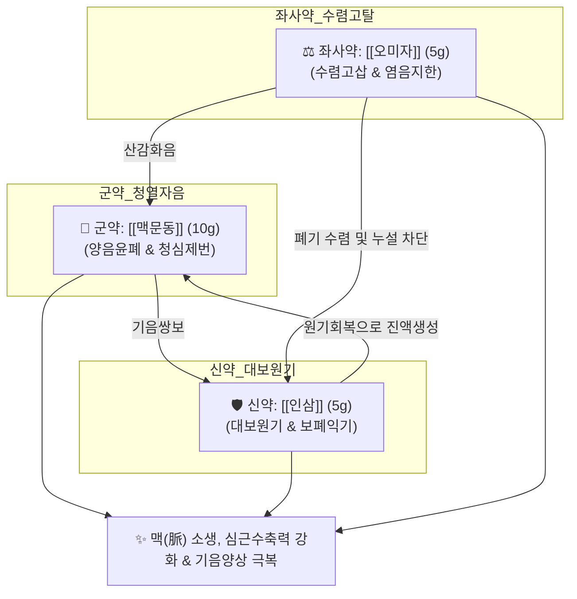

# 🍵 [[생맥산]] (生脈散, Shengmai-san)

> **핵심 3줄 요약 (Key Summary)**:
> - 🌿 [[맥문동]](군약, 배량) + [[인삼]](신약) + [[오미자]](좌사약) 3미(三味)로 구성된 금원사대가 이동원의 명방으로, 맥(脈)을 되살리는 보기생진(補氣生津)·염음지한(斂陰止汗)의 대표 방제.
> - 🎯 여름철 무더위와 과도한 발한으로 인한 기음양상(氣陰兩傷), 지체 권태, 구갈(갈증), 마른기침, 헐떡임(기단천식), 심근 수축력 저하로 인한 심계항진 및 어지러움. 특히 "덥고 습하면 숨이 차는 심폐 허약 환자"에게 특효.
> - 🔬 [[진세노사이드]]와 오피오포고닌의 심근세포 Ca2+-ATPase 활성화를 통한 심근 수축력 강화(Positive Inotropic Effect), 관상동맥 확장 및 항심근허혈, [[쉬잔드린]]의 미토콘드리아 보호 및 전해질 평형 유지.
> - ⚠️ 주의사항: 외감 표증(감기 초기 오한·발열) 환자에게 오미자의 강력한 수렴 작용으로 표사(表邪)가 체내로 갇힐 수 있으므로 표증 해소 후 복용. 실열(實熱) 환자 단독 투여 주의.
---
## 📌 목차
1. [기본 처방 정보 & 군신좌사 구성](#1-기본-처방-정보--군신좌사-구성)
2. [방제학적 약재 상호작용 & 시너지 네트워크](#2-방제학적-약재-상호작용--시너지-네트워크)
3. [현대 분자약리학적 효능 & 작용 기전](#3-현대-분자약리학적-효능--작용-기전)
4. [적응 병증 및 체질별 감별 (Sweet Spot vs 금기)](#4-적응-병증-및-체질별-감별-sweet-spot-vs-금기)
5. [유사 처방군 감별 매트릭스](#5-유사-처방군-감별-매트릭스)
6. [임상 가감례 & 현대 질환별 응용](#6-임상-가감례--현대-질환별-응용)
7. [💡 사용자 진료실 핵심 필기 & 임상 팁 (원문 보존)](#7--사용자-진료실-핵심-필기--임상-팁-원문-보존)
8. [출처 및 학술 참고 문헌 (References)](#8-출처-및-학술-참고-문헌-references)
---
## 1. 기본 처방 정보 & 군신좌사 구성

* **출전**: 금원사대가(金元四大家) 이동원(李東垣) 『[[내외상변혹론]](內外傷辨惑論)』, 허준 『[[동의보감]](東醫寶鑑)』
* **치법**: 익기생진(益氣生津), 염음지한(斂陰止汗), 청심윤폐(淸心潤肺), 부맥안신(復脈安神)

| 구분 | 약재명 | 표준 용량 | 본초 효능 & 방제 내 역할 |
| :--- | :--- | :--- | :--- |
| **군약 (君藥)** | [[맥문동]] | 10g | 양음윤폐(養陰潤肺), 청심제번(淸心除煩), 진액을 대량 생성하고 심열과 폐열을 식힘 (배량 배오) |
| **신약 (臣藥)** | [[인삼]] | 5g | 대보원기(大補元氣), 보폐익기(補肺益氣), 맥문동과 합세하여 기운을 돋우고 진액 생성 촉진 |
| **좌사약 (佐使藥)** | [[오미자]] | 5g | 수렴고삽(收斂固澁), 익기생진, 흘러나가는 땀과 흩어지는 심폐의 기운을 굳건히 봉합 |

> **배오 특징**: 1보기(補氣: [[인삼]]) + 1보음(補陰: [[맥문동]]) + 1수렴(收斂: [[오미자]])의 완벽한 정삼각형 배오 구조입니다. 이동원은 맥문동의 양을 인삼과 오미자의 2배로 배오하여 더위로 고갈된 진액을 급속히 보충하고, 오미자의 산미와 인삼·맥문동의 감미가 어우러지는 **산감화음(酸甘化陰)** 원리로 마르지 않는 진액 생성을 유도합니다.
---
## 2. 방제학적 약재 상호작용 & 시너지 네트워크

* [[맥문동]] + [[인삼]] 배오: 인삼은 기(氣)를 보하고 맥문동은 음(陰)을 보하여 기음양허(氣陰兩虛)를 동시에 다스리며, 기가 살아나야 음이 생기고 음이 충족되어야 기가 머문다는 기생음(氣生陰)·음유기(陰留氣)의 시너지를 이룹니다.
* [[맥문동]] + [[오미자]] 배오: 맥문동의 감한(甘寒)으로 마른 진액을 윤택하게 하고, 오미자의 산온(酸溫)으로 흩어지는 폐신(肺腎)의 기운을 거두어들이며 산감화음(酸甘化陰)하여 갈증을 멎게 합니다.
---
## 3. 현대 분자약리학적 효능 & 작용 기전

### 1) 심근 수축력 강화 (Positive Inotropic Effect) 및 심근 보호
* **심근 세포내 칼슘 동력학 최적화**: 인삼 [[진세노사이드]](Rb1, Rg1)와 맥문동 오피오포고닌(Ophiopogonin) 성분이 심근세포의 근형질세망(Sarcoplasmic Reticulum) Ca2+-ATPase(SERCA2a) 활성을 증강시켜 심박출량과 좌심실 박출률(LVEF)을 유의하게 개선합니다.
* **관상동맥 미세순환 개선**: 관상동맥의 혈관 저항을 낮추고 산화질소(NO) 생성을 촉진하여 허혈-재관류 손상 및 심근경색 모델에서 심근세포 사멸(Apoptosis)을 차단합니다.

### 2) 항피로, 체온 조절 및 전해질 손실 방어
* **미토콘드리아 ATP 생성 촉진**: 오미자 리그난 성분([[쉬잔드린]] A, B)이 미토콘드리아 호흡 사슬 효소 활성을 높여 고온 다습한 환경에서 근육 피로 물질인 젖산(Lactate)의 축적을 억제합니다.
* **전해질 삼투압 유지**: 과도한 발한으로 소실되는 혈장 Na+, K+의 재흡수를 돕고 혈관 투과성을 안정화하여 탈수로 인한 혈액 농축 및 저혈압성 허탈을 방지합니다.

### 3) 항산화 및 장기 손상 방어 (Heatstroke 방어)
* SOD 활성을 증가시키고 MDA(말론디알데하이드) 및 염증성 사이토카인(TNF-α, IL-6)을 차단하여 열사병(Heatstroke)으로 유발되는 다발성 장기 부전(MODS)을 예방합니다.
---
## 4. 적응 병증 및 체질별 감별 (Sweet Spot vs 금기)

[✅ 최적 적응증 (Sweet Spot)]
• 원전 조문: 《내외상변혹론》 "여름철 더위에 기운이 헐떡이고 땀이 그치지 않으며 맥이 허(虛)한 자에게 쓴다. 성(聖)스러운 약이다."
• 체질 소견: 소음인 및 태음인 중 심폐 기능이 허약하고 땀을 많이 흘린 뒤 급격히 지치는 체질
• 임상 주치: 
  1. 무더운 여름철 야외 활동이나 운동 후 땀을 쏟고 기운이 탈진된 상태
  2. "덥고 습한 환경에서 숨이 차고 헐떡거리며 가슴이 두근거리는 환자"
  3. 만성 피로, 목이 마르고 입술이 트는 구갈, 마른기침(건해무담), 저혈압성 어지러움
• 설진/맥진: 설홍소태(舌紅少苔) 또는 건조태, 맥허약(脈虛弱)·맥세삭(脈細數)·맥부무력(脈浮無力)

[⚠️ 신중 투여 및 금기 (Caution / Contraindication)]
• 감기 초기(외감 풍한·풍열 표증): 오미자의 강한 수렴 작용으로 표사(表邪)를 체내에 가두어 기침과 고열이 악화되므로 표증 해소 후 투여.
• 비위 습열(濕熱) 및 실열(實熱) 번갈: 열이 펄펄 끓고 대변이 굳은 실증 환자에게는 단독 투여 금기.
---
## 5. 유사 처방군 감별 매트릭스

| 처방명 | 핵심 구성 차이 | 주치 및 체질 차이 | 맥진/설진 차이 |
| :--- | :--- | :--- | :--- |
| [[생맥산]] | 맥문동, 인삼, 오미자 | **기음양허, 서열손상, 심폐허약, 숨참** | 설홍소태, 맥허약 무력 |
| [[청서익기탕]] | 생맥산 + 황기, 백출, 진피, 당귀, 황백, 승마, 신곡 등 | 비위기허에 습열(濕熱) 협잡, 사지 권태, 식욕부진, 연변 | 설태백니 또는 황니, 맥유약 |
| [[오령산]] | 복령, 저령, 백출, 택사, 계지 | 수습불화, 축수증, 물을 마시면 즉시 토함(수역), 소변불리 | 설담태백활, 맥부 |
| [[육미지황탕]] | 숙지황, 산약, 산수유, 복령, 목단피, 택사 | 만성 간신음허, 하초 허약, 요슬산연, 야간 도한 | 설홍소태, 맥세수 |

---
## 6. 임상 가감례 & 현대 질환별 응용

* **수반 증상별 가감법**:
  * 심한 기허(氣虛) 및 자한(식은땀) 동반 시 $\rightarrow$ + [[황기]] 8~12g
  * 폐음허(肺陰虛) 마른기침 극심 시 $\rightarrow$ + [[백합]], [[패모]] 각 6g
  * 심열(心熱) 및 불면, 가슴 답답함 동반 시 $\rightarrow$ + [[연자육]], [[산조인]] 각 8g
  * 몸에 열감이 많고 인삼의 온성이 부담스러운 환자 $\rightarrow$ [[인삼]] 대신 서양삼(西洋蔘) 또는 [[당삼]]으로 대체
* **현대 질환별 임상 매핑**:
  * **순환기계**: 만성 심부전 초기(심근 수축력 보조), 기립성 저혈압, 부정맥, 허혈성 심질환 회복기
  * **호흡기계**: 만성 폐쇄성 폐질환(COPD) 회복기, 여름철 기관지염, 결핵 후유증 건해
  * **환경성 질환**: 열사병·일사병 예방 및 회복, 온열 탈진, 하절기 만성 무기력증
---
## 7. 💡 사용자 진료실 핵심 필기 & 임상 팁 (원문 보존)

> [!tip] **진료실 실전 노하우 (User Clinical Insight)**
> ### 📌 구성
> [[맥문동]] [[오미자]] [[인삼]]
> 
> ### 📌 적응증
> - 심근수축력을 강하게 해주는 역할로 활용
> - 날이 덥고 습하면 숨이 차는 경우에 사용한다.

---
## 8. 출처 및 학술 참고 문헌 (References)

1. **Chen, R., et al. (2018)**. "Shengmai San improves cardiac function and inhibits myocardial apoptosis in chronic heart failure rats." *Frontiers in Pharmacology*, 9, 1374.
   - **[연구 요약]**: 만성 심부전 랫트 모델에서 생맥산 투여가 좌심실 박출률(LVEF)을 유의하게 개선하고 SERCA2a 및 Bax/Bcl-2 경로를 조절하여 심근세포 아포토시스를 억제함을 규명.
2. **Wang, Q., et al. (2020)**. "Protective mechanisms of Shengmai injection against heatstroke-induced multiorgan dysfunction." *Phytomedicine*, 68, 153170.
   - **[연구 요약]**: 열사병 모델에서 생맥산 복합물이 체온 상승을 억제하고 혈관 내피 손상 및 염증성 사이토카인 생성을 차단하여 다발성 장기 손상을 방어함을 확인.
3. **이동원 (1247)**. 『[[내외상변혹론]](內外傷辨惑論)』.
   - **[고전 원전]**: 생맥산 원방 출전 조문 및 보기생진 치법.
4. **허준 (1613)**. 『[[동의보감]](東醫寶鑑)』.
   - **[임상 문헌]**: 서열문(暑熱門) 주치 및 하절기 섭생 배오.