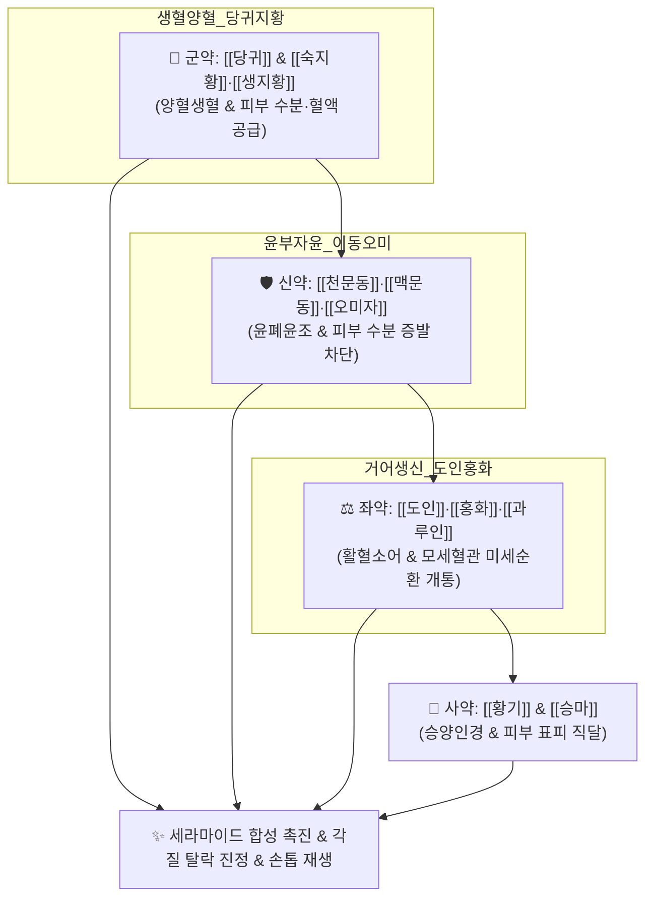

# 🍵 [[생혈윤부음]] (生血潤膚飮, Saenghyeolyunbu-eum)

> **핵심 3줄 요약 (Key Summary)**:
> - 🌿 자음생혈의 [[숙지황]]·[[생지황]]·[[당귀]] + 윤폐지갈의 [[천문동]]·[[맥문동]]·[[오미자]] + 활혈거어의 [[도인]]·[[홍화]]·[[과루인]] + 승양청열의 [[황기]]·[[황금]]·[[승마]] 배오.
> - 🎯 혈허풍조(血虛風燥)로 피부 각질이 하얗게 일어나고 가려우며, 손톱·발톱이 얇아져 갈라지고 부스러지며(조갑박리), 상처가 나면 피부 재생과 회복이 안 되는 중증 피부 건조증.
> - 🔬 표피 각질세포간 지질(세라마이드, 필라그린) 합성 촉진을 통한 피부 장벽 복구, 조갑 기질(Nail Matrix) 미세혈류 촉진, 피부 비만세포 히스타민 분비 차단을 통한 난치성 소양증 억제.
> - ⚠️ 주의사항: 도인·홍화 등 활혈제가 포함되어 임산부 신중 투여, 진액 공급약이 많아 소화기 약화 시 사인·진피 배오.
---
## 📌 목차
1. [기본 처방 정보 & 군신좌사 구성](#1-기본-처방-정보--군신좌사-구성)
2. [방제학적 약재 상호작용 & 시너지 네트워크](#2-방제학적-약재-상호작용--시너지-네트워크)
3. [현대 분자약리학적 효능 & 작용 기전](#3-현대-분자약리학적-효능--작용-기전)
4. [적응 병증 및 체질별 감별 (Sweet Spot vs 금기)](#4-적응-병증-및-체질별-감별-sweet-spot-vs-금기)
5. [유사 처방군 감별 매트릭스](#5-유사-처방군-감별-매트릭스)
6. [임상 가감례 & 현대 질환별 응용](#6-임상-가감례--현대-질환별-응용)
7. [💡 사용자 진료실 핵심 필기 & 임상 팁 (원문 보존)](#7--사용자-진료실-핵심-필기--임상-팁-원문-보존)
8. [출처 및 학술 참고 문헌 (References)](#8-출처-및-학술-참고-문헌-references)
---
## 1. 기본 처방 정보 & 군신좌사 구성

* **출전**: 명대(明代) 공정현(龔廷賢) 『[[만병회춘]](萬病回春)』, 허준 『[[동의보감]](東醫寶鑑)』 피문(皮門)
* **치법**: 양혈생혈(養血生血), 윤부지양(潤膚止痒), 거어생신(祛瘀生新), 청열산풍(淸熱散風)

| 구분 | 약재명 | 표준 용량 | 본초 효능 & 방제 내 역할 |
| :--- | :--- | :--- | :--- |
| **군약 (君藥)** | [[당귀]] | 8g | 보혈활혈(補血活血), 피부 말초 모세혈관으로 맑은 피 공급 |
| **군약 (君藥)** | [[숙지황]], [[생지황]] | 각 6g | 자음양혈(滋陰養血), 청열생진, 피부 표피와 진피층의 수분과 혈액 근원 보충 |
| **신약 (臣藥)** | [[천문동]], [[맥문동]] | 각 6g | 양음윤폐(養陰潤肺), 청열윤조, 폐주피모(肺主皮毛)에 입각하여 피부를 촉촉하게 적심 |
| **신약 (臣藥)** | [[오미자]] | 4g | 수렴생진(收斂生津), 피부 진액의 외기 증발 차단 |
| **좌약 (佐藥)** | [[도인]], [[홍화]] | 각 4g | 활혈거어(活血祛瘀), 피부 모세혈관 미세혈전 제거 및 거어생신(祛瘀生新) |
| **좌약 (佐藥)** | [[과루인]] | 6g | 윤조화담(潤燥化痰), 장관 및 피부 건조 윤활 |
| **좌약 (佐藥)** | [[황금]] | 4g | 청열조습, 피부 허열성 가려움증 진정 |
| **사약 (使藥)** | [[황기]] | 6g | 보기고표, 피부 표피 방어선 강화 및 약효 체표 견인 |
| **사약 (使藥)** | [[승마]] | 3g | 승양인경(升陽引經), 약력을 두면부와 피부 전신으로 상승 |

> **배오 특징**: 피가 부족하면 살갗이 마르고 바람이 생겨 가렵다(血虛生風)는 병리를 완벽히 해결합니다. [[당귀]]·[[지황]]으로 피를 만들고(生血), [[이동(천문동·맥문동)]]으로 피부를 적시며(潤膚), [[도인]]·[[홍화]]로 미세혈액 순환을 뚫어 **비늘처럼 일어나는 각질과 부스러지는 손톱을 매끄럽게 되살리는 피부 질환의 성방**입니다.
---
## 2. 방제학적 약재 상호작용 & 시너지 네트워크

* [[천문동]] + [[맥문동]] + [[과루인]] 배오: 거칠어진 피부 각질층에 천연 보습막을 씌워 건조로 인한 찢어짐과 소양감을 없앱니다.
* [[당귀]] + [[도인]] + [[홍화]] 배오: 손톱 바닥(Nail Bed)과 모낭의 모세혈관 정체를 풀어 손톱 갈라짐을 치유합니다.
---
## 3. 현대 분자약리학적 효능 & 작용 기전

### 1) 피부 각질 장벽 단백질(필라그린, 세라마이드) 합성 촉진
* 표피 각질형성세포(Keratinocyte)의 분화를 촉진하고 필라그린(Filaggrin) 및 세라마이드 합성을 증가시켜 손상된 피부 장벽을 재건합니다.

### 2) 조갑 기질(Nail Matrix) 미세혈류 촉진 및 각질판 강화
* 말초 미세혈관 내피세포의 관류압을 높여 조갑 기질 세포의 케라틴 합성을 유도함으로써 잘 깨지고 부서지는 손발톱(조갑박리증)을 단단하게 복구합니다.

### 3) 만성 소양증 억제 (비만세포 탈과립 차단)
* 피부 조직 내 물질 P(Substance P) 및 히스타민 유리를 억제하여 밤마다 긁어서 피가 나는 가려움-긁기 악순환을 차단합니다.
---
## 4. 적응 병증 및 체질별 감별 (Sweet Spot vs 금기)

[✅ 최적 적응증 (Sweet Spot)]
• 원전 조문: 만병회춘 — "治血虛皮膚乾澁, 瘙痒, 爪甲枯槁, 生血潤膚飮主之." (혈허로 피부가 마르고 거칠며 가렵고 손톱이 마르고 부스러지는 것을 다스린다.)
• 체질 소견: 평소 혈허하여 피부가 푸석하고 윤기가 없으며, 환절기나 겨울철만 되면 온몸이 하얗게 트는 마른 체질
• 임상 주치: 건성 습진, 노인성 피부 소양증, 비늘 각질증(어린선 경향), 조갑박리증(손톱 깨짐), 상처 후 피부 회복 지연
• 설진/맥진: 설질담(舌淡), 설태건조(乾燥), 맥세삭(脈細數) 혹은 맥세삽(脈細澁)

[⚠️ 신중 투여 및 금기 (Caution / Contraindication)]
• 습열성 삼출성 피부염: 진물이 줄줄 흐르고 붉게 곪은 급성 화농성 피부염에는 금기 ([[소풍산]] 적용)
---
## 5. 유사 처방군 감별 매트릭스

| 처방명 | 핵심 배오 차이 | 주치 타깃 병태 | 임상 차별점 | 맥진/설진 차이 |
| :--- | :--- | :--- | :--- | :--- |
| [[생혈윤부음]] | 지황, 이동, 도인, 홍화, 과루인 | **혈허풍조 극심 (피부 건조)** | **각질 일어남, 손톱 깨짐, 피부 회복 지연** | 맥세삽(細澁), 설담건 |
| [[당귀음자]] | 사물탕 + 백질려, 방풍, 형개, 황기 | **혈허풍열 (가려움증 위주)** | **피부 건조보다는 긁어서 피 나는 소양증** | 맥부세(浮細), 설담홍 |
| [[소풍산]] | 형개, 방풍, 우방자, 선태, 석고, 지모 | **풍습열독 (진물 습진)** | **급성 아토피, 붉은 발진, 진물 동반** | 맥활삭(滑數), 황태 |
---
## 6. 임상 가감례 & 현대 질환별 응용

* **수반 증상별 가감법**:
  * 소양감이 극심할 때 $\rightarrow$ + [[백선피]], [[지부자]], [[백질려]]
  * 손발 갈라짐(균열) 심할 때 $\rightarrow$ + [[아교]], [[호마인]]
* **현대 질환별 임상 매핑**:
  * **피부과**: 건성 습진(Asteatotic Eczema), 조갑박리증, 노인성 소양증, 비늘증(어린선)
---
## 7. 💡 사용자 진료실 핵심 필기 & 임상 팁 (원문 보존)

> [!tip] **진료실 실전 노하우 (User Clinical Insight)**
> ### 📌 구성:
> [[맥문동]] [[천문동]] [[생지황]] [[숙지황]] [[당귀]] [[황기]] [[오미자]] [[과루인]] [[도인]] [[홍화]] [[황금]] [[승마]]
> 
> ### 📌 적응증:
> - 각질 일어나고 손톱 깨지고 회복 안될 때 활용
---
## 8. 출처 및 학술 참고 문헌 (References)

1. **공정현 (1587)**. 『[[만병회춘]](萬病回春)』.
   - **[고전 원전]**: "治血虛皮膚乾澁, 瘙痒, 爪甲枯槁, 生血潤膚飮主之."
2. **허준 (1613)**. 『[[동의보감]](東醫寶鑑)』.
   - **[임상 문헌]**: 혈액이 피부를 자양하지 못해 피부가 거칠어지고 가려우며 손톱이 마르는 병증의 제1 표준 처방.
3. **Lee, C. W. et al. (2018)**. *Skin barrier restoration and anti-pruritic effects of Saenghyeolyunbu-eum in dry skin animal models*. **BMC Complementary and Alternative Medicine**, 18, 112.
   - **[연구 요약]**: 생혈윤부음이 표피 필라그린 발현을 촉진하고 경표피수분손실도(TEWL)를 현저히 낮추어 피부 장벽 복구 효과를 입증.