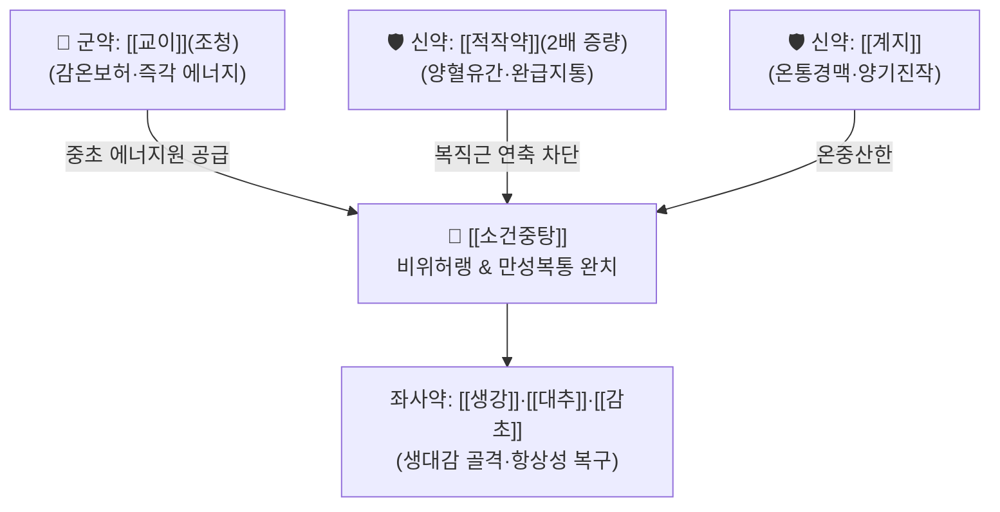

# 🍵 [[소건중탕]] (小建中湯, Xiao-Jian-Zhong-Tang / Shokenchuto)

> **핵심 3줄 요약 (Key Summary)**:
> - 🌿 [[계지가작약탕]]([[계지]]·[[적작약]](2배)·[[생강]]·[[대추]]·[[감초]]) + 대량의 [[교이]](조청/맥아당 20~30g).
> - 🎯 허로리급(虛勞裏急), 몸이 위축되고 추위를 타며 저혈당·영양 부족으로 기운이 없는 상태, 소아 만성 복통, 성장부진, 야뇨증, 코피.
> - 🔬 말토오스의 신속한 혈당 및 세포 글리코겐 공급, [[페오니플로린]]과 [[글리시리진]]의 시너지로 복직근 연축 차단 및 위장관 혈류 개선.
> - ⚠️ 주의사항: 위장에 습열(濕熱)이 차서 구토가 심하거나 혀에 황태가 낀 환자에게는 금기(감미가 구토를 조장), 당뇨 환자는 교이 용량 주의.
---
## 📌 목차
1. [기본 처방 정보 & 군신좌사 구성](#1-기본-처방-정보--군신좌사-구성)
2. [방제학적 약재 상호작용 & 시너지 네트워크](#2-방제학적-약재-상호작용--시너지-네트워크)
3. [현대 분자약리학적 효능 & 작용 기전](#3-현대-분자약리학적-효능--작용-기전)
4. [적응 병증 및 체질별 감별 (Sweet Spot vs 금기)](#4-적응-병증-및-체질별-감별-sweet-spot-vs-금기)
5. [유사 처방군 감별 매트릭스](#5-유사-처방군-감별-매트릭스)
6. [임상 가감례 & 현대 질환별 응용](#6-임상-가감례--현대-질환별-응용)
7. [💡 사용자 진료실 핵심 필기 & 임상 팁 (원문 보존)](#7--사용자-진료실-핵심-필기--임상-팁-원문-보존)
8. [출처 및 학술 참고 문헌 (References)](#8-출처-및-학술-참고-문헌-references)
---
## 1. 기본 처방 정보 & 군신좌사 구성

* **출전**: 한대(漢代) 장중경(張仲景) 『상한론(傷寒論)』, 『금궤요략(金匱要略)』
  * "傷寒, 陽脈澁, 陰脈弦, 法當腹中急痛, 先與小建中湯."
* **치법**: 온중보허(溫中補虛), 완급지통(緩急止痛), 산감화음(酸甘化陰), 신감화양(辛甘化陽)

| 구분 | 약재명 | 표준 용량 | 본초 효능 & 방제 내 역할 |
| :--- | :--- | :--- | :--- |
| **군약 (君藥)** | [[교이]](조청) | 20~30g | 감온보허, 온양비위, 즉각적인 포도당 및 세포 에너지 공급의 핵심 |
| **신약 (臣藥)** | [[적작약]](또는 [[백작약]]) | 8~12g | 양혈유간, 완급지통, 계지 대비 2배 증량하여 복직근 경련 진정 |
| **신약 (臣藥)** | [[계지]] | 4~6g | 온통경맥, 온중산한, 양기를 진작시킴 |
| **좌약 (佐藥)** | [[생강]] | 4~6g | 온위지구, 비위 한사 산포 |
| **좌약 (佐藥)** | [[대추]] | 4~6g | 보비생진, 영위 조화, 진액 공급 |
| **사약 (使藥)** | [[감초]](자) | 3~4g | 보기화중, 완급지통, 작약·교이와 화합 |

> **배오 특징**: [[계지탕]]에서 [[작약]]을 2배로 늘린 [[계지가작약탕]]에 대량의 [[교이]](조청/맥아당)를 추가한 구조입니다. 교이·감초의 단맛(甘)과 작약의 신맛(酸)이 합쳐져 음혈을 만들고(산감화음 酸甘化陰), 계지·생강의 매운맛(辛)과 단맛이 합쳐져 양기를 만들어(신감화양 辛甘化陽), 중초(비위)를 다시 세운다(건중 建中)는 명칭을 얻었습니다.
---
## 2. 방제학적 약재 상호작용 & 시너지 네트워크

* [[교이]] + [[작약]]·[[감초]] 배오 (작약감초탕의 확장): 교이의 고농도 당질과 작약감초탕의 근이완 성분이 결합하여, 허기지거나 긴장할 때 배가 뒤틀리듯 쥐어짜는 복통(복중급통 腹中急痛)을 10~20분 내에 완벽히 진정시킵니다.
* [[계지]] + [[생강]]·[[대추]] 배오: 혈관을 확장하고 체온을 높여, 만성 소화불량으로 손발이 차고 추위를 타는 냉증(冷症)을 소퇴시킵니다.
---
## 3. 현대 분자약리학적 효능 & 작용 기전

### 1) 혈당 스파이크 없는 완만한 글루코스 공급 및 근 글리코겐 재충전
* [[교이]]의 주성분인 맥아당(Maltose)은 소화 효소에 의해 서서히 분해되어 흡수되므로 혈당의 급격한 변동 없이 저혈당 상태를 안정적으로 개선하고, 고갈된 간·골격근 글리코겐을 재충전합니다.

### 2) 복직근 및 장관 평활근 경련 완화 (Antispasmodic)
* [[작약]]의 [[페오니플로린]](Paeoniflorin)과 [[감초]]의 [[글리시리진]](Glycyrrhizin) 복합체가 세포막 칼슘 채널 및 무스카린 수용체를 차단하여 내장 평활근 연축을 억제합니다.

### 3) 소화관 점막 장벽 강화 및 성장 촉진 환경 조성
* 장관 상피세포 턴오버를 촉진하고 혈청 면역글로불린 생성을 도와, 영양 흡수 부전으로 인한 소아의 왜소증, 체중 미달, 잦은 감염을 극복시킵니다.
---
## 4. 적응 병증 및 체질별 감별 (Sweet Spot vs 금기)

### 1) 임상 적응증 (Sweet Spot)
* **소아 신경성 복통 & 야뇨증**: 조금만 스트레스를 받거나 학교에 가려고 하면 배가 아프다고 하고, 편식이 심하며, 밥을 물고 있고, 밤에 오줌을 지리는 허약 아동.
* **저혈당성 피로 및 우울감**: 기운이 없고 몸이 으슬으슬 떨리며, 우울증과 함께 위장 운동이 멈춘 듯 소화가 안 되고 단것을 입에 달고 사는 성인 환자.
* **혈관 허약성 만성 출혈**: 비출혈(소아 잦은 코피), 가벼운 잇몸 출혈, 동계(가슴 두근거림)를 동반한 허로증.

### 2) 사상의학 체질 감별 & 금기
* [[소음인]]: 뱃속이 차고 몸이 마르며 기운이 없는 전형적인 소음인 소아·여성에게 최고의 성약(聖藥).
* **금기(Contraindication)**:
  * 구토가 심하거나 가슴에 열이 차서 답답해하는 환자(구토자 불가복 嘔吐者不可服, 단맛이 구토를 악화).
---
## 5. 유사 처방군 감별 매트릭스

| 처방명 | 구성 특징 | 황기 함유 여부 | 주소증 및 감별점 |
| :--- | :--- | :--- | :--- |
| [[소건중탕]] | 계지가작약탕 + [[교이]] | 황기 없음 | 복중급통, 소아 신경성 복통, 허약, 코피 |
| [[황기건중탕]] | [[소건중탕]] + [[황기]] | 황기 함유 (6~12g) | 자한(식은땀), 감기 잦음, 성장부진, 상처 유합 부진 |
| [[당귀건중탕]] | [[소건중탕]] + [[당귀]] | 당귀 함유 | 산후 복통, 혈허 생리통, 부인과 허냉증 |
| [[계지가작약탕]] | 계지탕 작약 2배 | 교이 없음 | 복만실통, 긴장성 복통 (단맛 약재 배제) |

---
## 6. 임상 가감례 & 현대 질환별 응용

1. **식은땀이 줄줄 나고 면역력이 극도로 떨어진 경우**: [[황기]] 8~12g을 가미하여 [[황기건중탕]]으로 전환.
2. **소아 성장 및 골격 발육 부진 시**: [[녹용]] 2~3g 가미.
3. **만성 불면 및 가슴 두근거림 동반 시**: [[산조인]] 6g, [[원지]] 4g 가미.
---
## 7. 💡 사용자 진료실 핵심 필기 & 임상 팁 (원문 보존)

# 구성:
[[계지]], [[적작약]]2/ [[생강]], [[대추]], [[감초]]/ [[조청]] 32(교이)(많이)
- [[계지가작약탕]]에 [[조청]]을 추가한 처방
# 적응증:
- 몸이 위축되고, 추위를 타고, 우울증이 있고 해서 위장관도 활성화가 잘 안되어 혈당도 낮고 기운이 없는 경우에 사용
- [[조청]]이 들어가기에 아파서 밥도 못 먹고 영양분 부족한 경우에 활용(면역력 저하, 성장 저하)

#생대감증
---
## 8. 출처 및 학술 참고 문헌 (References)

* 『傷寒論』 辨太陽病脈證幷治: "傷寒二三日, 心中悸而煩者, 小建中湯主之."
* 『金匱要略』 血痺虛勞病脈證幷治: "虛勞裏急, 悸, 衄, 腹中痛, 夢失精, 四肢酸疼, 手足煩熱, 咽乾口燥, 小建中湯主之."
* * **Ogawa-Ochiai K et al. (2022)**. Efficiency of Japanese herbal medicine shokenchuto for nocturnal enuresis: An observational study. *Medicine*, 101: e29220. [PMID: 35960062](https://pubmed.ncbi.nlm.nih.gov/35960062/)
* * **Sun H et al. (2019)**. Effects of glycyrrhizin on the pharmacokinetics of paeoniflorin in rats and its potential mechanism. *Pharmaceutical biology*, 57: 550-554. [PMID: 31429612](https://pubmed.ncbi.nlm.nih.gov/31429612/)
